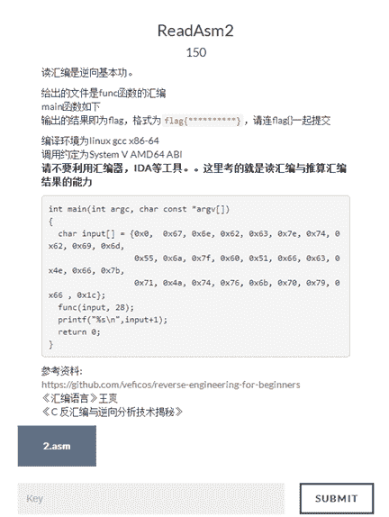
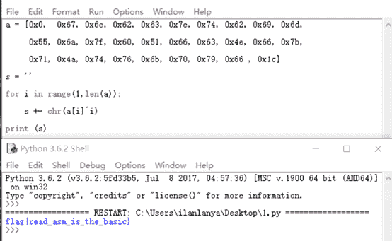

<!--yml
category: 未分类
date: 2022-04-26 14:53:24
-->

# 南邮CTF逆向题第二道ReadAsm2解题思路_iqiqiya的博客-CSDN博客

> 来源：[https://blog.csdn.net/xiangshangbashaonian/article/details/78881498](https://blog.csdn.net/xiangshangbashaonian/article/details/78881498)

首先看下提示



分析main函数 可以发现主要功能还是在于func函数中 于是我们仔细看func函数


00000000004004e6**<**func**>:**;4004e6一列表示该指令对应的虚拟内存地址 55一列为该指令对应的计算机指令

4004e6**:**55**push** rbp ;入栈，将寄存器的值压入调用 bp栈中

4004e7**:**4889 e5 **mov** rbp**,**rsp;建立新栈帧，别掉函数栈帧栈底地址放入寄存器

4004ea**:**48897d e8 **mov****QWORD**PTR**[**rbp**-**0x18**],**rdi;对应main中input[]这时i=0 //[rbp-0x18] = input[0]

4004ee**:**8975 e4 **mov****DWORD**PTR**[**rbp**-**0x1c**],esi**;放入28 //[rbp-0x1c] = 28

4004f1**:** c745 fc 01000000**mov****DWORD**PTR**[**rbp**-**0x4**],**0x1;首先将0x1赋值给[rbp-0x4] //i = 1

4004f8**:** eb28**jmp**400522**<**func**+**0x3c**>**;接着跳转到400522的位置 //for(i=1;i<=28;i++) 下面以第一次过程为例

4004fa**:**8b45 fc **mov****eax****,DWORD**PTR**[**rbp**-**0x4**]**;将[rbp-0x4]的值赋给eax寄存器 //即令eax=i =1

4004fd**:**4863 d0 **movsxd** rdx**,eax**;将eax的值带符号扩展，并传送至rdx中 //即令rdx=eax =i =1

400500**:**488b45 e8 **mov** rax**,QWORD**PTR**[**rbp**-**0x18**]**;将rax的值给input[0] //即令rax = input[0] =[rbp-0x18]

400504**:**4801 d0 **add** rax**,**rdx;将rdx的值加上rax再赋值给rax //即 rax=input[1] =i+input[0] =rdx+rax

400507**:**8b55 fc **mov****edx****,DWORD**PTR**[**rbp**-**0x4**]**;将[rbp-0x4]的值给edx //即令edx=i =1

40050a**:**4863 ca **movsxd** rcx**,edx**;将edx的值带符号扩展，并传送至rcx中 //即令rcx=i =1

40050d**:**488b55 e8 **mov** rdx**,QWORD**PTR**[**rbp**-**0x18**]**;将[rbp-0x18]的值给rdx //即令rdx=[rbp-0x18] =input[0]

400511**:**4801 ca **add** rdx**,**rcx;将rcx的值加上rdx再赋值给rdx //即i++ rdx=input[1]

400514**:**0f b6 0a**movzx****ecx****,BYTE**PTR**[**rdx**]**;将rdx无符号扩展，并传送至ecx //即ecx=chr(rdx) =chr(input[0])

400517**:**8b55 fc **mov****edx****,DWORD**PTR**[**rbp**-**0x4**]**;edx = [rbp-0x4] //即edx=i =1

40051a**:**31 ca **xor****edx****,ecx**;将edx与ecx异或 //i^input[0]

40051c**:**8810**mov****BYTE**PTR**[**rax**],dl**;rax = dl

40051e**:**8345 fc 01**add****DWORD**PTR**[**rbp**-**0x4**],**0x1;[rbp-0x4]++ //i++

400522**:**8b45 fc **mov****eax****,DWORD**PTR**[**rbp**-**0x4**]**;将[rbp-0x4]的值赋给eax寄存器 //eax = i

400525**:**3b45 e4 **cmp****eax****,DWORD**PTR**[**rbp**-**0x1c**]**;将[rbp-0x1c]中的值与eax值比较第一次就是28

400528**:**7e d0 **jle**4004fa**<**func**+**0x14**>**;如果<=那么就跳到4004fa //if eax即i <=28跳到4004fa继续循环

40052a**:**90**nop**;空指令

40052b**:**5d**pop** rbp ;出栈

40052c**:** c3**ret**;ret相当于return

分析可得Python3代码：

```
a = [0x0, 0x67, 0x6e, 0x62, 0x63, 0x7e, 0x74, 0x62, 0x69, 0x6d,

0x55, 0x6a, 0x7f, 0x60, 0x51, 0x66, 0x63, 0x4e, 0x66, 0x7b,

0x71, 0x4a, 0x74, 0x76, 0x6b, 0x70, 0x79, 0x66 , 0x1c]

s = ''

for i in range(1,len(a)):

s += chr(a[i]^i)

print (s)
```

运行结果如下：



推荐看下这篇 指令讲解的很棒

[https://www.cnblogs.com/Chesky/p/nuptzj_re_writeup.html](https://www.cnblogs.com/Chesky/p/nuptzj_re_writeup.html)

关于x86-64寄存器

[http://www.360doc.com/content/14/0428/09/9408846_372826893.shtml](http://www.360doc.com/content/14/0428/09/9408846_372826893.shtml)