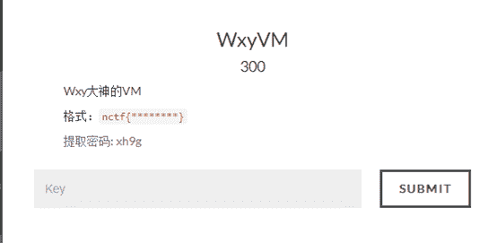
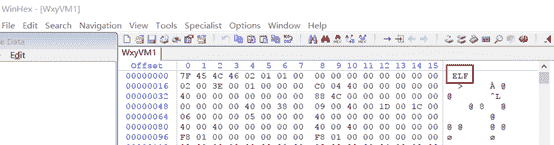
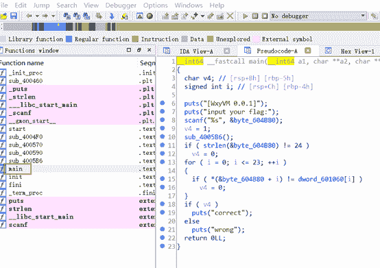
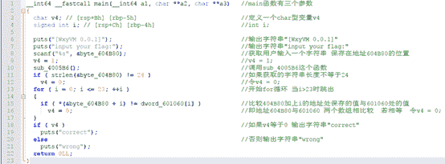
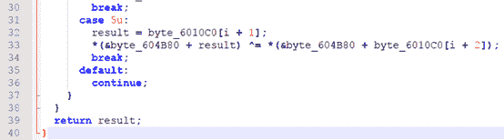

<!--yml
category: 未分类
date: 2022-04-26 14:52:48
-->

# 南邮CTF逆向题第四道WxyVM解题思路_iqiqiya的博客-CSDN博客

> 来源：[https://blog.csdn.net/xiangshangbashaonian/article/details/78883486](https://blog.csdn.net/xiangshangbashaonian/article/details/78883486)

首先看下题目

ELF文件

直接载入64位IDA

进入main函数

F5查看C代码

分析main函数代码：

__int64 __fastcall main**(**__int64 a1**,**char******a2**,**char******a3**)**//main函数有三个参数

**{**

char v4**;**// [rsp+Bh] [rbp-5h] //定义一个char型变量v4

signedint i**;**// [rsp+Ch] [rbp-4h] //int i;

puts**(**"[WxyVM 0.0.1]"**);**//输出字符串"[WxyVM 0.0.1]"

puts**(**"input your flag:"**);**//输出字符串"input your flag:"

scanf**(**"%s"**,****&**byte_604B80**);**//获取用户输入一个字符串保存在地址604B80的位置

v4 **=**1**;**//v4 = 1;

sub_4005B6**();**//调用sub_4005B6这个函数

**if****(** strlen**(&**byte_604B80**)****!=**24**)**//如果获取的字符串长度不等于24

v4 **=**0**;**//令v4 = 0;

**for****(** i **=**0**;** i **<=**23**;****++**i **)**//开始for循环当i>23时跳出

**{**

**if****(*****(&**byte_604B80 **+** i**)****!=** dword_601060**[**i**]****)**//比较404B80加上i的地址处保存的值与601060处的值

v4 **=**0**;**//即地址604B80与601060 两个数组相比较若相等令v4 = 0;

**}**

**if****(** v4 **)**//如果v4等于0 输出字符串"correct"

puts**(**"correct"**);**

**else**//否则输出字符串"wrong"

puts**(**"wrong"**);**

**return**0LL**;**

**}**

接着我们看看函数sub_4005B6：

分析一波

思路一：

该函数对我们在main中输入的字符串进行修改，根据v0的值来确定进入哪个case，6010c0处的数组应该是每三个为一组,分别为v0,v1,v2，每组中的第一个数字决定跳到哪个操作进行运算，第二个数字决定对用户字符串的第几个字符进行操作，第三个数字决定我们要操作的操作数。

将6010c0处的数组保存下来，查看后发现v0的值只有1，2，3，那么我们就不管后三种情况，字符串长度只有24位，我们选择直接爆破，脚本如下所示：

b **=**''

c **=****[]**

d **=****[]**

e **=****[]**

s **=****[**'0xc4'**,**'0x34'**,**'0x22'**,**'0xb1'**,**'0xd3'**,**'0x11'**,**'0x97'**,**'0x7'**,**'0xdb'**,**'0x37'**,**'0xc4'**,**'0x6'**,**'0x1d'**,**'0xfc'**,**'0x5b'**,**'0xed'**,**'0x98'**,**'0xdf'**,**'0x94'**,**'0xd8'**,**'0xb3'**,**'0x84'**,**'0xcc'**,**'0x8'**]**

**with** open**(**'test.txt'**,**'r'**)****as** f**:**

**while****True:**

a **=** f**.**readline**()**# 整行读取数据

**if****not** a**:**

**break**

b **+=** a**[:**24**]+**a**[**25**:]**

**for** i **in** range**(**0**,**len**(**b**),**9**):**

c**.**append**(**int**(**b**[**i**:**i**+**2**]))**

d**.**append**(**int**(**b**[**i**+**3**:**i**+**5**],**16**))**

e**.**append**(**int**(**b**[**i**+**6**:**i**+**8**],**16**))**

**def**rplus**(**s**,**x**,**y**):**

s**[**x**]****=****(**s**[**x**]+**y**)%**2******8

**def**rsub**(**s**,**x**,**y**):**

s**[**x**]****=****(**s**[**x**]-** y**)%**2******8

**def**rxor**(**s**,**x**,**y**):**

s**[**x**]****=****(**s**[**x**]^**y**)%**2******8

**def**case**(**s**,**i**,**x**,**y**):**

**if** i **==**1**:**

rplus**(**s**,**x**,** y**)**

**elif** i **==**2**:**

rsub**(**s**,**x**,** y**)**

**elif** i **==**3**:**

rxor**(**s**,**x**,** y**)**

count **=**0

flag **=****[**0**for** i **in** range**(**24**)]**

result **=**''

**for** k **in** range**(**24**):**

**for** j **in** range**(**33**,**128**):**

flag**[**k**]****=** j

**for** i **in** range**(**len**(**c**)):**

case**(**flag**,**c**[**i**],** d**[**i**],** e**[**i**])**

**if** hex**(**flag**[**k**])==**s**[**k**]:**

result **+=** chr**(**j**)**

**print** chr**(**j**)**

**break**

**print** result

得到nctf{Embr4ce_Vm_j0in_R3}

思路二：

直接对全部进行逆运算

可以参考

[http://blog.csdn.net/m0_37812124/article/details/76269151](http://blog.csdn.net/m0_37812124/article/details/76269151)

[http://blog.csdn.net/whklhhhh/article/details/74793530?locationNum=1&fps=1](http://blog.csdn.net/whklhhhh/article/details/74793530?locationNum=1&fps=1)

ELF文件格式详解

[http://blog.csdn.net/tenfyguo/article/details/5631561](http://blog.csdn.net/tenfyguo/article/details/5631561)