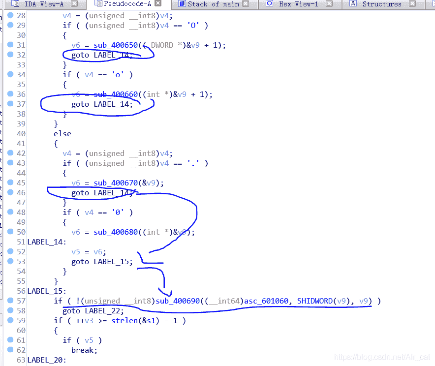
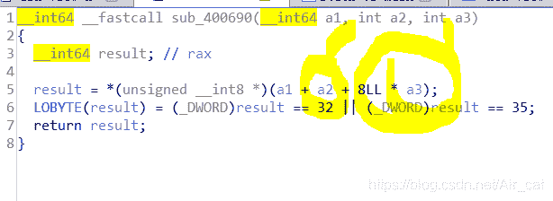

<!--yml
category: 未分类
date: 2022-04-26 14:37:54
-->

# 南邮ctf非正式题解 -- 逆向maze （方向的判断函数解析）_Air_cat的博客-CSDN博客

> 来源：[https://blog.csdn.net/Air_cat/article/details/101292336](https://blog.csdn.net/Air_cat/article/details/101292336)

南邮的maze我以前做过两遍，第一遍是完全看题解都看不懂，第二遍是勉强做完之后隔了差不多几周的时间再去做一遍，又看了题解，感觉对哪些判断函数稍稍懂了一些了，但还是对判断上下左右这一点十分迷惑，因为网络上的题解都没有讲到这一点的，这次是因为在刷xctf的新手题，其中最后一道就是这到maze，正好把我的疑惑自己解答了，这里放出对方向的判断的分析报告。

这里前面的函数我们也只提一下，其它的题解基本都有对其的分析；
这四个函数分别让v9和地址与v9连续的下一个变量（&v9+1）的值-1或者+1。
而简单的根据迷宫算法，这两个变量应该是一个上下方向一个左右方向，但具体是哪个就不一定了。而我们看到这几个函数在完成判断之后都会跳到LABEL_15处，并且这里也调用了v9变量，所以我们可以把LABEL_15这里的东西好好研究下，因为按照规律这里非常有可能就是判断方向的函数。
首先我们明确一点，我们这个函数传进来的变量分别是哪个迷宫的首地址，经过SHIDWORD()函数的v9和v9变量，而这里result应该是意味着移动的位置。为什么这么说？再看后面的赋值，赋给result的是迷宫对应的地址的值。其中a2是SHIDWORD(v9)，老实说这个函数是什么我也没搞懂，可能可以去看看API，但a3是我们之前的变量v9，这里先看看局部，a1（迷宫首地址），加上8*v9，你会想到什么？
如果你还没搞懂，你可以去看看hex视图下的迷宫。很显然，迷宫的一行是8个东西（字节），那么首地址+8*v9之后应该就是可以向上或者向下移动了，所以v9变量应该就是我们上下方向变量。
而a2对应的值显然就是左右方向变量，可能我们搞不懂哪个SHIDWORD()到底是个啥，但做到这里就可以大胆猜测了，直接把这玩意当&v9+1，之后带入解答就好了。

*ps：* 这里我的&v9+1写法是为了对应那个伪代码，其实应该写成如*（&v9+1）
另，我们看到不懂的系统函数的话应该尽量去搞懂，或者说，不能让我们这方面知识的匮乏影响我们的分析。