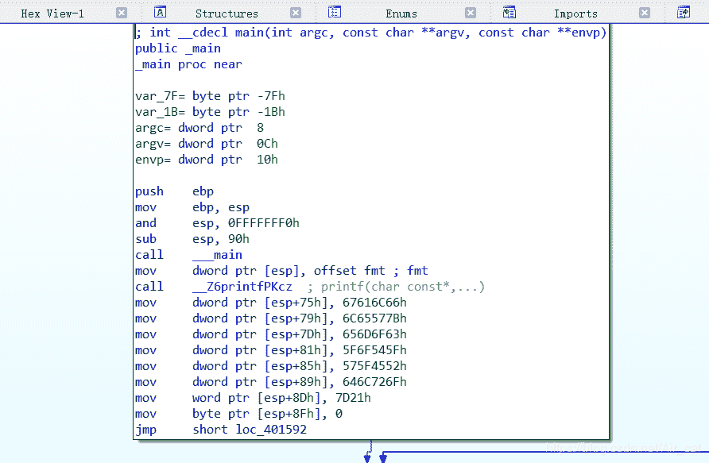
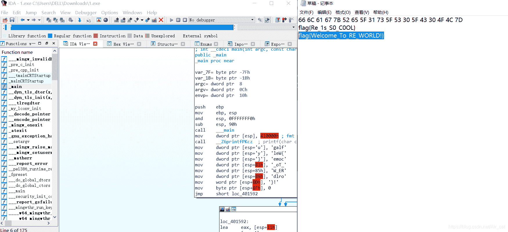

<!--yml
category: 未分类
date: 2022-04-26 14:33:15
-->

# 南邮ctf题解--逆向第一道Hello,RE!_Air_cat的博客-CSDN博客

> 来源：[https://blog.csdn.net/Air_cat/article/details/88976977](https://blog.csdn.net/Air_cat/article/details/88976977)

题目链接：[http://ctf.nuptzj.cn/challenges#](http://ctf.nuptzj.cn/challenges#)

    先总结一下，南邮的题横向对比一下真的是简单（第一次自己做出来的题，泪目）。下载了源程序之后，题目都明示了用ida，那就用ida呗

    可以看到printf的那部分地下是一大堆字符串，很明显flag就在这里，不过是用ascii码的形式而已，接下来有两种方法，一个是照着这个翻译（比较蠢），另一个就是利用ida强大的功能，将光标移到这些字符串上摁r键就好了

    乍一看是不是发现是不明白的字符串？因为需要注意的是一般我们默认在汇编里的是小端序（也需要了解不同处理器架构不同），需要转换回正常的格式。

    提交，通过。