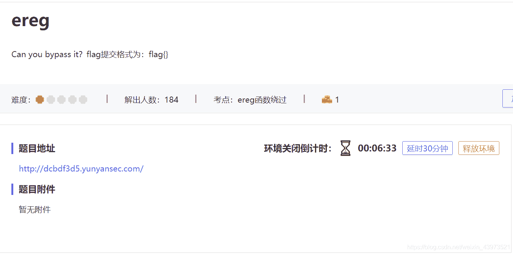

<!--yml
category: 未分类
date: 2022-04-26 14:53:26
-->

# 四叶草云演-CTF03# ereg_weixin_43973521的博客-CSDN博客

> 来源：[https://blog.csdn.net/weixin_43973521/article/details/113921764](https://blog.csdn.net/weixin_43973521/article/details/113921764)

> *   ereg()函数用指定的模式搜索一个字符串中指定的字符串,如果匹配成功返回true,否则,则返回false。搜索字母的字符是大小写敏感的。
>     
>     
> *   ereg函数存在NULL截断漏洞，导致了正则过滤被绕过,所以可以使用%00截断正则匹配

## 

## 题解：

首先，启动环境，发现无任何内容，查看源码无发现，打开robots.txt，审计php代码

```
if (isset ($_GET['password'])) {
// get请求参数名为password，非空

	if (ereg ("^[a-zA-Z0-9]+$", $_GET['password']) === FALSE)
    // 判断password参数值是否为一个或者多个大小写字母和数字构成
	{
		echo '<p>You password must be alphanumeric</p>';

    }
	  else if (strlen($_GET['password']) < 8 && $_GET['password'] > 9999999)
      // 判断password参数值长度是否小于8，参数值是否大于9999999
	{    

		if (strpos ($_GET['password'], '*-*') !== FALSE)
        // 判断password参数值是否出现*-*
		{
			die('Flag: ' . $flag);
		}
		else
		{
			echo('<p>*-* have not been found</p>');
		}
	}
	else
	{
		echo '<p>Invalid password</p>';
	}
```

构造url：[http://dcbdf3d5.yunyansec.com/?password=1e9%00*-*](http://dcbdf3d5.yunyansec.com/?password=1e9%00*-*)

**得到**Flag: flag{this_is_flag}