<!--yml
category: 未分类
date: 2022-04-26 14:37:20
-->

# 大连海事大学第一届“启航杯”DLMU CTF部分题解_ℳ๓₯㎕₯㎕ζั的博客-CSDN博客

> 来源：[https://blog.csdn.net/tmmxa/article/details/111091911](https://blog.csdn.net/tmmxa/article/details/111091911)

# 大连海事大学第一届“启航杯”CTF校园网络安全竞赛

## 签到题

### 0\. dlmuctf2020

flag{welcome_to_dlmuctf2020}
dlmuctf{welcome_to_dlmuctf2020}

### 1\. 早安，贝丝人

`TVJXRzI1TERPUlRIV1NCV09aU1Y2TlM3TTRZREFaQzdNUTNIU0lMNQ==`

​ 很明显的Base64编码，解密后得到`MRWG25LDORTHWSBWOZSV6NS7M4YDAZC7MQ3HSIL5`,在进行Base32解码，拿到flag：`dlmuctf{H6ve_6_g00d_d6y!}`

## Misc

### 2\. lsp了

​ 题目叫lsp，第一反应想到的就是LSB加密。


可以看到，PK开头，可知是zip压缩文件，保存，打开，得到flag：`flag{Good_Job_kkk}`

### 3\. base2sth

​ 打开flag.txt,里边有一堆代码，简单看一下，字母全是小写，最高位没有超过f，推测是HEX编码，解码一下。解码后，可以在开头位置看到`data:image/png;base64` 说明是Base64加密的图片，Base64转图片得到flag。


### 4\. docz

​ 下载下来是docx文件，但是打不开，第一反应看16进制，用010editor打开
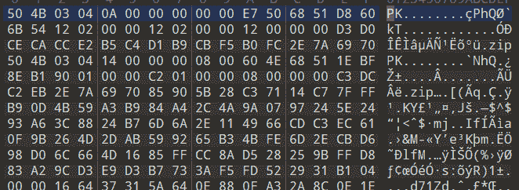
​ 明显PK开头，改后缀名为zip，打开后里边又是一层zip，打开里边有一个密码.zip，打开后内部是加密的，结合注释“真的有密码？”猜测是伪加密，用010editor打开，去除伪加密，打开里边的爆破.zip，根据提示6位数字密码，进行zip爆破，爆破得到密码233333（过程不展示了，工具到处都是），打开得到flag。

### 5\. jigsaw

​ 题目叫做jigsaw，翻译一下就是拼图的意思，打开压缩包，里边有黑白图片一共10000张，推测是拼起来是个二维码，这里用的工具是`ImageMagick` 下的`montage` （具体安装方法百度吧）

​ 在终端下输入：

```
montage *.png -tile 100X100 -geometry +0+0 flag.png 
```

​ 运行后得到flag.png


直接扫扫不出来，我当时是拖到word里加个滤镜，缩小一下扫出来的。。。


P.S.这道题做得我血压飙升，一万张图，在虚拟机跑好久，切一下后台kali就给我杀进程。。。期间卡死无数次。。。

## Crypto

### 6\. 经典三合一

​ `o{rnhBuRcj_Hjb_uN?p_auJ}`

​ 先栅栏得`oujp{Rb_rc_anjuuh_NJBH?}`，再凯撒得到`flag{Is_it_really_EASY?}`

### 7\. XOR

​ 题目XOR，肯定就是异或了，百度查阅了好多异或加密的资料，写代码：

```
 #include <stdio.h>
    main()
    {
       char a[]="DsfvD-jZ|,+p}sX.zIfvzYrh|pSvWMX'";
       char c[100];
       int i;

       for(int j=1;j<200;j++)
        {
       for(i=0;a[i];i++)
          c[i]=a[i]^j;
       printf("You Password: %s\n",c);
        }
    } 
```

运行结果：

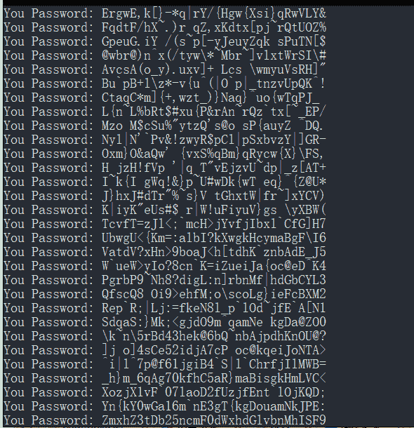

这个时候就要看你对Base64的敏感度了，最后一行很像Base64，直接一手解码，啪！很快啊，拿到flag：`flag{Congratulations!!!}`

### 8\. RSA

​ RSA是一种很经典的加密算法，以前只听说过没有研究过，查了好多资料后，大概了解了，用Python写代码：

```
import gmpy2
p=0xEB4360DF0E0C824D57AE20700BBF6C1BA8324A94DB7B3608DDA40DE07A59082F
q=0xA5B8BA7304F15C70BA82FF60F8A4A5F156ED04896EC94A7E99B96B4E11727A8F
e=0x10001
c=5849414025349869533962909975439563212209275395646853474539897994585461763870010917408284076946095324877247807213532724048271531587570791138002392138818496
n=p*q
s = (p-1)*(q-1)
d = gmpy2.invert(e,s)
m = pow(c,d,n)
print ("hex: " +  hex(m)) 
```

​ 把得到的16进制的明文HEX转码，拿到flag

### 9\. RSA_plus

​ 这道题给出了dp的值，查阅资料后，发现这叫dp泄露，进行简单的公式推导之后，写代码：

```
import gmpy2
import binascii
n=0x83A9DEF3CC906B08B926C896F3109D080E6DA3BA0744D15D1ED23CEBC7F67F0152B6FF8031F65702A991B0B41D81C4DD2840111ADE9CD1556178CB9D52B90409
e=0x10001
dp=10932553400881682210635683321183648664355266541474849157856482711967041983033
c=2258623409939733607655186579366743081899436099271191036894164042692086967635362871866346793891828960372212557879413400241461275122361638369464235153663059
for x in range(1, e):
    if(e*dp%x==1):
        p=(e*dp-1)//x+1
        if(n%p!=0):
            continue
        q=n//p
        phin=(p-1)*(q-1)
        d=gmpy2.invert(e, phin)
        m=pow(c, d, n)
        if(len(hex(m)[2:])%2==1):
            continue          
        print(hex(m)) 
```

把得到的16进制的明文HEX转码，拿到flag

## Reverse

### 9\. just_run

这道题，下载下来之后，首先试了一下改兼容性，无果。

然后第一反应用IDA打开，对着代码瞅了半天，看不懂。

想用IDA调试，折腾半天，整不好环境。（菜哭了）

IDA里看代码知道了是要用DOS运行，想装个DOS虚拟机。

后来还是觉得太麻烦了，最后发现了DOSBOX这个东西，嗯，很有精神！

在DOSBOX里跑了一下，拿到flag

## Web

### 10\. wireshark1

wireshark打开，根据题目提示：过滤FTP

追踪TCP流，找到password

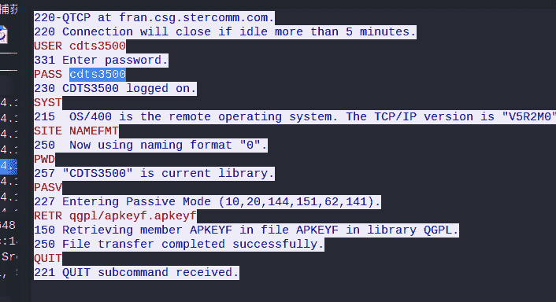

### 11\. 海事官网简化版

​ 有点意思的一道题目，一开始我就踩到了出题人的坑。。。


他说我搜不到flag，我TM就是要搜一下试试，然后就一直研究这个查询按钮。。。

最后重新看了一遍源代码，找到关键

```
 <a 
```

Base64解码`flag{DMU-CTF_WEB-mpc_chuti11261849}`

### 12\. 超级人肉计算机

比赛前两天看到过类似的题，正则提取题目，然后提交。Python写代码：

```
import requests
import re   

url = 'http://123.206.31.85:10002/'

source = requests.get(url, headers=head).content.decode('utf-8')
expression = re.search(r'(\d+[+*])+(\d+[+*])+\((\d+[+*])+(\d+)\)', source).group()
print(expression)
val = str(eval(expression))
print(val)
post = {'result': val}
result = requests.post(url, headers=head, data=post).content.decode('utf-8')
print(result) 
```

得到flag：`flag{b37d6bdd7bb132c7c7f6072cd318697c}`

### 13\. 你看不见我

看网页源代码，拉到最底下，看到

打开`http://123.206.31.85:10024/index/index.php` 看到php代码：

```
<?php 
class Small_white_rabbit{ 
    private $file = 'index.php'; 

    public function __construct($file) { 
        $this->file = $file; 
    } 

    function __destruct() { 
        echo @highlight_file($this->file, true); 
    } 

    function __wakeup() { 
        if ($this->file != 'index.php') { 

            $this->file = 'index.php'; 
        } 
    } 
} 

if (isset($_GET['var'])) { 
    $var = base64_decode($_GET['var']); 
    @unserialize($var); 
} else { 
    highlight_file("index.php"); 
} 
?> 
```

可以看到是对var这个变量先序列化，再进行base64的编码。

构造php代码：

```
<?php
class Small_white_rabbit{ 
    private $file = 'the_f1ag.php'; 
}  
$a = new Small_white_rabbit;
$b = serialize($a);
$b = str_replace(":1:",":2:",$b);
$c= base64_encode($b);
echo $c;
?> 
```

把echo的值构造payload：

```
http: 
```

拿到flag：

```
 <?php

?> 
```

### 14\. wireshark2

用wireshark打开，导入题目给的ssllog.log密钥，过滤http。

然后就开始各种找。。。。

搜索login追踪TLS流，最后找到。。。。。

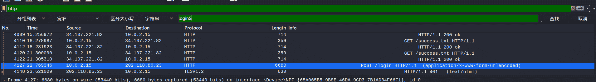

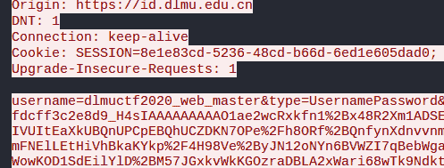

`username=dlmuctf2020`

### 15\. wireshark_js

用wireshark打开，导入ssllog.log密钥，过滤http

紧接上题，找到同一个位置，还是差不多同样一坨代码，然后就不知道怎么下手了。

```
HTML Form URL Encoded: application/x-www-form-urlencoded
    Form item: "username" = "dlmuctf"
    Form item: "type" = "UsernamePassword"
    Form item: "_eventId" = "submit"
    Form item: "geolocation" = ""
    Form item: "execution" = "30291c18-3c1f-4902-9fdd-6741d76770af_H4sIAAAAAAAAAO1ae2wcRxkfnx+xHSex82oDagghsUpL7n2+u6amvZzt5NKz4/rsJHUJydzu3Hnjvd3N7px9F1BKhEpfRG2lNkpJQalUiRJCU6l/tAoKbVWkAmqRKC2PoiCBmkeFqACBKgFS+Wb2cQ+fL+fCX+hOvvPuzDfffDPz+x7z
        Key: execution
        Value [truncated]: 30291c18-3c1f-4902-9fdd-6741d76770af_H4sIAAAAAAAAAO1ae2wcRxkfnx+xHSex82oDagghsUpL7n2+u6amvZzt5NKz4/rsJHUJydzu3Hnjvd3N7px9F1BKhEpfRG2lNkpJQalUiRJCU6l/tAoKbVWkAmqRKC2PoiCBmkeFqACBKgFS+Wb2cQ+fL+fCX+hOvvPuzDfffDPz+x7zzZz7M2
    Form item: "captcha_code" = ""
    Form item: "croypto" = "Up0p1bMqJvQ="
    Form item: "password" = "kcQMc1GkwN2/jOXyCHuBBilFZ9WFg1U3EBft1+sY0n1A7sVQjzcDGg==" 
```

这些代码很接近Base64，但是解不出来。。。。实在是很难受

过了好久。。。。。就在百度上乱搜。。。

直到我搜到了`croypto` 然后找到了这样一篇blog：

参考资料：https://blog.csdn.net/weixin_43272781/article/details/107331432

参考资料2：https://shentuzhigang.blog.csdn.net/article/details/107323907

很相似了，然后我知道了这是DES加密

先把`croypto`字段解码成16进制格式

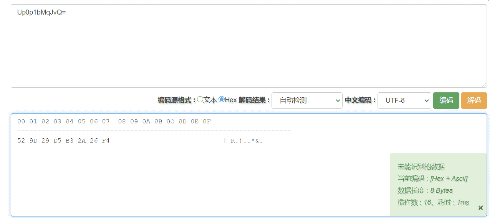

然后进行DES解密，在线地址：https://the-x.cn/cryptography/Des.aspx


拿到flag。

## Pwn

### 16\. 查字典

感觉这道题比第二道难啊啊！

在kali下

```
$ncat 172.27.97.232 2628 
```

会出现

```
$ncat 172.27.97.232 2628                                                                             220 dell-Precision-7920-Tower dictd 1.12.1/rf on Linux 4.15.0-1102-oem <auth.mime> <301.15714.1607266042@dell-Precision-7920-Tower> 
```

然后不管我输入啥都会返回一个`500 unknown command` ，后来我想，既然是command，那我试试输个help试试，然后就得到了

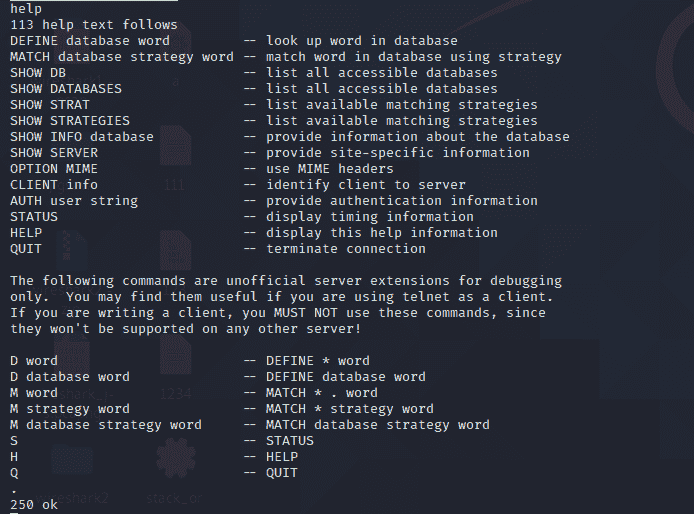

这，那这就很是Amazing了啊！后来查阅资料这是一种DICT协议，研究了好半天这种协议。。。感觉帮助不大

先搜他一手flag `DEFINE * flag`


啊，这啥呀，对着百度翻译半天，大体了解了，一开始我就把重点放到了第一段，`See also {hidden flag},{mode bit}`上,成功避开了正确的路，找了好半天没有结果，后来回过头再看第二段最后，`(i.e., dlmuctf2020)`

搜一下试试，`D * dlmuctf2020`,get!

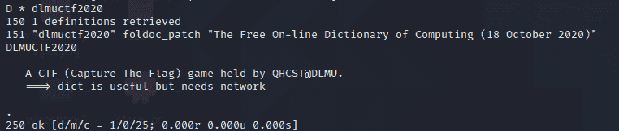

### 17\. 学生管理系统1

在kali下

```
$ncat 172.27.97.232 2000 
```

发现让输入密码，打开git看一下，发现并没有密码，看历史改动，找到了被删除的明文密码：`A_sImp1e_s7u6eN4_mAna9eme2t_s6s4eM`

输入密码后

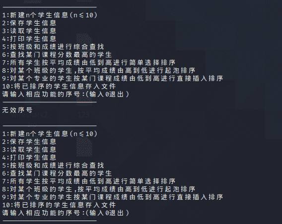

输入指令后提示要先读取文件，靠直觉试了试flag，不对，又试了一下flag.txt

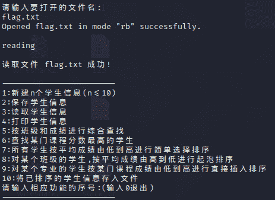

但是还有个问题，有个计时函数，每次我操作一会之后就会断开，很烦，然后就想到了构造代码，用管道符输入。

构造代码：

```
#include<stdio.h>
int main()
{
	printf("A_sImp1e_s7u6eN4_mAna9eme2t_s6s4eM\n");
	printf("3\n");
	printf("flag.txt\n");
	printf("4\n");
} 
```

编译：

```
$gcc a.cpp -o a 
```

终端输入：

```
$./a | ncat 172.27.97.232 2000 
```

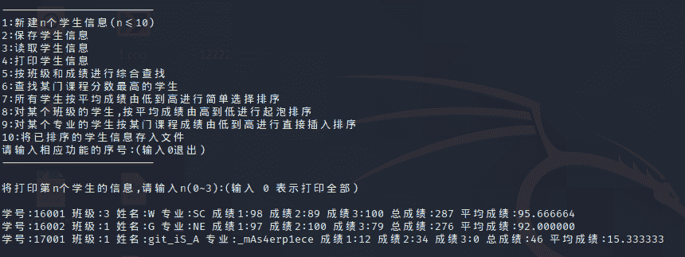

get!

```
学号:16001 班级:3 姓名:W 专业:SC 成绩1:98 成绩2:89 成绩3:100 总成绩:287 平均成绩:95.666664
学号:16002 班级:1 姓名:G 专业:NE 成绩1:97 成绩2:100 成绩3:79 总成绩:276 平均成绩:92.000000
学号:17001 班级:1 姓名:git_iS_A 专业:_mAs4erp1ece 成绩1:12 成绩2:34 成绩3:0 总成绩:46 平均成绩:15.333333 
```

flag:`dlmuctf{git_iS_A_mAs4erp1ece}`

### 18\. Pwn简单大综合

真的不会了，代码也看不懂，太菜了。。。。。。。