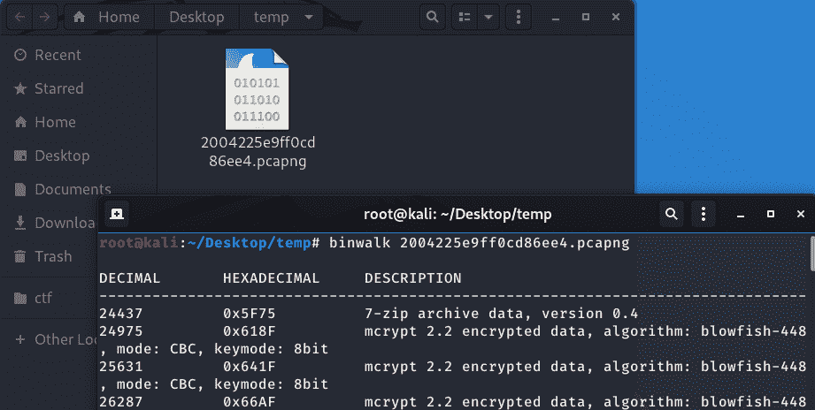
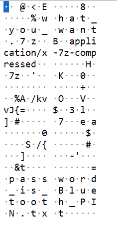
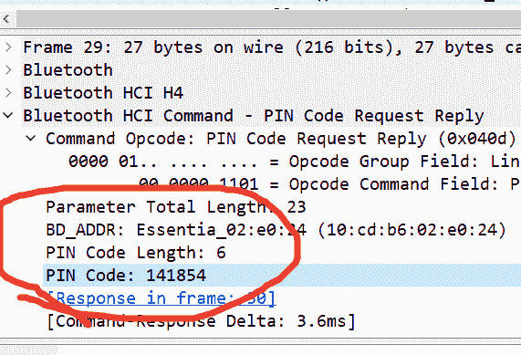
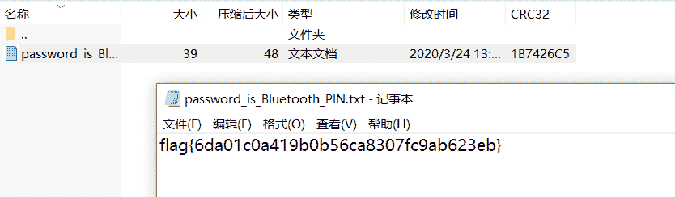
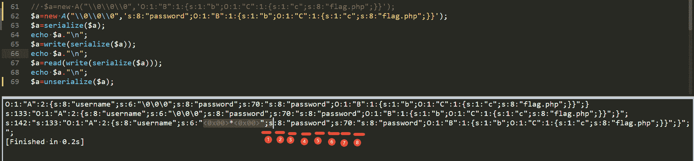
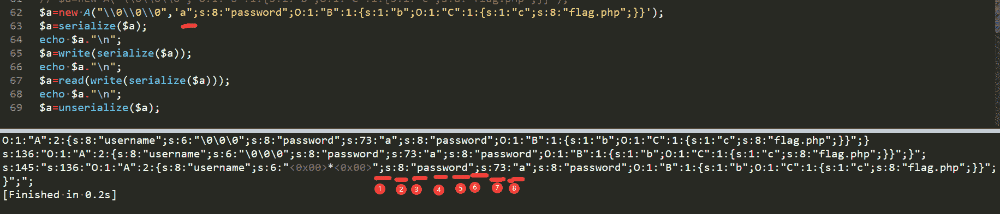
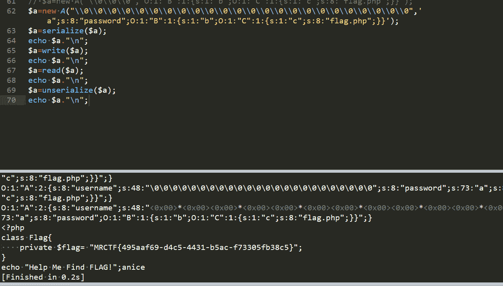

<!--yml
category: 未分类
date: 2022-04-26 14:42:14
-->

# 安恒四月月赛 DASCTF 部分题解_ruokeqx的博客-CSDN博客_安恒ctf题库

> 来源：[https://blog.csdn.net/weixin_45485719/article/details/105952920](https://blog.csdn.net/weixin_45485719/article/details/105952920)

# 安恒四月月赛 DASCTF 部分题解

----------------------------发现一个写了 但是丢着没发的wp-------------------------

### 6G还远吗

签到题 1G的文件 下载很慢 直接下载缓存 open with sublime就能看到flag

### blueshark

binwalk 能发现一个7z

搜索7z发现一个文件头 还提示密码是bluetooth pin txt

左上角文件→导出分组字节流 然后搜索pin可以找到pincode是141854

解压获得flag


### Ez_unserialize

直接给源码

```
<?php
show_source("index.php");
function write($data) {
    return str_replace(chr(0) . '*' . chr(0), '\0\0\0', $data);
}

function read($data) {
    return str_replace('\0\0\0', chr(0) . '*' . chr(0), $data);
}

class A{
    public $username;
    public $password;
    function __construct($a, $b){
        $this->username = $a;
        $this->password = $b;
    }
}

class B{
    public $b = 'gqy';
    function __destruct(){
        $c = 'a'.$this->b;
        echo $c;
    }
}

class C{
    public $c;
    function __toString(){

        echo file_get_contents($this->c);
        return 'nice';
    }
}

$a = new A($_GET['a'],$_GET['b']);

$b = unserialize(read(write(serialize($a)))); 
```

这是“Joomla RCE漏洞”改编的题目 直接百度 read 函数内的操作(L4)就能百度到

可参考博客：https://www.cnblogs.com/magic-zero/p/11643916.html

在我的项目中有曾经的 “flag.php” 正好可以验证包含的成功与否

可以看到 当new的c对象赋值给b对象的变量的时候，成功包含了 “flag.php”

现在的问题就是如何通过传参数让A类与B类产生关系，这就涉及到了上面提及的“Joomla RCE漏洞”了，即利用“read”和“write”函数。


不难看到 当传入 “\0\0\0” 经过序列化并write和read后 原本序列化出来的表示长度的6并没用改变 但是字符串的的长度由原本的6个变成了3个，所以反序列化时或将到下一个‘s’为止的字符串都当成‘username’的内容


所以我们可以在后面的参数传入时构造代码并让前面参数最终多“吃掉”字符并闭合，这样就可以在反序列化的时候包含“flag.php”了

所以我们可以传入多个"\0\0\0"以吃掉后面的到password后的引号为止，这样就可以自动闭合前面username的引号



要读到自己构造的password 至少需要8个“\0\0\0”,因为虽然7个刚好可以读到引号，但是没能构造出分号 所以需要再读“\0\0\0”，在后面构造处补分号并补齐前面username到引号 我这里构造如下图



我构造的password 前面补上 a"; 引号和分号不能变，a是任意字符

可以看到成功包含

