<!--yml
category: 未分类
date: 2022-04-26 14:46:16
-->

# 实验吧 部分逆向题解_pipixia233333的博客-CSDN博客

> 来源：[https://blog.csdn.net/qq_41071646/article/details/89056010](https://blog.csdn.net/qq_41071646/article/details/89056010)

最近搞pwn 搞得很自闭  不想看pwn了  准备看点  逆向    准备刷一些实验吧的一些题   来安慰安慰我  pwn不懂的心情！~~~~~

有些题 已经刷过了  我也就不写了   那些刷过的  也没有整理成一篇博客   比较可惜吧

recursive

这个题  看出来是python的了  然后   在主函数里面发现了东西

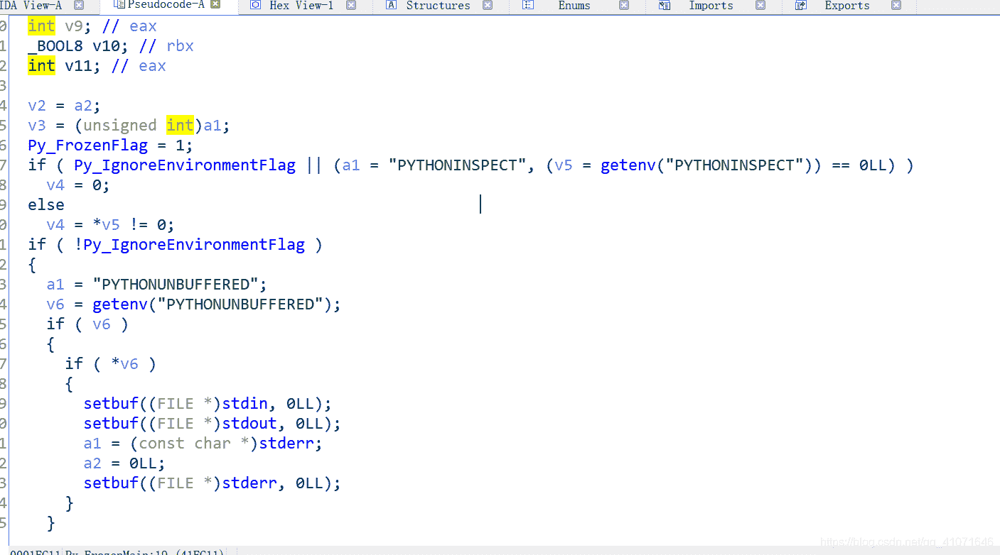

看起来应该是让 getenv 不等于0的 但是确实不知道怎么搞  百度了一波wp

[https://blog.csdn.net/qq_42192672/article/details/82990655](https://blog.csdn.net/qq_42192672/article/details/82990655)

大概明白了   是  环境变量

然后 用 其中Linux export命令用于设置或显示环境变量

然后一个一个分析就好 用ida 或者linux 的字符匹配求解

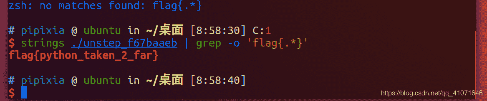

pinstore

这个题目太带劲了

还带数据库的 下了一个查看数据库的工具直接一把梭   看看是什么情况

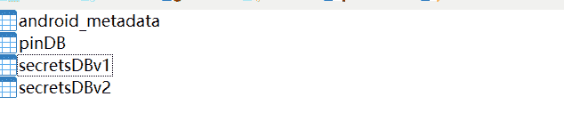

可以看出很多的值    

pinFromDB ：  d8531a519b3d4dfebece0259f90b466a23efc57b  (SHA 1  解密结果 7498) 

v1 ： hcsvUnln5jMdw3GeI4o/txB5vaEf1PFAnKQ3kPsRW2o5rR0a1JE54d0BLkzXPtqB

v2 :    Bi528nDlNBcX9BcCC+ZqGQo1Oz01+GOWSmvxRj7jg1g=

这里可以把值直接取出来

这个题 按道理来说应该有两种做法  

第一种就是直接 把v1改成v2  让程序直接把flag打印出来

这样的做法  简单粗暴一把梭 我很喜欢  那么 下面我详细讲述第二种

第二种就是直接粘贴算法 然后模拟这个题目的算法

我们看一下他都做了什么

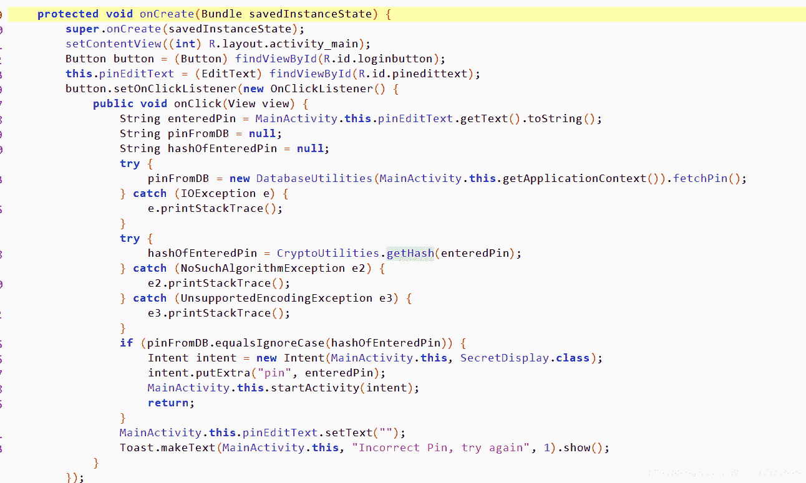

这里没啥用 直接输入 解密结果 7498 就可以进入下一个界面了

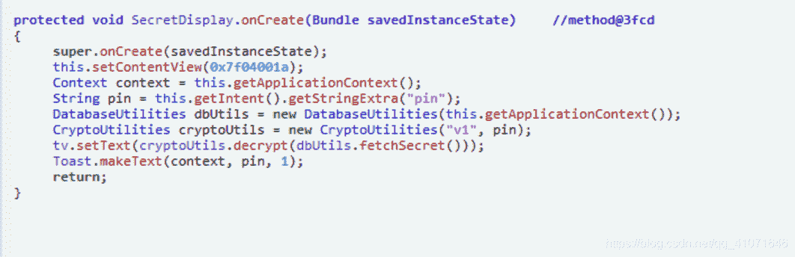

这样看起来也没有做多少事情   分析里面的函数

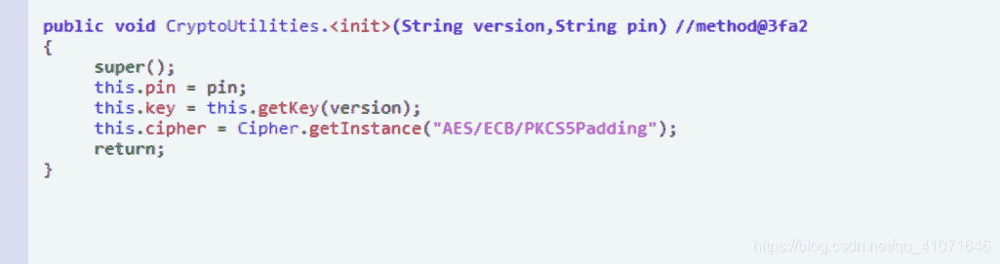

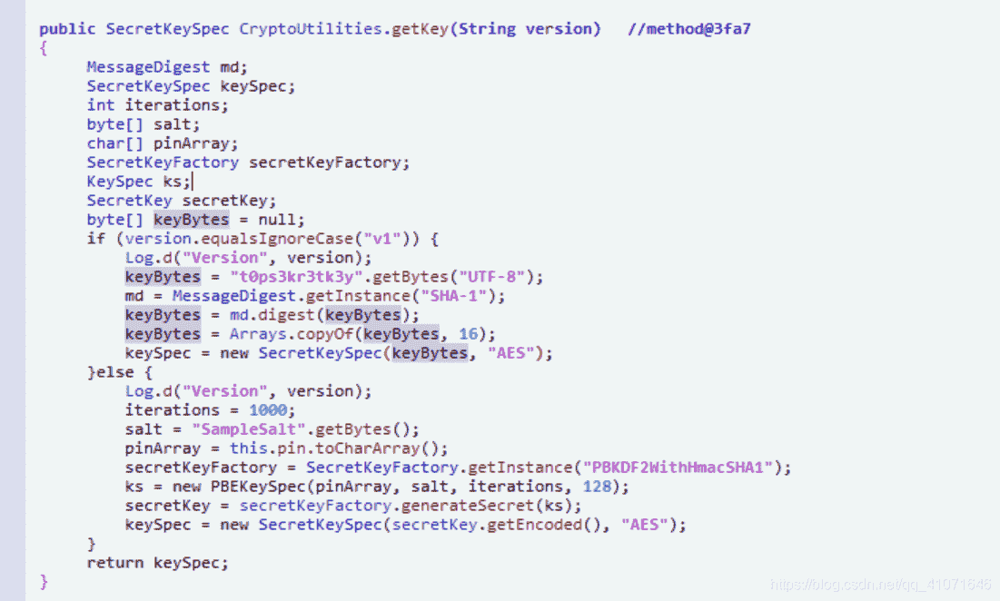 最终解密算法。。。。  重点是求出来key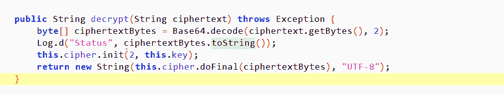

这里可以明显看出来 v1 v2 分开对待了

可以模拟一下这个算法

```
import java.io.UnsupportedEncodingException;
import java.security.InvalidKeyException;
import java.security.MessageDigest;
import java.security.NoSuchAlgorithmException;
import java.security.spec.InvalidKeySpecException;
import java.util.Arrays;
import java.util.Base64;
import java.util.Base64.Decoder;
import java.util.Base64.Encoder;
import java.util.Stack;
import javax.crypto.spec.SecretKeySpec;
import javax.crypto.BadPaddingException;
import javax.crypto.Cipher;
import javax.crypto.IllegalBlockSizeException;
import javax.crypto.NoSuchPaddingException; 
import javax.crypto.SecretKeyFactory;
import javax.crypto.spec.PBEKeySpec;

/*
 * v1: hcsvUnln5jMdw3GeI4o/txB5vaEf1PFAnKQ3kPsRW2o5rR0a1JE54d0BLkzXPtqB
 * v2: Bi528nDlNBcX9BcCC+ZqGQo1Oz01+GOWSmvxRj7jg1g=
 * 
 * */

public class Main {

	public static void main(String[] args) throws NoSuchAlgorithmException, NoSuchPaddingException, UnsupportedEncodingException, InvalidKeySpecException, InvalidKeyException, IllegalBlockSizeException, BadPaddingException{
    	int flag=2;
    	SecretKeySpec key;
    	byte[] ciphertextBytes=null;
		String pinFromDB="7498";
		Decoder decoder = Base64.getDecoder();
    	Cipher cipher = Cipher.getInstance("AES/ECB/PKCS5Padding");
    	String dbv1="hcsvUnln5jMdw3GeI4o/txB5vaEf1PFAnKQ3kPsRW2o5rR0a1JE54d0BLkzXPtqB";
    	String dbv2="Bi528nDlNBcX9BcCC+ZqGQo1Oz01+GOWSmvxRj7jg1g=";
    	if(flag==1)
    	{
    		ciphertextBytes = decoder.decode(dbv1.getBytes());
    		key=new SecretKeySpec(Arrays.copyOf(MessageDigest.getInstance("SHA-1").digest("t0ps3kr3tk3y".getBytes("UTF-8")), 16), "AES");

    	}
    	else
    	{
    		ciphertextBytes = decoder.decode(dbv2.getBytes());
    		byte[] salt = "SampleSalt".getBytes();
    		key=new SecretKeySpec(SecretKeyFactory.getInstance("PBKDF2WithHmacSHA1").generateSecret(new PBEKeySpec(pinFromDB.toCharArray(), salt, 1000, 128)).getEncoded(), "AES");
    	}
    	cipher.init(2,key);   
    	System.out.printf(new String(cipher.doFinal(ciphertextBytes)),"UTF-8");
    }

} 
```

v1 的结果

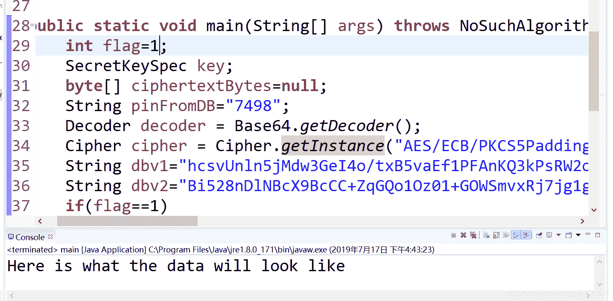

v2

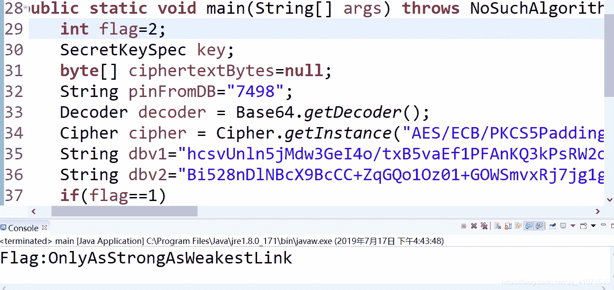

tcl

这个题目。。。 真的比较狗了

我用的是暴力模拟 一开始的想法是 用 os.system()  但是，，

必须按回车才会进行下一步

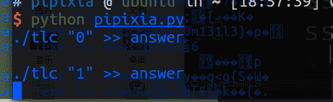

不清楚是怎么回事 如果有大佬知道 还请 指教。。

然后这个题目大概就是

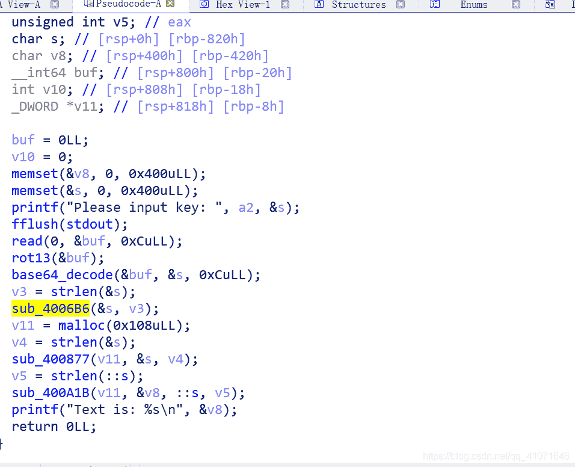

其中 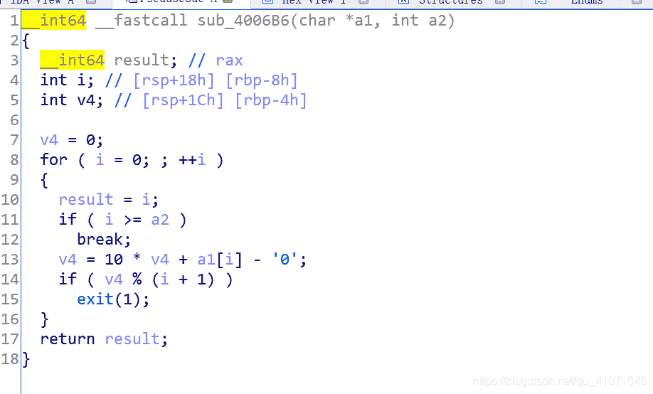

这里是一个判断点，，

我们可以筛选这些数字 然后 进行暴力跑

```
#include<stdio.h>
#include<string.h>
#include<algorithm>
#include<vector>
#include<iostream>
#include<map>
#include<time.h>
#include<queue>
#include "windows.h"
using namespace std;
int pow(int n)
{
    int sum=0;
    while(n)
    {
        n/=10;
        sum++;
    }
    return sum;
}
int pows(int n)
{
     int ret=1;
     for(int i=0;i<n;i++)
     {
          ret*=10;
     }
     return ret;
}
// 0- 1000000000
bool kk(char *a1,int a2)
{
    int result;
    int i; // [rsp+18h] [rbp-8h]
    int v4; // [rsp+1Ch] [rbp-4h]
    v4 = 0;
   for ( i = 0; ; ++i )
   {
    result = i;
    if ( i >= a2 )
      break;
    v4 = 10 * v4 + a1[i] - '0';
    if ( v4 % (i + 1) )
    {
        printf("%d\n",i);
     return 0;
    }
  }
  return 1;
}

int pan(int n)
{
    int sum=0,i;
    int len=pow(n);
    int k=len;
    for(i=0;i<k;i++)
    {
        sum=sum*10+(n/pows(len-1)%10);
        len--;
        if(sum%(i+1))
        {
            return 0;
        }
    }
    return 1;
}
/*
243600
243606
243654
246000
246006
246054
246402
246408
246450
987654564
*/
int main()
{

   FILE *fg=fopen("C:\\Users\\Lenovo\\Desktop\\1.txt","w");
   if(fg==NULL)
   {
       printf("打开文件失败！\n");
       return 0;
   }
   int k=0;
    for(int i=0;i<1000000000;i++)
    {
           if(pan(i))
           {
                //printf("%d\n",i);
               fprintf(fg,"%d\n",i);
               k++;
           }
    }
    printf("sum:%d\n",k);
    fclose(fg);
    return 0;
} 
```

然后 这里是python 脚本

```
# -*- coding:utf-8 -*-
import os
import base64
def rot(crypt_str,shift):
    crypt_list = list(crypt_str)
    plain_str = ""
    num = int(shift)
    for ch in crypt_list:
        ch = ord(ch)
        if ord('a') <= ch and ch <= ord('z'):
            ch = ch + num
            if ch > ord('z'):
                ch -= 26
        if ord('A') <= ch and ch <= ord('Z'):
            ch = ch +num
            if ch > ord('Z'):
                ch -= 26
        a=chr(ch)
        plain_str += a
    return plain_str

with open("flag.txt","r") as f:
	s=f.read()

s=s.split('\n')
for lists in s:
	ss=base64.b64encode(lists)
	ss=rot(ss,13)
	#command='./tlc "'+lists+'" >> answer'
	ret=os. popen('echo "'+ss +'" |./tlc')
	ret_read=ret.read()
	for line in ret_read.splitlines():
		if line.find("{")!=-1:
			print line

	#os.system(command) 
```

然后注释掉的 就是 system  不知道怎么回事，，，

然后  这个题目其实也可以把最后两个加密给模拟了 然后给直接算  这样会快点 

但是 这里没有必要  因为数字够少。。 结果如下

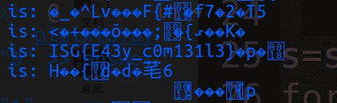

debug

这个题 说起来惭愧

本来我以为 ida  f5粘贴复制就行 但是我发现这个根本就不行   然后我进行了限制 

j前面本来 我没有加(unsigned __int8)  但是我发现结果跑的不对。。

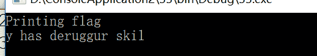

加上去之后 就对了

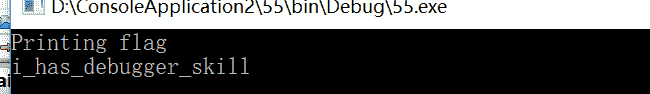

太真实了。。

```
#include<stdio.h>
#include<string.h>
#include<algorithm>
#include<iostream>
using namespace std;
int main()
{
   int v3[5],k; // [esp+18h] [ebp-20h]
  puts("Printing flag");
  v3[0] = 0x1686F596;
  v3[1] = 0x5646F537;
  v3[2] = 0x76765726;
  v3[3] = 0x37F52756;
  v3[4] = 0xC6C696B6;
  for (int  i = 0; i <= 4; ++i )
  {
    for ( int j= v3[i],k=0; k<4; j >>= 8,k++)
    {
      putchar(((unsigned __int8)j >> 4) | 16 * j);
    }
      //getchar();
  }

    putchar(10);
    return 0;
} 
```

### catalyst-system 

参考链接 [http://www.shiyanbar.com/ctf/writeup/5026](http://www.shiyanbar.com/ctf/writeup/5026)

如果要是知道linux 和windows 的随机数 竟然不一样  

我也不会。。。。。。。。。。。。。。。。。。。。。。。。。。。。。

思想了一下 应该是  windows linux 的随机策略不一样  毕竟 随机 有很多 策略

阿西吧  比较可惜吧     这个题我先说我分析到哪里 

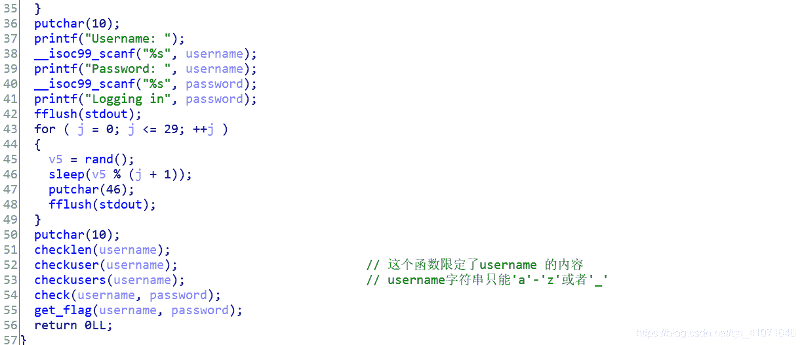

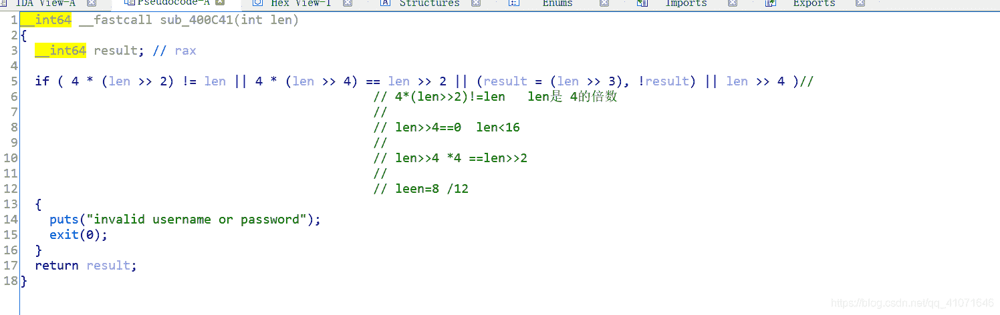

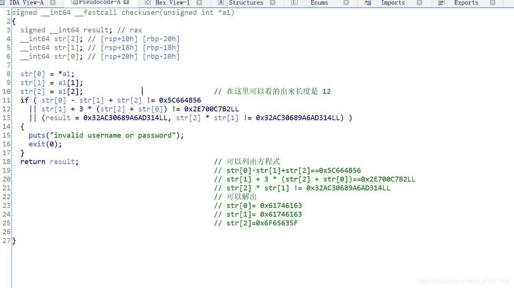

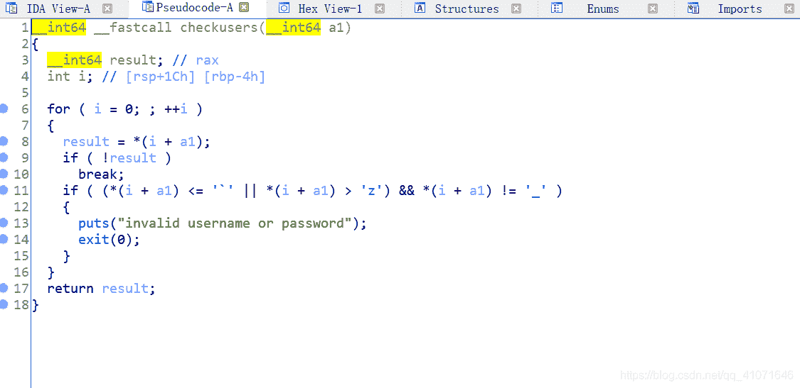

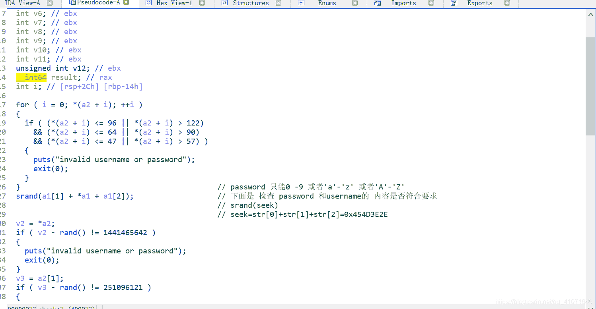 本来这里我感觉可以了 

然后先把username  打印出来

```
#include<stdio.h>
#include<string.h>
#include<algorithm>
#include<iostream>
using namespace std;
int main()
{
    int username[4];
    username[0]= 0x61746163;
    username[1]= 0x61746163;
    username[2]=0x6F65635F;
    printf("%.12s",username);

    return 0;
}
```

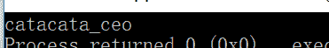

然后在求 password 的时候 发现出了问题

```
#include<stdio.h>
#include<stdlib.h>
#include<time.h>
int main()
{
    unsigned int a[14];
    srand(0x454D3E2E); //前面解出来的x + y + z

    a[0] = 0x55EB052A + rand();
    a[1] = 0x0EF76C39 + rand();
    a[2] = 0xCC1E2D64 + rand();
    a[3] = 0xC7B6C6F5 + rand();
    a[4] = 0x26941BFA + rand();
    a[5] = 0x260CF0F3 + rand();
    a[6] = 0x10D4CAEF + rand();
    a[7] = 0xC666E824 + rand();
    a[8] = 0xFC89459C + rand();
    a[9] = 0x2413073A + rand();
    for(int i=0;i<10;i++)
        printf("%d:%x\n",i,a[i]);
        printf("%.40s",a);
    return 0;

}
```

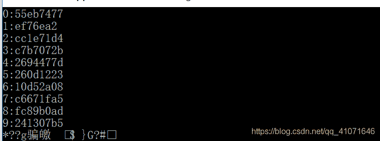

我 ？？？？？？？？？？

什么鬼

然后 看了那篇wp 我才知道我有那么 年轻。。

```
#include<stdio.h>
#include<stdlib.h>
#include<time.h>
int main()
{
    unsigned int a[14];
    srand(0x454D3E2E); //前面解出来的x + y + z

    a[0] = 0x55EB052A + rand();
    a[1] = 0x0EF76C39 + rand();
    a[2] = 0xCC1E2D64 + rand();
    a[3] = 0xC7B6C6F5 + rand();
    a[4] = 0x26941BFA + rand();
    a[5] = 0x260CF0F3 + rand();
    a[6] = 0x10D4CAEF + rand();
    a[7] = 0xC666E824 + rand();
    a[8] = 0xFC89459C + rand();
    a[9] = 0x2413073A + rand();
unsigned char b[] = {0x42, 0x13, 0x27, 0x62, 0x41, 0x35, 0x6b, 0x0f, 0x7b, 0x46, 0x3c, 0x3e, 0x67, 0x0c, 0x08, 0x59, 0x44, 0x72, 0x36, 0x05, 0x0f, 0x15, 0x54, 0x43, 0x38, 0x17, 0x1d, 0x18, 0x08, 0x0e, 0x5c, 0x31, 0x21, 0x16, 0x02, 0x09, 0x18, 0x14, 0x54, 0x59};
    for(int i=0;i<10;i++)
        printf("%d:%x\n",i,a[i]);
 char *aa = (char *)a;
        printf("password: %.40s",aa);
	printf("\n");
	printf("ALEXCTF{");
    for (int j = 0 ;j < 40 ;j++){
        printf("%c",b[j] ^aa[j]);
    }
    printf("}\n");
    return 0;

}
```

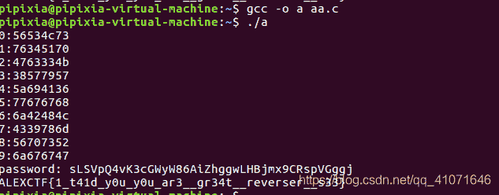

### defcamp

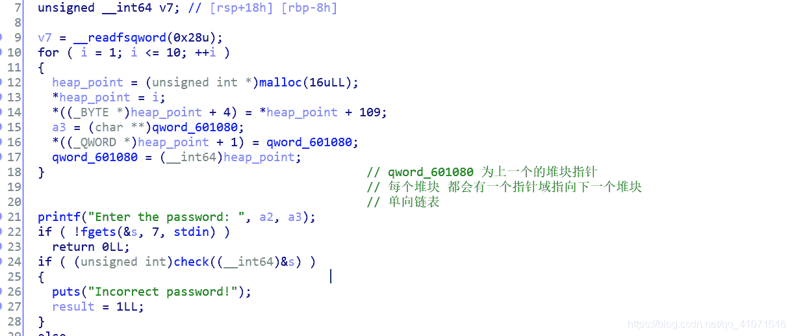

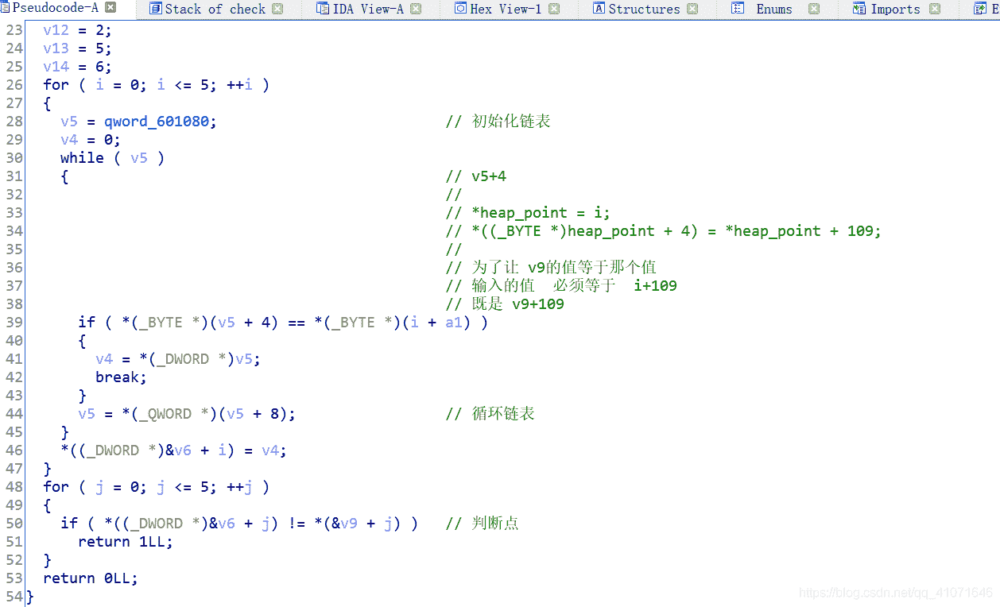

```
#include<stdio.h>
#include<stdlib.h>
#include<time.h>
int main()
{
    int s[6];
    for(int i=0;i<6;i++)
        scanf("%d",&s[i]);
    printf("\n");

    getchar();
    for(int i=0;i<6;i++)
        printf("%c",s[i]);
        getchar();
    return 0;

} 
```

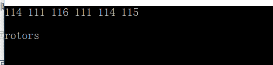

### reversemeplz

这个题目有点好玩

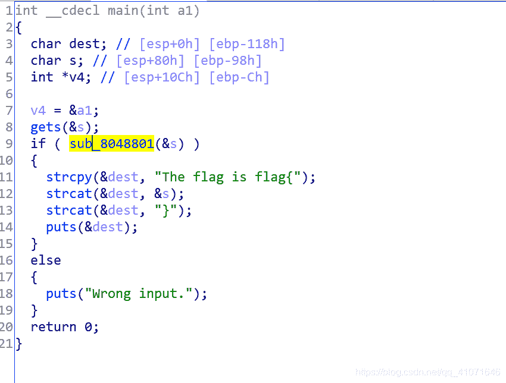

就一个验证函数

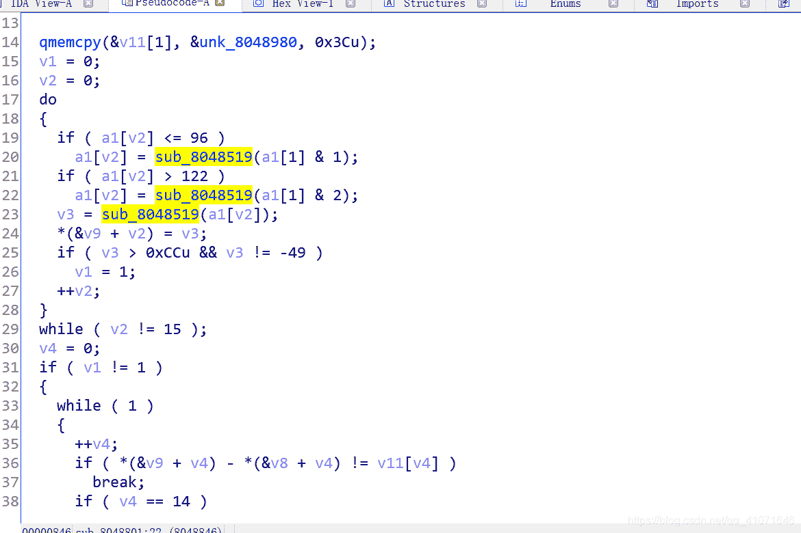

其中 sub_8048519  是一个映射函数   把一个字符映射成另一个字符

然后我们找一下密文

密文

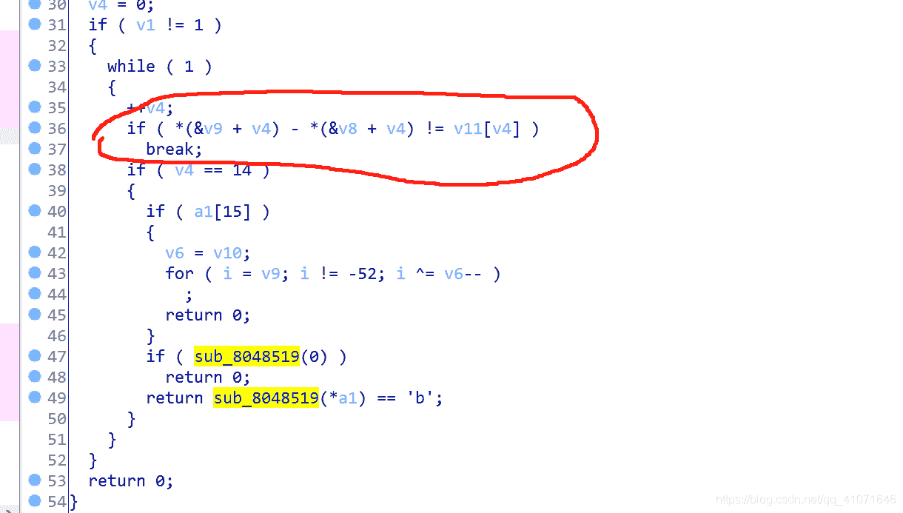

这里就是验证密文的   然后 密文第一位就是b

然后我们求出密文   然后 把可见字符都映射一下 做成一个表 然后 把密文映射一下就可以了

```
#include<stdio.h>
#include<string.h>
#include<algorithm>
#include<vector>
#include<iostream>
#include<map>
#include<time.h>
#include<queue>
#include "windows.h"
using namespace std;
map<char,char>mapp;
int dword_8049CA4;
char  sub_80484FB(char a1)
{
  ++dword_8049CA4;
  ++dword_8049CA4;
  return a1;
}
int  sub_8048519(char a1)
{
  unsigned __int8 v1; // al
  signed int v2; // edi
  int v3; // ebx
  signed int v4; // edi
  int v5; // ebx
  signed int v6; // edi
  int v7; // ebx
  signed int v8; // edi
  char v9; // cl
  int v10; // edx
  signed int v11; // edi
  int v12; // edx
  int v13; // edx
  signed int v14; // edi
  signed int v15; // ecx
  int v16; // edx
  signed int v17; // ecx
  int v18; // edx
  signed int v19; // ecx
  int v20; // edx
  signed int v21; // ebx
  int v22; // edx
  signed int v23; // ebx
  int v24; // edx
  signed int v25; // ebx
  int v26; // edx
  signed int v27; // ebx
  int v28; // edx
  signed int v29; // ecx
  int v30; // edx
  signed int v31; // ecx
  int v32; // edx
  signed int v33; // ecx
  signed int v34; // esi
  int v35; // edx
  char v36; // cl
  int v37; // edx
  signed int v38; // esi
  int v39; // edx
  int v40; // edx
  signed int v41; // edi
  int v42; // edx
  signed int v43; // edi
  int v44; // edx
  signed int v45; // ecx
  signed int v46; // esi
  int v47; // edx
  int v48; // esi
  bool v49; // zf
  signed int v50; // eax
  char v52; // [esp+4h] [ebp-10h]

  v1 = sub_80484FB(a1);
  v2 = 19;
  if ( (v1 & 0x3F) != 38 )
    v2 = 0;
  v3 = v2 | (v1 << 8) | 9 * ((v1 & 0x5F) == 86);
  v4 = 71;
  if ( (v1 & 0x77) != 116 )
    v4 = 0;
  v5 = v4 | v3;
  v6 = 84;
  if ( (v1 & 0x3F) != 39 )
    v6 = 0;
  v7 = v6 | v5;
  v8 = 48;
  if ( (v1 & 0x4F) != 4 )
    v8 = 0;
  v9 = v1 & 0x1F;
  v10 = 3 * ((v1 & 0x57) == 80) | 8 * (v9 == 1) | v7 | v8 | 2 * (v9 == 15) | 2 * ((v1 & 0x5B) == 83);
  v11 = 114;
  v52 = ~v1;
  v12 = 8 * (v9 == 2) | 8 * (v9 == 11) | v10 | 2 * ((v1 & 0x57) == 66) | 8 * ((v1 & 0x2E) == 44);
  if ( (v1 & 0x37) != 37 )
    v11 = 0;
  v13 = v11 | v12;
  v14 = 16;
  v15 = 0;
  if ( (v1 & 0x1C) == 8 )
    v15 = 16;
  v16 = ((~v1 & 0x78u) < 1 ? 0x48 : 0) | v15 | v13;
  v17 = 64;
  if ( (v1 & 0x1D) != 16 )
    v17 = 0;
  v18 = v17 | v16;
  v19 = 0;
  if ( (v1 & 0xF) == 11 )
    v19 = 16;
  v20 = 4 * ((v1 & 0x55) == 64) | v19 | v18;
  v21 = 72;
  if ( (v1 & 0x4B) != 1 )
    v21 = 0;
  v22 = v21 | v20;
  v23 = 24;
  if ( (v1 & 0x47) != 1 )
    v23 = 0;
  v24 = v23 | v22;
  v25 = 96;
  if ( (v1 & 0x2B) != 34 )
    v25 = 0;
  v26 = ((v52 & 0x55u) < 1 ? 0x48 : 0) | v25 | v24;
  v27 = 0;
  if ( (v1 & 0x31) == 16 )
    v27 = 16;
  v28 = v27 | v26;
  v29 = 0;
  if ( (v1 & 0x55) == 81 )
    v29 = 68;
  v30 = v29 | v28;
  v31 = 0;
  if ( (v1 & 0xE) == 8 )
    v31 = 32;
  v32 = v31 | v30;
  v33 = 97;
  if ( (v1 & 0x59) != 72 )
    v33 = 0;
  v34 = 81;
  v35 = v33 | v32;
  v36 = v1 & 0x17;
  if ( (v1 & 0x17) != 4 )
    v34 = 0;
  v37 = v34 | v35;
  v38 = 37;
  if ( (v1 & 0x47) != 66 )
    v38 = 0;
  v39 = v37 | v38 | 8 * ((v1 & 0x43) == 2);
  if ( (v1 & 0x46) != 2 )
    v14 = 0;
  v40 = v14 | v39;
  v41 = 80;
  if ( v36 != 3 )
    v41 = 0;
  v42 = v41 | v40;
  v43 = 70;
  if ( v36 != 1 )
    v43 = 0;
  v44 = v43 | v42;
  v45 = 40;
  if ( (v1 & 0x70) != 64 )
    v45 = 0;
  v46 = 0;
  v47 = 4 * ((v1 & 0x41) == 1) | ((v52 & 0xBu) < 1 ? 0x60 : 0) | v45 | v44;
  if ( (v1 & 0x48) == 64 )
    v46 = 32;
  v48 = v47 | v46;
  v49 = (v1 & 0x21) == 1;
  v50 = 0;
  if ( v49 )
    v50 = 68;
  return v48 | v50;
}

//bargjbgursyntlb
int main()
{
    //求出密文...
//        int dword_8048980[] = {0xFFFFFFFF, 0x11, 0xFFFFFFF5, 3, 0xFFFFFFF8, 5, 0xE,
//                           0xFFFFFFFD, 1, 6, 0xFFFFFFF5, 6, 0xFFFFFFF8, 0xFFFFFFF6,
//                           0};
//    int l='b';
//    printf("b");
//    for(int i=0;i<14;i++)
//    {
//        l+=dword_8048980[i];
//        printf("%c",l);
//    }
     char s[]="bargjbgursyntlb";
     char ll;
     char k[]="abcdefghijklmnopqrstuvwxyzABCDEFGHIJKLMNOPQRSTUVWXYZ0123456789";
     for(int i=0;i<strlen(k);i++)
     {
         ll=sub_8048519(k[i]);
         mapp[k[i]]=ll;
     }
     printf("flag{");
     for(int i=0;i<strlen(s);i++)
     {
           printf("%c",mapp[s[i]]);
     }
     printf("}");
    return 0;
}
```

得出flag

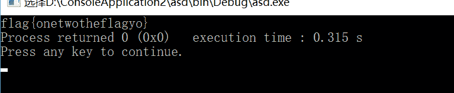

Byte Code 这个题 也是没有什么好讲的  这个题很简单

.class  多半就是java的  然后出现了  

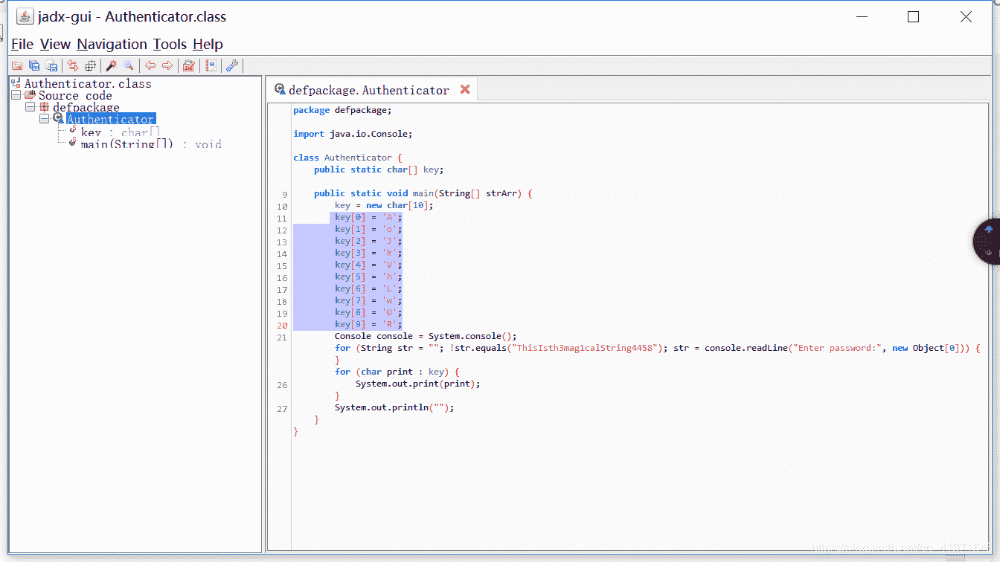

然后看程序逻辑  应该就是 如果 输入的字符串等于 ThisIsth3mag1calString4458 就会输入key

那么 key 就是我们的flag。

### bitwise  

一开始我想的是这个题 暴力跑 可是我发现了  &255  还有 左移右移 的和是 8  我感觉这个算法  还是可以逆一下的

  #255 ==11111111   最后结果取 8个二进制 那么
  #左移和右移 加起来是8  那么也就相当于 转个圈  最后在和 最后三位 异或一下
  #那么逆推回去就是 先异或 111 然后 >>改成<<  <<改成>> 即可

这个是我看源代码  给分析出来的


这是跑出来的结果和脚本

```
#coding:utf-8
if __name__ =='__main__':
    verify_arr = [193, 35, 9, 33, 1, 9, 3, 33, 9, 225]
    strs=""
    for i in verify_arr:
        i=i^111
        temp=((i>>5)|(i<<3))&255
        strs+=chr(temp)
    print(strs) 
```

这题算是很简单的

### 逆向观察

这个题 就更简单了。

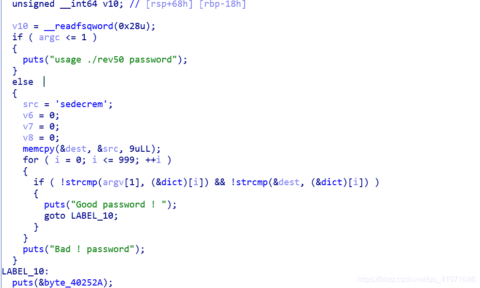

逻辑是如此 然后可能不知道 dict 是干啥的

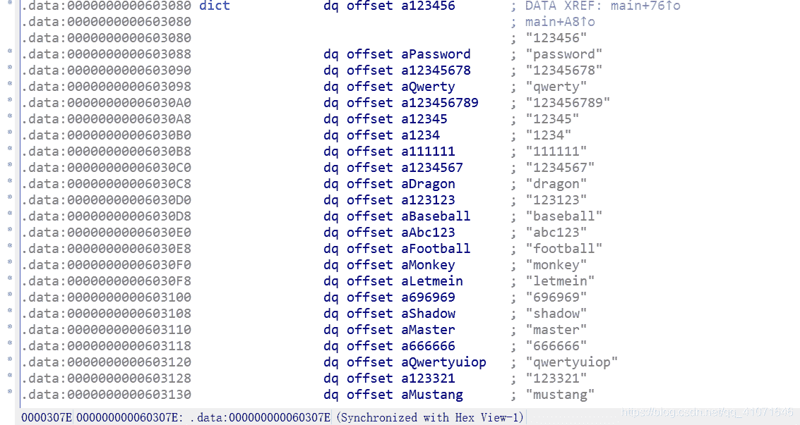

这。。。  应该是一个数组 然后 暴力跑一遍？？？？？？ 不过反正我们输入的字符 和他们一样就行了 至于为什么 把我们转化的字符给反转     我感觉应该用ida的导出数据 好一点 不要轻易的  转化就直接用 

因为我一开始 就犯了这个错误 。。。

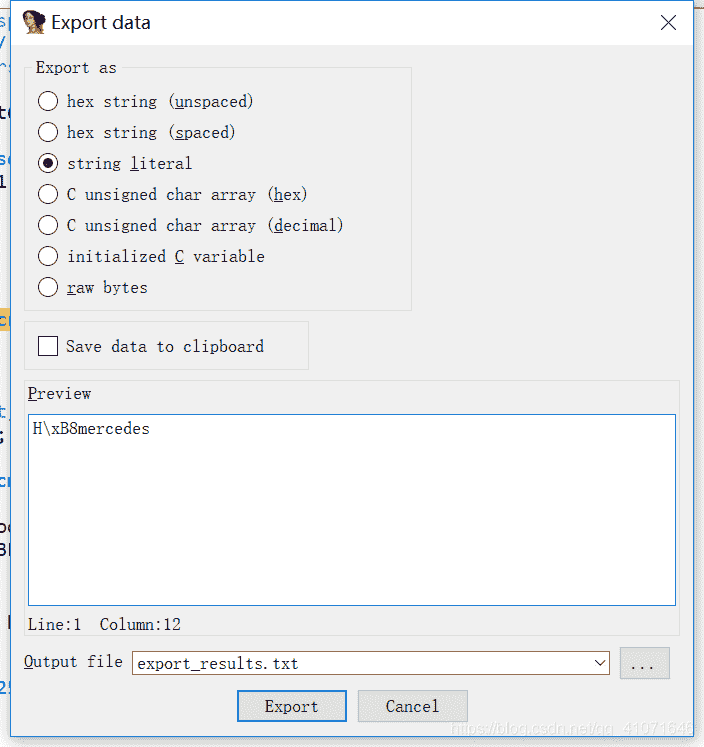

把前面的去掉就可以了

mercedes

回答正确。

1000

这个题 我是尽力了  这道题 做的我怀疑人生  我看着这个flag 不对 想着flag 也不会写到 文本里面 结果  

人家 还真的是  然后在后面添加一个Y就行 。。。

1000  要不 是二进制 要不就是10进制 这个我是猜的出来了 

但是后面的 我是真的 想不出来竟然是这个样子。 我断下了按钮 

获得了 输入框 最后 断下了 writefile。。

唉 

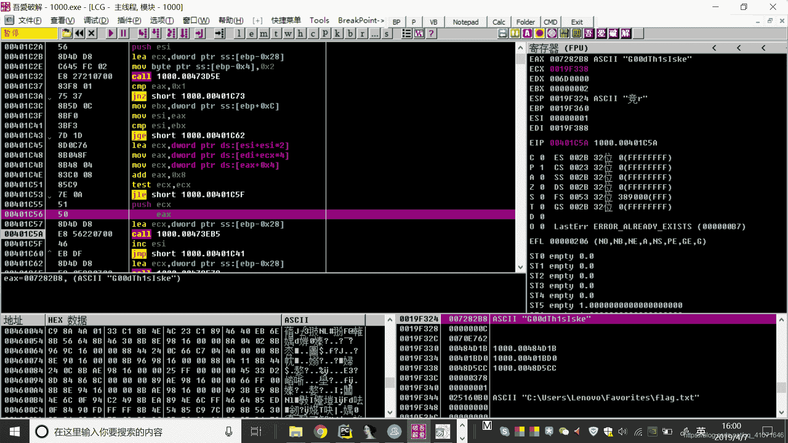

G00dTh1sIskeY

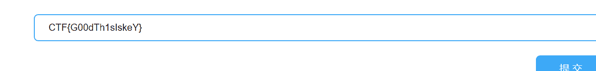

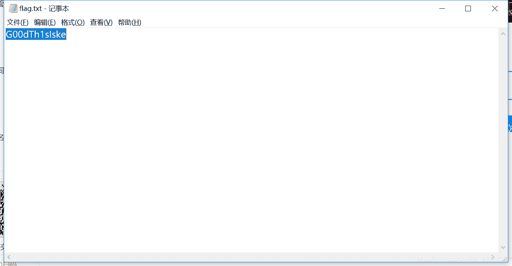

### 迷路

太坑了  花里胡哨的

前面过的 花里胡哨  但是到后面就感觉差了很多 。。。。。。 是真的感觉不行啦   

怎么说呢   出题人太骚了  特别是那个 整易语言 我都有点受不了   更别说其他的了  我都不知道 那些大佬是怎么发现这些骚套路的

这个题 我还以为是走方格什么的  。。。。 结果不是  。。。  我硬撸 算法 发现失败了。。。。。。。。。

然后 参考链接

[https://blog.csdn.net/qq_40827990/article/details/83212779](https://blog.csdn.net/qq_40827990/article/details/83212779)

没错  

我又看别人的博客了  呜呜呜 我哭了   没有想到 还会有一个按钮

具体看按钮情况 可以用 

ShowWindow

来断点 看参数信息

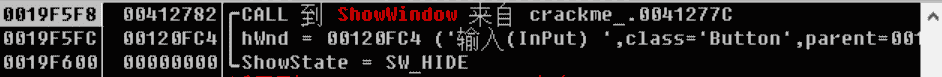

 点击 0 改成1就好

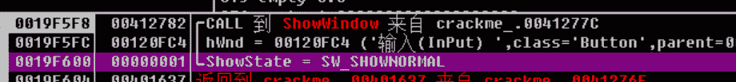

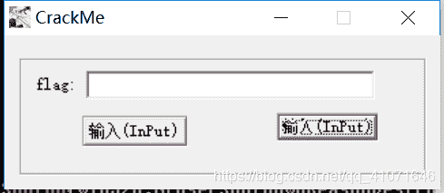

然后 就多出了 哪一个按钮     断 点 然后 静态分析就好

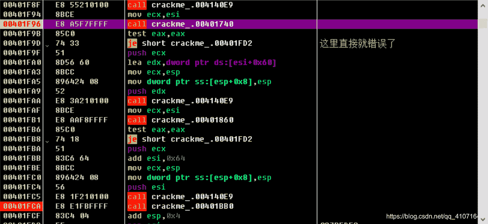

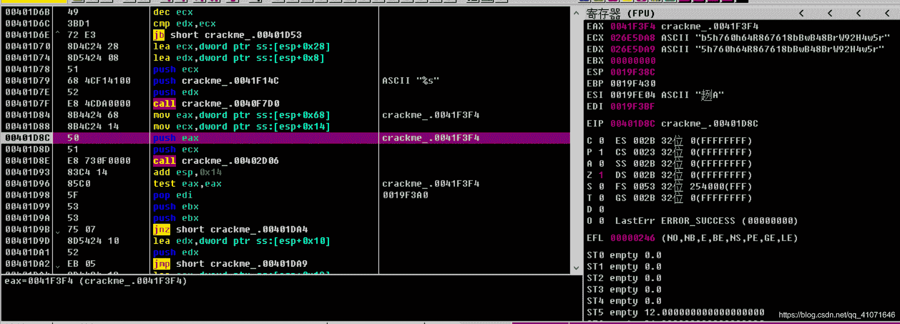

 发现这里都是直接跑飞的点 断下来 ida 静态分析一波

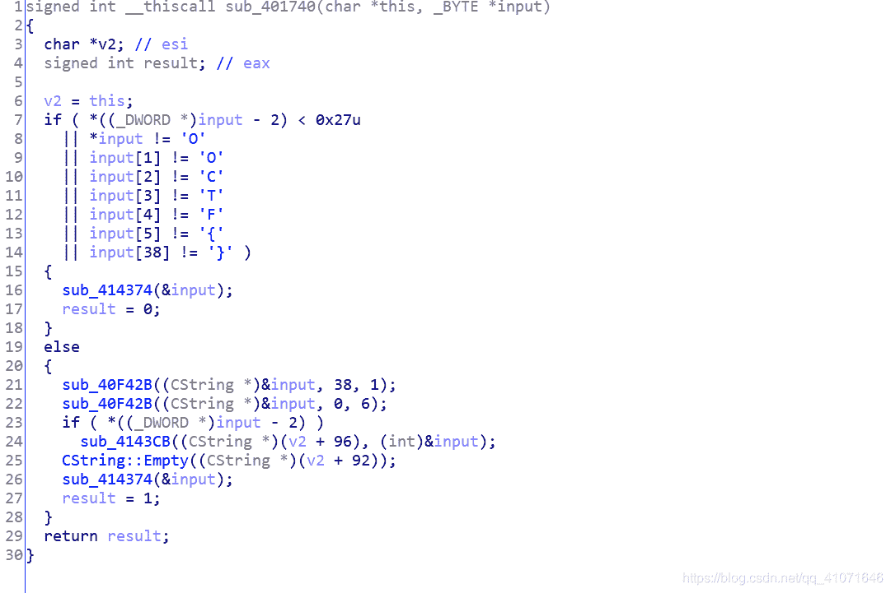

第一个 函数 限定了他们的flag 格式

第二个 就是 算法了

 像 v5  还有  v6 都可以调试调出来

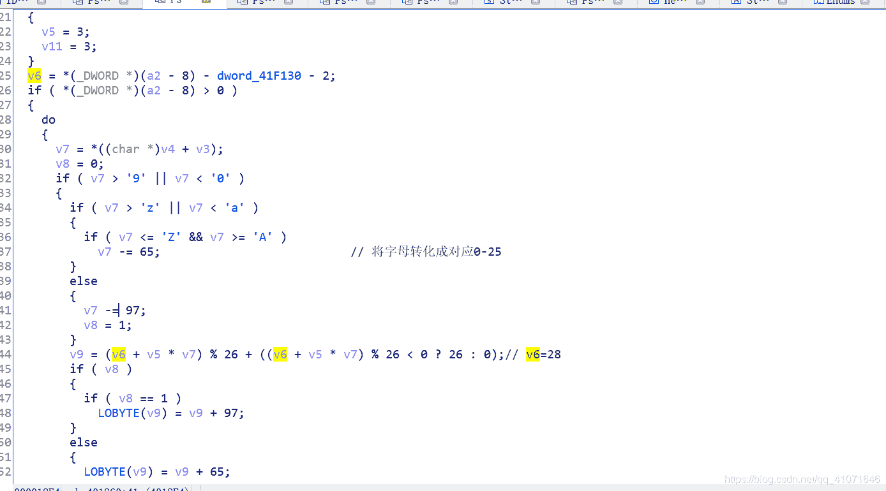

b5h760h64R867618bBwB48BrW92H4w5r

那么可以写一个脚本出来

```
#include<stdio.h>
#include<stdlib.h>
#include<time.h>
#include<string.h>
#include<iostream>
using namespace std;
char s[]="b5h760h64R867618bBwB48BrW92H4w5r";
int main()
{
    int temp;
    printf("OOCTF{");
    for(int i=0;i<strlen(s);i++)
    {
        if(s[i]>=48&&s[i]<=57)
        {
            printf("%c",s[i]);
            continue;
        }
        if(s[i]>=65&&s[i]<=90)
        {
             temp=65;
        }
        else
        {
            temp=97;
        }
         for(int j=0;j<26;j++)
         {
              if((j*5+28)%26==s[i]-temp)
              {
                   printf("%c",j+temp);
              }
         }
    }
    printf("}");
    return 0;

}
```

### NSCTF Reverse 400

这个题  看着有点像 python打包的exe 文件 以前接触过这种题  

工具下载地址

[https://sourceforge.net/projects/pyinstallerextractor/](https://sourceforge.net/projects/pyinstallerextractor/)

直接试着能不能给直接搞定

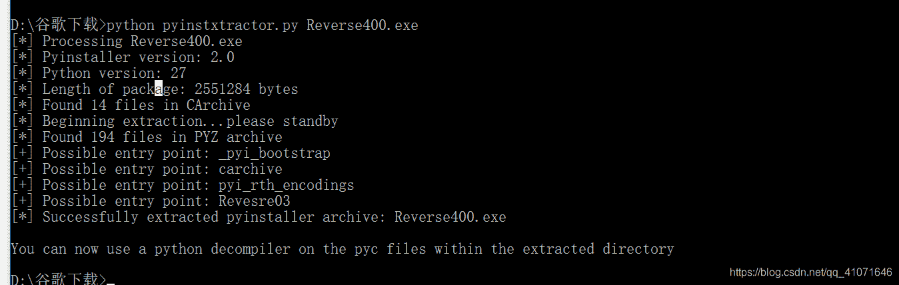

 哦吼 好像搞定了

然后打开文件夹 

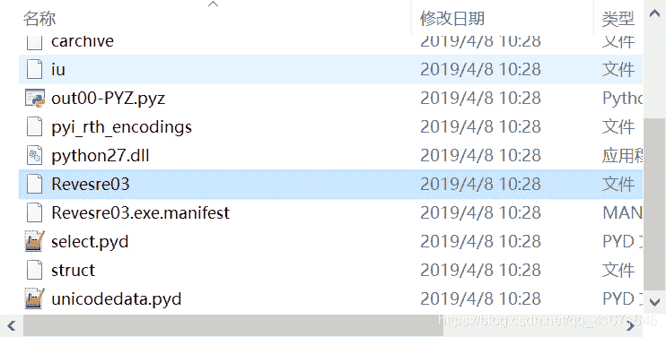

选定我光标的那个文件 然后 看一下文件都有什么内容

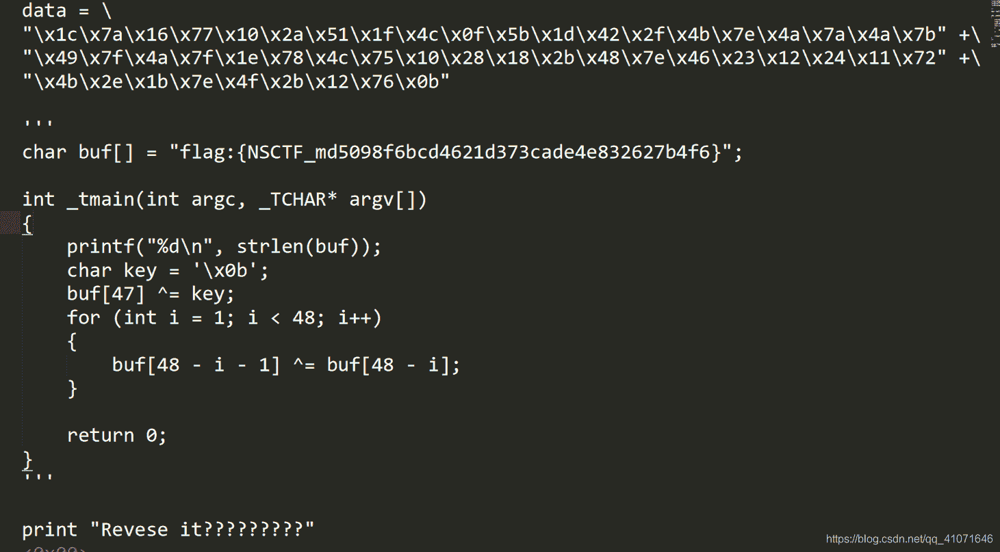

哇 直接 爆flag   正当我 有点开心的时候 

突然发现。。。。。。。。。。。。。。。。。。。。。。。。。。。。。。。。。 这个flag 不对 

然后 我看了一下后面的算法  逆向了一下 

用buf 还有data 都试了一下 结果 data 的对了

```
#!/usr/bin/env python
# encoding: utf-8
data = \
"\x1c\x7a\x16\x77\x10\x2a\x51\x1f\x4c\x0f\x5b\x1d\x42\x2f\x4b\x7e\x4a\x7a\x4a\x7b" +\
"\x49\x7f\x4a\x7f\x1e\x78\x4c\x75\x10\x28\x18\x2b\x48\x7e\x46\x23\x12\x24\x11\x72" +\
"\x4b\x2e\x1b\x7e\x4f\x2b\x12\x76\x0b"
flag=""
for i in range(len(data)-1):
    flag+=chr(ord(data[i]) ^ ord(data[i+1]))

print(flag) 
```

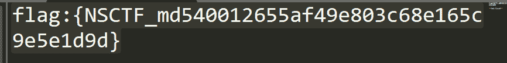

做出来这个题 真的是 巧合

### Keylead（ASIS CTF 2015）

这个题 应该算是 简单的了   大致看了一下  我们输入的数据和 解密的函数没有关系  那么直接 修改rip  跳到 解密函数即可

（sub_4006B6） 动态调试一下 就可以

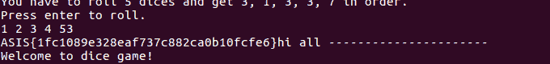

得到flag

### lol 

终于。。 我还是直接撸 llvm了    其实这个题我一开始 再撸 610windows 那个题 

但是 他那个虚拟指令 我大概看懂了一点 但是 还是看的不是很明白 然后我们看一下 这个题把  

我们直接看 so库里面的代码   java 层代码 没有什么好说的 就那么多的东西

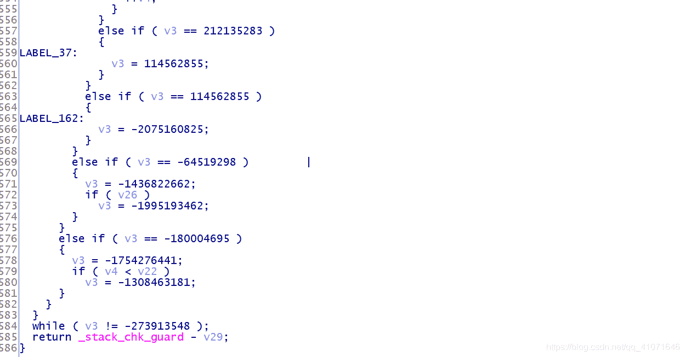

很明显。。。。。  要是我们直接撸 我感觉 起码一个星期才能撸出来 不过我听说 有关于pin 还有  符号执行能够解决这个问题 但是我现在还不是很明白怎么搞这个东西     比较好的是 这个题的 逻辑不是很难  （也是我瞎猫碰见死耗子  运气好一点吧）

我们先看一下主要的地方  

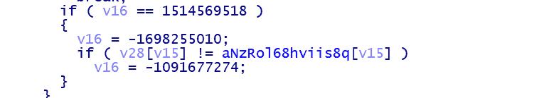


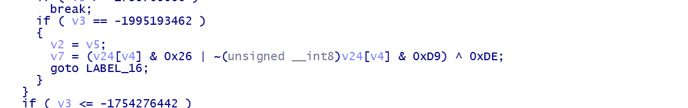

那么我们看一下  跳转条件是什么

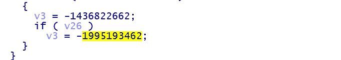

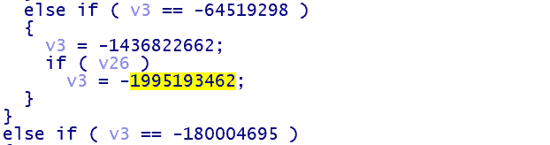

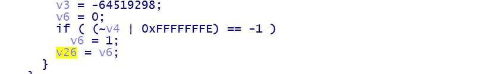

0xFFFFFFFE=‭11111111111111111111111111111110‬  -1=0xFFFFFFFF=‭11111111111111111111111111111111‬

那么 ~v4|11111111111111111111111111111110==‭11111111111111111111111111111111‬

那么这里  是 ~v4 只要最后一位 是1 那么就会完成条件  ~又是取反 那么 只要是0那么就是完成条件 

那么这个条件可以 简化成   v4%2==0

在这里之后再也找不到 v26的变化地方了 那么我们尝试一下写一个脚本试试  看看是否是正确答案

```
#coding:utf-8
if __name__ =='__main__':
	str1="NZ@rol68hViIs8qlX~7{6m&t"
	flag=""
	index=0
	l=''
	for i in str1:
		for j in range(256):
			if index%2==0:
				l=chr((j & 0x26 | ~j& 0xD9) ^ 0xDE)
			else:
				l=chr((j & 0xF6) | ~j& 9)
			if(l==i):
				flag+=chr(j)
				break
		index+=1
	print(flag) 
```

结果正确了~~