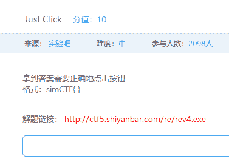
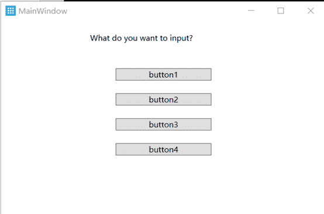
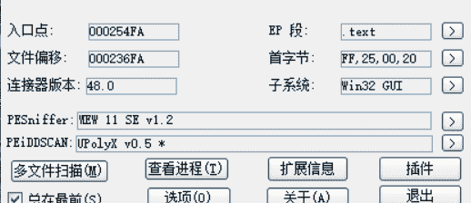
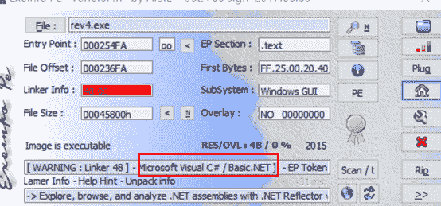
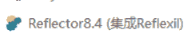
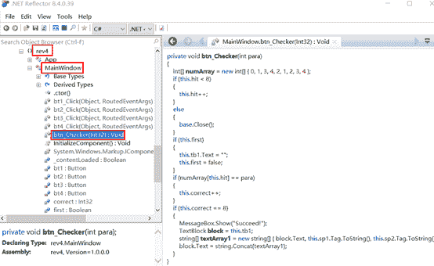
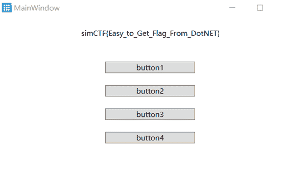

<!--yml
category: 未分类
date: 2022-04-26 14:31:16
-->

# 实验吧CTF逆向题目Just Click题解_iqiqiya的博客-CSDN博客

> 来源：[https://blog.csdn.net/xiangshangbashaonian/article/details/78934999](https://blog.csdn.net/xiangshangbashaonian/article/details/78934999)

题目如下：

运行程序：

结合第一张题目提示已经能够猜到 是按一定的顺序点击1，2，3，4四个按钮就好

先来查下壳

这是个什么鬼 没见过的壳

我再试试

发现是.NET的程序

那就上这个

随便点开几个看看 结果发现关键代码

发现这个数组后

没看代码 直接按照刚才想的按顺序点击1，3，4，2，1，2，3，4

就得到了flag

不过提交确是错的

把to改成To就好(还有 simCTF不是sinCTF 。。。)

sinCTF{Easy_To_Get_Flag_From_DotNET}