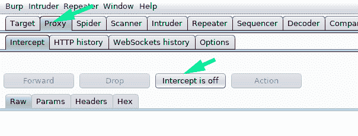
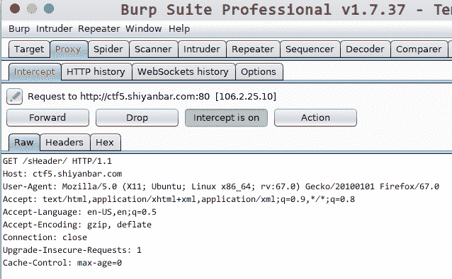
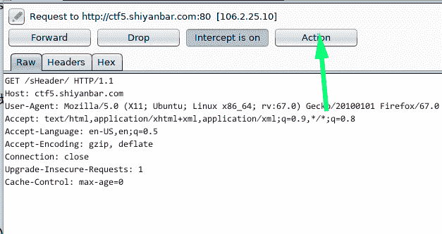
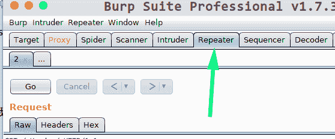
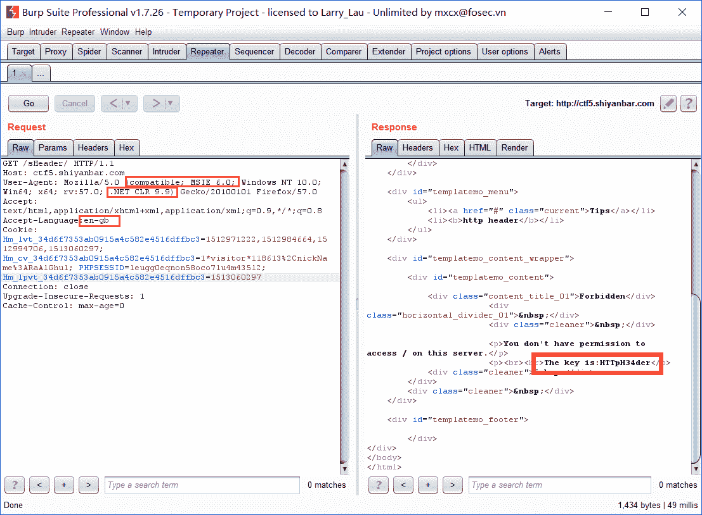

<!--yml
category: 未分类
date: 2022-04-26 14:47:56
-->

# 实验吧WEB CTF 头有点大 全网最简单易懂的解题方法_滕青山YYDS的博客-CSDN博客_实验吧维护

> 来源：[https://blog.csdn.net/qq_34626094/article/details/113116052](https://blog.csdn.net/qq_34626094/article/details/113116052)

## 前言

题目网址： [实验吧平台升级维护中](http://www.shiyanbar.com/ctf/29 "实验吧平台升级维护中")

需要用到的工具： burpsuite

## 开始

首先打开**burpsuite**，切换到**Proxy**选项卡，确保**intercept**是关着的。

[](https://www.tuziang.com/usr/uploads/2019/05/2726538715.png)

浏览器打开[解题链接](http://ctf5.shiyanbar.com/sHeader/ "解题链接")

可以看到：

```
Forbidden

You don't have permission to access / on this server.

Please make sure you have installed .net framework 9.9!

Make sure you are in the region of England and browsing this site with Internet Explorer 
```

这题的要求有三个：1.使用.net 9.9框架 2.在英国 3.使用IE浏览器。

当然，我们并不需要去安装.net 9.9，也不用使用IE浏览器，更不需要去英国，我们只要修改请求头信息，让服务器认为我们达到了条件即可。

打开**intercept**，并且刷新浏览器页面

可以看到**burpsuite**的**raw**中出现了下面的信息

[](https://www.tuziang.com/usr/uploads/2019/05/3560677840.png)

点击**action**，选择**Send to repeater**

[](https://www.tuziang.com/usr/uploads/2019/05/1434519321.png)

接着切换到**repeater**选项卡

[](https://www.tuziang.com/usr/uploads/2019/05/3130691501.png)

现在再来思考一下我们需要改的信息：

首先是在User-Agent中，添加compatible; MSIE 6.0，使得服务器认为我们使用的是IE6.0的浏览器，

接下来添加.NET CLR 9.9，使得服务器认为我们安装了.NET 9.9框架。

接下来是修改Accept-language，改为en-gb，使得服务器认为我们在英国。

## 结束

最后点击**Go**，key的值就出来了

[](https://www.tuziang.com/usr/uploads/2019/05/3897240404.png)

* * *

参考：[决斗场 - 实验吧 WEB 头有点大](https://blog.csdn.net/raalghul/article/details/78782147 "决斗场 - 实验吧 WEB 头有点大")