<!--yml
category: 未分类
date: 2022-04-26 14:50:27
-->

# 平时练习 ctf 解题报告 web类_白山茶i的博客-CSDN博客

> 来源：[https://blog.csdn.net/qq_30435981/article/details/81219313](https://blog.csdn.net/qq_30435981/article/details/81219313)

### **1.读文件**

大大的空白网页就给出

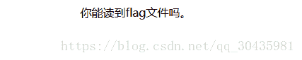

去看源代码

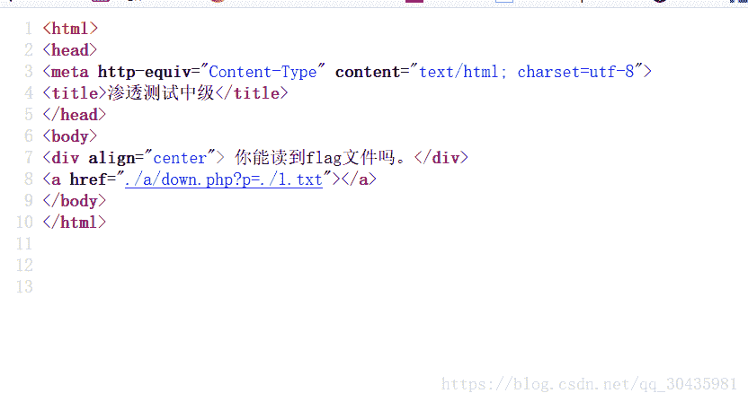

发现有个php文件，在给的地址后面加上  /a/down.php?p=./1.txt

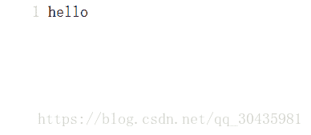

页面就一个 hello，源码也是hello，没有任何提示

我们试试将1改成flag，发现页面报错 （这里我是直接浏览器URL传的，用hackbar传值，记得关post）

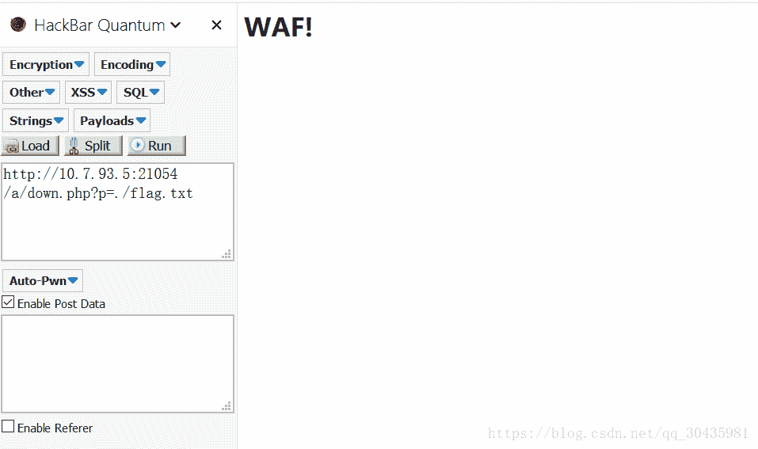

此时我们想想为什么1.txt前面加上了./ 说不定是被过滤了

此时我们可以考虑返回上一级查看信息

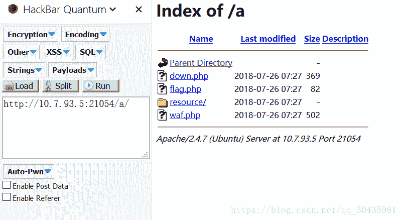

发现flag文件，我们直接点进去

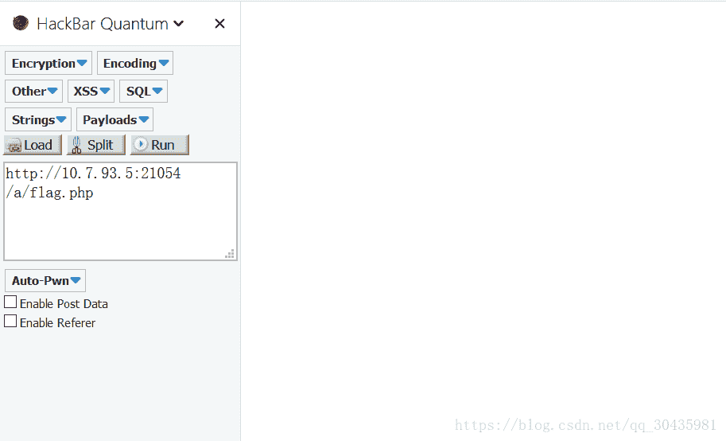

发现不行，我觉得这可能是这个题目的bug，也许是需要我们通过在down.php然后返回上级目录，然后再去访问flag.php才能访问到。

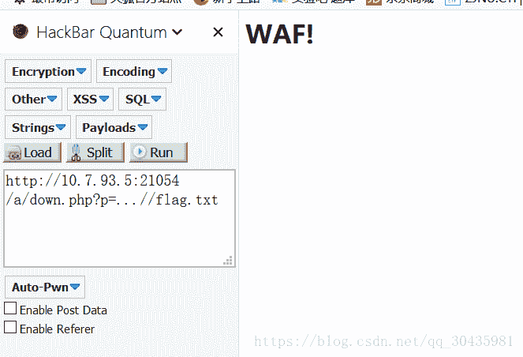

重新回到报错的网页，我们在p值后面加上 ../ 发现还是报错，

然后我们想到，一般的做题网站，我们直接访问flag文件不行，因为flag被过滤掉，我们可以试试双写，大小写，发现都是报错。

看来得用到这道题目独有的特征:  **./  **被过滤，所以我们可以在flag中间加上， 变成fl./ag。

这是这道题目特有的，其他题目遇到这种情况可以试试我说的将flag大小写、双写什么的。

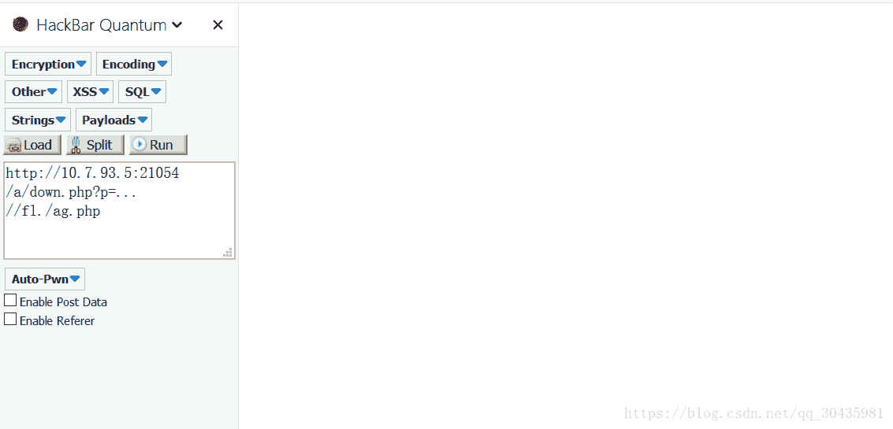

貌似是对了，去看看源码。

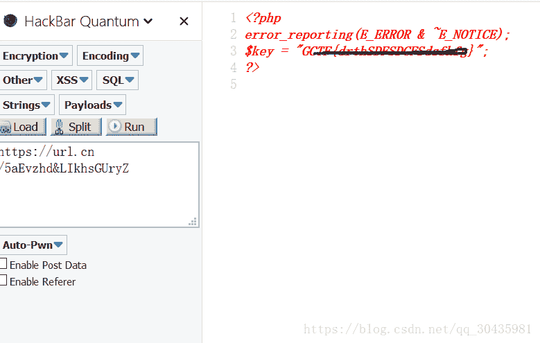

找到了flag

**2. **NaNNaNNaNNaN-Batman

这个题目是下载下来一个文件，web100，我们可以试试在浏览器里面打开

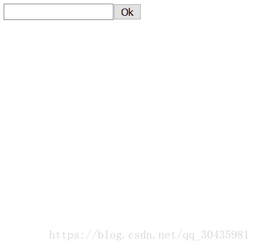

发现是个让我输入东西的一个网站

查看源代码

```
<script>
_='function $(){e=getEleById("c").value;
length==16^be0f23233ace98aa$c7be9)
{tfls_aie}na_h0lnrg
{e_0iit\'_ns=[t,n,r,i];
for(o=0;o<13;++o)
{	[0]);
.splice(0,1)
}
}
}
\'<input id="c">
< onclick=$()>Ok</>\');
delete _var ","docu.)match(/"];
/)!=null=["	write(s[o%4]button
if(e.ment';
for(Y in $='	')
with(_.split($[Y]))_=join(pop());
eval(_)
</script>
```

看到eval，里面是个下划线，我们可以监测这个下划线的值，把eval改成alert。

其实这个代码还需要编辑成PHP文件，扔进浏览器看一波

```
function 
$(){var e=document.getElementById("c").value;
if(e.length==16)if(e.match(/^be0f23/)!=null)
if(e.match(/233ac/)!=null)
if(e.match(/e98aa$/)!=null)
if(e.match(/c7be9/)!=null)
{var t=["fl","s_a","i","e}"];
var n=["a","_h0l","n"];
var r=["g{","e","_0"];
var i=["it'","_","n"];
var s=[t,n,r,i];
for(var o=0;o<13;++o)
{document.write(s[o%4][0]);
s[o%4].splice(0,1)
}
}
}
document.write('<input id="c"><button onclick=$()>Ok</button>');
delete _
```

这个也可以百度一波正则表达式

然后代码审计一波，发现if条件语句

这是要让我们输入一个c值

此时，尝试编出这个神奇秘钥，我们知道 /^ 这个符号是这个代码的开头，开头要有：be0f23,  $/ 这个符号代表结尾，那段if语句的意思为：c值里面结尾为 e98aa 其他两条为 中间要有  233ac和c7be9

可得c= be0f233ac7be98aa

输入刚给的那个web100文件

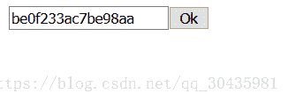

点ok之后

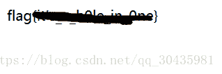得到flag

**3.Forbidden**

题目给出一个网站和一个hint：请求头

登录网站发现网站不给访问

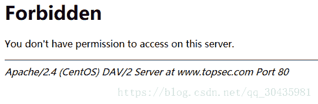

这时候想到去F12的网络中去找响应相关的信息，发现在响应中有个hint

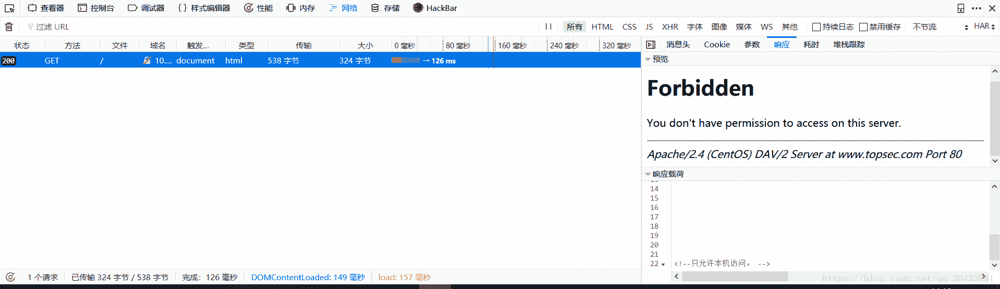

提示是：只允许本机访问。这需要我们需要去编辑消息头。

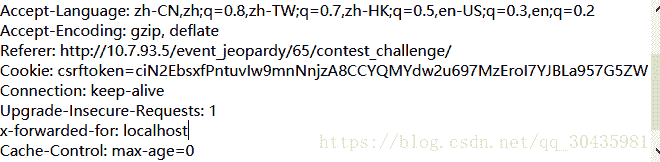

在原本消息头这边编辑，在对应位置，如上图 加

> x-forwarded-for:localhost

发送之后又给出个网站跳转。

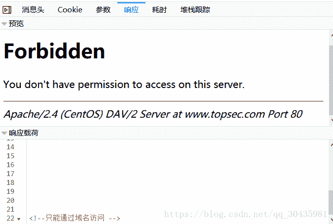

这里我们可以看到：只能通过域名访问，再看forbidden网页提示，我们要通过 wwww.topsec.com 80端口访问

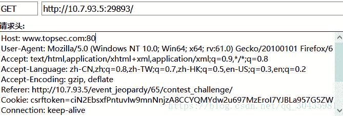

在请求头这边，Host这边，该对应网址的80端口，如上图这么修改再发送内容，发现还是不能访问。

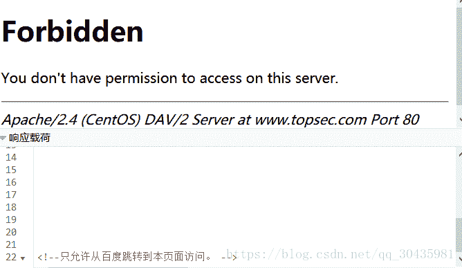

响应这边又给出新的提示：只允许从百度跳转到本页面访问。

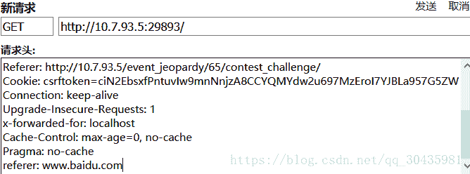

编辑新请求，在最后一行加上：

> referer:www.baidu.com

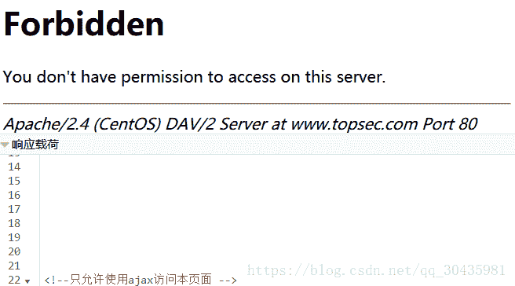

发送之后发现新提示：只允许使用ajax访问本页面。

这个我们可以了解一下ajax创建对象，是XMLHttpRequest

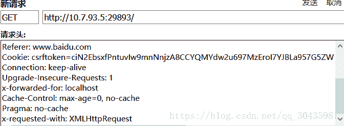

在最后一行加上

> x-requested-with: XMLHttpRequest

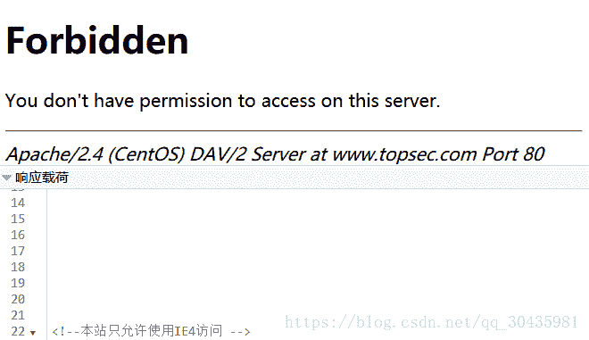

发现还是不能访问，在响应这边又给出了新提示，用ie4访问。

这时候我们需要了解IE4浏览器在消息头发送的时候是以怎样一个形式，百度一下。

这个就将user-agent里面的win64 改成MSIE4.0就行

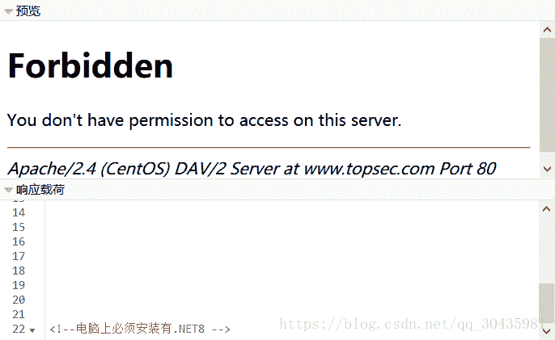

又是一个提示

这个在user-agent后面加上 .NET CRL 8.0

同时在前面加上服务的Apache 即Apache/2.4(CentOS) DAV/2

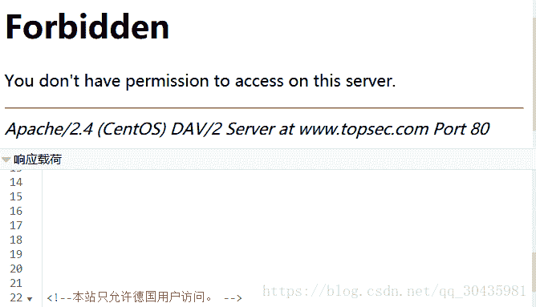

又一个响应：只允许德国用户访问，在accept-language那边修改：

Accept-Language: de-DE,de; 

de是德国英文的缩写

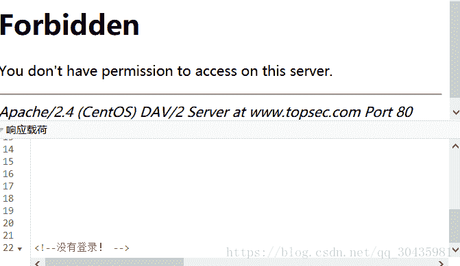

一个hint：没有登录

在cookie这给了个login的

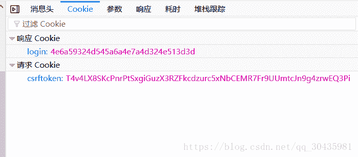

发现cookie有个login，明显加密过，总之先16进制解码发现是个base64的密码，再base64解码，发现

还是不对，再16进制解码之后发现，解码出来是：false

所以我们有个思路，将 true 进行编码传送


cookie这后面加上  

;login=  (true进行16进制编码再base64编码再16进制编码的密码)

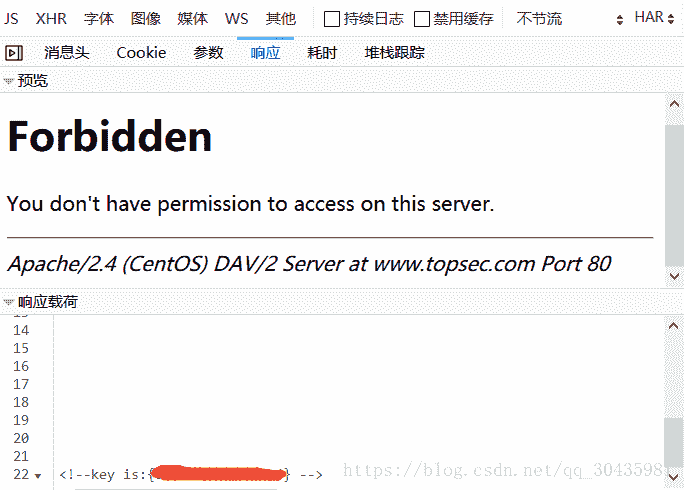

成功找到key

### 4.urldecode

打开题目链接

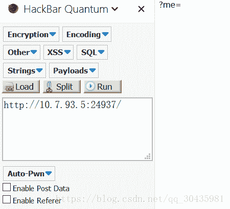

显然他问我们me是多少，我们先随便传值

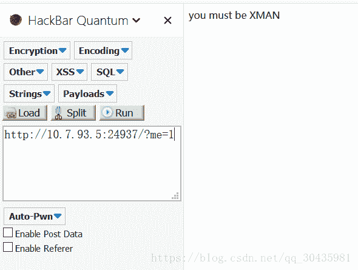

这句话，我们可以试试将xman传值

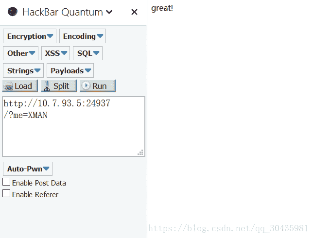

看来是对的，但是没有flag文件

题目有个提示，说在me这个值也要见到%

我们可以想到url编码

将XMAN进行一次编码传值

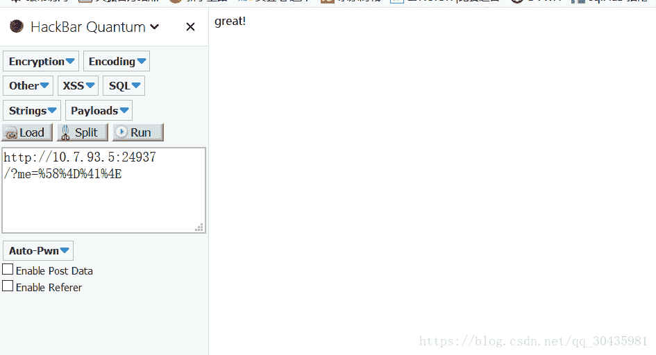

发现还是不行，但思路可能是对的

我们可以试试再次编码传值

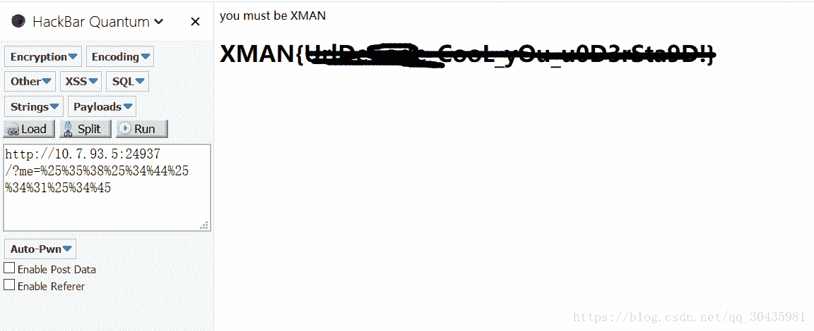

得到flag