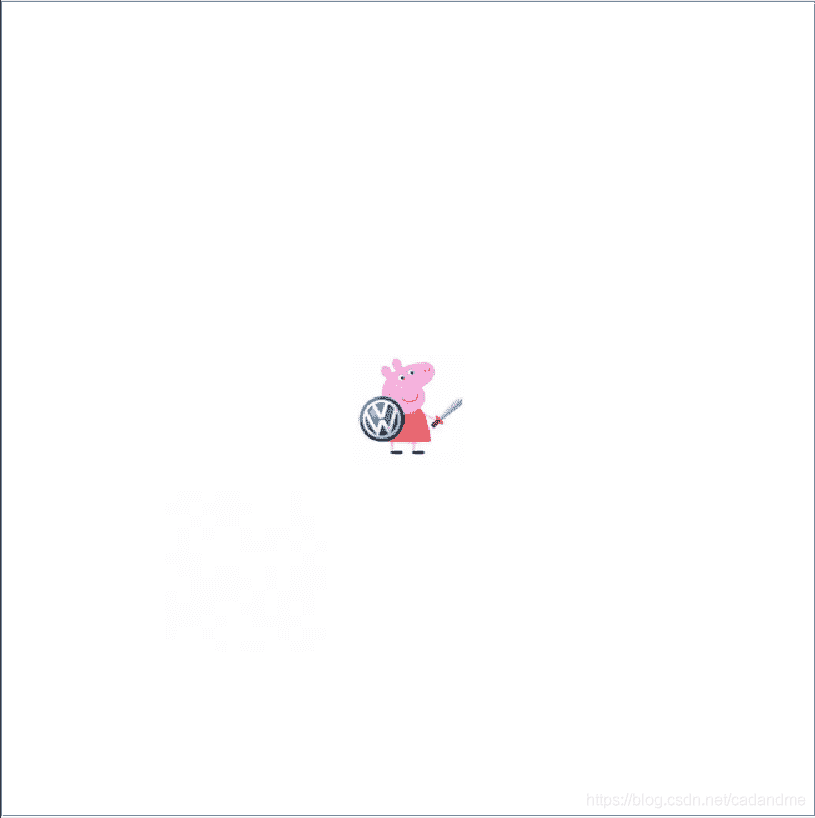
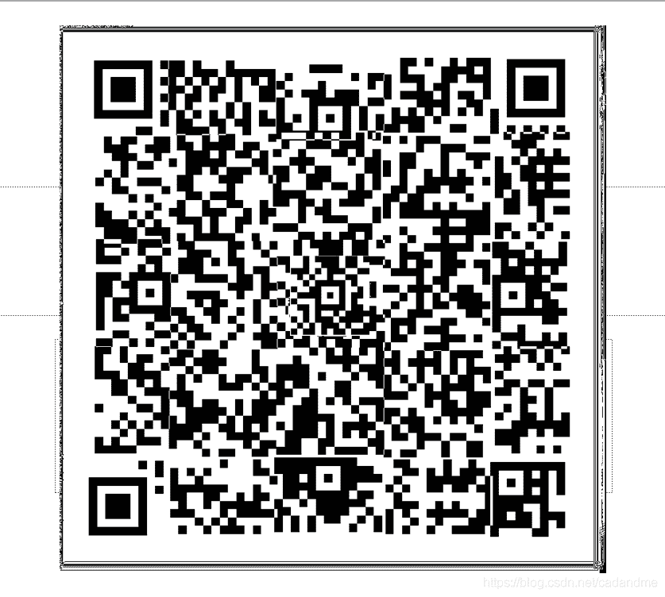
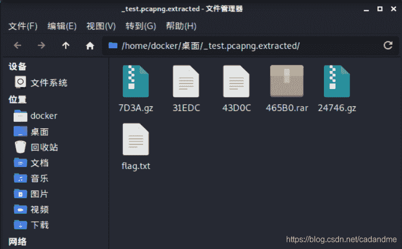

<!--yml
category: 未分类
date: 2022-04-26 14:40:40
-->

# 广东第一届网络安全知识竞赛比赛CTF题做题记录_静默开水的博客-CSDN博客_ctf网络安全大赛题目

> 来源：[https://blog.csdn.net/cadandme/article/details/117202234](https://blog.csdn.net/cadandme/article/details/117202234)

今天进行的CTF比赛，跟队友一起做出了几道CTF题，挑几道签到题记录一下，主要记录一下自己参加比赛的点滴，讲解不全，请见谅。

第一题：小猪佩奇，看的我眼花
用stegsolve打开查看，眼神好的立马就可以发现背景有二维码碎片，一共有25张图，25张碎片需要拼接。大佬们都是脚本跑出来的，但小白的我只能苦哈哈的抠图。在队友的帮忙下，漫长的扣图后产品如下：

扫出来后是密文，base解码两次后为压缩包密钥，解开压缩包是猪圈密码，小猪佩奇也是一个提示吧。

第二题 ：misc签到题
流量分析，给了一个流量包，
在kali中文件分离后在一个压缩包找到flag.txt。
文件分离命令：binwalk -e 文件名
第三题：密码签到题，今天最大的坑
给了一张图片，如下：

在图片属性中找到一段密文，需要我们AES解码，在图片的16进制结尾有信息附加，在stegsolve也可以直接看出。那个就是AES解码密钥，但我在解题时，用了一个不好的在线解密网站，然后没显示，我以为密钥不是这个，花费漫长时间，最后队友在比赛快结束时，才把这个试出来。