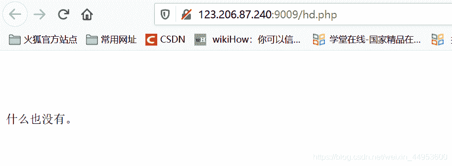
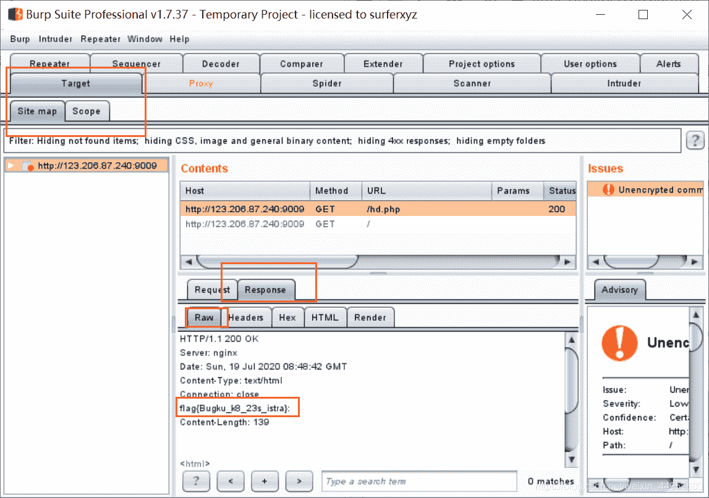

<!--yml
category: 未分类
date: 2022-04-26 14:37:55
-->

# 手把手教你用Burp抓包——Bugku 头等舱 超详细题解——CTF web小白入门基础篇_日熙！的博客-CSDN博客_bugku头等舱

> 来源：[https://blog.csdn.net/weixin_44953600/article/details/107360406](https://blog.csdn.net/weixin_44953600/article/details/107360406)

打开题目链接，发现什么都没有，查看网页源码也没发现有用信息。

题目是头等舱，应该是暗示在响应头或者是在响应头什么的里面，用burpsuite抓包（题目没有什么有用的信息时 先抓包看看），果然在响应头里找到答案了。

* * *

### 下面是用burpsuite抓包的详细步骤，可供小白参考。

使用BurpSuite的套路是：先浏览器设置BurpSuite代理——>BurpSuite 调至on状态——>访问web程序——>进行抓包分析

准备工作：
安装好burpsuite，并能正常使用，因为版权原因上传教程不能过审，找不到资源的可以私我，愿意分享。（我是在吾爱破解的网站里找到的，大家可以去找找看）
抓包之前首先得 把浏览器设置好代理才行。谷歌和火狐都可。设置步骤可参考链接：[用burpsuite抓包，谷歌 / 火狐浏览器 该怎么设置BurpSuite代理？——超详细教程——CTF Web小白入门基础篇](https://blog.csdn.net/weixin_44953600/article/details/104877388)

正式抓包：
1.打开burp（注意检查一下Proxy——Intercept：是不是显示 **intercept is on**，否则记得设置成 on）
2.在浏览器设置代理的插件中勾选burp代理的选项
3.浏览器进入题目链接
4.burp中：
Proxy——Intercept——点击Forward一下
查看Target选项，如下图所示，就可以看到Flag了。
(以上四个步骤用谷歌浏览器或者火狐浏览器 都一样)
