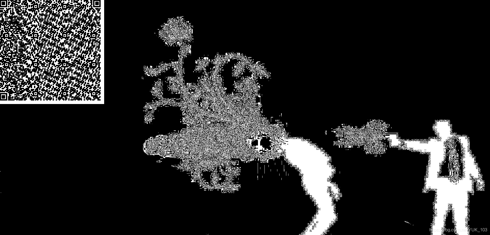
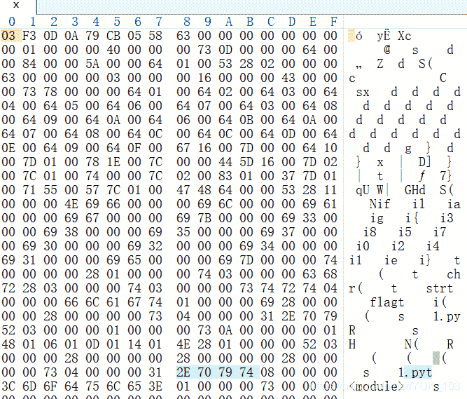
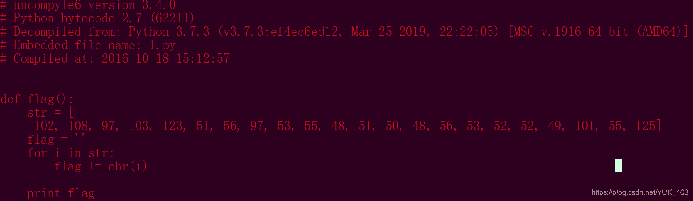
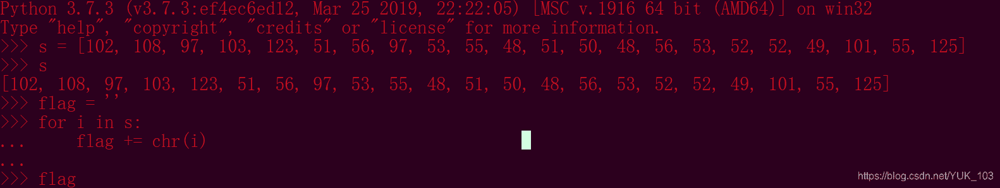

<!--yml
category: 未分类
date: 2022-04-26 14:38:19
-->

# 攻防世界 MISC 适合作为桌面 题解_YUK_103的博客-CSDN博客_ctf适合作为桌面

> 来源：[https://blog.csdn.net/YUK_103/article/details/103223552](https://blog.csdn.net/YUK_103/article/details/103223552)

**就给了你一张图片。。。**


# 思路

首先放入**winhex**中看看有没有什么信息，未果。
其次放入**kali**中用**binwalk**分析，未果。
最后放入**隐写神器Stegsolve**中翻着翻着突然发现了这个：


扫一下出现了一个字符串：
**思路：我看这个字符串像文件16进制**，所以复制放入winhex中得：


我再一查那个文件头：**pyc**，那么我们就把他改成.pyc文件。
但是pyc毕竟是pyc，**看不到源码**啊，怎么办呢？我们使用黑科技来反编译：


```
python库的安装方法:
pip install uncompyle 
```

没有pip的你自己想办法吧。
然后使用命令： uncompyle6.exe + *.pyc即可。
代码太简单了我就不细说了。

* * *

算了，讲一下：

### 方法一：

在python3交互界面打一遍就行了。flag自己写自己看。

### 方法二

此方法是我在吃完**甜甜的红薯**后想起来的巧妙的方法。
由上面反编译的图得知此为**python2代码**。
于是我们可以在此文件的目录下新建一个python文件。然后添加两句话

```
import A
A.flag() 
```

或者：

```
from A import flag
flag() 
```

这样也行:

```
from A import *
flag() 
```

A是那个pyc文件。我们把它当作一个模块进行引入，而A，模块里又有一个flag函数。那我们这样直接调用不就行了吗？少打好多字欸。
不过注意，这个模块是py2，所以你也要用python2去运行这个python。py3会报错。
python确实有点意思。