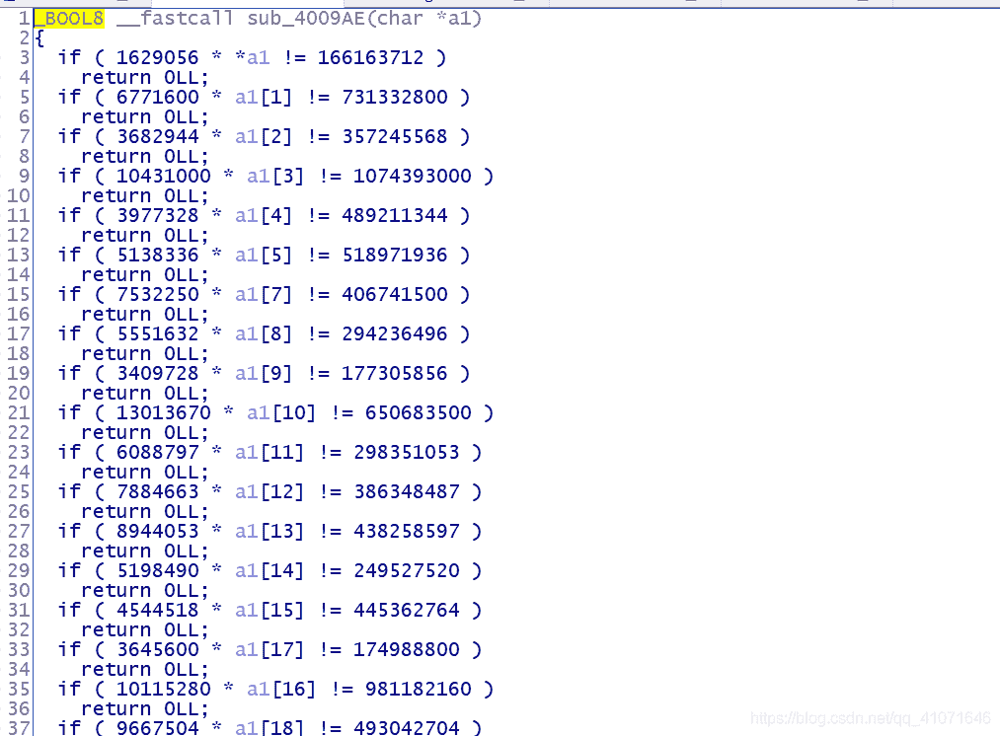
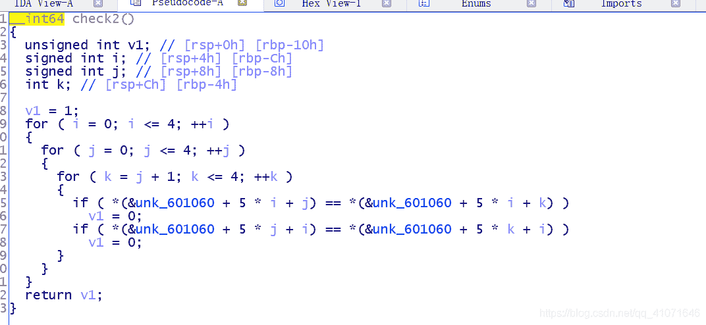
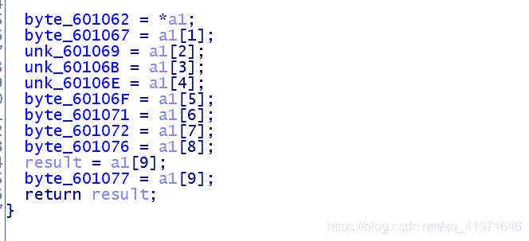
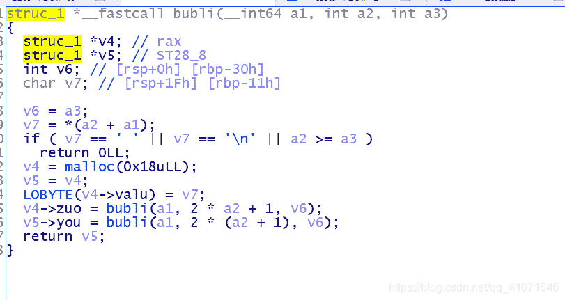
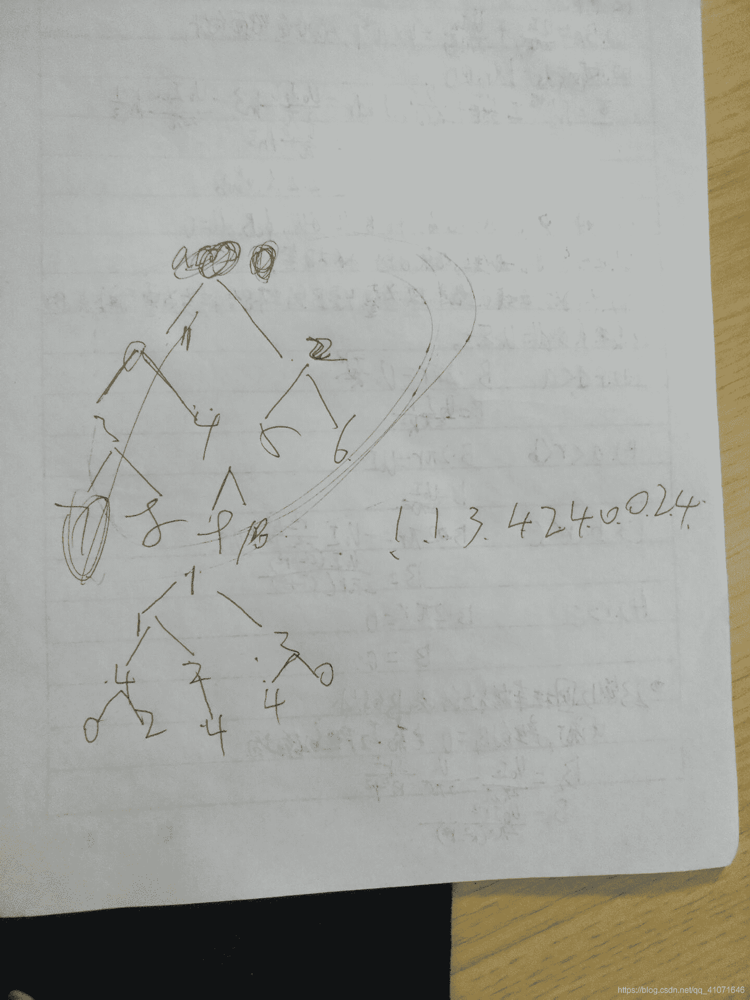
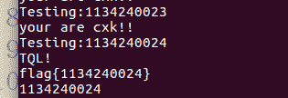

<!--yml
category: 未分类
date: 2022-04-26 14:29:33
-->

# 深信服杯 CTF 线上 逆向题解_pipixia233333的博客-CSDN博客

> 来源：[https://blog.csdn.net/qq_41071646/article/details/90487358](https://blog.csdn.net/qq_41071646/article/details/90487358)

这个比赛的逆向题挺简单的

第一题

这个题 他们出题人要挨打了 他们有一位忘了判断 导致 这个题有了多解

这个题 有upx壳 用 upx -d 直接可以脱了

然后ida 看一下



直接C语言跑一下就好了

```
#include<stdio.h>
#include<string.h>
#include<algorithm>
#include<vector>
#include<iostream>
#include<map>
#include<time.h>
#include<queue>
#include "windows.h"
using namespace std;
#include <stdint.h>
int a1[32];
//int s[40]={0x76,0x35,0xFD,0xF5,0x7D,0x47,0xFE,0x95,0x13,0x7A,0x26,0x59,0x3F,0xFF,0x31,0xA1,0x85,0x7C,0x63,0x02,0x6E,0xBD,0x93,0x6A,0x3E,0x4D,0x8D,0xD7,0x27,0x73,0x2D,0x5E,0xCC,0x62,0xF2,0xDF,0xE5,0xD2};
//char v9[256]= {0xb0,0x31,0x75,0x70,0xf8,0xdf,0x7,0x3c,0x78,0x71,0x50,0x29,0x2c,0x16,0x69,0x12,0xc8,0x2b,0x3b,0x7f,0xb2,0xe7,0x4b,0x68,0x8c,0xc5,0xa6,0x15,0x3,0x58,0x47,0x4,0x13,0x8d,0x87,0x26,0x9,0xed,0x17,0x8a,0xc2,0xf2,0x43,0xc0,0xac,0x59,0x97,0xf5,0x3f,0x67,0x5e,0x39,0x86,0xd5,0x72,0x61,0xda,0xf7,0x1,0x5,0x8b,0xc3,0xb1,0x77,0xaf,0x1d,0x30,0xc6,0x45,0xe,0x5f,0xee,0xae,0xf0,0x28,0xce,0xcd,0xa7,0x9b,0x2a,0x19,0x48,0x8,0x44,0x20,0xfe,0x6d,0xb5,0x2e,0x6a,0xf1,0x34,0xbc,0x1e,0x3e,0xcc,0x41,0x92,0xd8,0xbd,0xa5,0xe8,0x4d,0xa,0x49,0xd,0xa2,0xfa,0x62,0x74,0xd4,0x83,0x96,0x94,0x3d,0xcb,0x18,0x63,0x99,0x46,0xca,0xb7,0x8e,0xcf,0xfb,0xa3,0x6c,0x7e,0x51,0x27,0x60,0x9a,0x11,0xf3,0x5c,0x6e,0xba,0x42,0x76,0x2f,0xef,0xbf,0x21,0xaa,0xe4,0xd6,0x1b,0x55,0x7d,0xbe,0xea,0xd3,0x10,0xf4,0xc7,0x4a,0x23,0x79,0x84,0xa4,0x1c,0xab,0x14,0xdb,0x4c,0x3a,0xb8,0x52,0xec,0x37,0x38,0xb6,0xd2,0xa0,0x5a,0x5b,0x98,0x66,0x54,0x9e,0x4e,0x4f,0xb4,0xc4,0xc9,0xd0,0x25,0x9c,0x80,0xde,0x2d,0x6,0x22,0xb,0x91,0x6b,0x9f,0xf6,0xe6,0xe2,0xc1,0xf,0x93,0x90,0x7b,0x9d,0x8f,0xdd,0xe5,0x65,0x35,0xad,0xa9,0xdc,0x82,0xbb,0x0,0x53,0xd1,0xa8,0x33,0xe9,0x40,0x1a,0xff,0xa1,0x95,0x36,0xd9,0xeb,0x89,0xe3,0x7c,0x73,0x85,0x88,0x7a,0xe0,0xfd,0x64,0xc,0x57,0x32,0xb3,0xb9,0x1f,0xd7,0xfc,0x81,0xe1,0x2,0xf9,0x5d,0x56,0x6f,0x24};
int main()
{
    a1[6]='?';
    a1[0]= 166163712/1629056;

   a1[1]=731332800/ 6771600;

    a1[2] =357245568/ 3682944;

    a1[3]=1074393000 / 10431000;

   a1[4]=489211344 / 3977328 ;

   a1[5]=518971936/ 5138336;

    a1[7]=406741500 /7532250;

    a1[8] =294236496 /5551632;

    a1[9]=177305856/3409728;

    a1[10]=650683500 /13013670;

     a1[11] =298351053/6088797 ;

     a1[12]=386348487/7884663 ;

     a1[13]=438258597/8944053;

    a1[14] =249527520/ 5198490;

    a1[15]=445362764 /4544518 ;

    a1[17]=174988800/3645600 ;

    a1[16]=981182160 /10115280 ;

    a1[18] =493042704/9667504;

    a1[19]=257493600/5364450 ;

   a1[20] =767478780 / 13464540 ;
   a1[21]=312840624/ 5488432 ;

   a1[22]=1404511500/ 14479500 ;

    a1[23]=316139670/6451830  ;

    a1[24] =619005024/6252576 ;

    a1[25]=372641472/7763364;

    a1[26] =373693320/7327320 ;

    a1[27]=498266640/8741520 ;

     a1[28]= 452465676/8871876 ;

    a1[29]=208422720 /4086720 ;

    a1[30]=515592000 /9374400 ;
    a1[31]=719890500/5759124 ;
    for(int i=0;i<32;i++)
    {
        printf("%c",a1[i]);
    }
}
```

a1[6]的值是我随机赋值的

第二题

其实这个题让我动态调试了半天

其实也没有什么sub_4006B6 这个函数生成一个数组而已

然后与sub_4007DB 进行异或

然后 三个函数是变形的 base64  置换表 字符是 '=' 至'='+64

写出解密脚本即可

```
#include<stdio.h>
#include<string.h>
#include<algorithm>
#include<vector>
#include<iostream>
#include<map>
#include<time.h>
#include<queue>
#include "windows.h"
using namespace std;
#include <stdint.h>
int a1[32];
int s[40]={0x76,0x35,0xFD,0xF5,0x7D,0x47,0xFE,0x95,0x13,0x7A,0x26,0x59,0x3F,0xFF,0x31,0xA1,0x85,0x7C,0x63,0x02,0x6E,0xBD,0x93,0x6A,0x3E,0x4D,0x8D,0xD7,0x27,0x73,0x2D,0x5E,0xCC,0x62,0xF2,0xDF,0xE5,0xD2};
char v9[256]= {0xb0,0x31,0x75,0x70,0xf8,0xdf,0x7,0x3c,0x78,0x71,0x50,0x29,0x2c,0x16,0x69,0x12,0xc8,0x2b,0x3b,0x7f,0xb2,0xe7,0x4b,0x68,0x8c,0xc5,0xa6,0x15,0x3,0x58,0x47,0x4,0x13,0x8d,0x87,0x26,0x9,0xed,0x17,0x8a,0xc2,0xf2,0x43,0xc0,0xac,0x59,0x97,0xf5,0x3f,0x67,0x5e,0x39,0x86,0xd5,0x72,0x61,0xda,0xf7,0x1,0x5,0x8b,0xc3,0xb1,0x77,0xaf,0x1d,0x30,0xc6,0x45,0xe,0x5f,0xee,0xae,0xf0,0x28,0xce,0xcd,0xa7,0x9b,0x2a,0x19,0x48,0x8,0x44,0x20,0xfe,0x6d,0xb5,0x2e,0x6a,0xf1,0x34,0xbc,0x1e,0x3e,0xcc,0x41,0x92,0xd8,0xbd,0xa5,0xe8,0x4d,0xa,0x49,0xd,0xa2,0xfa,0x62,0x74,0xd4,0x83,0x96,0x94,0x3d,0xcb,0x18,0x63,0x99,0x46,0xca,0xb7,0x8e,0xcf,0xfb,0xa3,0x6c,0x7e,0x51,0x27,0x60,0x9a,0x11,0xf3,0x5c,0x6e,0xba,0x42,0x76,0x2f,0xef,0xbf,0x21,0xaa,0xe4,0xd6,0x1b,0x55,0x7d,0xbe,0xea,0xd3,0x10,0xf4,0xc7,0x4a,0x23,0x79,0x84,0xa4,0x1c,0xab,0x14,0xdb,0x4c,0x3a,0xb8,0x52,0xec,0x37,0x38,0xb6,0xd2,0xa0,0x5a,0x5b,0x98,0x66,0x54,0x9e,0x4e,0x4f,0xb4,0xc4,0xc9,0xd0,0x25,0x9c,0x80,0xde,0x2d,0x6,0x22,0xb,0x91,0x6b,0x9f,0xf6,0xe6,0xe2,0xc1,0xf,0x93,0x90,0x7b,0x9d,0x8f,0xdd,0xe5,0x65,0x35,0xad,0xa9,0xdc,0x82,0xbb,0x0,0x53,0xd1,0xa8,0x33,0xe9,0x40,0x1a,0xff,0xa1,0x95,0x36,0xd9,0xeb,0x89,0xe3,0x7c,0x73,0x85,0x88,0x7a,0xe0,0xfd,0x64,0xc,0x57,0x32,0xb3,0xb9,0x1f,0xd7,0xfc,0x81,0xe1,0x2,0xf9,0x5d,0x56,0x6f,0x24};
int main()
{
//  ida_chars[0x2] = a1[0]
//  ida_chars[0x7] = a1[1]
//  ida_chars[0x9] = a1[2]
//  ida_chars[0xB] = a1[3]
//  ida_chars[0xE] = a1[4]
//  ida_chars[0xF] = a1[5]
//  ida_chars[0x11] = a1[6]
//  ida_chars[0x12] = a1[7]
//  ida_chars[0x16] = a1[8]
//  ida_chars[0x17] = a1[9]

     int v8=0;
    int v7=0;
    int v3,v4;
    for (int  i = 0; i < 40; ++i )
    {
        //s[i] ^= LOBYTE(v9[(v3 + v4)]);
        v7 = (v7 + 1)&0xff;
        v3 = v9[v7];
        v8 = (v8 + v3)&0xff;
        v4 = v9[v8];
        v9[v7] = v4;
        v9[v8] = v3;
       // printf("%x\n",v8);
        //printf("%x %x %x %x %x\n",v3,v4,v7,v8,v9[(v3 + v4)]);
        s[i] ^= LOBYTE(v9[(v3 + v4)&0xff]);
        //printf("%d\n",s[i]);
    }
    for(int i=0;i<40;i++)
    {
        printf("%c",s[i]);
    }

    return 0;
}
```

然后第三题

这个题 其实就是一个树而已   可以 暴力跑出答案之后 然后 把这个树的遍历倒推候去就可以了



这里就是我们要爆破的 重点



这里就是树 遍历后的值



建树   然后我们 先暴力跑出答案

```
from z3 import *
s = Solver()
l =[
  0x31, 0x34, 0x23, 0x32, 0x33, 0x33, 0x30, 0x23, 0x31, 0x23, 
  0x30, 0x23, 0x32, 0x33, 0x23, 0x23, 0x33, 0x23, 0x23, 0x30, 
  0x34, 0x32, 0x23, 0x23, 0x31]
a = [Int('a%d'%i) for i in range(10)]
for i in a:
	s.add(i>47)
	s.add(i<=52)

l[0x2] = a[0]
l[0x7] = a[1]
l[0x9] = a[2]
l[0xB] = a[3]
l[0xE] = a[4]
l[0xF] = a[5]
l[0x11] = a[6]
l[0x12] = a[7]
l[0x16] = a[8]
l[0x17] = a[9]
for i in range(5):
	for j in range(5):
		for k in range(j+1,5):
			s.add(l[5 * i + j]!=l[5 * i + k])
			s.add(l[ 5 * j + i]!=l[5 * k + i])

 s.check() == sat:
        print(s.model())
```

然后 在反推过去就好了

这张图 有缘人看吧 能看懂就看 23333 我对我的画图已经不抱希望了

然后还有一个思路就是 暴力跑脚本 这个呢  怎么说呢  我一开始想用符号执行 但是由于他有malloc  就会直接炸

然后 群里有巨佬用的是  os 库 感觉很好用 这里记录一下  哦 巨佬名字是 glzjin

```
 import os 
def test(i):
	result = os. popen('echo ' + str(i) + '|./number_game')
	res = result. read()
	for line in res. splitlines():
		print(line)
		if line. find('flag') != -1: 
			return True
	return False

for i1 in range(1, 5):
	for i2 in range(0, 5):
		for i3 in range(0, 5):
			for i4 in range(0, 5):
				for i5 in range(0, 5):
					for i6 in range(0, 5):
						for i7 in range(0, 5):
							for i8 in range(0, 5):
								for i9 in range(0, 5):
									for i10 in range(0, 5):
										password = str(i1) + str(i2) + str(i3) + str(i4) + str(i5) + str(i6) + str(
i7) + str(i8) + str(i9) + str(i10)
										print('Testing:' + password)
										if (test(password)):
											print ( password)
											exit(0) 
```

一时白嫖一时爽 一直白嫖一直爽

