<!--yml
category: 未分类
date: 2022-04-26 14:48:51
-->

# 百度杯”CTF比赛（十一月场)_Root__Liu的博客-CSDN博客

> 来源：[https://blog.csdn.net/Root__Liu/article/details/53366347](https://blog.csdn.net/Root__Liu/article/details/53366347)

第一场 

 1、小可爱

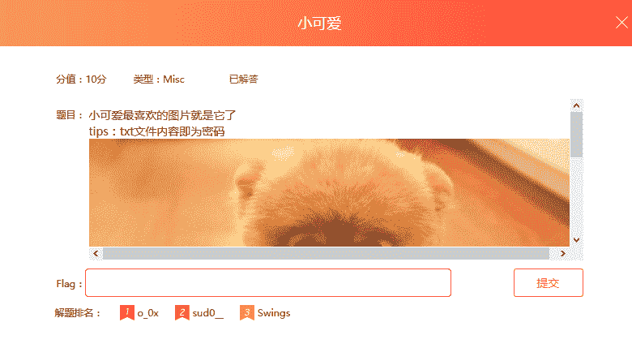 

解：

2、签到题

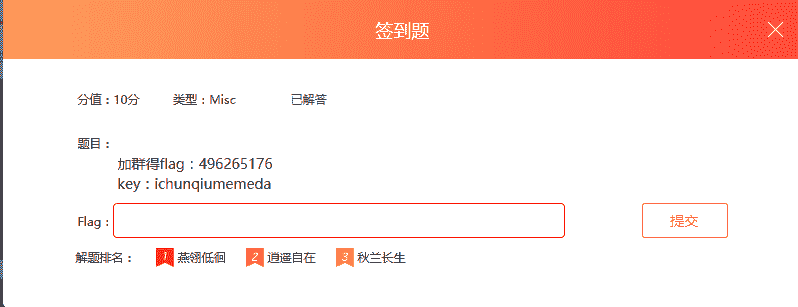 

解：加群下载文件“flag.rar”,打开时需要解密，输入给的key解出来

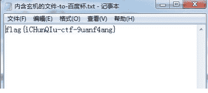 

直接提交就可以了，这道题很喜欢。。。。

3、所以这是13点吗

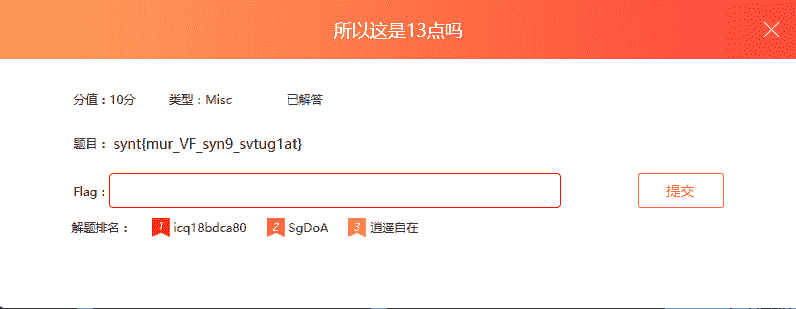 

解：第一眼看过去这是凯撒密码，直接拿去凯撒暴力破解

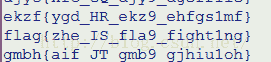 

找到正确答案提交。

pwn的还没学，先放着，做完后再补。

第二场 

1、嘀嘀嘀

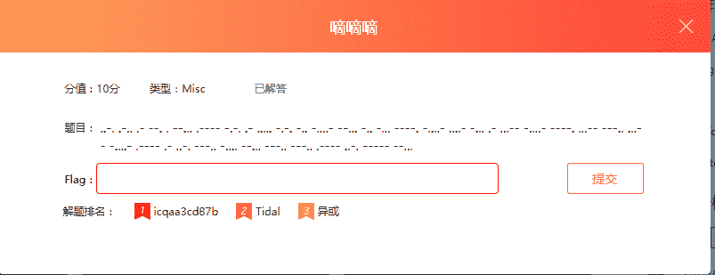 

解：这是莫尔斯码，先用莫尔斯解密，得到如下：

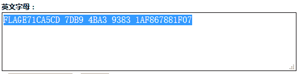 

将所有字幕转换为小写得到：flage71ca5cd-7db9-4ba3-9383-1af867881f07 

 然后又试着解密了好多，结果都不对，看到flag应该是正确的，所以试着把flag后面的内容放在括号里，结果对了。

flag{e71ca5cd-7db9-4ba3-9383-1af867881f07} 

2、山岚

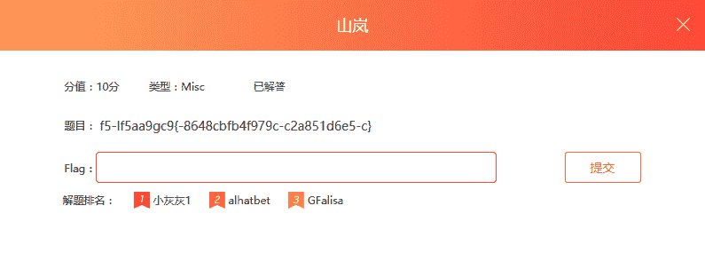 

解：用栅栏解密就行了。

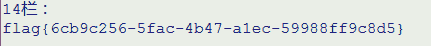分为14栏时结果正确。

3、签到题

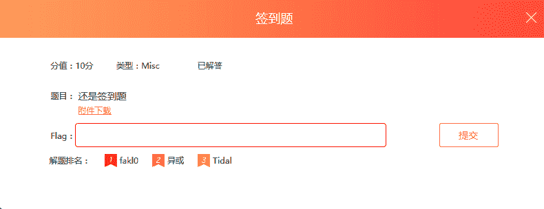 

解：打开附件得到如下内容;

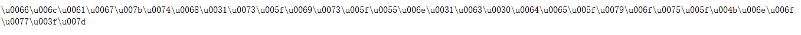 

用在线工具解码，工具网址：http://tool.chinaz.com/tools/unicode.aspx;用unicode转中文：

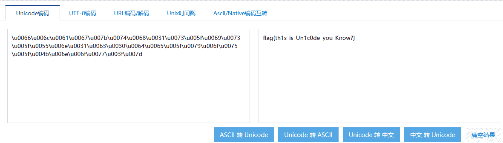 

得到结果：flag{th1s_is_Un1c0de_you_Know?}，直接提交

 第三场

 1、XX

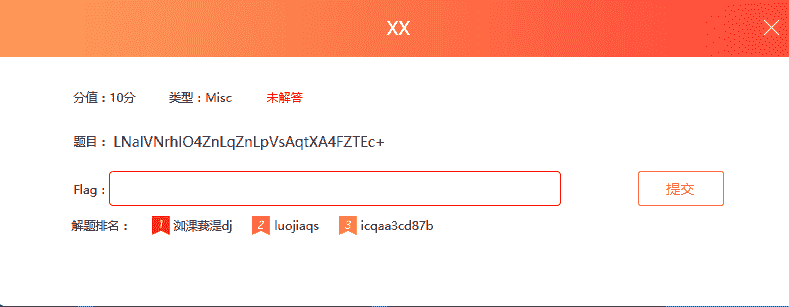 

解：此题是XXencode加密，找在线解密工具解密，http://web.chacuo.net/charsetxxencode/ 

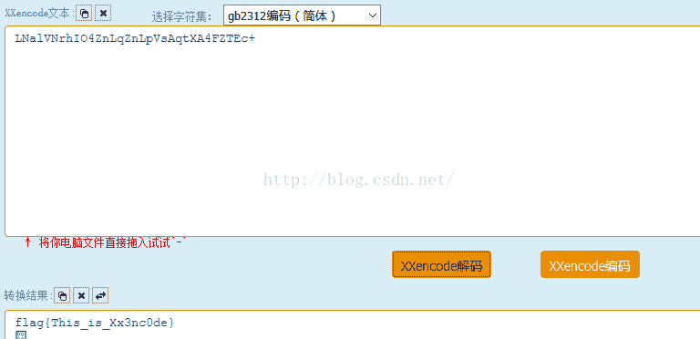 

得到结果flag{This_is_Xx3nc0de}，直接提交。

2、贝丝家族

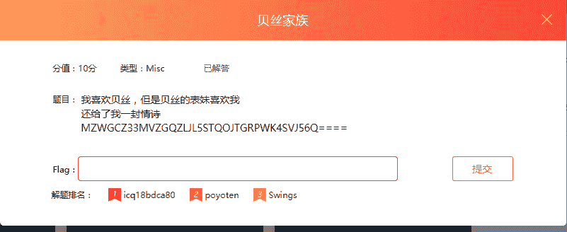 

解：尝试解密，使用base32在线解密工具解密成功，

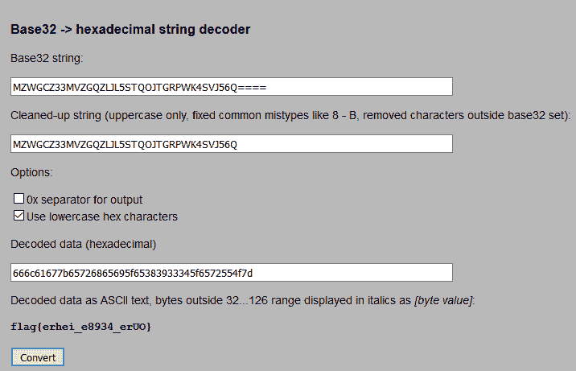 

结果为 ：**flag{erhei_e8934_erUO}** 

 3、敲击

 

解：在键盘上按照字母画出图形，发现wdvtdz正好形如x,qsxdr形如v，以此类推，结果为flag{xvzoc}

第四场

1、签到题

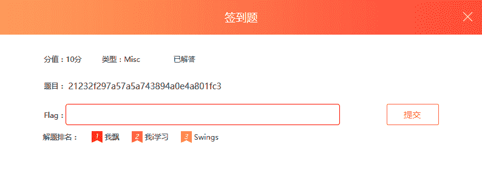 

解：使用md5解密，得到结果为flag{admin}

2、小常识

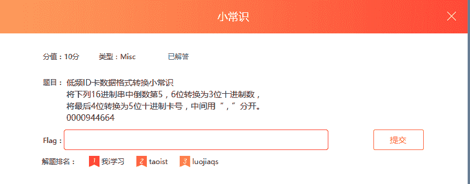 

解：按照题目的意思一步一步往下做就可以得到结果flag{148,18020}。但是这个题的知识点不是很懂，百度了一下，发现EMID也有好多种格式，如下：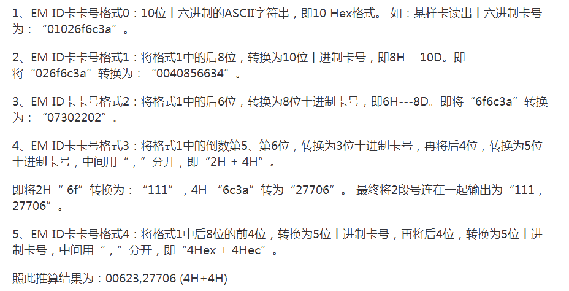 

看了一下，有了比较全的了解。

3、回归原始

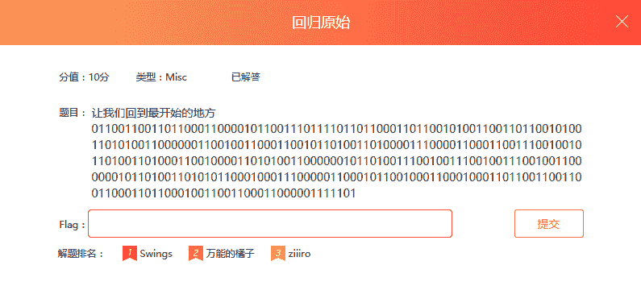 

解：将这些二进制数8个一组分开，分成42组，然后对照ascii码表写出字符。然后得到结果 flag{ce3e502c-48c9-4d50-9990-5b81db6fcbf0}，对照过程如下：

 01100110   66   f
01101100   6c   l
01100001   61   a
01100111   67   g
01111011   7b   {
01100011   63   c
01100101   65   e
00110011   33   3
01100101   65   e
00110101   35   5
00110000   30   0
00110010   32   2
01100011   63   c
00101101   2d   -
00110100   34   4
00111000   38   8
01100011   63   c          flag{ce3e502c-48c9-4d50-9990-5b81db6fcbf0}
00111001   39   9         
00101101   2d   -
00110100   34   4
01100100   64   d
00110101   35   5
00110000   30   0
00101101   2d   -
00111001   39   9
00111001   39   9
00111001   39   9
00110000   30   0
00101101   2d   -
00110101   35   5
01100010   62   b
00111000   38   8
00110001   31   1
01100100   64   d
01100010   62   b
00110110   36   6
01100110   66   f
01100011   63   c
01100010   62   b
01100110   66   f
00110000   30   0
01111101   7d   }