<!--yml
category: 未分类
date: 2022-04-26 14:44:39
-->

# 百度杯”CTF比赛（十二月场)_Root__Liu的博客-CSDN博客

> 来源：[https://blog.csdn.net/Root__Liu/article/details/70161498](https://blog.csdn.net/Root__Liu/article/details/70161498)

"百度杯"CTF比赛（十二月场）

第一场

1、传说中的签到题

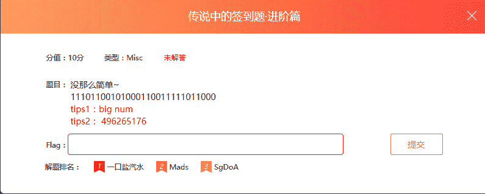 

解决：把二进制用在线进制转换器转换，发现转为10进制时，和tips2一样，在qq上一查，是CTF官方群，在公告里有一个字符串ZmxhZ3tiMTU5MDI4Yy05NWZmLTRmNzEtYWQ3Yi1jZWY1MTBhMjJkMDB9 

用base64解码，得到flag，

flag{b159028c-95ff-4f71-ad7b-cef510a22d00}

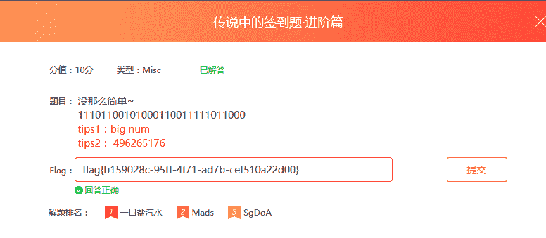 

2、福尔摩斯，题目如下： 

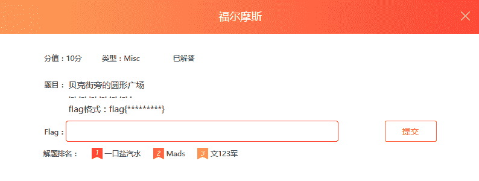 

解决：网上找福尔摩斯解码器，或者自己写一个福尔摩斯解码程序进行解码，我写的程序解出来是rrrrrre,提交出错，把字母改成大写通过。结果如下： 

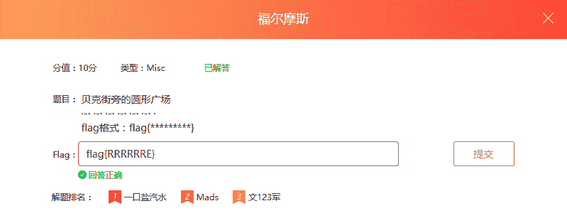 

3、+--+

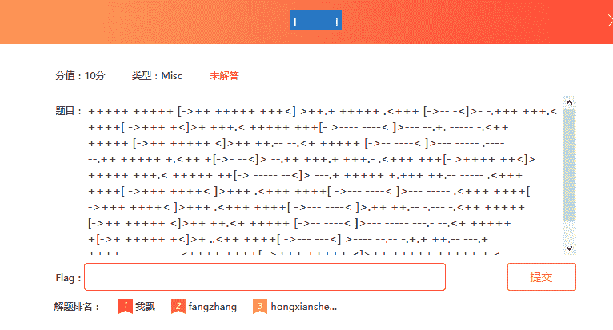 

解决：网上一查，说这是什么brainfuck语言，应该是加解密，找了一下在线解密工具，果然解出flag，工具网址https://www.splitbrain.org/services/ook 

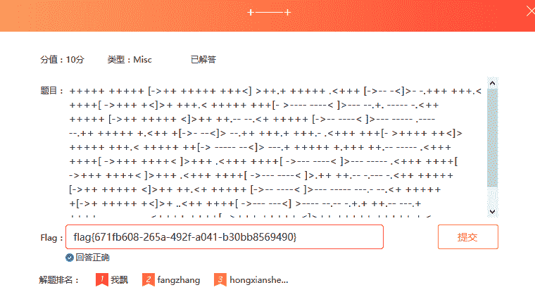 

第二场

1、一个十六岁的少年

 

解决:抓住敏感字十六，用base16解码得到结果 

flag{ec8b2ee0-3ae9-4c21-a012-08aa5fa7be67}

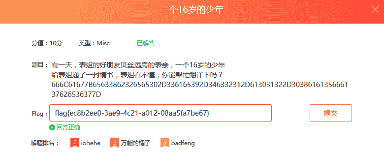 

2、藏在邮件头里的密码

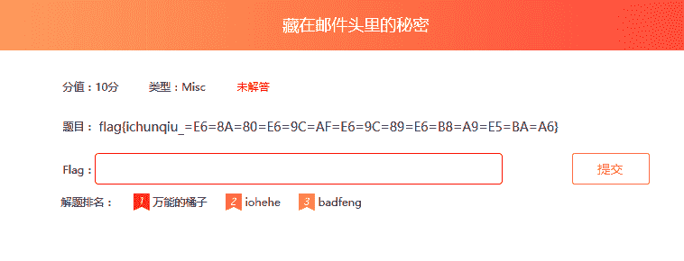 

解决：

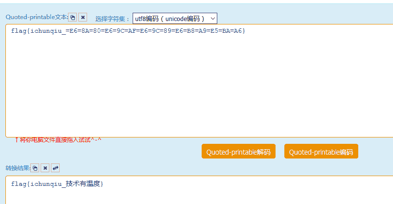 

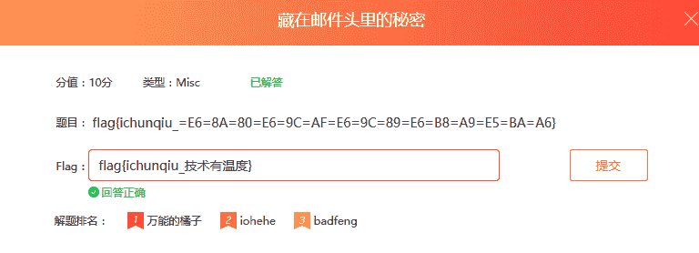 

3、吃货

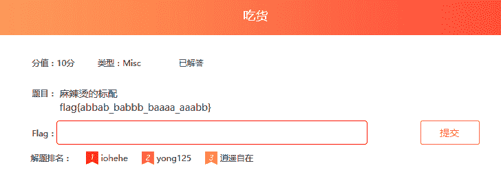 

解决：根据题目，估计flag里是某种加密的密文，百度查找了发现有ab的密文很可能是培根加密，对照培根加密表，得到结果

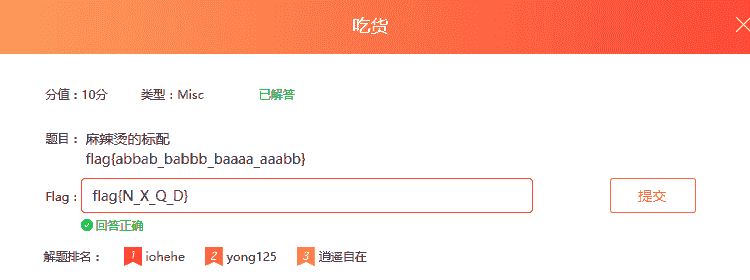 

第三场

1、misc1

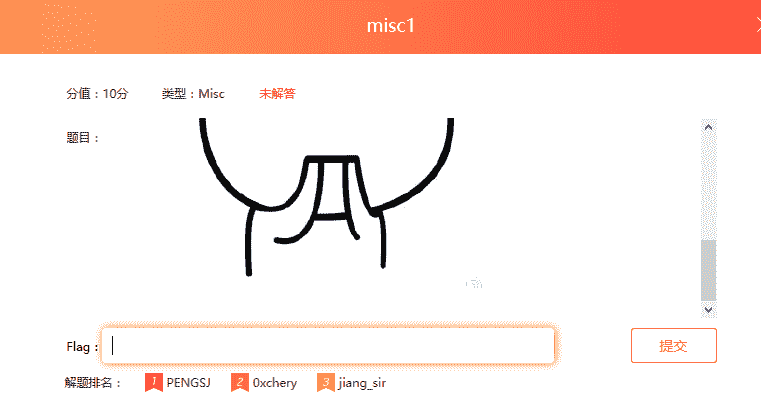 

解决：图片题应该是隐写，用隐写破解工具winhex打开，直接在最底部查看flag

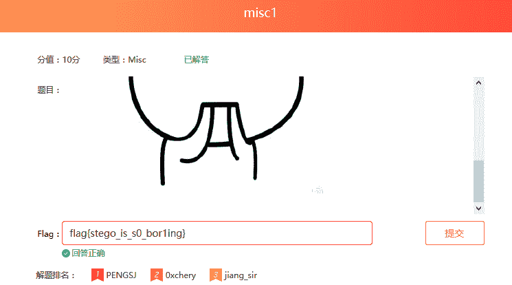 

2、misc2

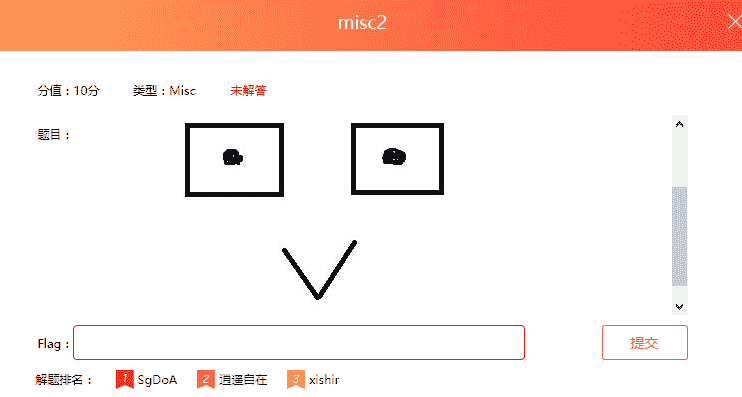 

解决：看图片很明显是猪圈密码，对照猪圈密码表解码得到flag是NSN 

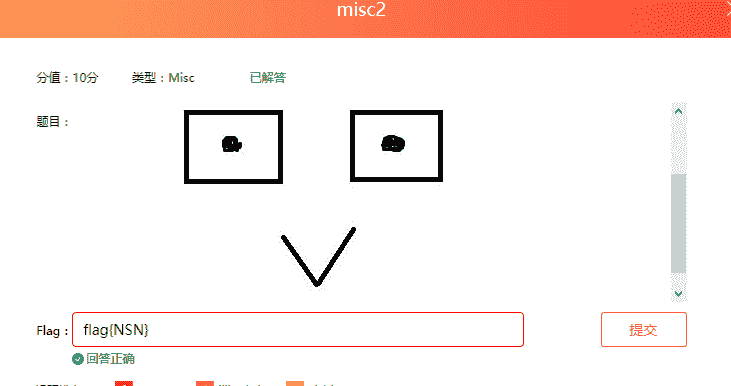 

3、misc3

解决：在键盘上分清行和列，按照坐标对照

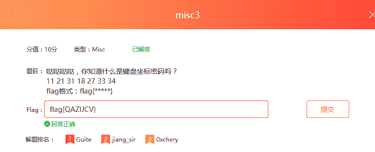 

第四场

1、misc1-纵横四海

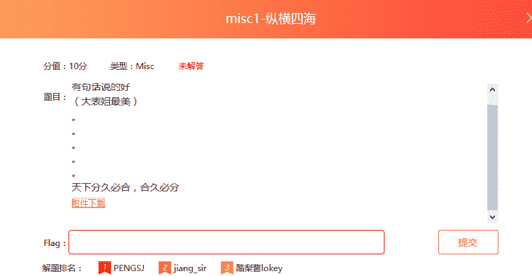 

解决：打开附件，解压，好多文件，打开每个文件里只有一个字母，把他们写进一个文件，去掉换行，得到flag{0a47061d-0619-4932-abcd-5426f4ea34aa}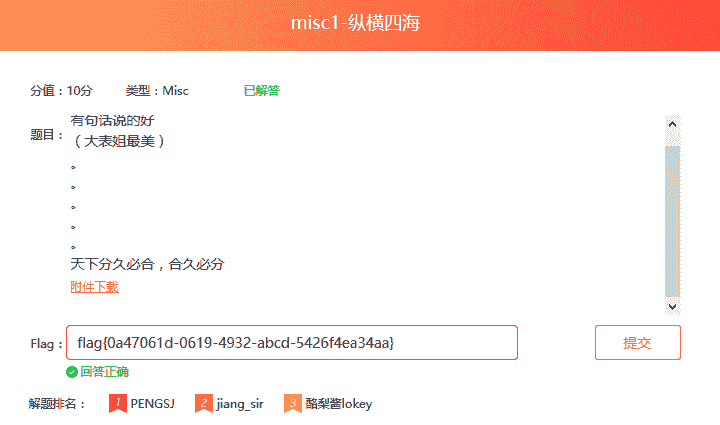 

2、misc2-对错

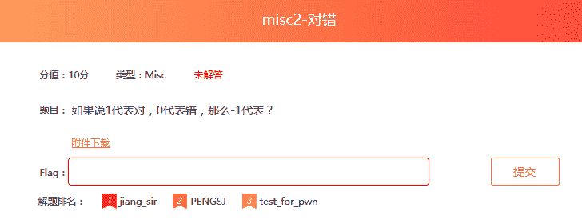 

解决：打开调到一个页面，是一串二进制数，把他转换为ASCII码就得到flag{zhEc9034jodsjfosko} 

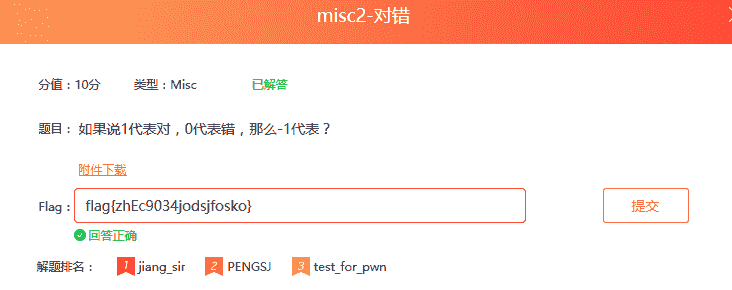 

3、misc3-枯竭

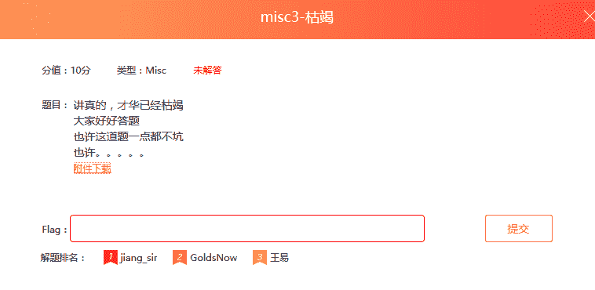 

解决：附件打开时有密码，用zip password tool工具破解，得到密码是12345，解压后打开文件得到flag{319b7f63-e17d-4ac5-8428-c2476c7ecce3} 

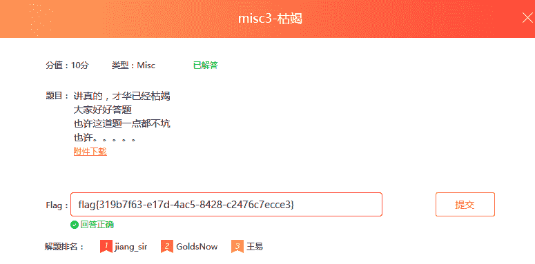