<!--yml
category: 未分类
date: 2022-04-26 14:49:51
-->

# 看雪.京东 2018CTF 第十二题 破解之道_大灬白的博客-CSDN博客

> 来源：[https://blog.csdn.net/Onlyone_1314/article/details/113813918](https://blog.csdn.net/Onlyone_1314/article/details/113813918)

# CTF（看雪.京东 2018CTF 第十二题 破解之道）

> x6412.exe

先打开程序：
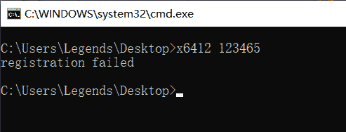

是一个输入字符串再判断对错的程序。
打开程序进行动态调试,一步一步走。首先会遇到一个对输入数据的长度进行判断的地方如下图所示:

## 第一步：

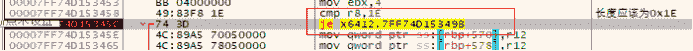

这里会对输入的数据的长度与0x1E进行比较,如果不相等的话就会跳到错误的地方。
所以得到第一个条件就是输入的长度必须是30；

## 第二步：

然后继续向下执行,找到再次出现我们输入的字符串的地方发现如下汇编语言：
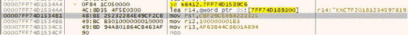
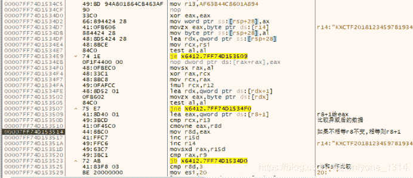

这段代码的意思是从我们输入的所有数据中每一个符号都要进行运算。
运算过程是先与0xCBF29CE484222325进行异或,然后再乘以0x100000001B3。
然后运算的结果会和0xAF63B44C8601A894进行比较，如果相等的话就会给r8+1,
最终r8的数据应该要大于等于3。
那么我们写一个程序来看一下哪个字符的运算后会和给的结果相同,最终运算结果是’9’，
所以我们输入的字符串中应该至少有3个’9’；
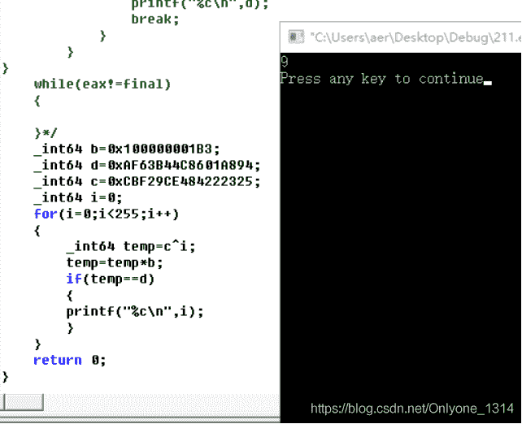

## 第三步：

运行到如下图所示的地方,又出现了我们输入的字符串,所以这里应该也是一处关键性的代码,通过分析我们发现这里取了输入的前9个字符进行和上图一样的运算,而且都对结果进行了检验,由于每一个字符的选择是从0-255，所以这里选择爆破的方法获得前九位字符.
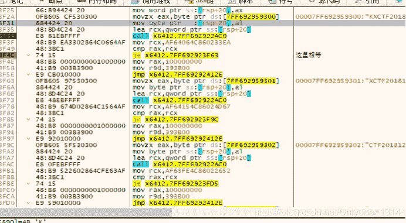

爆破代码及运行结果如下图所示:

```
#include<stdio.h>
int main()
{
	__int64 a[9]={0xAF64064C860233EA,
		0xAF64154C86024D67,
		0xAF63FE4C86022652,
		0xAF64094C86023903,
		0xAF63FB4C86022139,
		0xAF63AF4C8601A015,
0xAF63AD4C86019CAF,
0xAF63AC4C86019AFC,
0xAF63B54C8601AA47};
	__int64 b=0x100000001B3;
	__int64 d=0;
	int flag=0;
	int i=0;
	__int64 c=0xCBF29CE484222325;
	__int64 final=0x4F8075587499C0FF;
	__int64 rax=0xA189FA2D2B8F61B6;
	for(i=0;i<9;i++)
	{
		for(d=0;d<255;d++)
		{
			__int64 temp=d^c;
			temp=temp*b;
			if(temp==a[i])
			{
				printf("%c",d);
				break;
			}
		}
}
	return 0;
} 
```

运行结果：
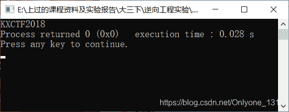

所以我们可以确定输入的前九个字符就是KXCTF2018
到目前为止我们可以确定输入的字符串的格式大概是KXCTF2018999XXXXXXXXXXXXXXXXXXXX

## 第四步：

又找到如图的关键代码处,此处的功能是将所有输入的字符进行计算,然后得出的结果必须和0x4F8075587499C0FF相同,由于这里共有30个字符串我们仅仅已知12个,还有18个字符未知,爆破是不可取的,所以这里应该可以留下来做一个检验的功能,这里先修改跳转,不进行分析：
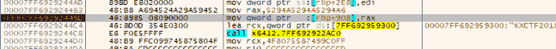

## 第五步：

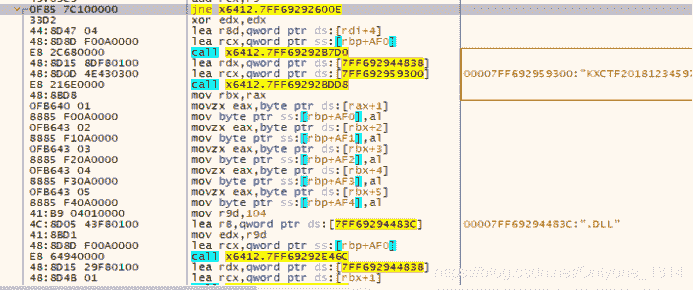

如图所示,这个地方应该是关键代码处,由于上面的跳转会跳过这一部分,所以我们修改跳转之后让程序进入这一部分运行。
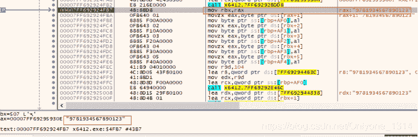

当运行过BDD8这个函数之后发现返回的字符串是在第一个’9’之后的字符串,
之后又取了截取后的字符串的前五位作为参数,同时又传进了”.DLL”作为参数,执行了E46C函数,我们继续运行发现执行了E46C函数之后返回值里有7819c.DLL这个就是我们截取的5个字符和.DLL进行拼接后的结果


所以这个E46C的作用应该是拼接。
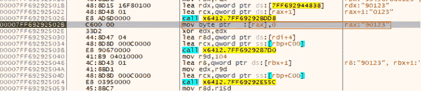

这里将第三个’9’赋值为0,然后取出了第二个’9’到没赋值前第三个’9’之间的字符串.
所以这一段的功能应该是将第一个’9’之后的五位取出来与.DLL进行拼接,生成一个动态链接库的名字,然后将第二个’9’和第三个’9’之间的字符取出来,暂时不清楚有什么用，但是大概分析出格式为:
KXCTF20189XXXXX9xxxxxxxxxxxxx9
其中的XXXXX应该是一个DLL的名字.
猜测可能是NTDLL
通过网上查找发现这里的计算是一种hash算法。

## 第六步：

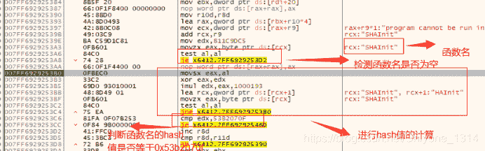

分析这段代码大概功能是从当前加载的DLL库中进行查找所有函数,然后进行HASH值的计算,找到HASH值等于0x53b2070f的函数名,我们直接执行到他找到之后的代码,在寄存器里会发现这段代码找到的了LoadLibraryEXA函数.
继续向下执行
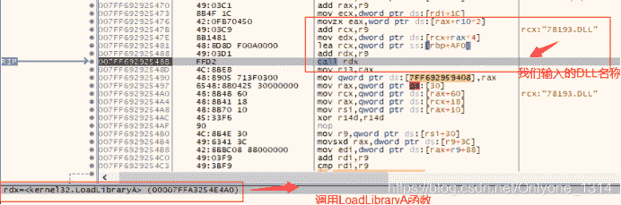

这段的作用就是加载我们输入的DLL。
然后返回DLL地址00007FFA349C0000;
然后继续向下执行发现了和上面查找函数一样的代码,只不过是查找的hash值不同而已,采取同样的方法,直接看他找到了什么函数
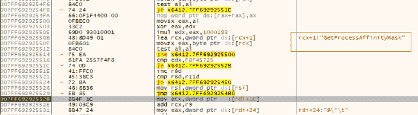

发现他找到了GetProcessAffinitMask函数,但是这个函数好像没什么用。
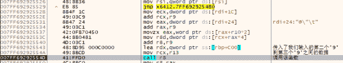

我们发现在用CALL R8的时候其实就是在调用GetProcAddress函数,并且使用了我们输入的第二个’9’到第三个’9’之间的数据作为一个函数名。
并且在调用该函数的时候使用的第一个参数是我们输入的DLL的地址.
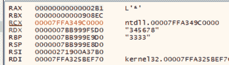

所以这一段我们分析出来他应该是从我们输入的DLL中去找到我们输入的函数的地址,如果找到的话会返回函数地址,如果没有找到就会返回NULL
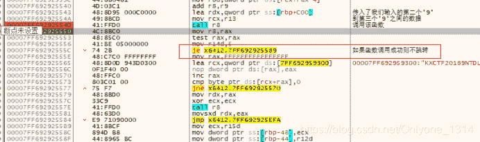

这里必须不跳转,所以GetProcAddress要调用成功.然后这里就会返回一个负数在接下来的一个判断中起作用,然后跳转到成功的地方
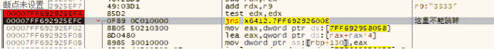
所以综上所述我们输入的flag应该是
KXCTF20189[XXX]9{XXXX}9
条件1：长度为30位
条件2：必须有至少3个’9’
条件3：前九位为 KXCTF2018
条件4：整个字符串的hash值应该是0x4F8075587499C0FF
条件5：[]之间的数据应该是一个长度为5的DLL名称
条件6：{}之间应该是一个长度为13的函数名称
还有可能有4个’9’或者5个’9’等等但是这样的话就输入了很多无用的数据,所以这里应该是只有3个’9’在字符串中的。
所以综上可以写出代码来爆破得出最终的flag;
def Hash(string_xx):
temp = 0xcbf29ce484222325
a = 0x100000001b3
for i in string_xx:
temp = temp ^ ord(i)
temp = (temp * a) & 0xffffffffffffffff
return temp

def Find():
file = open(“C:\Users\aer\Desktop\06x64\api.txt”)
while 1:
str = file.readlines(100000)
if not str:
break
for line in str:
Function = line.strip()
str_in = “KXCTF20189NTDLL9” + Function + “9”
Code = Hash(str_in)
if Code == 0x4f8075587499c0ff:
print (str_in)
break
file.close()
Find()
运行结果：
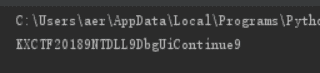

得到正确的flag：KXCTF20189NTDLL9DbgUiContinue9
将flag输入exe：x6412 KXCTF20189NTDLL9DbgUiContinue9
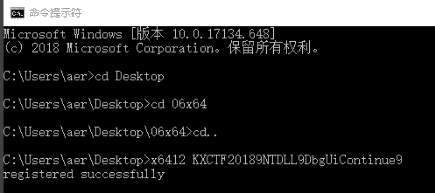

正确