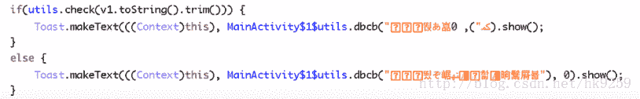
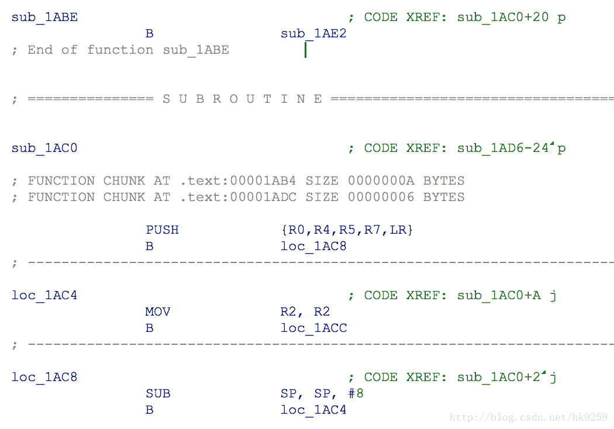
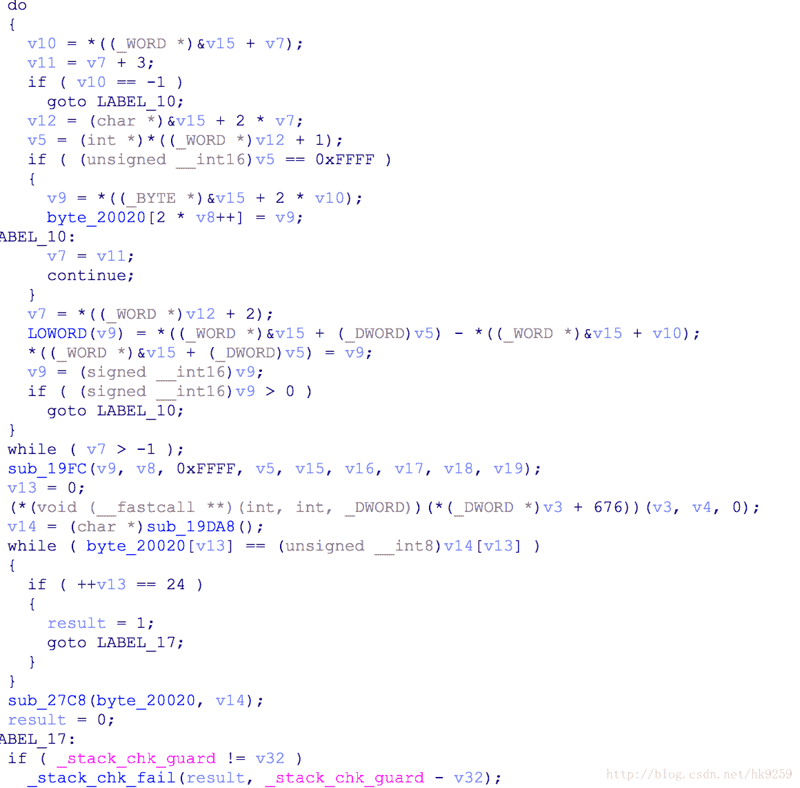

<!--yml
category: 未分类
date: 2022-04-26 14:40:29
-->

# 看雪CTF 2017 第六题设计思路和解题思路_Ericky_的博客-CSDN博客

> 来源：[https://blog.csdn.net/hk9259/article/details/73252615](https://blog.csdn.net/hk9259/article/details/73252615)

这道题主要需要花时间搞清楚套路，就迎刃而解了。^_^

### 1.java层稍作字符串加密和类名方法名混淆处理(本来是打算java层也做点文章的@_@)

解题：通过阅读代码，可以知道check函数为关键函数，当返回为真的时候，注册成功。

### 2.so层用花指令对程序指令进行混淆，在一定程度上防止分析。

解题：编写去花指令脚本，F5就会变得很简单。去花后check函数如下：

这样就能很清楚看到注册过程了，第一个while循环释放存放好的字符串到byte_20020。sub_19DA8为加密函数，返回结果到v14，最后v14与byte_20020做比较，一样就行了。算法采用了RC4加密+base64编码。

### 3.值得一提的是，so中藏关键字符串数据的方式我自己觉得挺有意思的。不知道聪明的你有没有发现呢？如果不会去花也不要紧，还有一个解题的思路就是是找到最后的汇编cmp，下好断点，因为这个算法的缘故。java层可以遍历传入字符串进行遍历暴力破解。

### 4.总结一下，我自己想到了两个解题方式，一个暴力解题，一个去花解题。从男人刚正面的角度来讲，这道题主要就是考去花，没有加其他的东西了，直接被大佬们秒得体无完肤。。。先行膜拜。最后附上答案：madebyericky94528