<!--yml
category: 未分类
date: 2022-04-26 14:18:09
-->

# 看雪ctf部分题解_合天网安实验室的博客-CSDN博客

> 来源：[https://blog.csdn.net/qq_38154820/article/details/106329796](https://blog.csdn.net/qq_38154820/article/details/106329796)

点击上方蓝色字体，关注我们

15

首先申明，我在遇到疑难点时参考了部分wp（咱还是菜啊）。

第一题没啥好说的，直接拖ida以十六进制输出就行了

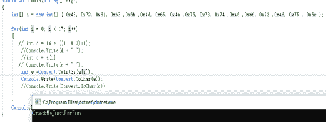

第二题名字叫数据结构，那肯定涉及到部分数据结构的知识，无壳无反调，发现有aslr，为了方便动静结合，用ffi去掉aslr（自我感觉这个习惯良好（滑稽）），把dll标和基础重定位目录归0就行了。

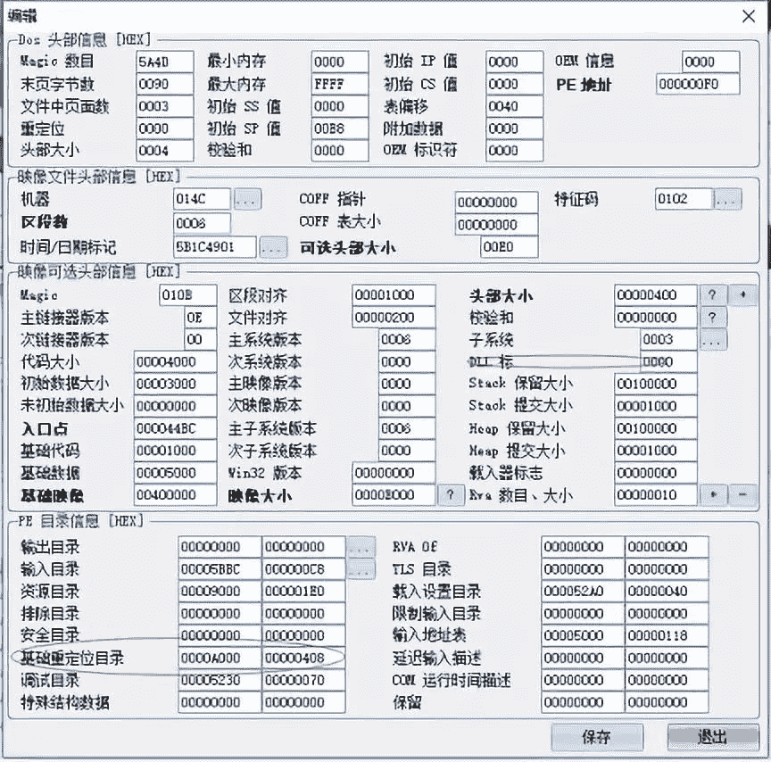

直接拖入ida，看下字符串，发现没有成功或者失败的提示，并且在一些提示信息中可以百度到数据结构是字典树

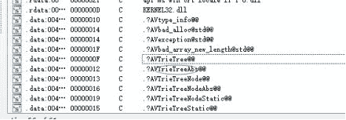

然后去看下main函数，可以看到一些call，但是不知道是做什么的，去动调看下就知道了

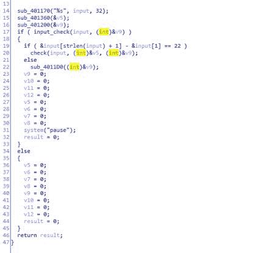

使用od调试观察返回值，可以看到经过401360和401200这两个函数之后栈中出现了成功和失败的提示字眼，可以认定是这两个函数是对success和fail进行了解码

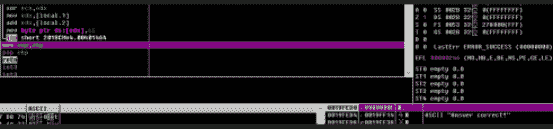

然后继续跟，在对长度与22进行比较之后，传入了核心的check函数，构造22位假码输入，先静态看下check方法了解下大概流程，可以发现这里把假码分成了8租，分别传入403AB0和402B40进行操作，动调跟下确定下分组

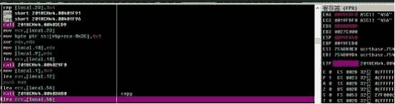

可以结合ida和动调返回值确定分组，整理下，可以得到如下分组，并且可以发现每一次都是对v39这个变量进行了操作，可以猜测v39是由输入的构成的字典树，然后传入了4030E0和一个未知类型的东西比较，可以看下这里的比较函数

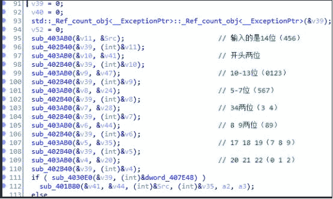

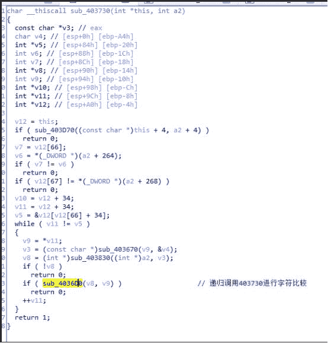

可以发现是一个递归比较的过程，类似于树的遍历，确保v39和目标生成树一摸一样，通过ida的交叉引用看下哪里初始化了407E48这个目标字典树结构

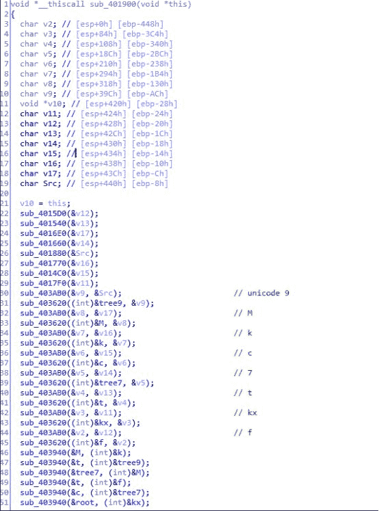

去od对401900下断点，动调跟一下看看各个结点以及他们之间的关系，首先是确定结点，通过观察每一次经过403AB0这个函数的返回值来确定（无法直接观察到结果时数据窗口中跟随）

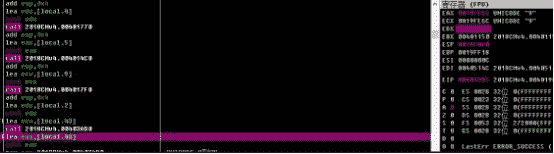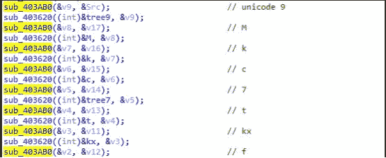

之后就是进行设置字数以及限制多解的操作，403940这个函数就是把第一个参数设置为第二个参数的孩子，并且之后给每个结点加了次数统计，对变量进行重命名之后可以清晰的画出树的结构

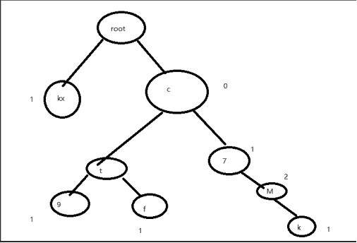

由于字典树是以前缀作为结点的，可以得到单词表

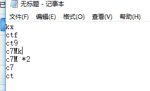

下面就要确定输入的顺序了，与输入的八组单词进行对比，通过单词的长度可以确定部分顺序，至于长度一样的给出了第二个check，写脚本爆破下

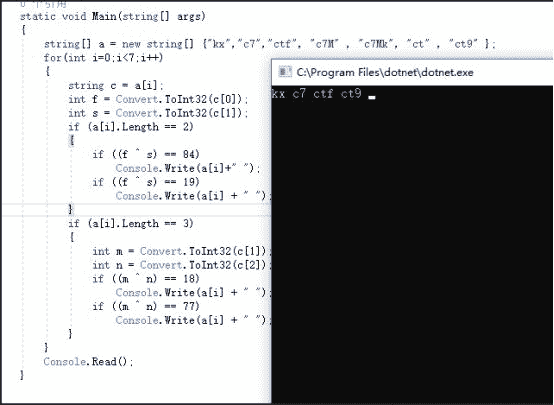

可以确定输入的序列，本题就到此结束了，遗憾就是没有在ida里新建结构体还原下字典树，再看下第四题（咱不会pwn），无壳，放入peid查看下，根据名字猜测里面用了部分加密算法，于是使用peid的密码学插件看下，查出了四个东西，

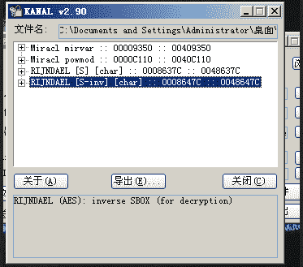

上面两个不知道是干嘛的，但是提示说是使用了miracl库中的两个方法，去百度下，miracl是大数运算库中，使用的两个方法中一个是橫幂，一个是负责分配大数的内存空间的（从var也可以知道一般用来定义变量之类的），还是不知道是啥算法，不过百度下这两个函数全是rsa的，后面两个就是aes中的s盒和逆s盒啦（看到地址记一下），似乎ida识别出的main函数不是真正的main函数，试图从字符串的交叉引用中找到main函数，嗯，找是找到了，但是没法f5生成伪c代码，决定这回不依赖f5来提高自己的汇编阅读能力，找到输出一行*的地方，在od里下个断点，直接走到那里，此时以及绕过了开头的一些乱跳走到了main的内部，这里再扯几句，整个程序到处都是那种positive sp value的错误，是因为部分call加上一个很近的地址然后add esp抬高栈所导致的，例如下图，有针对这种esp值的错误，可以手动patch掉这些干扰分析的代码，也可以选择alt+k自己调整下sp值修复（我几乎都是第二种方法，因为keypatch还没装好，不是很方便）

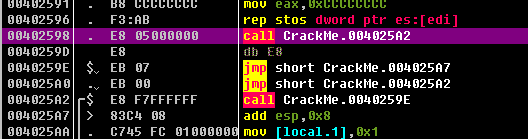

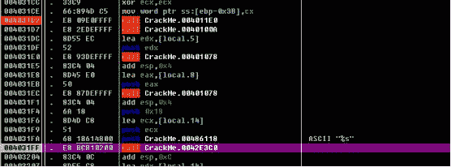

还无意间看到了反调（其实是看到可疑字符串some problem交叉引用找到的），看来调试时得小心点

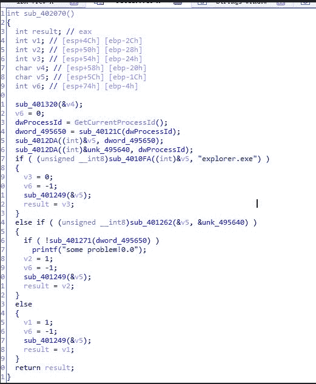

继续向下看，首先检查了字符串长度，必须为0x17（判断点在403213）

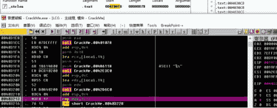

然后底下的几个call一个个看，首先传入401172把输入的4-23位转换成hex表示，动调可以看出来

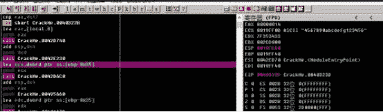

然后传入一个比较复杂的函数分析，之前说到这个程序用到了miracl这个大数运算库，本来想直接导入sig文件看看能不能识别出一些函数,发现ida 7.0并没有自带这个库，需要自己动手做一个，首先去编译一份miracl.lib这个静态库，然后找到flair文件夹先用pcf生成.pat文件，最后再使用sigmake生成了sig文件，嗯，似乎看上去一路顺风，发现。。。识别出的函数屈指可数（估计是自己编译时函数找到不够全），还是选择了用现成的sig文件，发现好用至极，进入那个函数看一下，在进行一些赋值之后，传入了402a3a分析，这个函数用到了许多miracl的函数

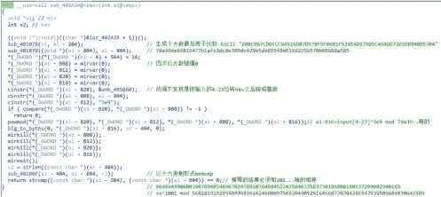

mirvar是定义大数变量的，powmod是橫幂，具体用法可以在csdn上找到，分析下大概逻辑，已经写在idb里了，想用数学类软件强解，发现出不了结果，在被点拨之后，发现本质上就是rsa的加密函数啊喂喂喂

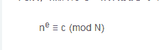

于是根据rsa的加密函数把几个大数和用mirval定义的几个变量依次对上号，直接用RSATool+pyg密码学工具解决~（真香

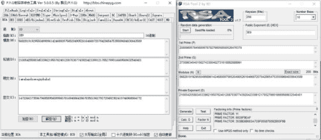

在这个函数return 1之后，前面三位还是未知的，继续看下面的call

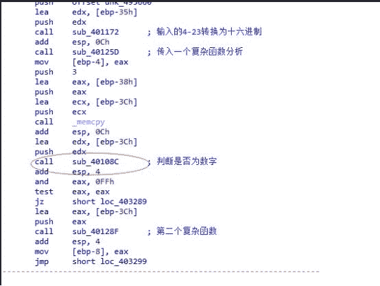

首先判断了前三位是否是数字

然后再次传入了复杂函数分析，点进去发现是标准aes加密

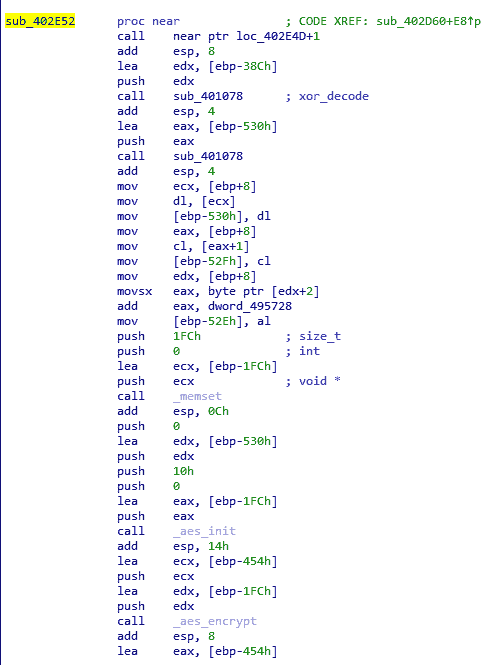

光静态分析还是无法理清函数调用和参数的情况的，这里继续动调看

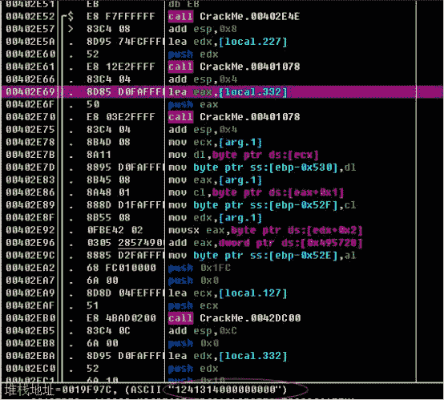

一开始通过两个401078这两个函数（在之前的rsa校验中也出现过），xor解密处需要用的原密钥以及用于strcmp的密文，在动调中看到是000131400000000000，可以看出这里取出了前三位之后，每一位进行移动，并给第三位加上了1（可以看到我输入的前三位假码是123，生成的密钥是124131400000000000），用来取代原密钥中的前三位，然后作为密钥，对存储在edi寄存器中的明文“pediy”进行加密，最后进行比较

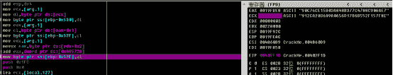

现在就成了如何爆破出前三位的问题，我还是直接选择用aes解密（这里要注意，源程序编译时aes选择的填充方式是zeropadding以及ecb模式的加密，解密时也要对应相应的模式和填充方式，我这里选择的是用jce库里的函数写，发现并没有提供AES/ECB/ZeroPadding这种方式，需要自己用0补充下，既然自己补全了，程序里面就要选择带有nopadding的模式了,但是也没有提供AES/ECB/NoPadding，只好选择默认的填充方式，补充后密文长度变成了之前的两倍，不过只有前一半才是真正有效的值，直接选取前一半就行了

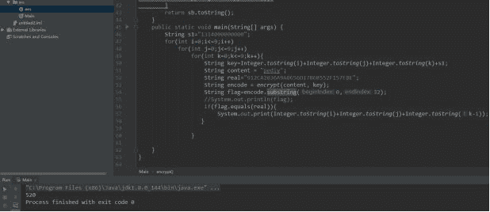

这里附上代码

import javax.crypto.SecretKey;

import javax.crypto.Cipher;

    import javax.crypto.spec.SecretKeySpec;

    public class Main {

    public static String encrypt(String content, String key) {//密文和密钥

        try {

            String ALGO_MODE = "AES" ;//为了补零这里本应选择nopadding

            byte[] enCodeFormat = key.getBytes();

            SecretKey secretKey=new SecretKeySpec(enCodeFormat,"AES");//生成密钥对象

            Cipher cipher = Cipher.getInstance(ALGO_MODE);

            //默认ECB和pkcs5padding

            int blockSize = cipher.getBlockSize();

            //获取加密块大小

            byte[] byteContent = content.getBytes();

            //获得byte类型的密文

            int plaintextLength = byteContent.length;

            if (plaintextLength % blockSize != 0) {

                plaintextLength = plaintextLength + (blockSize - (plaintextLength % blockSize));

            }

            byte[] plaintext = new byte[plaintextLength];

            System.arraycopy(byteContent, 0, plaintext, 0, byteContent.length);

            //上面4行实现了zeropadding

            //System.out.println(plaintext.toString());

            cipher.init(Cipher.ENCRYPT_MODE, secretKey);

            byte[] result = cipher.doFinal(plaintext);

            return Byte2HexStr(result);

        } catch (Exception e) {

            e.printStackTrace();

        }

        return null;

    }

    private static String Byte2HexStr(byte[] result) {//byte类型数组转hex方便操作

        StringBuffer sb = new StringBuffer();

        for (int i = 0; i < result.length; i++) {

            String hex = Integer.toHexString((int)result[i] & 0xFF);

            if (hex.length() == 1) {

                hex = '0' + hex;

            }

            sb.append(hex.toUpperCase());

        }

        return sb.toString();

    }

    public static void main(String[] args) {

        String s1="1314000000000";

        for(int i=0;i<=9;i++)

            for(int j=0;j<=9;j++)

                for(int k=0;k<=9;k++){

                    String key=Integer.toString(i)+Integer.toString(j)+Integer.toString(k)+s1;

                    String content = "pediy";

                    String real="912CA2036A9A0656D17B6B552F157F8E";

                    String encode = encrypt(content, key);

                    String flag=encode.substring(0,32);

                    //System.out.println(flag);

                    if(flag.equals(real)){

                        System.out.print(Integer.toString(i)+Integer.toString(j)+Integer.toString(k-1));

                   }

                }

    }

}

解密得到520

别忘了投稿哦！

合天公众号开启原创投稿啦！！！

大家有好的技术原创文章。

欢迎投稿至邮箱：edu@heetian.com

合天会根据文章的时效、新颖、文笔、实用等多方面评判给予100元-500元不等的稿费哟。

有才能的你快来投稿吧！

点击了解投稿详情[ 重金悬赏 | 合天原创投稿等你来！](http://mp.weixin.qq.com/s?__biz=MjM5MTYxNjQxOA%3D%3D&chksm=bd5945be8a2ecca808f62ee5726223c16cab235d216c891df2dd114b8539001390dbad37bccd&idx=2&mid=2652846451&scene=21&sn=2456db03a3a77d5ff8064449c34ffceb#wechat_redirect)

