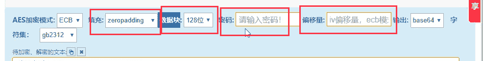
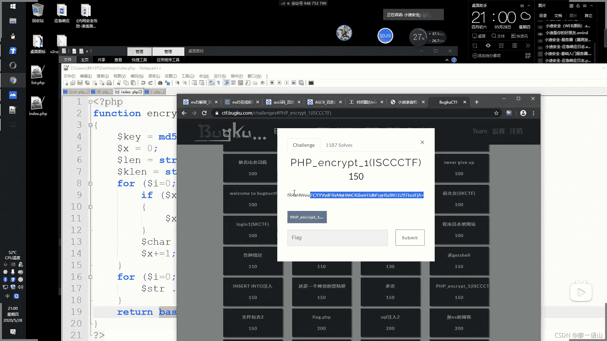
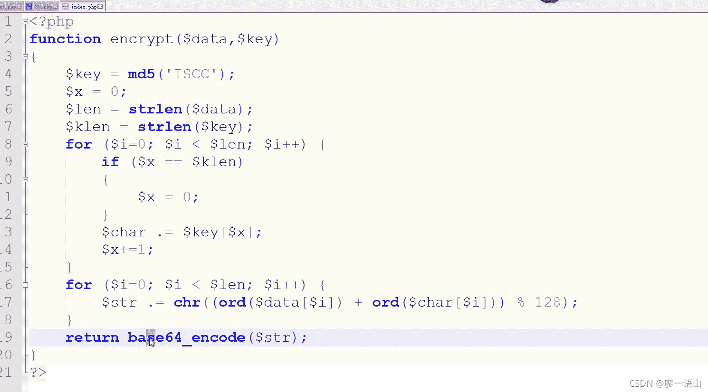
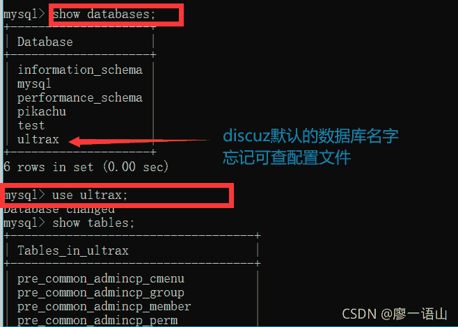
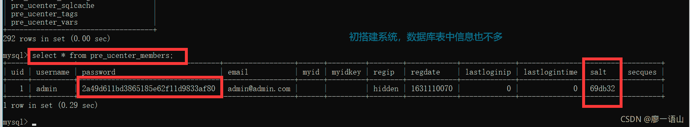
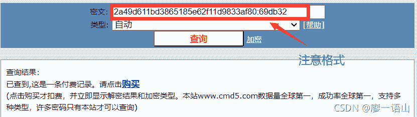
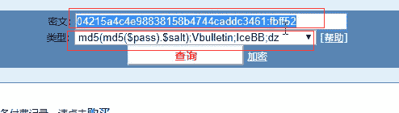
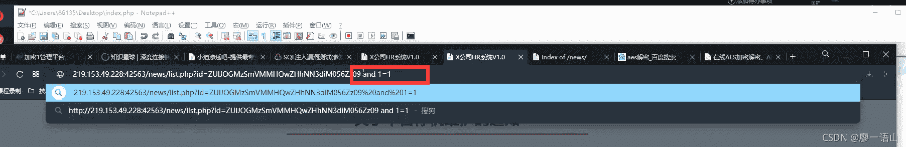

<!--yml
category: 未分类
date: 2022-04-26 14:54:43
-->

# 第6篇：基础入门~加密编码算法_廖一语山的博客-CSDN博客

> 来源：[https://blog.csdn.net/qq_42438245/article/details/119831179](https://blog.csdn.net/qq_42438245/article/details/119831179)

* * *

# 前言

  在渗透测试中，常见的密码等敏感信息会采用加密处理，其中作为安全测试人员必须要了解常见的加密方式，才能为后续的安全测试做好准备，本次课程将讲解各种加密编码等知识，便于后期的学习和发展。

使用 [加解密工具](https://www.cr173.com/soft/21692.html)，无关原理的学习

* * *

# 1.正文

## 1.1.常见加密编码等算法解析

常见的加密编码：MD5，SHA，ASC，进制，时间戳，URL，BASE64，Unescape，AES，DES 等

*   时间戳：常见于数据库
    

*   URL：url编码转换，%百分号加数字或者字母结合（两位），两次加码（浏览器只解密一次）

*   BASE64：密文相应于明文长度变长。大小写数字混编（区分大小写）。密文字符串末经常出现“==”（也会一个、也会没有）。便于代码的加密，对参数进行加密等。网站常见

*   unescape：密文常见：%u四位数字：对应两个字符。网站常见

*   AES的四个要素：密码、偏移量、填充、数据块。
    AES加密后以BASE64显示，看着像BASE64解密但是解密出来乱码

## 1.2.常见加密形式算法解析

直接加密，带 salt，带密码，带偏移，带位数，带模式，带干扰，自定义组合等

**自定义组合**：利用常见的加密方式加上自定的一些规则

## 1.3.常见解密方式（针对）

枚举，自定义逆向算法，可逆向

## 1.4.了解常规加密算法的特性

长度位数，字符规律，代码分析，搜索获取等

* * *

# 2.演示案例

## 2.1.某 CTF 比赛题目解析：脚本自定义算法组合逆向

这题是不是被下架了？

*   考察对密码加解密的顺序梳理
    

*   加密程序：ord意为ascall转化
    

## 2.2.某 CMS 密码加密解密

> MD5+salt
> 部分 CMS 密码加密形式-wp,dz 等

*   discus论坛源码（知名、通用）。**搭建**、查看数据库系统：

选择表

*   ★综上：干扰项：**salt**，没有这个值无法解密，以及加密嵌套方式

付费就算了，看迪师傅的结果

即为没有加密算法识别、没有相关“秘钥”，等于无解。wordpress博客，应该也类似

搭建discus时，其它选项菜单->MySql工具->MySql命令行，密码：root（不知道是不是安装discus时设置的，还是phpstudy的数据库系统默认的）

## 2.3.某 URL 加密地址的漏洞测试

> AES+Base64+自定义
> 观察参数值加密字符串，下载源代码分析，函数定义 AES 加密，涉及模式 CBC,128
> 位，加密密码，偏移量，两次 base64 减去常规一次，填充模式。（1_mozhe）
> 
> ZUlJOGMzSmVMMHQwZHhNN3diM056Zz09
> eII8c3JeL0t0dxM7wb3Nzg==

启动 [墨者学院](https://www.mozhe.cn/bug/detail/SjRRVFpOQWlLWDBJd3hzNGY5cFBiQT09bW96aGUmozhe) 在线靶场

*   考核AES加密的**信息泄露**，一定会给一些数据，加密方式、偏移量等，没有没法解密
*   启动靶场，先用后台扫描工具干，铸剑

1.  网站地址链接进行加密，后台执行代码需要解密在进行下一步执行
2.  寻找解密方式->“id=加密过的数据”
3.  注入信息解密后使用

这个注入，目前超纲
[详细解题方法：SQL注入漏洞测试(参数加密)）](https://blog.csdn.net/qq_38963246/article/details/99065936)

## 2.4.某实际应用 URL 地址参数加密

> 搜素特定关键字加密字符串

搜索网址结尾为“id=MQ==”（加密过的数字1）的网址：“inurl:id=MQ==”

注入点是不是越来越少了、是不是越来越难了？

★测试语句需要和网站的加密格式一致

主要是掌握的知识太少。即，不是有难度，还是太菜，不要整天吃西瓜

* * *

# 涉及资源：

[墨者学院](https://www.mozhe.cn)
[在线MD5加解密](https://www.cmd5.com) 付费~~凸(艹皿艹 )~~
[在线AES加解密](http://tool.chacuo.net/cryptaes)
[discuc源码](https://gitee.com/Discuz/DiscuzX)
https://ctf.bugku.com/challenges