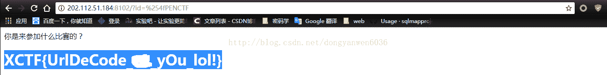

<!--yml
category: 未分类
date: 2022-04-26 14:47:09
-->

# 练习 > CTF解题 > OpenCTF 2017 > urldecode_Gunther17的博客-CSDN博客

> 来源：[https://blog.csdn.net/dongyanwen6036/article/details/77915950](https://blog.csdn.net/dongyanwen6036/article/details/77915950)

根据提示猜测源码：

$_GET[id] = urldecode($_GET[id]);
if($_GET[id] == "openctf")
{
  echo "
Access granted!
";
  echo "
Key: xxxxxxxxxxxxxxxxxxxxxxxxxxxxxxxx 
";
} 

?>

这题就是有病为什么非要大写呢？

啊啊，你要坚定就是这个思路[点击链接](http://blog.csdn.net/dongyanwen6036/article/details/77341083)，就反反复试吧-------。

最后得到flag