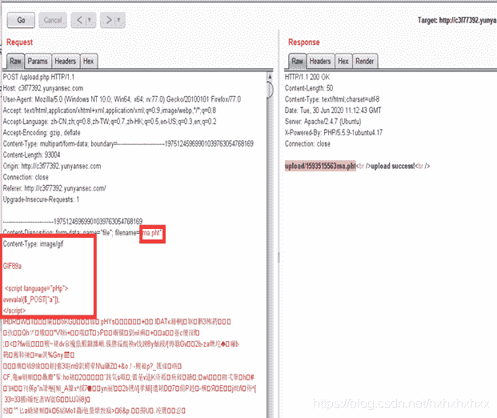
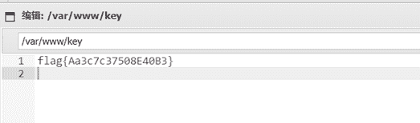

<!--yml
category: 未分类
date: 2022-04-26 14:47:13
-->

# 腾讯犀牛鸟CTF文件上传题目解析_無名之涟的博客-CSDN博客

> 来源：[https://blog.csdn.net/hxhxhxhxx/article/details/107154843](https://blog.csdn.net/hxhxhxhxx/article/details/107154843)

### 腾讯犀牛鸟CTF文件上传题目解析

对上传功能点进行测试，发现限制了图片大小范围。
那么我们就找一个符合范围的图片。

反复尝试，发现，PHp大小写可以绕过，pht也可以绕过，同时构造头GIF89a,就可以绕过。然后蚁剑进行连接。

flag值：
flag{Aa3c7c37508E40B3}