<!--yml
category: 未分类
date: 2022-04-26 14:51:14
-->

# 蓝鲸CTF-web-密码泄露_烟雨天青色的博客-CSDN博客

> 来源：[https://blog.csdn.net/qq_38603541/article/details/100155382](https://blog.csdn.net/qq_38603541/article/details/100155382)

蓝鲸CTF-web之密码泄露：[题目链接](http://39.107.92.230/web/web5/index.php)

进入到题目环境之后，页面显示登陆表单和“false”字样，先猜解一些密码是什么，经过一系列的猜解之后，页面一直显示flase。此时，查看网页源代码：

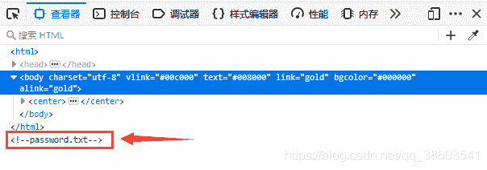

源代码的注释里显示了一个名为password.txt的文件，现在我们可以去访问一下这个文件，访问之后，页面显示了很多条密码，着很显然是一个密码字典：

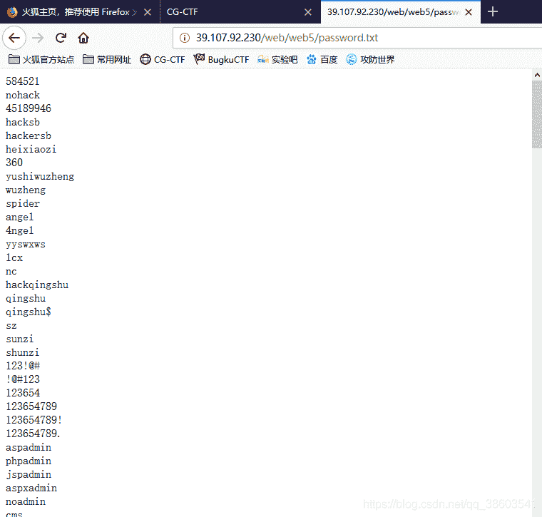

这个时候我们需要利用工具和密码字典进行暴力破解。现将页面的内容拷贝到一个txt文本文件里制作密码字典，然后使用burpsuite进行抓包爆破

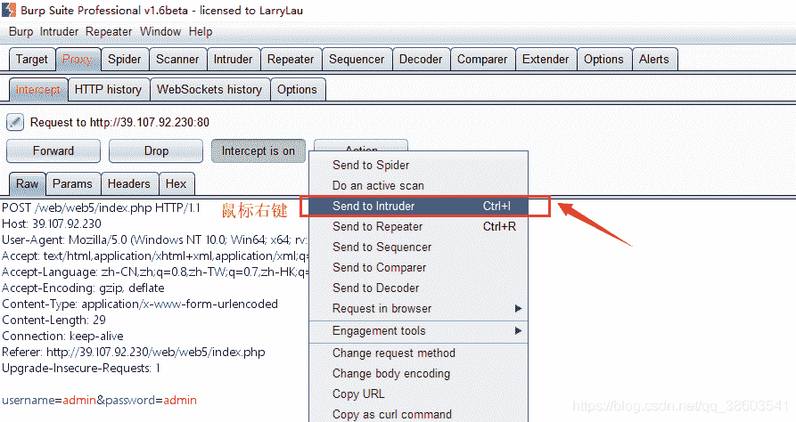

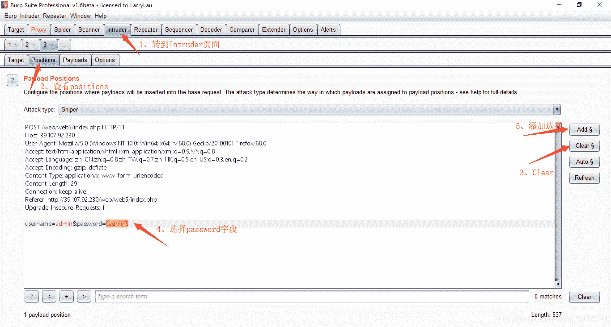

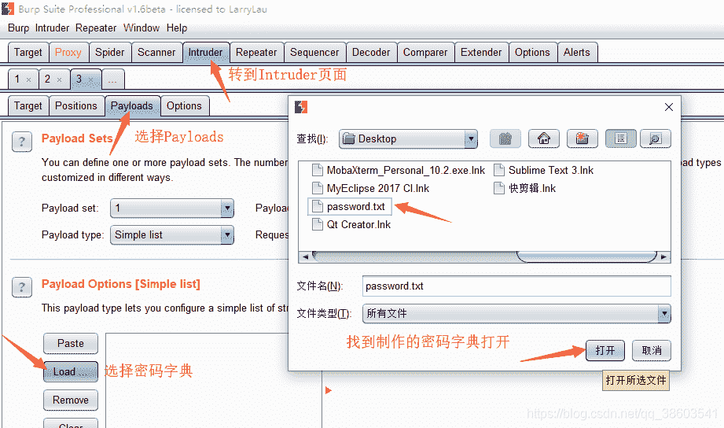

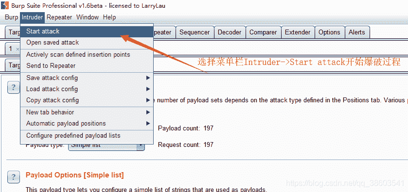

开始爆破过程，因为密码字典只有100多条密码，因此爆破过程还是很快的，结束之后，点击Length进行排序，排序之后我们可以清晰的看到经过爆破得到的密码。

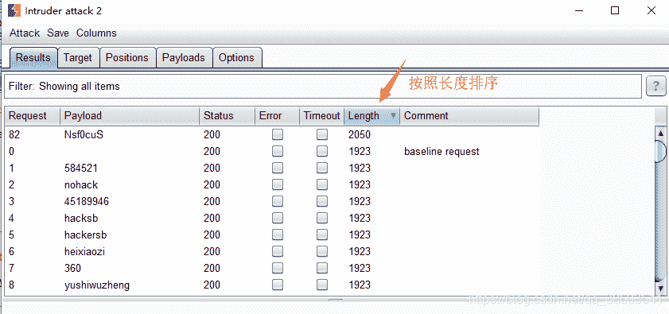

既然得到了密码，现在返回到网页提交一下密码，提交密码过程中，发现密码长度为7位，而密码的input表单却只能输入5位，此时需要更改一下源代码里的input标签的maxLength属性值，改为7.再次输入密码。

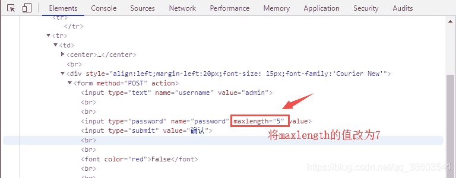

输入正确的密码点击提交之后，页面回显信息“这里没有flag哦”

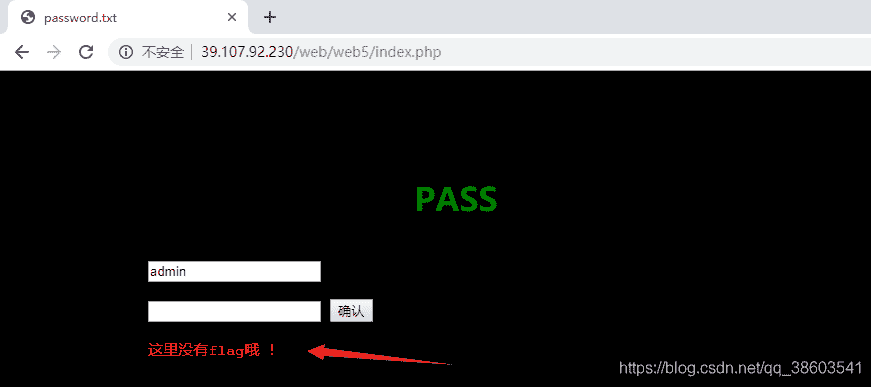

这怎么整了？再回到burpsuite里面，看一下刚刚爆破密码之后的Response。

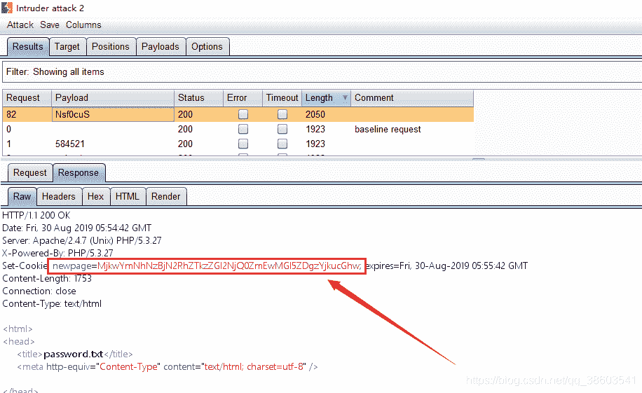

在爆破结果里，有一个Set-Cookie字样，它的属性值看样子是一个base64的编码，此时我们进行解码看一下：

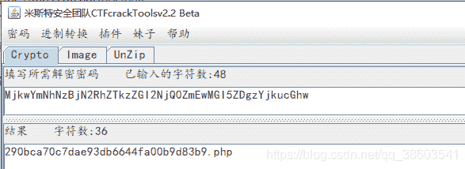

解码出来竟然是一个.php文件。。。再来访问一下这个php文件。

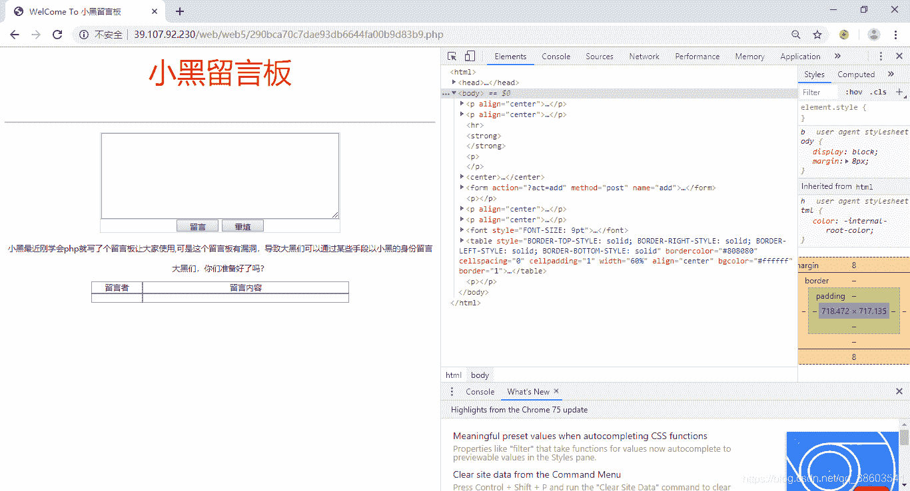

访问之后的页面是这样的，有一个浏览框，看到了留言框，首先我想到的是XSS漏洞，可是查看源代码之后，发现并不是。先在留言框里输入信息看一下会是什么情况。

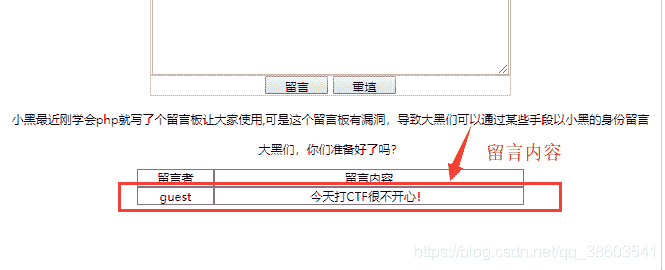

留言之后，留言的信息会显示在下方的留言板上。。。再想想，留言者这个地方很可疑，为什么会是guest呢？自动创建的吗，还是默认的访客用户。

继续使用burpsuite进行抓包，看结果：

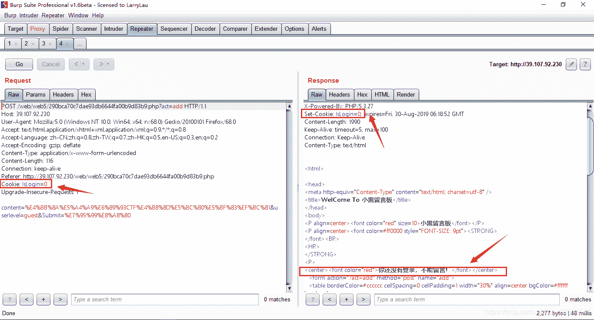

抓到包之后，发送到Repeater，然后Go一下，我们可以看到执行之后的信息，页面提示“你还没有登录，不能留言”。嗯？什么情况，刚刚我已经是可以留言的啊！再仔细观察，页面中有一个标蓝的Cookie属性的属性值，Cookie的属性值是IsLogin=0。IsLogin的值为0，这就说明了登录的时候并没有记录登录状态，我们需要改为IsLogin=1。

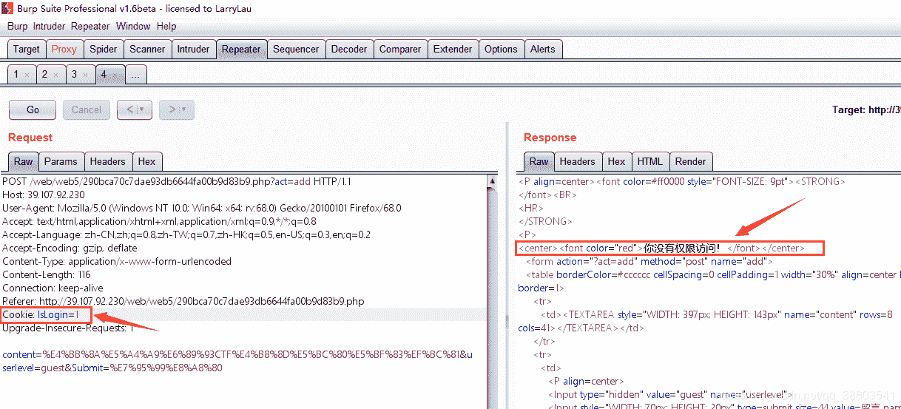

改为1之后，点击Go执行，此时页面回显信息“你没有权限登录”，和刚才不一样了，说明IsLogin的值改为1是正确的，可是这个权限到底是指什么权限，在回头看抓包的代码信息。抓包的信息里有一段“userlevel=guest”，这个guest有点意思了，访客用户，是要改成管理员账户吗，现在来改成root执行试一下：

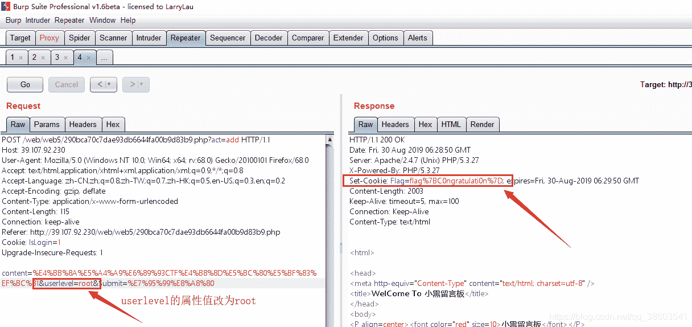

测试通过，确实是由于用户权限引发的问题，执行之后我们可以看到，Response里面显示了一个flag，不过这个flag看起来有点怪，好像是什么编码，但又好像是部分编码，使用%号开头的编码像是URL编码，放在工具里进行解码，看结果：

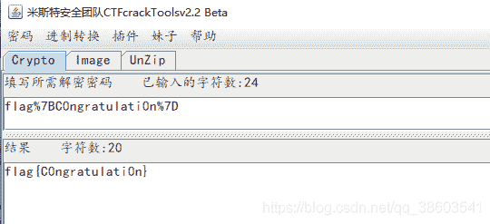

解码之后终于看到flag 了，这个flag再不对我就疯掉了。

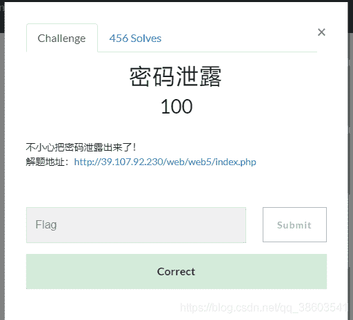

测试通过，end结束。

总结：这道题目感觉很有水平，题目设计的转折点也是比较合理的。题目首先得突破点是第一个网页的源代码，通过源代码里“password.txt”的提示信息，然后进行密码爆破获取密码，之后再根据抓包的信息进行base64解码，然后在根据解码信息去访问指定的页面，我觉得直到这里才是关键，所有的结果都是通过修改Cookie的登录记录信息去获取，因为没有登录的状态，我们去改变IsLogin的值，因为没有权限登录，我们去改变登录的用户名，最后才获取到了flag，然鹅这个flag还是经过编码的，解码之后才是最终结果。所以感觉这样一道题目设计的非常有脑洞，很锻炼思维。