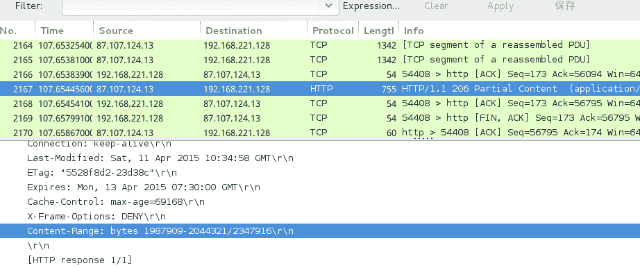
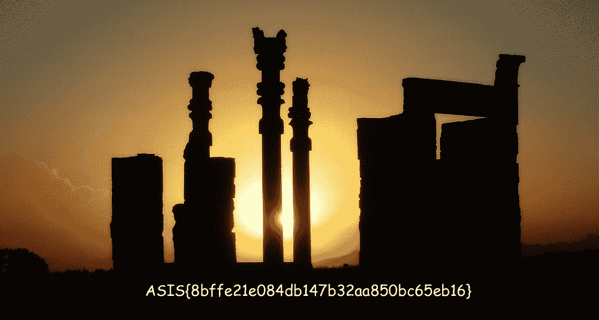
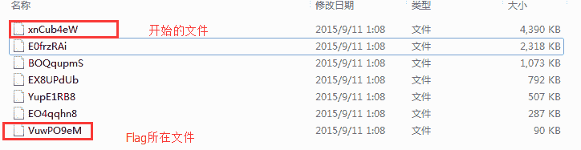

<!--yml
category: 未分类
date: 2022-04-26 14:35:03
-->

# 西普CTF部分题目（解密）_gwenchill的博客-CSDN博客

> 来源：[https://blog.csdn.net/gwenchill/article/details/48073245](https://blog.csdn.net/gwenchill/article/details/48073245)

1、simple algorithm
题目地址：[http://www.simplexue.com/ctf/examctfdetail/737](http://www.simplexue.com/ctf/examctfdetail/737)
题目给了一个py脚本和一个密文文件，py脚本将明文转换为密文，现在需要将密文文件中的密文解密得到明文。
加密算法为

```
flag = '[censored]'
hflag = flag.encode('hex')
iflag = int(hflag[2:], 16)

def FAN(n, m):
    i = 0
    z = []
    s = 0
    while n > 0:
        if n % 2 != 0:
            z.append(2 - (n % 4))
        else:
            z.append(0)
        n = (n - z[i])/2
        i = i + 1
    z = z[::-1]
    l = len(z)
    for i in range(0, l):
        s += z[i] * m ** (l - 1 - i)
    return s

i = 0
r = ''
while i < len(str(iflag)):
    d = str(iflag)[i:i+2]
    nf = FAN(int(d), 3)
    r += str(nf)
    i += 2
print r 
```

很明显加密流程为将明文转换为16进制编码，在转化为10进制数，将每两位数字构成的数进行FAN函数运算，再拼接起来得到密文。
因此解密流程为：将0~99利用FAN函数求得加密值，建立加密值–>原数的字典，在明文中查字典拼接得到10进制数，转化为16进制数，再求取字符串。代码如下：

```
xxx={} #字典
for kk in range(0,100):
    xxx[FAN(kk, 3)]=kk
ff=open('enc.txt','r')
dd=ff.read()
print dd
str1=''
jj=0
while jj<len(dd):
    if xxx.has_key(int(dd[jj:jj+4])):
        str1+='%d'%(xxx[int(dd[jj:jj+4])])
        jj+=4
    elif xxx.has_key(int(dd[jj:jj+3])):
        str1+='%02d'%(xxx[int(dd[jj:jj+3])])
        jj+=3
    elif xxx.has_key(int(dd[jj:jj+2])):
        str1+='%02d'%(xxx[int(dd[jj:jj+2])])
        jj+=2
    elif xxx.has_key(int(dd[jj:jj+1])):
        str1+='%02d'%(xxx[int(dd[jj:jj+1])])
        jj+=1
print str1  
str2='%x'%(int(str1))
print str2.decode('hex')
```

得到明文为SIS{a9ab115c488a311896dac4e8bc20a6d7}，根据算法还缺一位字母，加上题目来自ASIS（一个伊朗的CTF比赛），故key应该为ASIS{a9ab115c488a311896dac4e8bc20a6d7}。不过该题存储的答案是SIS{a9ab115c488a311896dac4e8bc20a6d7}。
该题还是不简单的，国外的题目确实很新颖，值得学习，开拓思路。

2、Broken heart
文件地址：[http://ctf5.simplexue.com/misc/myheart](http://ctf5.simplexue.com/misc/myheart)
该文件用linux的file指令看一下，是个7z格式的压缩包，解压得到myheart~，再用file指令看一下得到pcap-ng capture file - version 1.0，可知是个抓包文件，用wireshalk打开，选择file–>export objects–>HTTP，导出全部文件，修改第一个文件名为LoiRLUoq(0)，得到23个文件，将文件命名为LoiRLUoq(0)~LoiRLUoq(22)
查看http数据包看到

其中的content-Range包括文件的字节位置。
linux中执行：

```
strings myheart.pcap | grep 'Content-Range' | awk '{print NR,$3}' > myheart.txt
```

输出到文件myheart.txt，将txt和导出的23个文件放在一个文件夹下
编写代码，输出到文件，后来观察头包含HDR，前面缺少13个字节，猜测可能是个PNG图片，补充PNG头的前13个字节。打开图片。

```
f=open('myheart.txt','r')
x=list(f.readlines())
f.close()
listvalues=[]
indexlist=[]
for i in xrange(len(x)):
    d=x[i].split()[1].split('/')[0].split('-') 
    flag=True
    for kline in listvalues:
        if (int(d[0])>=kline[0] and int(d[1])<=kline[1]):
            flag=False
            break
    if flag:
        listvalues.append((int(d[0]),int(d[1])))
        indexlist.append(i) 

sortedpos=sorted([xx[0] for xx in listvalues]) 

fresult=open('resultx.png','wb')
fresult.write('89504E470D0A1A0A0000000D49'.decode('hex')) 
for i in xrange(len(sortedpos)):
    index=0
    for searchnums in listvalues:
        if(sortedpos[i]==searchnums[0]): 
            break
        else:
            index+=1
    f=open('LoiRLUoq(%d)'%(indexlist[index]),'rb') 
    if(i!=len(sortedpos)-1):
        fresult.write(f.read()[:sortedpos[i+1]-sortedpos[i]])
    else:
        fresult.write(f.read())    
    f.close()
fresult.close()
print '执行完毕，请查看图片得到key'
```



3、黑客叔叔（雨袭团）内部交流题
密文链接：[http://ctf5.simplexue.com/crypto/p0tt1%20.html](http://ctf5.simplexue.com/crypto/p0tt1%20.html)
该题设计太差，完全需要脑洞，没有水平，完全是坑爹的节奏。题目给了125位长度的密文，有大小有小写有数字。看起来不是base64加密的，不过去掉最后一位试一下base64解码，得到umfpbljhawrfrmxhz19zmf9megnrmw45x3donhq|01|03|07|+|+1|+3|+7|2+1|2+2|2+6|2+7|2+9|3+0|3+3|3+7|3
仍然很大的坑，后有人提示后面的数字代表前面的字符串中第n个字符应变换为大写，+代表*10+，如+表示10，+7表示17，2+9表示29，3+7表示37。最后面还有个特殊的3，啥意思（仍在坑人）。试了一下是代表最后的3位需要为大写。最后在base64解码一下得到key。国内出题人的逻辑和水平堪忧，题目差评。

```
import base64
sss="dW1mcGJsamhhd3Jmcm14aHoxOXptZjltZWducm13NDV4M2RvbmhxfDAxfDAzfDA3fCt8KzF8KzN8Kzd8MisxfDIrMnwyKzZ8Mis3fDIrOXwzKzB8MyszfDMrN3wzK"
x=base64.b64decode(sss[:-1])
print x

res=x.split('|')
content=res[0]
result=list(content)
for ke in res[1:-1]:
    numstr=ke.replace('+','*10+')
    if numstr[0]=='*':
        numstr='1'+numstr
    if numstr[-1]=='+':
        numstr=numstr+"0"
    num=eval(numstr)
    result[num-1]=chr(ord(result[num-1])-32)

strs=''.join(result)+"="
strs=strs[:-3]+strs[-3:].upper()
print strs

print "Flag is "+base64.b64decode(strs) 
```

4、zcrypt(ASIS2015)
给了一个附件及一串字符串提示和一个工具pkcrack
查看附件是个7z文件，解压再看一下是wireshalk文件，用wireshalk打开导出全部http对象为文件，发现7个很特殊的文件，均为zip格式，文件大小依次减小为一半，flag文件在最后一个压缩包中。

根据提示，搜索发现，从最大的压缩包入口解密，依次解，最后解开flag压缩包得到flag。根据pkcrack说明，需要一个参考文件，且文件sha1值为317fc6d41e3d0f79f3e9c470cda48f52a7168c6f，但参考文件哪里有呢。搜索发现有个地方有sha1值满足的文件[下载地址](http://malwaredb.malekal.com/index.php?hash=317fc6d41e3d0f79f3e9c470cda48f52a7168c6f)。
下载后得到一个压缩包，解压（密码： infected）得到参考文件，重命名为plaintext，zip压缩为参考zip。

```
root@kali:~/Desktop/1234
317fc6d41e3d0f79f3e9c470cda48f52a7168c6f  plaintext
root@kali:~/Desktop/1234
  adding: plaintext (deflated 0%)
```

```
root@kali:~/Desktop/1234
root@kali:~/Desktop/1234
Generating 1st generation of possible key2_2725465 values...done.
Found 4194304 possible key2-values.
Now we're trying to reduce these...
Lowest number: 959 values at offset 2722246
省略中间的
Lowest number: 97 values at offset 2689991
Done. Left with 97 possible Values. bestOffset is 2689991.
Stage 1 completed. Starting stage 2 on Fri Sep 11 14:05:25 2015
Ta-daaaaa! key0=70a8cda4, key1=547222ce, key2=4c7d562e
Probabilistic test succeeded for 35479 bytes.
Stage 2 completed. Starting zipdecrypt on Fri Sep 11 14:05:52 2015
Decrypting 317fc6d41e3d0f79f3e9c470cda48f52a7168c6f (ed5e829f7f1c27cbb62e5458)... OK!
Decrypting 2VT&Wb!XJ0dzG7JyvyH-II
Finished on Fri Sep 11 14:05:52 2015
```

得到2VT&Wb!XJ0dzG7JyvyH-II#J 解密文件，重复上述步骤，直到最后一个文件，得到flag为ASIS{b72be7f18502dde0c2ca373ee3c2b03e}
bash脚本如下：

```
#!/bin/sh
PATH=$PATH:~/work/tools/pkcrack
echo $PATH
cd ~/Desktop/1234

cp rawplaintext plaintext
zip plaintext.zip plaintext
extract xnCub4eW 317fc6d41e3d0f79f3e9c470cda48f52a7168c6f
pkcrack  -p plaintext -c 317fc6d41e3d0f79f3e9c470cda48f52a7168c6f -P plaintext.zip -d decrypted.zip -C xnCub4eW 
unzip -o decrypted.zip

mv '2VT&Wb!XJ0dzG7JyvyH-II#J' plaintext
zip plaintext.zip plaintext
extract E0frzRAi cohaxOTDL4Iy4sK7DWFU6Mw6
pkcrack  -p plaintext -c cohaxOTDL4Iy4sK7DWFU6Mw6 -P plaintext.zip -d decrypted.zip -C E0frzRAi 
unzip -o decrypted.zip

mv 'Yy#FoK+YmAgM0#4*C2^i+WWA' plaintext
zip plaintext.zip plaintext
extract BOQqupmS 'JxdIs^43_74nc-1h3WGphjSUGigLPl'
pkcrack  -p plaintext -c 'JxdIs^43_74nc-1h3WGphjSUGigLPl' -P plaintext.zip -d decrypted.zip -C BOQqupmS
unzip -o decrypted.zip

mv 'fIIutQ+18TE0*Odi*XxM' plaintext
zip plaintext.zip plaintext
extract EX8UPdUb '7U0(ZB%8AFX8pd!9FN~v1fePI@s'
pkcrack  -p plaintext -c '7U0(ZB%8AFX8pd!9FN~v1fePI@s' -P plaintext.zip -d decrypted.zip -C EX8UPdUb
unzip -o decrypted.zip

mv 'l@IqLO0zJkujH0h3Fj#Ztp!m'  plaintext
zip plaintext.zip plaintext
extract YupE1RB8 'e7m1Jy+#%H!%bBD1FvCB)m!JM0gE'
pkcrack  -p plaintext -c 'e7m1Jy+#%H!%bBD1FvCB)m!JM0gE' -P plaintext.zip -d decrypted.zip -C YupE1RB8
unzip -o decrypted.zip

mv 'fU2G8r)1DD2QQ_xNWuclyde#'  plaintext
zip plaintext.zip plaintext
extract EO4qqhn8 '7^&V8S(J63s$K9csDk~xaFRDGK&Z'
pkcrack  -p plaintext -c '7^&V8S(J63s$K9csDk~xaFRDGK&Z' -P plaintext.zip -d decrypted.zip -C EO4qqhn8
unzip -o decrypted.zip

mv '%dQ+skWS84uT#KSKY1uND$v+'  plaintext
zip plaintext.zip plaintext
extract VuwPO9eM '9Ux)@Zzr1h03PA#p&#u~JWWgUtpF'
pkcrack  -p plaintext -c '9Ux)@Zzr1h03PA#p&#u~JWWgUtpF' -P plaintext.zip -d decrypted.zip -C VuwPO9eM
unzip -o decrypted.zip

cat flag.txt
```