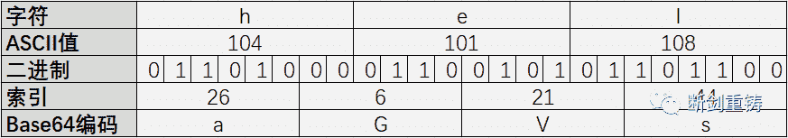
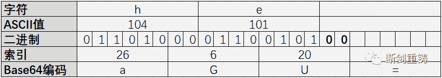
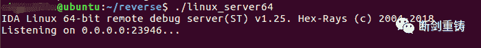
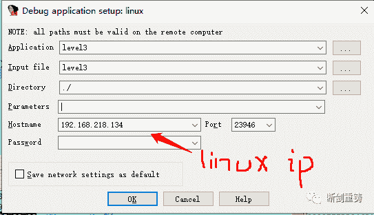
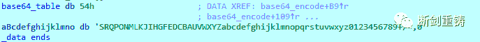
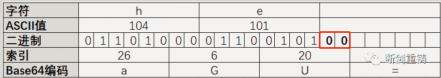

<!--yml
category: 未分类
date: 2022-04-26 14:54:06
-->

# 解码base64_CTF逆向中的常见算法解析base64_奇闻志的博客-CSDN博客

> 来源：[https://blog.csdn.net/weixin_42523543/article/details/112652214](https://blog.csdn.net/weixin_42523543/article/details/112652214)

CTF中的逆向题，大多是考察对代码的读写能力以及加密混淆算法的识别能力。能够在一大堆代码里快速识别出经典的加密混淆算法，可以大大提高我们的解题效率

计划从本期开始解析CTF逆向中的常见算法，包括算法的原理、代码、代码特征以及常见应用，先从最常见的base64开始

**0x1 base64的原理**

对于一串字符，算法要求每三个字符为一组，生成四个字符。如果最后一组字符数不足三个，则用等号补充。具体转换规则如下表所示，三个字符共24位，每6位作为一组计算索引值，再结合base64表查找相应的索引，完成三字符到四字符的转换



base64表如下：


如下表所示，字符不足三个时，最后一个字符低位补0，计算索引，再添加等号



**0x2 base64 编程实现：**

```
char *__fastcall base64_encode(char *a1){  int v1; // eax  int v2; // eax  int v3; // eax  int v4; // eax  int v5; // eax  int v6; // eax  int v8; // [rsp+1Ch] [rbp-54h]  int v9; // [rsp+20h] [rbp-50h]  int v10; // [rsp+24h] [rbp-4Ch]  int v11; // [rsp+24h] [rbp-4Ch]  int v12; // [rsp+24h] [rbp-4Ch]  int v13; // [rsp+28h] [rbp-48h]  int v14; // [rsp+2Ch] [rbp-44h]  char src[56]; // [rsp+30h] [rbp-40h]  unsigned __int64 v16; // [rsp+68h] [rbp-8h]  v16 = __readfsqword(0x28u);  v1 = strlen(a1);                              // a1为输入的字符串  v14 = v1 % 3;                                 // v14为输入字符串长度除3以后的余数  v13 = v1 / 3;                                 // v13为3个一组的字符组合数量  memset(src, 0, 0x30uLL);  v10 = 0;  v8 = 0;  v9 = 0;  while ( v8 < v13 )  {    v2 = v10;    v11 = v10 + 1;    src[v2] = base64_table[a1[v9] >> 2];        // 第一个：a1[0]左移2位，取前6位作为索引值，查找对应字符    v3 = v11++;    src[v3] = base64_table[(16 * (a1[v9] & 3)) | (a1[v9 + 1] >> 4)];// 第二个：a1[0]取后2位与a1[1]的前4位拼接    src[v11] = base64_table[(4 * (a1[v9 + 1] & 0xF)) | (a1[v9 + 2] >> 6)];// 第三个：a1[1]取后4位与a1[2]的前2位拼接，查找对应字符    v4 = v11 + 1;    v10 = v11 + 2;    src[v4] = base64_table[a1[v9 + 2] & 0x3F];  // 第四个：a1[2]取后6位作为索引，查找对应字符    v9 += 3;    ++v8;  }  if ( v14 == 1 )                               // 余数为1，则需要添加两个等号  {    src[v10] = base64_table[a1[v9] >> 2];    src[v10 + 1] = base64_table[16 * (a1[v9] & 3)];    strcat(src, "==");  }  else if ( v14 == 2 )                          // 余数为2，则需要添加1个等号  {    v5 = v10;    v12 = v10 + 1;    src[v5] = base64_table[a1[v9] >> 2];    v6 = v12++;    src[v6] = base64_table[(16 * (a1[v9] & 3)) | (a1[v9 + 1] >> 4)];    src[v12] = base64_table[4 * (a1[v9 + 1] & 0xF)];    src[v12 + 1] = '=';  }  strcpy(a1, src);  return a1;}
```

**0x3 base64的代码特征：**

1.base64算法要用到base64表,可以在程序中找到连续的字符串ABCDEFGHIJKLMNOPQRSTUVWXYZabcdefghijklmnopqrstuvwxyz0123456789+/

2.根据base64加密原理，代码中必然存在根据余数个数判断是否添加等号的代码

3.((a[0]&3)<<4)|(a[1]>>4)和(16*(a[0]&3))|(a[1]/16)是等价操作，都表示取a[0]后2位与a[1]前4位拼接，是base64中的常见操作

**0x4 base64的扩展应用**

1.  base64变表

顾名思义，就是更改base64的索引表。如之前索引0对应A，变成索引0对应B。可使用如下代码完成转换：

```
import base64base = 'ABCDEFGHIJKLMNOPQRSTUVWXYZabcdefghijklmnopqrstuvwxyz0123456789+/'#初始表diy_base = 'TSRQPONMLKJIHGFEDCBAUVWXYZabcdefghijklmnopqrstuvwxyz0123456789+/'#新表s = 'd2G0ZjLwHjS7DmOzZAY0X2lzX3CoZV9zdNOydO9vZl9yZXZlcnGlfD=='#待解密字符串ss = ''for i in range(len(s)):    ss += base[diy_base.find(s[i])]ss += '=='print ssa = base64.b64decode(ss)print a
```

对于base64变表的逆向题，找到新的base表是关键。如果新的base表是写在静态程序中，可以通过IDA字符串查找(shift+f12)来获取或者使用以下命令来发现

```
strings 可执行程序名 | grep -x '.\{30,\}' | head
```

如果base表是在程序加载时才出现，可以分析程序加载时base表的生成代码，静态分析出新的base64表或者采用动态调试的方法提取base64表

调试步骤：







2.base64隐写

base64算法解码过程：首先把所有的等号去掉，然后查表将字符转为二进制的索引值，最后每8位一组计算ascii码还原字符，**不足8位则丢弃**

仍然以下表为例，**被红框标记的部分由于不足8位被丢弃了，说明其不会影响解码结果，也就是说放啥都行。所以此处可以隐写信息**



网上找的base64隐写解密脚本：

```
def get_base64_diff_value(s1, s2):    base64chars = 'ABCDEFGHIJKLMNOPQRSTUVWXYZabcdefghijklmnopqrstuvwxyz0123456789+/'    res = 0for i in xrange(len(s2)):if s1[i] != s2[i]:return abs(base64chars.index(s1[i]) - base64chars.index(s2[i]))return resdef solve_stego():with open('stego.txt', 'rb') as f:        file_lines = f.readlines()        bin_str = ''for line in file_lines:            steg_line = line.replace('\n', '')            norm_line = line.replace('\n', '').decode('base64').encode('base64').replace('\n', '')            diff = get_base64_diff_value(steg_line, norm_line)print diff            pads_num = steg_line.count('=')if diff:                bin_str += bin(diff)[2:].zfill(pads_num * 2)else:                bin_str += '0' * pads_num * 2print goflag(bin_str)def goflag(bin_str):    res_str = ''for i in xrange(0, len(bin_str), 8):        res_str += chr(int(bin_str[i:i + 8], 2))return res_strif __name__ == '__main__':    solve_stego()
```

参考链接：

https://blog.csdn.net/xnightmare/article/details/103774379