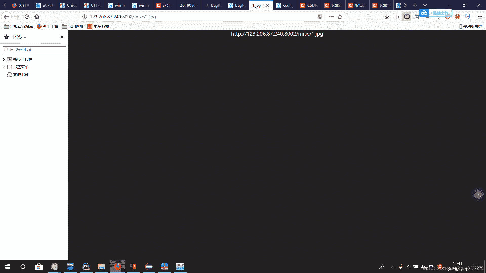
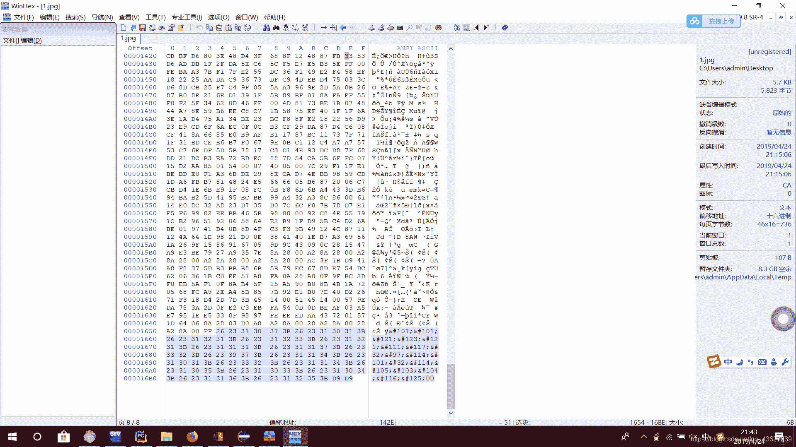
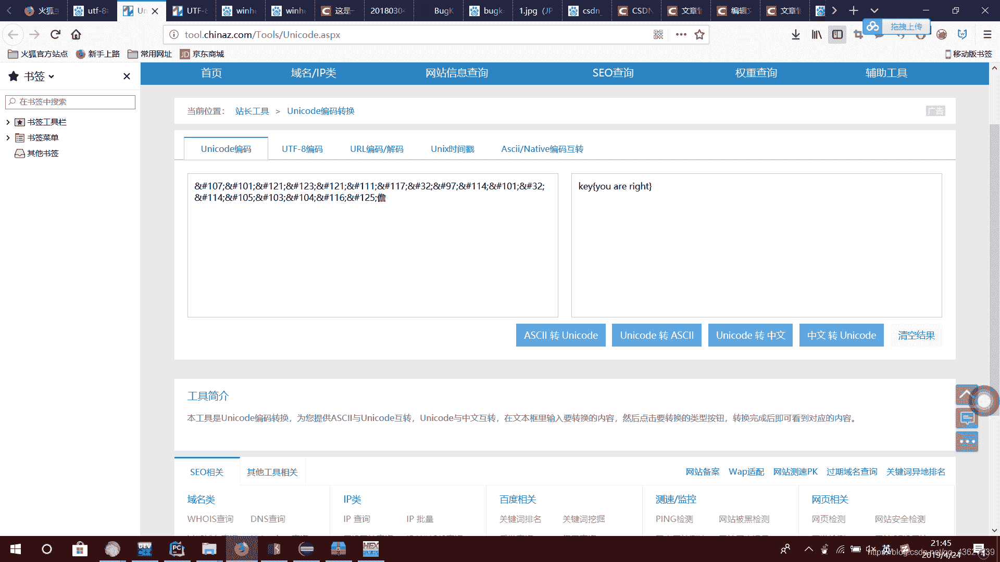

<!--yml
category: 未分类
date: 2022-04-26 14:44:19
-->

# 计网笔记ip分类 bugkuctf题目新手初解_颜又舞的博客-CSDN博客

> 来源：[https://blog.csdn.net/qq_43627239/article/details/89501806](https://blog.csdn.net/qq_43627239/article/details/89501806)

.网络层（IP层）功能

  功能：使异构网络实现互联。（通过中间设备联接多个计算机网络）

  中间设备又称为中继系统，网络层的中继系统是路由器。

  路由器是一台专用计算机，用于在互联网中进行路由选择。

  参与互联的计算机网络都使用相同的网际协议IP（ internet Protocol ）.

IP分类：

IP分为网络号和主机号两部分共32位  分为ABCDE五类

A类：（1~126）

有8位网络号 第一位默认是0 ，所以最大网络号是01111111是127位 表示环回地址 1~126是可用 的网络号

主机号24位 所以最大主机数位2的24次方减2，特殊主机号：全0单独表示网络地址 全1用于广播 表示所有主机

B类：（128~191）

有16位网络号 前两位是10 可用网络号位2^16-1

                  特殊网络号：10000000（128.0不用于指派），最小网络号为（128.1），可用网络号2^14 - 1

有16位主机号 所以最大主机数是2^16-2，特殊主机号：和A类类似全0单独表示网络地址

C类：（192~243）

有24位网络号 前三位是110，特殊网络号：11000000（192.0.0不用于指派），

                    最小网络号为（192.0.1），可用网络号2^21 - 1
有8位主机号  特殊主机号：全0的单独表示网络地址（129.0.1.0），

                    全1用于广播，表示所有主机，剩下的2^16 - 2是可用主机号数量

前八位 用于区分ABC类网络 不用往后看！

Bugku ctf杂项初解题

1 扫码获取flag

2一张单纯的图片

点击题目 会出现网址

[http://123.206.87.240:8002/misc/1.jpg](http://123.206.87.240:8002/misc/1.jpg)

点进去网址是黑黑的一张图

保存图片到桌面 用winhex查看图片 会得到图片的码

最右下角是un code码 用转码器 转码得到key

得到flag:key{you are right}