<!--yml
category: 未分类
date: 2022-04-26 14:50:00
-->

# 记录一道神仙CTF-wtf.sh-150_asdqwe10203的博客-CSDN博客

> 来源：[https://blog.csdn.net/asdqwe10203/article/details/101833470](https://blog.csdn.net/asdqwe10203/article/details/101833470)

记录一道完全超出我能力的CTF神仙题（不愧是世界级比赛的真题orz)，此题我仅解出了第一部分的flag，第二部分则参考了WP。不得不说这种题目解出来还是很有自豪感的嘛~  直接看题！

# **0x01 第一部分flag**

打开题目：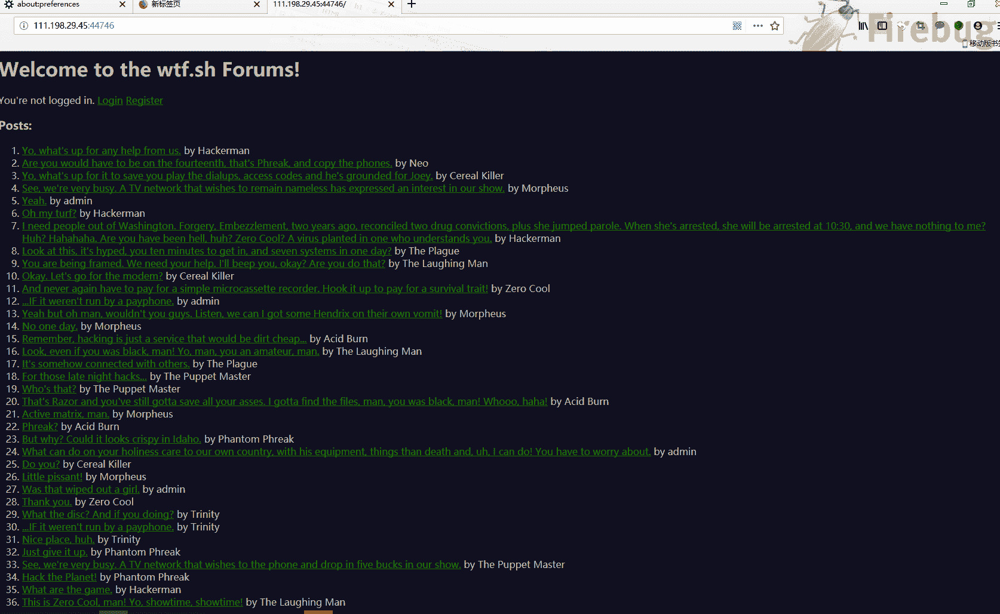

　　随便点击几个浏览可以看出题目环境是一个论坛，我们先注册个账号：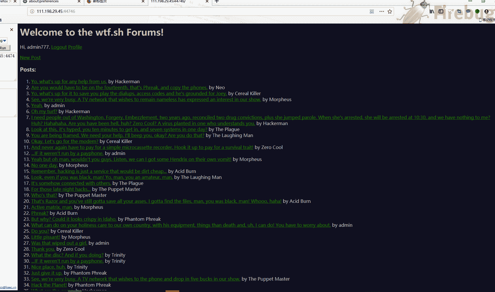

　　通过一些简单的测试像是sql注入，目录爆破，源码泄露这种常见套路走不通了hhhhhh，最后不断尝试：在展示文章的页面 post.wtf 下发现路径穿越漏洞（如果应用程序使用用户可控制的数据，以危险的方式访问位于应用服务器或其它后端文件系统的文件或目录，就会出现路径遍历。攻击者可以将路径遍历序列放入文件名内，向上回溯，从而访问服务器上的任何文件）

，可以获得网站源码：

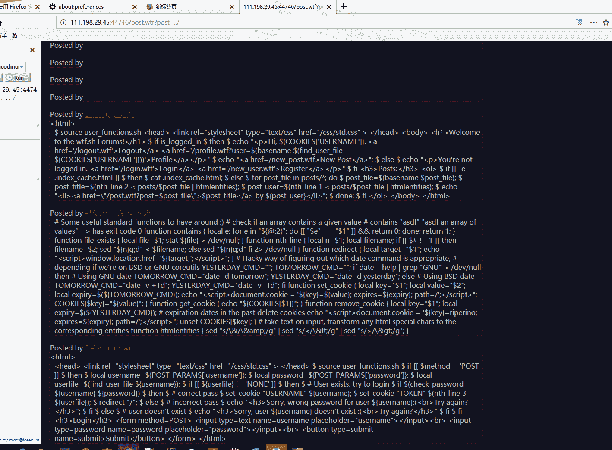

　　　　寻找flag关键字：

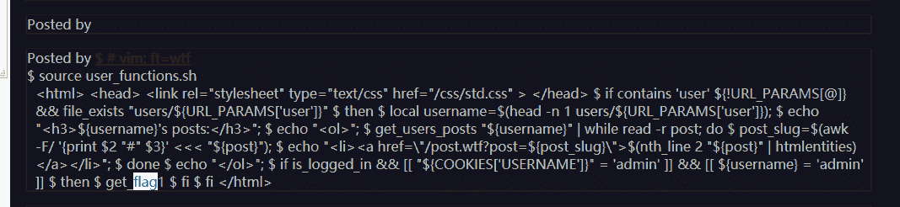

　　　　代码格式化：

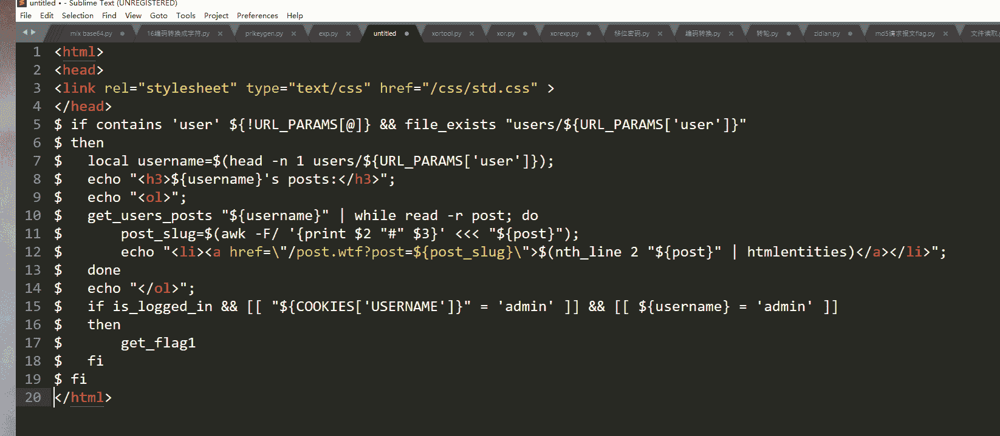

发现如下部分：

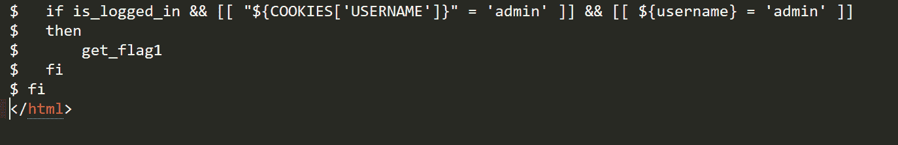

可以看到只要登录 admin 账号就可以获得 flag1：

在泄露的源码里得知有 users 目录，继续尝试路径穿越：

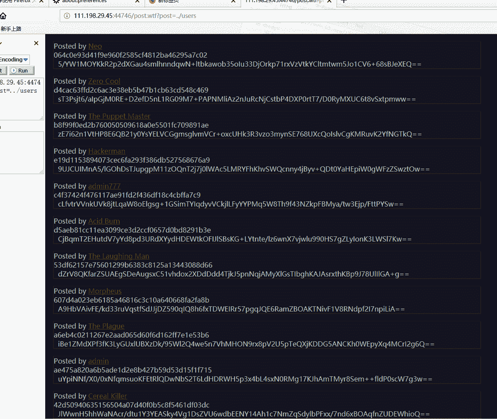

　　可以看到里面有我们的账号信息和admin的信息，看到这些字符串如果经验丰富的话可以猜测是cookie或者是代表我们身份的令牌：老套路抓包试试：

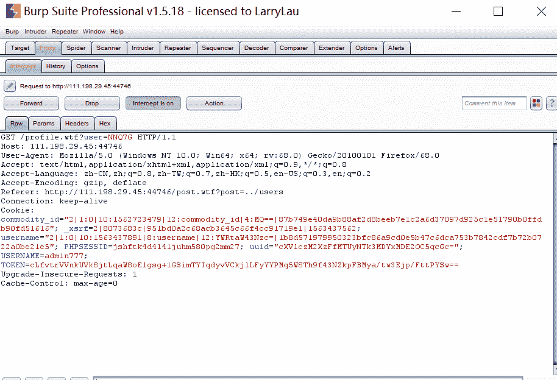

可以看到我们用户名下面的第二行就是代表我们身份的令牌，admin的令牌也知道了，可以进行 cookie 欺骗啦HHH~，抓包修改！

 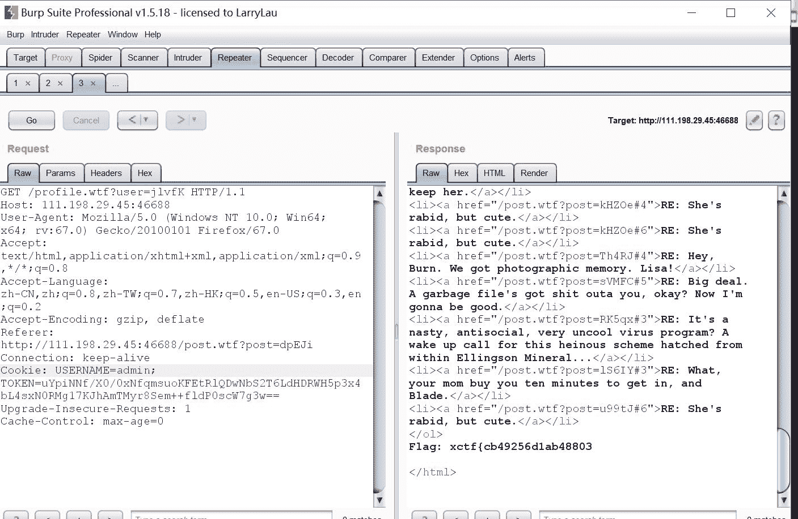

　　拿到第一个flag!

# **0x02:第二个flag**

get_flag1和get_flag2是Set-UID（SUID）二进制文件，我们想要提升到flag1和flag2用户的权限以读取这些文本文件并不容易，因此，我们需要代码执行

因为 wtf 不是常规的网页文件，故寻找解析 wtf 文件的代码：

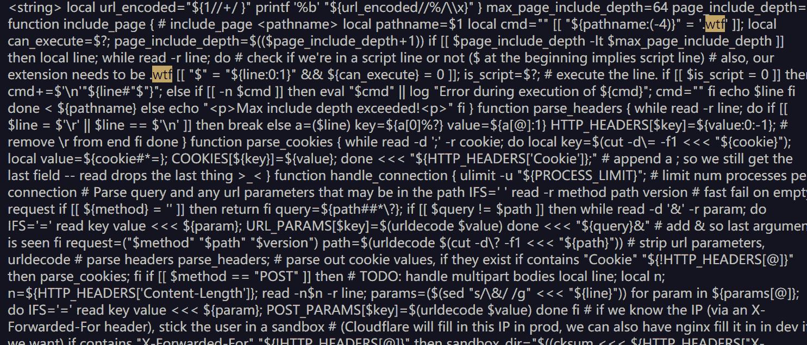

格式化代码：

```
 1 max_page_include_depth=64
 2 
 3 page_include_depth=0
 4 
 5 function include_page {
 6 
 7     # include_page pathname
 8 
 9     local pathname=$1
10 
11     local cmd=
12 
13     [[ ${pathname(-4)} = '.wtf' ]]; 14 
15     local can_execute=$; 16 
17     page_include_depth=$(($page_include_depth+1)) 18 
19     if [[ $page_include_depth -lt $max_page_include_depth ]] 20 
21 then 22 
23 local line; 24 
25         while read -r line; do
26 
27             # check if we're in a script line or not ($ at the beginning implies script line)
28 
29 # also, our extension needs to be .wtf 30 
31             [[ $ = ${line01} && ${can_execute} = 0 ]]; 32 
33             is_script=$; 34 
35 
36 # execute the line. 37 
38             if [[ $is_script = 0 ]] 39 
40 then 41 
42                 cmd+=$'n'${line#$}; 43 
44             else
45 
46                 if [[ -n $cmd ]] 47 
48 then 49 
50 eval $cmd  log Error during execution of ${cmd}; 51 
52                     cmd=
53 
54 fi 55 
56 echo $line 57 
58 fi 59 
60 done  ${pathname} 61 
62     else
63 
64         echo pMax include depth exceeded!
65 pfi 66 
67 }
```

通过这段代码我们发现服务器能够解析并执行 wtf 文件，如果还能够上传 wtf 文件并执行的话，就可以达到控制服务器的目的。

于是继续审计代码，发现如下代码给了这个机会：

```
 1 function reply {
 2 
 3     local post_id=$1;
 4 
 5     local username=$2;
 6 
 7     local text=$3;
 8 
 9     local hashed=$(hash_username "${username}"); 10 
11 
12     curr_id=$(for d in posts/${post_id}/*; do basename $d; done | sort -n | tail -n 1); 13 
14 next_reply_id=$(awk '{print $1+1}' <<< "${curr_id}"); 15 
16 next_file=(posts/${post_id}/${next_reply_id}); 17 
18 echo "${username}" > "${next_file}"; 19 
20 echo "RE: $(nth_line 2 < "posts/${post_id}/1")" >> "${next_file}"; 21 
22 echo "${text}" >> "${next_file}"; 23 
24 
25 # add post this is in reply to to posts cache 26 
27 echo "${post_id}/${next_reply_id}" >> "users_lookup/${hashed}/posts"; 28 
29 }
```

这是评论功能的后台代码，这部分也是存在路径穿越的。

这行代码把用户名写在了评论文件的内容中：echo "${username}" > "${next_file}";

通过上面的分析：如果用户名是一段可执行代码，而且写入的文件是 wtf 格式的，那么这个文件就能够执行我们想要的代码。 （而且*wtf.sh*只运行文件扩展名为.wtf的脚本和前缀为'$'的行）

先普通地评论一下，知晓评论发送的数据包的结构，在普通评论的基础上，进行路径穿越，上传后门`sh.wtf`：

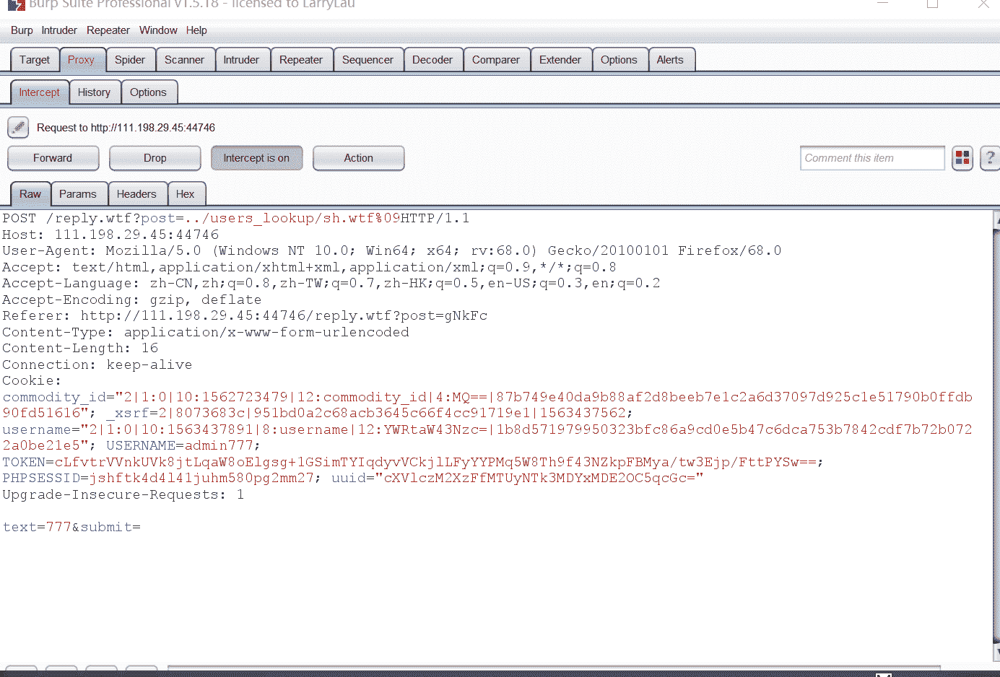

`%09`是水平制表符，必须添加，不然后台会把我们的后门当做目录去解析。

访问后门，发现成功写入：


为了写入恶意代码，我们得让用户名里携带代码，故注册这样一个用户：${find,/,-iname,get_flag2}    写入后门：

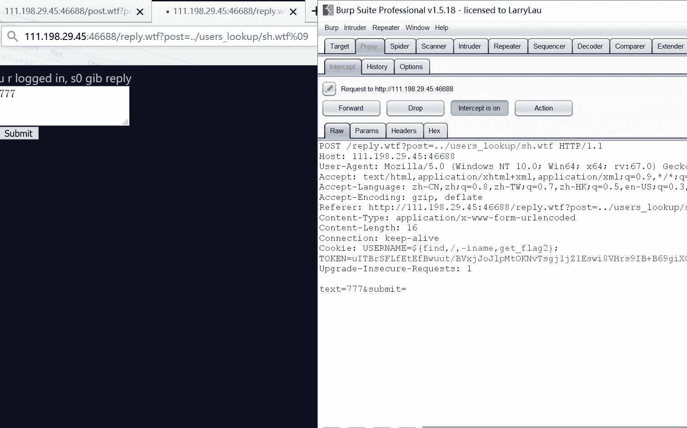

访问后门，执行代码，寻找`get_flag2`（因为之前获得 flag1 的时候是 `get_flag1`）：

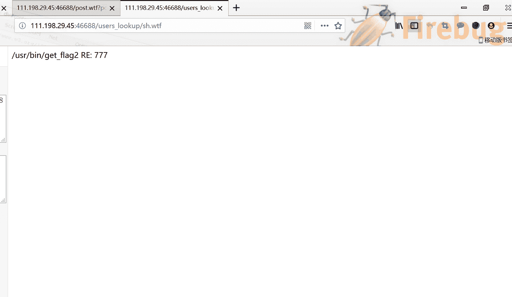

获得 flag2 所在的路径。

继续注册新用户：$/usr/bin/get_flag2      写入后门：

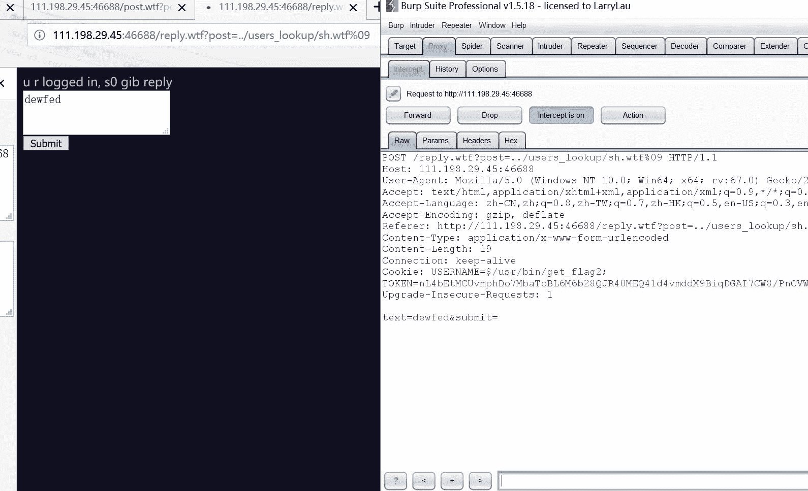

访问后门，获得 flag2：

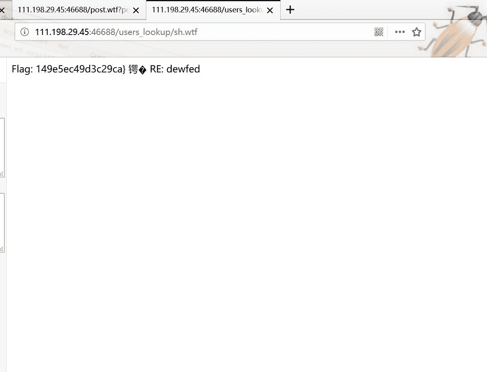

# **0x03总结**

**第一部分的话仔细研究还是能做的：路径穿越和cookie欺骗还是很常规的CTF赛题**

**此题的第二部分对于我目前是超出了能力范围，所以我也是借鉴了网上得WP（https://blog.cindemor.com/post/ctf-fairy-1.html）**

**代码审计能力还是要加强啊orz，还有一些小细节如“`%09`是水平制表符，必须添加，不然后台会把我们的后门当做目录去解析。”当时也没有想到T_T。**

**这种国际赛题虽然难，还是要做的嘛~~迎难而上才能突破自己鸭！**

**今天刚报名了下学期的省赛 接下来还是要继续去各大平台刷题总结 。加油啦！！**

**萌新的第一篇博客 请各位大佬多多指教啦！**