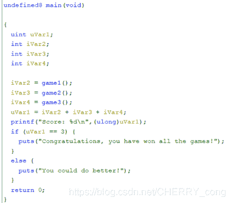
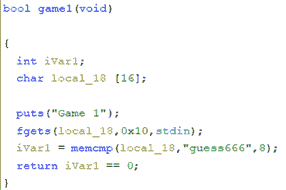
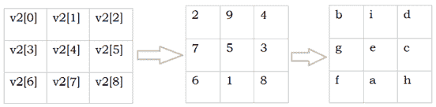
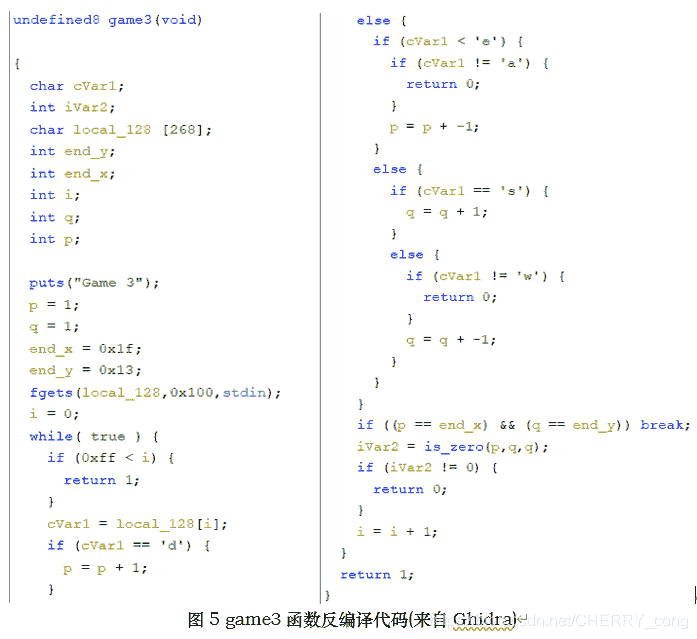
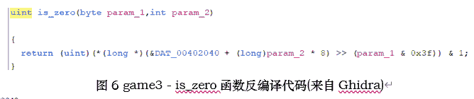
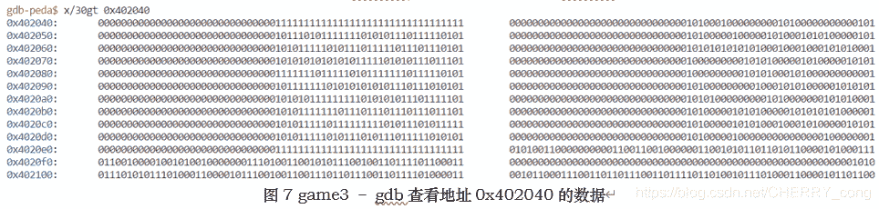
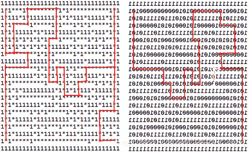
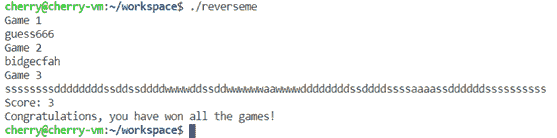

<!--yml
category: 未分类
date: 2022-04-26 14:38:59
-->

# 软件逆向分析初试reverse；ctf-re 入门题，详解_Cherry_icc的博客-CSDN博客_certreg是什么程序

> 来源：[https://blog.csdn.net/CHERRY_cong/article/details/116333941](https://blog.csdn.net/CHERRY_cong/article/details/116333941)

# 软件逆向分析初试re；ctf

实验环境：Ubuntu 20.04.1 LTS

GNU gdb (Ubuntu 9.1-0ubuntu1) 9.1

              Ghidra 9.2.2 Java Version 15

          IDA Version 7.5.201028 Windows x64 (64-bit address size)

实验日期：2021年3月31日星期三

实验内容：reverseme；文件链接[https://gitee.com/cherry_ccl/homework_code](https://gitee.com/cherry_ccl/homework_code)

### 程序逻辑分析

程序reverseme 的main函数反编译内容如下图1；main函数依次调用三个子函数game1，game2，game3，然后判断是否都通过。reverseme主要任务就是解开这三个子函数。

图1 main函数反编译代码(来自Ghidra)

## Game1

game1函数的反编译代码如下图2，显然此函数是读取16个输入，然后调用memcmp将输入内容与“guess666”比较。所以game1的解就是输入guess666.

图2 game1函数反编译代码(来自Ghidra)

## Game2

Game2的反编译代码如图3。主要技巧是将v2的类型转为int[9]。可以看出game2的主要逻辑是s读取输入字符串，将s每个字符减去96之后的值赋给数组v2[9]；之后会进行检查v2每个值是否都在1~9之间，且两两不相等，否则返回0。然后，框起来的代码会判断对v2[9]中这9个数是否满足九宫格中每行每列以及斜行的值是否相等。满足以上条件时会返回1。game2当于一个1~9的九宫格数独游戏。

 

game2的答案也是显而易见的。由于在将s的值赋给v2的时候减去了96，所以由abcdefghi来代替123456789，game2的解答如图4所示，满足数独的要求。game2的解答是输入bidgecfah。

图4 game2数独的解答

## Game3

Game3的反编译代码如图5所示。game3是一个迷宫游戏，起点是坐标(p, q) = (1，1), 终点是（end_x, end_y）=（0x1f, 0x13）=（31，19）。由w s a d字符来分别代表上下左右。每一步会经过is_zero函数判断当前位置是否合法。在每一步都合法的情况下到达终点就会返回1，通过函数。

查看is_zero函数的反编译代码如图6。看出数据的位置在00402040。使用gdb运行程序后，直接查看位置0x402040的数据，结果如图7。观察得到，从基址0x402040到0x4020e8的数据，被1围起来，相当于迷宫的地图。也可以验证，终点（31，19）带入is_zero函数，得到的终点位置(0x402040 + 19*8) >> 31 & 0x3f = 0x4020d8的从右数第31个比特。is_zero函数会判断每个经过的位置，如果为0则为合法，为1则不合法。换而言之，整个迷宫1代表墙0表示可以通过的路，答案应该是迷宫从起点到终点的通路。

将迷宫单独取出来表示如图8左侧(0被*替换)，但左图从（0，0）到（31，19）并不是此题的解答。右图是将左图做了左右镜像翻转，这个才是正确答案。原因：在反编译代码中，输入d(→)字符操作p++，a(←)字符操作p--。但是在is_zero函数中，（p，q）位置的状态数取的是将data的基址加上行数再右移q位（&DATA + q*8 >> p），取数据的最后一比特&1，即迷宫中右移p位对应的位置是数据从右向左数的第p比特位。因此我们看到的迷宫（左图），实际上的做法是按镜像翻转后的右图，因为is_zero函数对数据的操作使得左右刚好是反过来的。

图8 game3迷宫的解答

所以game3的正确解答是图8中右图的路线用w s a d代表上下左右表示出的路线，即ssssssssddddddddssddssddddwwwwddssddwwwwwwaawwwwddddddddssddddssssaaaassddddddssssssssss。

### 程序运行结果

