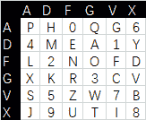

<!--yml
category: 未分类
date: 2022-04-26 14:50:36
-->

# 邑网杯 CTF 2021 ,cipher2 ADFGVX 解题_euzen的博客-CSDN博客

> 来源：[https://blog.csdn.net/euzen/article/details/119085350](https://blog.csdn.net/euzen/article/details/119085350)

## 题目

这题现场没有做出来，因为是集中比赛而且禁用互联网，废了九成功力。

题目是一个python 2的源码。使用ADFGVX加密，随机生成一个7位的纯字母key，然后用这个key加密key本身和flag{...........}，现在知道加密后的两个结果，求flag 。后来发现这个基本上就是第三方库pycipher上移植过来的，去掉了解密的代码。使用 pip install pycipher，安装这个库后可以使用解密函数，方便验证结果。

题目代码如下：

```
from flag import flag
from random import choice
import re

class ADFGVX():
    def __init__(self, key='ph0qg64mea1yl2nofdxkr3cvs5zw7bj9uti8', keyword='GERMAN'):
        self.key = [k.upper() for k in key]
        self.keyword = keyword

    def remove_punctuation(self, text, filter='[^A-Z0-9]'):
        return re.sub(filter,'',text.upper())

    def encipher_char(self, ch, size=6, chars='ADFGVX'):
        row = (int)(self.key.index(ch)/size)
        col = (self.key.index(ch) % size)
        return chars[row] + chars[col]

    def encipher_string(self, string):       
        string = self.remove_punctuation(string)
        ret = ''
        for c in range(0,len(string)):
            ret += self.encipher_char(string[c])
        return ret  

    def sortind(self, word):
        t1 = [(word[i],i) for i in range(len(word))]
        t2 = [(k[1],i) for i,k in enumerate(sorted(t1))]
        return [q[1] for q in sorted(t2)]

    def encipher_sortind(self,string):
        string = self.remove_punctuation(string)    
        ret = ''
        ind = self.sortind(self.keyword)
        for i in range(len(self.keyword)):
            ret += string[ind.index(i)::len(self.keyword)]
        return ret

    def encipher(self,string):             
        step1 = self.encipher_string(string)
        step2 = self.encipher_sortind(step1)
        return step2

def getKeyword(x):
    key = ''.join([choice('abcdefghijklmnopqrstuvwxyz') for i in range(x)])
    for i in key:
        if key.count(i)!=1:
            return getKeyword(x)
    return key

keyword = getKeyword(7)

enc = ADFGVX('ph0qg64mea1yl2nofdxkr3cvs5zw7bj9uti8',keyword)
print enc.encipher(keyword)
print enc.encipher('flag'+flag[5:-1])

# output:
# XAGDFGVGXXXGAX
# DXVGGVGGVGVFXAFVFXFFXFVFFFVFDVVGADGVAVGDAAVXGDGXGXDFVFDAVADAXAAFFVFXXGVX 
```

## 知识点

ADFGVX加密的详细解释，可以阅读百度百科： [ADFGVX密码](https://baike.baidu.com/item/ADFGVX%E5%AF%86%E7%A0%81) ，曾经是德国的军用密码，后来被法国人破解。

## 解题思路

没有什么奇思妙想，就是暴力破解。

最简单是使用原来的函数getKeyword()的思想，从26个字母生成7位的key，加密用与给定的结果对比，逐一检验。不过计算一下组合数，就立即放弃了：

```
>>> import scipy.special
>>> scipy.special.perm(26,7)
3315312000.0
```

另外就是从7位key来入手，因为使用了key来加密key自身，数据比较短，而且加密结果，可用条件比较充分，工作量会大大减少。7! = 5040 ，计算也就几秒的事情。

先手工模拟一下解密过程，key加密结果是 XAGDFGVGXXXGAX，从原理得知，解密第一步是要将密文按两个一组分解到纵列，XA,GD,FG,VG,XX,XG,AX各为一组，分解结果如下：

然后从左到右，从上到下，可以得到一个码表位置：XG FV XX AA DG GX GX。因为这个列的位置是按key的字符来排序的，所以这个码表只是可能之一。如果将第1，2列位置对换，可以得到第二个结果，1，3列对换，得到第三个结果，如此类推，总计5040种组合。

第二步，找出对应内容。按照码表序列 ph0qg64mea1yl2nofdxkr3cvs5zw7bj9uti8，可以得到对应的Polybius方格如下图。



那么XG FV XX AA DG GX GX对应的key值就是 tf8pavv，这个结果很明显是不符合要求的，1是存在数字，二是存在重复字符v 。后续其他组合的校验工作就交给脚本来完成。

## 解题脚本

 代码中写了对key中存在数字和重复字符的判断，实际可以省略，虽然这些不符合要求的key占了5040个可能中的绝大部分，但将它们也加进校验序列，所需时间并也不太影响计算进度。反而写代码的时代花费更多，性价比太低。

解题脚本如下：

```
from pycipher import ADFGVX
from itertools import permutations
import re

def chk(s):
	#对应值为0-9的项目，可以忽略
	lst = ['AF','AX','DA','DV','FD','GG','VD','VV','XD','XX']
	his = []
	for i in range(7):
		r = s[i*2] + s[i*2+1]
		if (r in lst):
			return False
		if (r in his):			#KEY中的每个字母都是唯一的，如果项目重复出现，可以忽略
			return False
		his.append(r)
	return True

def decipher_pair(pair,key='ph0qg64mea1yl2nofdxkr3cvs5zw7bj9uti8',size=6,chars='ADFGVX'):
	row = chars.index(pair[0])
	col = chars.index(pair[1])
	return key[row*size + col]	

def decipher_str(string):
	ret = ''
	for i in range(0,len(string),2):
		ret += decipher_pair(string[i:i+2])
	return ret  

key_en = 'XAGDFGVGXXXGAX'
flag_en = 'DXVGGVGGVGVFXAFVFXFFXFVFFFVFDVVGADGVAVGDAAVXGDGXGXDFVFDAVADAXAAFFVFXXGVX'

iter =  list(permutations([0,1,2,3,4,5,6],7))

#从0开始到14结束，以2为步进给列表a赋值
a =  [key_en[i] for i in range(0,len(key_en),2)]
b =  [key_en[i] for i in range(1,len(key_en),2)]

print (decipher_str('XGFVXXAADGGXGX'))

for it in iter:
	aa=[a[i] for i in it]    #按组合结果将新的列组合赋值到第一行
	bb=[b[i] for i in it]    #按组合结果将新的列组合赋值到第二行

	c = aa+bb         #得到对照码表
	d = ''.join(c)

	if chk(c):        #检查与否对计算速度影响不大
	#if True:
		key_d = decipher_str(d)     #从码表中查找出key的明文
		enc = ADFGVX('ph0qg64mea1yl2nofdxkr3cvs5zw7bj9uti8',key_d)
		en_d = enc.encipher(key_d)  #加密key本身
		if en_d == key_en :         #与题目中的结果对比
			print(d,en_d,key_d)
			print(enc.decipher(flag_en).lower()) 
```

计算结果是：

```
flagfb0dd5203c02cf7c60dc99330b5bfa66
```