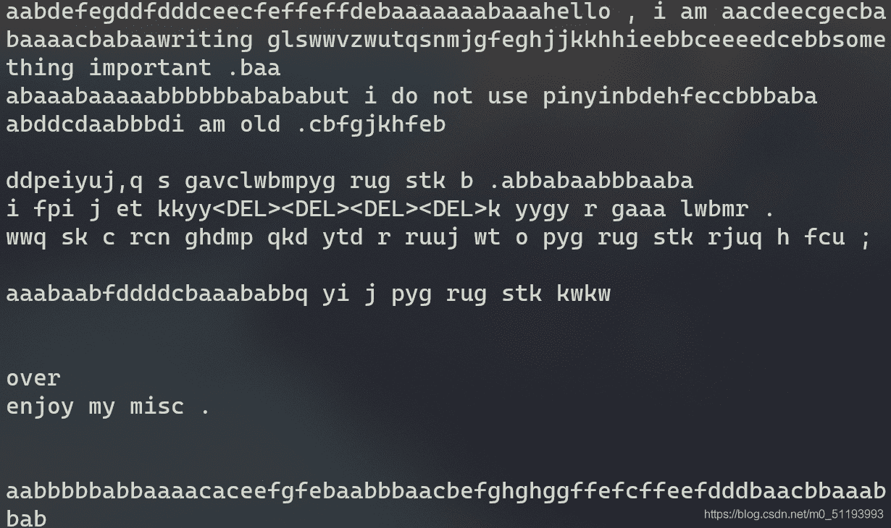
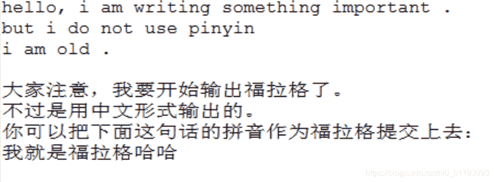

<!--yml
category: 未分类
date: 2022-04-26 14:38:55
-->

# 题解:CTF键盘流量分析初探_vper123的博客-CSDN博客_键盘流量

> 来源：[https://blog.csdn.net/m0_51193993/article/details/109996122](https://blog.csdn.net/m0_51193993/article/details/109996122)

键盘流量
通过网上搜集资料
键盘数据包的数据长度为8个字节，击键信息集中在第3个字节以后

```
BYTE1 --
       |--bit0:   Left Control是否按下，按下为1 
       |--bit1:   Left Shift  是否按下，按下为1 
       |--bit2:   Left Alt    是否按下，按下为1 
       |--bit3:   Left GUI    是否按下，按下为1 
       |--bit4:   Right Control是否按下，按下为1  
       |--bit5:   Right Shift 是否按下，按下为1 
       |--bit6:   Right Alt   是否按下，按下为1 
       |--bit7:   Right GUI   是否按下，按下为1 
```

BYTE2 – 暂不清楚，有的地方说是保留位
BYTE3–BYTE8 – 这六个为普通按键
例如：
键盘发送 `02 00 0e 00 00 00 00 00`
表示同时按下了`Left Shift + k`，即大写K。
具体键位对应参见[Hut1_12v2.pdf](https://www.usb.org/sites/default/files/documents/hut1_12v2.pdf)第53页。

若已经把Wireshark加入到了环境变量
直接运行以下命令
tshark -r usb1.pcap -T fields -e usb.capdata > usbdata.txt
用脚本工具

```
mappings = { 0x04:"A",  0x05:"B",  0x06:"C", 0x07:"D", 0x08:"E", 0x09:"F", 0x0A:"G",  0x0B:"H", 0x0C:"I",  0x0D:"J", 0x0E:"K", 0x0F:"L", 0x10:"M", 0x11:"N",0x12:"O",  0x13:"P", 0x14:"Q", 0x15:"R", 0x16:"S", 0x17:"T", 0x18:"U",0x19:"V", 0x1A:"W", 0x1B:"X", 0x1C:"Y", 0x1D:"Z", 0x1E:"1", 0x1F:"2", 0x20:"3", 0x21:"4", 0x22:"5",  0x23:"6", 0x24:"7", 0x25:"8", 0x26:"9", 0x27:"0", 0x28:"\n", 0x2a:"[DEL]",  0X2B:"    ", 0x2C:" ",  0x2D:"-", 0x2E:"=", 0x2F:"[",  0x30:"]",  0x31:"\\", 0x32:"~", 0x33:";",  0x34:"'", 0x36:",",  0x37:"." }
nums = []
keys = open('usbdata.txt')
for line in keys:
    if line[0]!='0' or line[1]!='0' or line[3]!='0' or line[4]!='0' or line[9]!='0' or line[10]!='0' or line[12]!='0' or line[13]!='0' or line[15]!='0' or line[16]!='0' or line[18]!='0' or line[19]!='0' or line[21]!='0' or line[22]!='0':
         continue
    nums.append(int(line[6:8],16))
keys.close()
output = ""
for n in nums:
    if n == 0 :
        continue
    if n in mappings:
        output += mappings[n]
    else:
        output += '[unknown]'
print 'output :\n' + output 
```

通过对题目给定数据包进行以上操作得到以下:

发现这是一段拼音,英语,五笔输入法混杂的键盘日志呢…surely,这也是做keylogger的人需要考虑而且头疼的一个地方。尝试对照着输入，再选择性忽略一些乱码([在线五笔输入献给小伙伴](https://www.qqxiuzi.cn/%E5%9C%A8%E7%BA%BF%E4%BA%94%E7%AC%94%E8%BE%93%E5%85%A5%E6%B3%95.htm))得到:


flag{wojiushifulagehaha}
题目下载：http://pan.baidu.com/s/1i57b33B