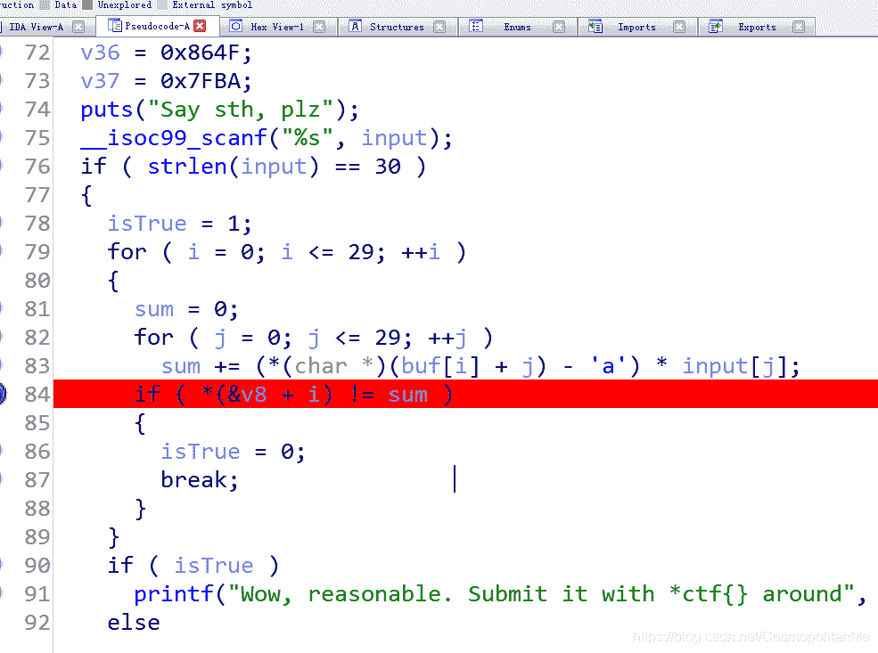
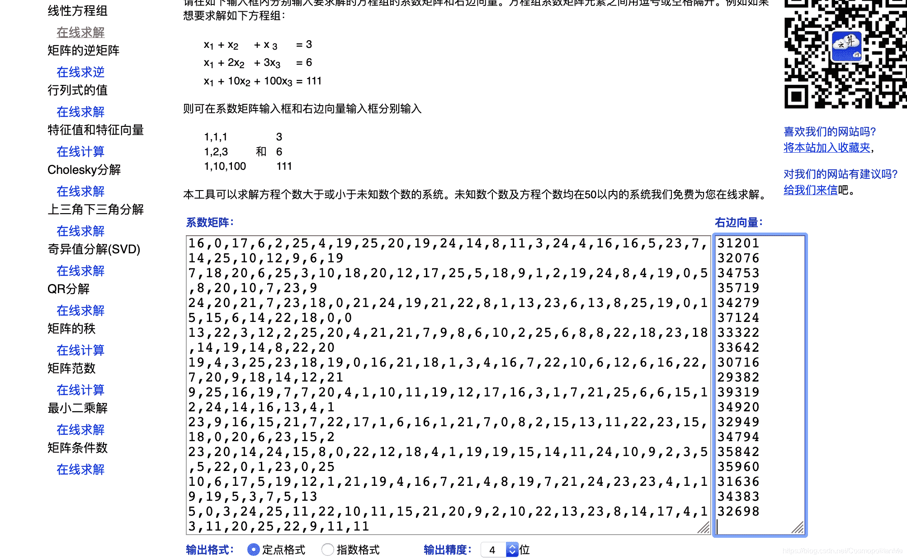
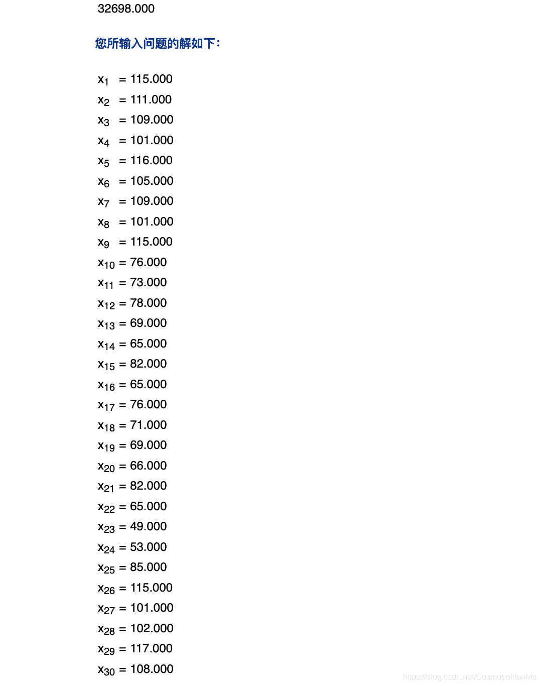

<!--yml
category: 未分类
date: 2022-04-26 14:33:52
-->

# *ctf 逆向math题解_Cosmop01itan的博客-CSDN博客

> 来源：[https://blog.csdn.net/CosmopolitanMe/article/details/89503523](https://blog.csdn.net/CosmopolitanMe/article/details/89503523)

> ida反编译一下



> 部分方程(20*flag[0]+10*flag[1]+12*flag[2]+23*flag[3]+25*flag[4]+12*flag[5]+17*flag[6]+9*flag[7]+6*flag[8]+6*flag[9]+7*flag[10]+20*flag[11]+0*flag[12]+8*flag[13]+15*flag[14]+13*flag[15]+15*flag[16]+1*flag[17]+0*flag[18]+14*flag[19]+12*flag[20]+24*flag[21]+23*flag[22]+5*flag[23]+13*flag[24]+21*flag[25]+5*flag[26]+15*flag[27]+7*flag[28]+25*flag[29]==res[22])
> (7*flag[0]+2*flag[1]+9*flag[2]+6*flag[3]+12*flag[4]+22*flag[5]+7*flag[6]+0*flag[7]+0*flag[8]+6*flag[9]+18*flag[10]+23*flag[11]+4*flag[12]+13*flag[13]+20*flag[14]+17*flag[15]+23*flag[16]+14*flag[17]+12*flag[18]+25*flag[19]+11*flag[20]+18*flag[21]+7*flag[22]+24*flag[23]+21*flag[24]+25*flag[25]+5*flag[26]+10*flag[27]+12*flag[28]+18*flag[29]==res[23])
> (14*flag[0]+13*flag[1]+3*flag[2]+14*flag[3]+0*flag[4]+11*flag[5]+25*flag[6]+23*flag[7]+22*flag[8]+16*flag[9]+7*flag[10]+4*flag[11]+3*flag[12]+22*flag[13]+25*flag[14]+11*flag[15]+4*flag[16]+18*flag[17]+0*flag[18]+22*flag[19]+23*flag[20]+21*flag[21]+12*flag[22]+10*flag[23]+3*flag[24]+19*flag[25]+15*flag[26]+7*flag[27]+18*flag[28]+6*flag[29]==res[24])
> (9*flag[0]+20*flag[1]+8*flag[2]+20*flag[3]+24*flag[4]+13*flag[5]+16*flag[6]+8*flag[7]+10*flag[8]+12*flag[9]+23*flag[10]+15*flag[11]+16*flag[12]+10*flag[13]+1*flag[14]+6*flag[15]+22*flag[16]+19*flag[17]+17*flag[18]+25*flag[19]+3*flag[20]+7*flag[21]+22*flag[22]+14*flag[23]+1*flag[24]+10*flag[25]+22*flag[26]+25*flag[27]+9*flag[28]+4*flag[29]==res[25])
> (5*flag[0]+15*flag[1]+23*flag[2]+22*flag[3]+14*flag[4]+12*flag[5]+10*flag[6]+24*flag[7]+25*flag[8]+13*flag[9]+24*flag[10]+10*flag[11]+5*flag[12]+4*flag[13]+18*flag[14]+8*flag[15]+6*flag[16]+3*flag[17]+19*flag[18]+24*flag[19]+10*flag[20]+14*flag[21]+16*flag[22]+19*flag[23]+2*flag[24]+7*flag[25]+4*flag[26]+16*flag[27]+17*flag[28]+14*flag[29]==res[26])
> (1*flag[0]+5*flag[1]+6*flag[2]+0*flag[3]+24*flag[4]+6*flag[5]+20*flag[6]+14*flag[7]+15*flag[8]+22*flag[9]+1*flag[10]+3*flag[11]+1*flag[12]+21*flag[13]+11*flag[14]+13*flag[15]+22*flag[16]+11*flag[17]+1*flag[18]+9*flag[19]+15*flag[20]+20*flag[21]+24*flag[22]+24*flag[23]+10*flag[24]+10*flag[25]+20*flag[26]+10*flag[27]+17*flag[28]+12*flag[29]==res[27])
> (5*flag[0]+7*flag[1]+21*flag[2]+5*flag[3]+22*flag[4]+10*flag[5]+2*flag[6]+6*flag[7]+17*flag[8]+7*flag[9]+6*flag[10]+17*flag[11]+13*flag[12]+22*flag[13]+8*flag[14]+13*flag[15]+11*flag[16]+13*flag[17]+21*flag[18]+21*flag[19]+18*flag[20]+19*flag[21]+23*flag[22]+14*flag[23]+4*flag[24]+15*flag[25]+17*flag[26]+14*flag[27]+24*flag[28]+5*flag[29]==res[28])
> (19*flag[0]+11*flag[1]+18*flag[2]+7*flag[3]+1*flag[4]+24*flag[5]+25*flag[6]+24*flag[7]+4*flag[8]+22*flag[9]+4*flag[10]+13*flag[11]+21*flag[12]+16*flag[13]+0*flag[14]+24*flag[15]+18*flag[16]+21*flag[17]+6*flag[18]+19*flag[19]+7*flag[20]+3*flag[21]+20*flag[22]+9*flag[23]+1*flag[24]+6*flag[25]+2*flag[26]+10*flag[27]+1*flag[28]+23*flag[29]==res[29])

发现flag长度为30,且flag的每一位都是一个未知数，一共构成30个方程组，通过解方程来得出flag.
这是用线代来解方程的理论：[https://www.shuxuele.com/algebra/systems-linear-equations-matrices.html](https://www.shuxuele.com/algebra/systems-linear-equations-matrices.html)
提系数脚本：

```
 res=[0x895D,
  0x8609,
  0x94F5,
  0x8FE1,
  0x8A42,
  0x7A41,
  0x82C9,
  0x816B,
  0x7A22,
  0x8E61,
  0x79AB,
  0x79E1,
  0x7D4C,
  0x87C1,
  0x8B87,
  0x85E7,
  0x9104,
  0x822A,
  0x836A,
  0x77FC,
  0x72C6,
  0x9997,
  0x8868,
  0x80B5,
  0x87EA,
  0x8C02,
  0x8C78,
  0x7B94,
  0x864F,
  0x7FBA]
data=[
"qargczetzutyoildyeqqfxhozkmjgt",
"hsugzdksumrzfsjbctyietafiukhxj",
"yuvhxsavytvwibnxgniztappgowsaa",
"nwdmczuevvhjigkczgiiwsxsotoiwu",
"tedzxstaqvsbdeqhwkgmgqwhujsomv",
"jzqthhuebkltmrqdbhvzggpmyoqneb",
"xjqpvhwrbgqbvhaicpnlwxpsaugxpc",
"xuoypiawmsebttpolykjcdffwabxaz",
"kgrftmbvteqhveithvyxxebttfdhfn",
"fadyzlwklpvujckwnxiorenluzwjll",
"hgcnjougkjysicnhuxqfuqeoekeyjt",
"mybmfvmxswldiuunbcnimpikvaking",
"fveyiajylcvntzuhexaehgqstytkbg",
"byrigtbszafusdxnxxpmdrpnnhzfxb",
"tdntvjrojknstuxlgjukbvmhtgwgrl",
"phdjixkqbjnglzwupuxwtxevkjural",
"ivjzzgqowrzultkbhimukjmpbrycjr",
"krzhtlutxqnprffuwljlyhkdpfdecf",
"mzcybnmryrficpiulgwmnjkhfnsrjp",
"vmptmbdrufvpxohlijubendwgfcpby",
"qdwkoegydgggzxhpmginszaihitbcu",
"vofwzqpuejwguykxewhdjnmunkpyxl",
"ukmxzmrjgghuaipnpbaomyxfnvfphz",
"hcjgmwhaagsxenurxomzlshyvzfkms",
"ondoalzxwqhedwzlesawxvmkdtphsg",
"juiuynqikmxpqkbgwtrzdhwobkwzje",
"fpxwomkyznykfesigdtykoqtcheqro",
"bfgayguopwbdbvlnwlbjpuyykkukrm",
"fhvfwkcgrhgrnwinlnvvstxoeproyf",
"tlshbyzyewenvqaysvgthdujbgckbx"]
'''
s.add(16*flag[0]+0*flag[1]+17*flag[2]+6*flag[3]+2*flag[4]+25*flag[5]+4*flag[6]+19*flag[7]+25*flag[8]+20*flag[9]+19*flag[10]+24*flag[11]+14*flag[12]+8*flag[13]+11*flag[14]+3*flag[15]+24*flag[16]+4*flag[17]+16*flag[18]+16*flag[19]+5*flag[20]+23*flag[21]+7*flag[22]+14*flag[23]+25*flag[24]+10*flag[25]+12*flag[26]+9*flag[27]+6*flag[28]+19*flag[29]==0x895d,7*flag[0]+18*flag[1]+20*flag[2]+6*flag[3]+25*flag[4]+3*flag[5]+10*flag[6]+18*flag[7]+20*flag[8]+12*flag[9]+17*flag[10]+25*flag[11]+5*flag[12]+18*flag[13]+9*flag[14]+1*flag[15]+2*flag[16]+19*flag[17]+24*flag[18]+8*flag[19]+4*flag[20]+19*flag[21]+0*flag[22]+5*flag[23]+8*flag[24]+20*flag[25]+10*flag[26]+7*flag[27]+23*flag[28]+9*flag[29]==0x8609,24*flag[0]+20*flag[1]+21*flag[2]+7*flag[3]+23*flag[4]+18*flag[5]+0*flag[6]+21*flag[7]+24*flag[8]+19*flag[9]+21*flag[10]+22*flag[11]+8*flag[12]+1*flag[13]+13*flag[14]+23*flag[15]+6*flag[16]+13*flag[17]+8*flag[18]+25*flag[19]+19*flag[20]+0*flag[21]+15*flag[22]+15*flag[23]+6*flag[24]+14*flag[25]+22*flag[26]+18*flag[27]+0*flag[28]+0*flag[29]==0x94f5,13*flag[0]+22*flag[1]+3*flag[2]+12*flag[3]+2*flag[4]+25*flag[5]+20*flag[6]+4*flag[7]+21*flag[8]+21*flag[9]+7*flag[10]+9*flag[11]+8*flag[12]+6*flag[13]+10*flag[14]+2*flag[15]+25*flag[16]+6*flag[17]+8*flag[18]+8*flag[19]+22*flag[20]+18*flag[21]+23*flag[22]+18*flag[23]+14*flag[24]+19*flag[25]+14*flag[26]+8*flag[27]+22*flag[28]+20*flag[29]==0x8fe1,19*flag[0]+4*flag[1]+3*flag[2]+25*flag[3]+23*flag[4]+18*flag[5]+19*flag[6]+0*flag[7]+16*flag[8]+21*flag[9]+18*flag[10]+1*flag[11]+3*flag[12]+4*flag[13]+16*flag[14]+7*flag[15]+22*flag[16]+10*flag[17]+6*flag[18]+12*flag[19]+6*flag[20]+16*flag[21]+22*flag[22]+7*flag[23]+20*flag[24]+9*flag[25]+18*flag[26]+14*flag[27]+12*flag[28]+21*flag[29]==0x8a42,9*flag[0]+25*flag[1]+16*flag[2]+19*flag[3]+7*flag[4]+7*flag[5]+20*flag[6]+4*flag[7]+1*flag[8]+10*flag[9]+11*flag[10]+19*flag[11]+12*flag[12]+17*flag[13]+16*flag[14]+3*flag[15]+1*flag[16]+7*flag[17]+21*flag[18]+25*flag[19]+6*flag[20]+6*flag[21]+15*flag[22]+12*flag[23]+24*flag[24]+14*flag[25]+16*flag[26]+13*flag[27]+4*flag[28]+1*flag[29]==res[5])
s.add(23*flag[0]+9*flag[1]+16*flag[2]+15*flag[3]+21*flag[4]+7*flag[5]+22*flag[6]+17*flag[7]+1*flag[8]+6*flag[9]+16*flag[10]+1*flag[11]+21*flag[12]+7*flag[13]+0*flag[14]+8*flag[15]+2*flag[16]+15*flag[17]+13*flag[18]+11*flag[19]+22*flag[20]+23*flag[21]+15*flag[22]+18*flag[23]+0*flag[24]+20*flag[25]+6*flag[26]+23*flag[27]+15*flag[28]+2*flag[29]==res[6])
s.add(23*flag[0]+20*flag[1]+14*flag[2]+24*flag[3]+15*flag[4]+8*flag[5]+0*flag[6]+22*flag[7]+12*flag[8]+18*flag[9]+4*flag[10]+1*flag[11]+19*flag[12]+19*flag[13]+15*flag[14]+14*flag[15]+11*flag[16]+24*flag[17]+10*flag[18]+9*flag[19]+2*flag[20]+3*flag[21]+5*flag[22]+5*flag[23]+22*flag[24]+0*flag[25]+1*flag[26]+23*flag[27]+0*flag[28]+25*flag[29]==res[7])
s.add(10*flag[0]+6*flag[1]+17*flag[2]+5*flag[3]+19*flag[4]+12*flag[5]+1*flag[6]+21*flag[7]+19*flag[8]+4*flag[9]+16*flag[10]+7*flag[11]+21*flag[12]+4*flag[13]+8*flag[14]+19*flag[15]+7*flag[16]+21*flag[17]+24*flag[18]+23*flag[19]+23*flag[20]+4*flag[21]+1*flag[22]+19*flag[23]+19*flag[24]+5*flag[25]+3*flag[26]+7*flag[27]+5*flag[28]+13*flag[29]==res[8])
s.add(5*flag[0]+0*flag[1]+3*flag[2]+24*flag[3]+25*flag[4]+11*flag[5]+22*flag[6]+10*flag[7]+11*flag[8]+15*flag[9]+21*flag[10]+20*flag[11]+9*flag[12]+2*flag[13]+10*flag[14]+22*flag[15]+13*flag[16]+23*flag[17]+8*flag[18]+14*flag[19]+17*flag[20]+4*flag[21]+13*flag[22]+11*flag[23]+20*flag[24]+25*flag[25]+22*flag[26]+9*flag[27]+11*flag[28]+11*flag[29]==res[9])
s.add(7*flag[0]+6*flag[1]+2*flag[2]+13*flag[3]+9*flag[4]+14*flag[5]+20*flag[6]+6*flag[7]+10*flag[8]+9*flag[9]+24*flag[10]+18*flag[11]+8*flag[12]+2*flag[13]+13*flag[14]+7*flag[15]+20*flag[16]+23*flag[17]+16*flag[18]+5*flag[19]+20*flag[20]+16*flag[21]+4*flag[22]+14*flag[23]+4*flag[24]+10*flag[25]+4*flag[26]+24*flag[27]+9*flag[28]+19*flag[29]==res[10])
s.add(12*flag[0]+24*flag[1]+1*flag[2]+12*flag[3]+5*flag[4]+21*flag[5]+12*flag[6]+23*flag[7]+18*flag[8]+22*flag[9]+11*flag[10]+3*flag[11]+8*flag[12]+20*flag[13]+20*flag[14]+13*flag[15]+1*flag[16]+2*flag[17]+13*flag[18]+8*flag[19]+12*flag[20]+15*flag[21]+8*flag[22]+10*flag[23]+21*flag[24]+0*flag[25]+10*flag[26]+8*flag[27]+13*flag[28]+6*flag[29]==res[11])
s.add(5*flag[0]+21*flag[1]+4*flag[2]+24*flag[3]+8*flag[4]+0*flag[5]+9*flag[6]+24*flag[7]+11*flag[8]+2*flag[9]+21*flag[10]+13*flag[11]+19*flag[12]+25*flag[13]+20*flag[14]+7*flag[15]+4*flag[16]+23*flag[17]+0*flag[18]+4*flag[19]+7*flag[20]+6*flag[21]+16*flag[22]+18*flag[23]+19*flag[24]+24*flag[25]+19*flag[26]+10*flag[27]+1*flag[28]+6*flag[29]==res[12])
s.add(1*flag[0]+24*flag[1]+17*flag[2]+8*flag[3]+6*flag[4]+19*flag[5]+1*flag[6]+18*flag[7]+25*flag[8]+0*flag[9]+5*flag[10]+20*flag[11]+18*flag[12]+3*flag[13]+23*flag[14]+13*flag[15]+23*flag[16]+23*flag[17]+15*flag[18]+12*flag[19]+3*flag[20]+17*flag[21]+15*flag[22]+13*flag[23]+13*flag[24]+7*flag[25]+25*flag[26]+5*flag[27]+23*flag[28]+1*flag[29]==res[13])
s.add(19*flag[0]+3*flag[1]+13*flag[2]+19*flag[3]+21*flag[4]+9*flag[5]+17*flag[6]+14*flag[7]+9*flag[8]+10*flag[9]+13*flag[10]+18*flag[11]+19*flag[12]+20*flag[13]+23*flag[14]+11*flag[15]+6*flag[16]+9*flag[17]+20*flag[18]+10*flag[19]+1*flag[20]+21*flag[21]+12*flag[22]+7*flag[23]+19*flag[24]+6*flag[25]+22*flag[26]+6*flag[27]+17*flag[28]+11*flag[29]==res[14])
s.add(15*flag[0]+7*flag[1]+3*flag[2]+9*flag[3]+8*flag[4]+23*flag[5]+10*flag[6]+16*flag[7]+1*flag[8]+9*flag[9]+13*flag[10]+6*flag[11]+11*flag[12]+25*flag[13]+22*flag[14]+20*flag[15]+15*flag[16]+20*flag[17]+23*flag[18]+22*flag[19]+19*flag[20]+23*flag[21]+4*flag[22]+21*flag[23]+10*flag[24]+9*flag[25]+20*flag[26]+17*flag[27]+0*flag[28]+11*flag[29]==res[15])
s.add(8*flag[0]+21*flag[1]+9*flag[2]+25*flag[3]+25*flag[4]+6*flag[5]+16*flag[6]+14*flag[7]+22*flag[8]+17*flag[9]+25*flag[10]+20*flag[11]+11*flag[12]+19*flag[13]+10*flag[14]+1*flag[15]+7*flag[16]+8*flag[17]+12*flag[18]+20*flag[19]+10*flag[20]+9*flag[21]+12*flag[22]+15*flag[23]+1*flag[24]+17*flag[25]+24*flag[26]+2*flag[27]+9*flag[28]+17*flag[29]==res[16])
s.add(10*flag[0]+17*flag[1]+25*flag[2]+7*flag[3]+19*flag[4]+11*flag[5]+20*flag[6]+19*flag[7]+23*flag[8]+16*flag[9]+13*flag[10]+15*flag[11]+17*flag[12]+5*flag[13]+5*flag[14]+20*flag[15]+22*flag[16]+11*flag[17]+9*flag[18]+11*flag[19]+24*flag[20]+7*flag[21]+10*flag[22]+3*flag[23]+15*flag[24]+5*flag[25]+3*flag[26]+4*flag[27]+2*flag[28]+5*flag[29]==res[17])
s.add(12*flag[0]+25*flag[1]+2*flag[2]+24*flag[3]+1*flag[4]+13*flag[5]+12*flag[6]+17*flag[7]+24*flag[8]+17*flag[9]+5*flag[10]+8*flag[11]+2*flag[12]+15*flag[13]+8*flag[14]+20*flag[15]+11*flag[16]+6*flag[17]+22*flag[18]+12*flag[19]+13*flag[20]+9*flag[21]+10*flag[22]+7*flag[23]+5*flag[24]+13*flag[25]+18*flag[26]+17*flag[27]+9*flag[28]+15*flag[29]==res[18])
s.add(21*flag[0]+12*flag[1]+15*flag[2]+19*flag[3]+12*flag[4]+1*flag[5]+3*flag[6]+17*flag[7]+20*flag[8]+5*flag[9]+21*flag[10]+15*flag[11]+23*flag[12]+14*flag[13]+7*flag[14]+11*flag[15]+8*flag[16]+9*flag[17]+20*flag[18]+1*flag[19]+4*flag[20]+13*flag[21]+3*flag[22]+22*flag[23]+6*flag[24]+5*flag[25]+2*flag[26]+15*flag[27]+1*flag[28]+24*flag[29]==res[19])
s.add(16*flag[0]+3*flag[1]+22*flag[2]+10*flag[3]+14*flag[4]+4*flag[5]+6*flag[6]+24*flag[7]+3*flag[8]+6*flag[9]+6*flag[10]+6*flag[11]+25*flag[12]+23*flag[13]+7*flag[14]+15*flag[15]+12*flag[16]+6*flag[17]+8*flag[18]+13*flag[19]+18*flag[20]+25*flag[21]+0*flag[22]+8*flag[23]+7*flag[24]+8*flag[25]+19*flag[26]+1*flag[27]+2*flag[28]+20*flag[29]==res[20])
s.add(21*flag[0]+14*flag[1]+5*flag[2]+22*flag[3]+25*flag[4]+16*flag[5]+15*flag[6]+20*flag[7]+4*flag[8]+9*flag[9]+22*flag[10]+6*flag[11]+20*flag[12]+24*flag[13]+10*flag[14]+23*flag[15]+4*flag[16]+22*flag[17]+7*flag[18]+3*flag[19]+9*flag[20]+13*flag[21]+12*flag[22]+20*flag[23]+13*flag[24]+10*flag[25]+15*flag[26]+24*flag[27]+23*flag[28]+11*flag[29]==res[21])
s.add(20*flag[0]+10*flag[1]+12*flag[2]+23*flag[3]+25*flag[4]+12*flag[5]+17*flag[6]+9*flag[7]+6*flag[8]+6*flag[9]+7*flag[10]+20*flag[11]+0*flag[12]+8*flag[13]+15*flag[14]+13*flag[15]+15*flag[16]+1*flag[17]+0*flag[18]+14*flag[19]+12*flag[20]+24*flag[21]+23*flag[22]+5*flag[23]+13*flag[24]+21*flag[25]+5*flag[26]+15*flag[27]+7*flag[28]+25*flag[29]==res[22])
s.add(7*flag[0]+2*flag[1]+9*flag[2]+6*flag[3]+12*flag[4]+22*flag[5]+7*flag[6]+0*flag[7]+0*flag[8]+6*flag[9]+18*flag[10]+23*flag[11]+4*flag[12]+13*flag[13]+20*flag[14]+17*flag[15]+23*flag[16]+14*flag[17]+12*flag[18]+25*flag[19]+11*flag[20]+18*flag[21]+7*flag[22]+24*flag[23]+21*flag[24]+25*flag[25]+5*flag[26]+10*flag[27]+12*flag[28]+18*flag[29]==res[23])
s.add(14*flag[0]+13*flag[1]+3*flag[2]+14*flag[3]+0*flag[4]+11*flag[5]+25*flag[6]+23*flag[7]+22*flag[8]+16*flag[9]+7*flag[10]+4*flag[11]+3*flag[12]+22*flag[13]+25*flag[14]+11*flag[15]+4*flag[16]+18*flag[17]+0*flag[18]+22*flag[19]+23*flag[20]+21*flag[21]+12*flag[22]+10*flag[23]+3*flag[24]+19*flag[25]+15*flag[26]+7*flag[27]+18*flag[28]+6*flag[29]==res[24])
s.add(9*flag[0]+20*flag[1]+8*flag[2]+20*flag[3]+24*flag[4]+13*flag[5]+16*flag[6]+8*flag[7]+10*flag[8]+12*flag[9]+23*flag[10]+15*flag[11]+16*flag[12]+10*flag[13]+1*flag[14]+6*flag[15]+22*flag[16]+19*flag[17]+17*flag[18]+25*flag[19]+3*flag[20]+7*flag[21]+22*flag[22]+14*flag[23]+1*flag[24]+10*flag[25]+22*flag[26]+25*flag[27]+9*flag[28]+4*flag[29]==res[25])
s.add(5*flag[0]+15*flag[1]+23*flag[2]+22*flag[3]+14*flag[4]+12*flag[5]+10*flag[6]+24*flag[7]+25*flag[8]+13*flag[9]+24*flag[10]+10*flag[11]+5*flag[12]+4*flag[13]+18*flag[14]+8*flag[15]+6*flag[16]+3*flag[17]+19*flag[18]+24*flag[19]+10*flag[20]+14*flag[21]+16*flag[22]+19*flag[23]+2*flag[24]+7*flag[25]+4*flag[26]+16*flag[27]+17*flag[28]+14*flag[29]==res[26])
s.add(1*flag[0]+5*flag[1]+6*flag[2]+0*flag[3]+24*flag[4]+6*flag[5]+20*flag[6]+14*flag[7]+15*flag[8]+22*flag[9]+1*flag[10]+3*flag[11]+1*flag[12]+21*flag[13]+11*flag[14]+13*flag[15]+22*flag[16]+11*flag[17]+1*flag[18]+9*flag[19]+15*flag[20]+20*flag[21]+24*flag[22]+24*flag[23]+10*flag[24]+10*flag[25]+20*flag[26]+10*flag[27]+17*flag[28]+12*flag[29]==res[27])
s.add(5*flag[0]+7*flag[1]+21*flag[2]+5*flag[3]+22*flag[4]+10*flag[5]+2*flag[6]+6*flag[7]+17*flag[8]+7*flag[9]+6*flag[10]+17*flag[11]+13*flag[12]+22*flag[13]+8*flag[14]+13*flag[15]+11*flag[16]+13*flag[17]+21*flag[18]+21*flag[19]+18*flag[20]+19*flag[21]+23*flag[22]+14*flag[23]+4*flag[24]+15*flag[25]+17*flag[26]+14*flag[27]+24*flag[28]+5*flag[29]==res[28])
s.add(19*flag[0]+11*flag[1]+18*flag[2]+7*flag[3]+1*flag[4]+24*flag[5]+25*flag[6]+24*flag[7]+4*flag[8]+22*flag[9]+4*flag[10]+13*flag[11]+21*flag[12]+16*flag[13]+0*flag[14]+24*flag[15]+18*flag[16]+21*flag[17]+6*flag[18]+19*flag[19]+7*flag[20]+3*flag[21]+20*flag[22]+9*flag[23]+1*flag[24]+6*flag[25]+2*flag[26]+10*flag[27]+1*flag[28]+23*flag[29]==res[29])

for i in res:
    print i
cnt=0
for i in data:
    line=""
    for j in range(len(i)):
        line+=str(ord(i[j])-ord('a'))+","
    cnt+=1
    print line.strip(',') 
```

网站：[http://www.yunsuan.info/matrixcomputations/solvelinearsystems.html](http://www.yunsuan.info/matrixcomputations/solvelinearsystems.html)


```
d=[115,111,109,101,116,105,109,101,115,76,73,78,69,65,82,65,76,71,69,66,82,65,49,53,85,115,101,102,117,108]
print "".join([chr(i) for i in d]) 
```

提交的时候用*ctf{}包裹